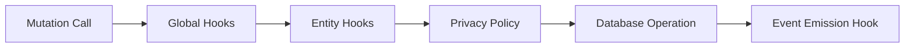

# Hooks and Interceptors

Hooks and interceptors are the primary extension points for adding behavior to database operations. They operate at the Ent ORM layer, which means they fire regardless of whether the operation was triggered by a GraphQL resolver, a REST handler, or an internal function.

Both follow the middleware pattern -- they wrap the underlying operation and can execute logic before, after, or instead of it. The difference is *when* and *what* they operate on.

## Hooks vs Interceptors

| | Hooks | Interceptors |
|---|---|---|
| **Operates on** | Mutations (create, update, delete) | Queries (list, get) |
| **Scope** | All mutations, all entry points | GraphQL queries via Ent traversals |
| **Common uses** | Event emission, field defaults, tuple management, validation | Multi-tenant filtering, access scoping, visibility rules |
| **Registration** | Global via `client.Use()` or per-schema via `Hooks()` | Per-schema via Ent interceptor interface |
| **Location** | `internal/ent/hooks/` | `internal/ent/interceptors/` |

## Hooks

### How Hooks Work

A hook is a function that wraps a mutation. It receives the mutator (the next step in the chain) and returns a new mutator that includes additional logic:

```go
func HookUser() ent.Hook {
    return hook.On(func(next ent.Mutator) ent.Mutator {
        return hook.UserFunc(func(ctx context.Context, m *generated.UserMutation) (generated.Value, error) {
            // Before mutation: validate and set defaults
            if password, ok := m.Password(); ok {
                hash, err := passwd.CreateDerivedKey(password)
                if err != nil {
                    return nil, err
                }
                m.SetPassword(hash)
            }

            // Execute the actual mutation
            return next.Mutate(ctx, m)
        })
    })
}
```

The `hook.UserFunc` wrapper provides type safety -- you get a `*generated.UserMutation` instead of a generic `ent.Mutation`.

The key thing to understand when writing a hook is in your hook logic you need to determine when the mutation commits or not. This means you can intercept the mutation and perform logic BEFORE the mutation (as in the example above), or you can execute the mutation FIRST, and then perform logic after. You may have conditional evaluations that occur throughout the hook to decide when the commit happens, but it's best to map this out in your head before trying to write the hook. In this example, we want the mutation to process immediately and then perform the logic afterwards:

```go
func HookGroupSettingVisibility() ent.Hook {
	return hook.If(func(next ent.Mutator) ent.Mutator {
		return hook.GroupSettingFunc(func(ctx context.Context, m *generated.GroupSettingMutation) (generated.Value, error) {
			retVal, err := next.Mutate(ctx, m)
			if err != nil {
				return nil, err
			}
        ...
```

Check out ent's documentation for additional information / context on things like `hook.if`, `hook.On`, etc.

### Global Hooks

Global hooks are hooks registered directly on the ent client on client initialization and they occur before schema-level hooks. You'll use these very sparingly. Here are a few examples of global hooks we employ today:

**EmitEventHook** -- fires after every successful mutation and publishes an event to the event bus. This drives the workflow engine, notifications, and other asynchronous side effects.

**HookDeletePermissions** -- fires on every delete operation and removes all FGA tuples where the deleted entity is the object. This prevents orphaned authorization relationships.

### Entity-Specific Hooks

Defined in each schema's `Hooks()` method and located in `internal/ent/hooks/`. Common patterns:

| Hook | Entity | Purpose |
|---|---|---|
| `HookUser()` | User | Hash passwords, set display name defaults, generate gravatar URLs |
| `HookProgramAuthz()` | Program | Create FGA tuples on creation (admin for creator, parent for org) |
| `HookOrganization()` | Organization | Set up org membership and ownership tuples |
| `HookDeletePermissions()` | All | Remove all FGA tuples referencing deleted entities |

### Hook Execution Order



Global hooks run first, then entity-specific hooks. Privacy policies execute as part of the Ent client's internal pipeline (after hooks have had a chance to modify fields). The event emission hook fires after the database operation succeeds.

## Interceptors

### How Interceptors Work

Interceptors modify queries *before* they execute. They add `WHERE` predicates, join conditions, or other filters to scope results based on the request context. Unlike hooks, they do not fire on mutations.

```go
func TraverseStandard() ent.Interceptor {
    return intercept.TraverseStandard(func(ctx context.Context, q *generated.StandardQuery) error {
        orgIDs, err := auth.GetOrganizationIDsFromContext(ctx)
        if err != nil {
            return err
        }

        q.Where(
            standard.Or(
                standard.And(
                    standard.OwnerIDIsNil(),
                    standard.SystemOwned(true),
                    standard.IsPublic(true),
                ),
                standard.OwnerIDIn(orgIDs...),
            ),
        )

        return nil
    })
}
```

This interceptor ensures that standard queries only return:
* Public system-owned standards (no owner, flagged as system, flagged as public)
* Standards owned by organizations the user belongs to

### Common Interceptor Patterns

**Organization scoping** -- filter results to only show entities belonging to the user's current organization. This is the most common pattern and is how multi-tenancy is enforced at the query level.

**Anonymous user handling** -- for trust center or public-facing queries, interceptors check for anonymous user context and restrict results to the appropriate organization's published content.

**System admin bypass** -- interceptors often check `rule.CheckIsSystemAdminWithContext()` to allow system administrators to see all records without filtering.

## When to Use Which

| Scenario | Use |
|---|---|
| Set field defaults before save | Hook (before mutation) |
| Validate field values | Hook (before mutation) |
| Create/delete FGA tuples | Hook (after mutation) |
| Emit events for async processing | Hook (after mutation, via global EmitEventHook) |
| Filter query results by org membership | Interceptor |
| Restrict visibility for anonymous users | Interceptor |
| Send a notification after entity creation | Hook that emits event, then a workflow or event listener |

:::tip
If you find yourself querying data in a hook to make a decision, you probably want an interceptor instead. Hooks are for side effects on writes. Interceptors are for scoping reads.
:::
