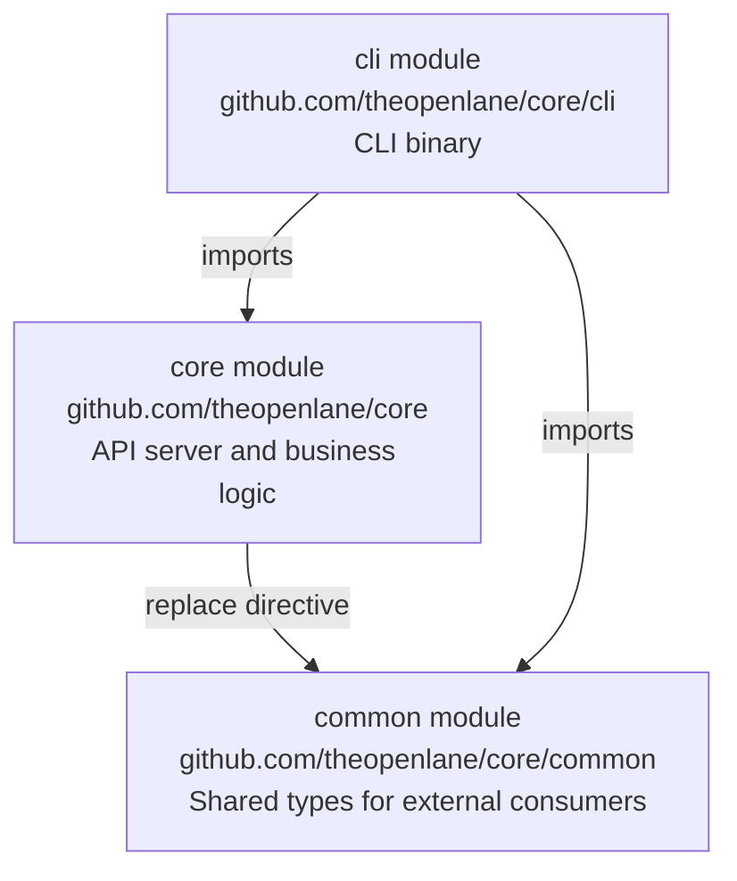

# Multi-Module Structure

The core repository contains three Go modules and uses build tags to control what gets compiled into different binaries. Understanding this structure is important for knowing where to put new code and why certain imports fail.

## The Three Modules



### `core` (root module)

**Module path:** `github.com/theopenlane/core`

The main API server. Contains the HTTP server, Ent schemas, GraphQL resolvers, hooks, interceptors, middleware, and all business logic. This module is not designed to be imported by external repositories (except code inside of `pkg`) -- its `internal/` directory is compiler-enforced as non-importable.

The root `go.mod` contains a `replace` directive pointing `common` to the local `./common` directory, so the two modules stay in sync without publishing.

### `common` (shared types)

**Module path:** `github.com/theopenlane/core/common`

A lightweight module containing types that external repositories need to consume. This is intentionally kept thin -- it has minimal dependencies and no server logic.

| Package | Contents |
|---|---|
| `common/enums` | Enumeration types (OAuth providers, user statuses, roles, entity states) |
| `common/models` | Domain models (compliance, audit, IP address types) |
| `common/openapi` | REST API request/response structs |
| `common/storagetypes` | Storage provider enums and configuration types |
| `common/integrations` | Third-party integration configuration types |
| `common/jobspec` | Job queue job specification models |
| `common/helpers` | Utility functions |

If you are building a service that needs to interact with Openlane's API types without importing the entire server, `common` is a viable path.

### `cli` (command-line tool)

**Module path:** `github.com/theopenlane/core/cli`

The Openlane CLI binary. It lives in the same repository for development convenience but compiles as a separate binary. It imports both `core` and `common` as dependencies.

The CLI uses [Cobra](https://github.com/spf13/cobra) for command structure and the generated GraphQL client for API communication.

## Where to Put New Code

| Code Type | Location | Reason |
|---|---|---|
| Server business logic | `internal/` | Not importable externally, keeps API surface controlled |
| Reusable utilities (used by other repos) | `pkg/` | Importable by external Go code |
| Types shared with CLI or external repos | `common/` | Separate module, minimal dependencies |
| CLI commands | `cli/` | Separate binary, separate module |
| Ent schemas | `internal/ent/schema/` | Server-only, drives code generation |
| REST handlers | `internal/httpserve/handlers/` | Server-only |
| GraphQL resolvers | `internal/graphapi/` | Server-only |

:::tip
If you are unsure whether something belongs in `pkg/` or `internal/`, ask: "Will any repository other than core ever import this?" If no, use `internal/`. If yes, use `pkg/`. If you are unsure, start with `internal/` -- it is easier to move code outward than to retract a public API.
:::

## Build Tags

The codebase uses `//go:build` tags for conditional compilation. This keeps the main server binary lean by excluding tooling and test infrastructure.

### Active Build Tags

| Tag | Purpose | Where Used |
|---|---|---|
| `test` | Test-only code (test utilities, fixtures, mock implementations) | `internal/testutils/`, test files |
| `cli` | CLI-specific code | `cli/`, CLI command implementations |
| `codegen` | Code generation scripts (not compiled into any binary) | `internal/ent/generate/`, `internal/graphapi/generate/` |
| `clistripe` | Stripe webhook management CLI tool | `cmd/stripe-webhook/` |
| `climanagedgroups` | Managed groups CLI tool | `cmd/managedgroups/` |
| `ignore` | Generation scripts that should never be compiled | Various `generate.go` files |

### Impact on Development

Your IDE needs to know about these tags to resolve symbols correctly. Without `cli,test,codegen` in your build tags, functions gated behind those tags will appear undefined.

**VSCode** -- add to `.vscode/settings.json`:

```json
{
  "go.buildTags": "cli,test,codegen"
}
```

**GoLand** -- _Settings > Go > Build Tags_: `cli,test,codegen`

**Command line** -- pass tags explicitly:

```bash
go test -tags test ./...
go build -tags cli ./cli/...
```

### Adding a New Build Tag

If you need to gate new functionality behind a build tag:

1. Add `//go:build yourtag` at the top of the file (before the package declaration)
1. Ensure the corresponding non-tagged files do not define conflicting symbols
1. Document the tag in the table above
1. Update IDE settings if the tag is needed for development

Build tags are appropriate for optional CLI tools and test infrastructure. They are not appropriate for feature flags in production code -- use the entitlements/module system for that.
