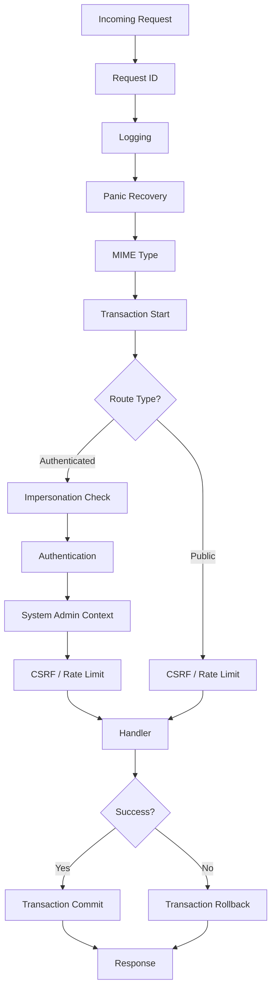

# Request Lifecycle

Every HTTP request to the Openlane server passes through a layered middleware stack before reaching a handler. Understanding this flow is essential for debugging unexpected behavior, especially around authentication and transaction boundaries.

## The Middleware Stack

The server uses [Echo](https://echo.labstack.com/) as its HTTP framework. Middleware is applied in layers, with each layer wrapping the next. The outermost middleware executes first on the way in and last on the way out.



### Base Middleware (All Routes)

These run on every request, regardless of route type:

| Order | Middleware | Purpose |
|---|---|---|
| 1 | **Request ID** | Generates or propagates `X-Request-ID` header for log correlation |
| 2 | **Logging** | Attaches a structured logger (zerolog) to the request context |
| 3 | **Panic Recovery** | Catches panics and returns a 500 error with stack trace logging |
| 4 | **MIME** | Sets default `Content-Type: application/json` |
| 5 | **Transaction** | Opens a database transaction and stores it in context |

### Authenticated Routes (Additional)

These are added on top of base middleware for endpoints that require authentication:

| Order | Middleware | Purpose |
|---|---|---|
| 6 | **Impersonation** | Checks for `X-Impersonate-User` header, validates impersonator permissions |
| 7 | **Authentication** | Validates JWT, PAT, or API token from `Authorization` header |
| 8 | **System Admin Context** | Sets system admin flag in context if applicable |
| 9 | **Additional** | CSRF validation, rate limiting, and other per-deployment middleware |

### Public Routes

Public routes skip steps 6-8 and go directly from base middleware to the additional middleware (CSRF, rate limiting).

## Context Values

The middleware stack populates the request context with values that downstream code relies on:

```go
// Available after transaction middleware
txn := transaction.FromContext(ctx)

// Available after auth middleware
user, err := auth.GetAuthenticatedUserFromContext(ctx)

// Available after logging middleware
logger := logx.FromContext(ctx)
```

These are accessed by handlers, hooks, interceptors, and privacy rules. Losing context (for example, by creating a new `context.Background()`) will cause these lookups to fail.

## Transaction Boundaries

The transaction middleware wraps every request in a single database transaction:

1. **Start** -- `ent.Client.Tx(ctx)` opens a transaction before the handler runs
1. **Commit** -- if the handler returns `nil`, the transaction commits
1. **Rollback** -- if the handler returns an error, the transaction rolls back

This means all database operations within a single request are atomic. If you create three entities and the fourth fails, all four are rolled back.

:::warning
Hooks fire within the transaction boundary. If a hook emits an event, that event is dispatched asynchronously *after* the transaction commits. If the transaction rolls back, the event was never dispatched. However, if a hook calls an external service (like OpenFGA to write tuples), that external call is *not* rolled back automatically unless it's wrapped within the transaction (e.g. you make the call before `next.Mutate` inside of a hook or similar)
:::

## REST Endpoints

REST handlers live in `internal/httpserve/handlers/` and are registered via declarative configuration in `internal/httpserve/route/`. As a rule of thumb, you should not be writing REST handlers - we elected to implement both REST and GraphQL because for many purposes like authentication flows, REST is far more appropriate given the nature of the technology but we want our user-facing APIs + business-driven logic to be build using GraphQL. When in doubt, reach out!

### Route Registration

Each handler is registered with metadata that simultaneously configures Echo routing and generates OpenAPI documentation:

```go
config := Config{
    Path:        "/login",
    Method:      http.MethodPost,
    Name:        "Login",
    Description: "Authenticates a user with credentials",
    Tags:        []string{"authentication"},
    OperationID: "LoginHandler",
    Security:    handlers.BasicSecurity(),
    Middlewares: *unauthenticatedEndpoint,
    Handler:     router.Handler.LoginHandler,
}

router.AddV1HandlerRoute(config)
```

The `Middlewares` field selects the middleware stack: `authenticatedEndpoint`, `publicEndpoint`, or `unauthenticatedEndpoint` (base only).

### Handler Pattern

Handlers receive an `echo.Context` and an `OpenAPIContext` for schema registration:

```go
func (h *Handler) LoginHandler(ctx echo.Context, openapi *OpenAPIContext) error {
    req, err := BindAndValidateWithAutoRegistry(ctx, h, openapi.Operation,
        models.ExampleLoginSuccessRequest,
        models.ExampleLoginSuccessResponse,
        openapi.Registry)
    if err != nil {
        return h.InvalidInput(ctx, err, openapi)
    }

    // Business logic...

    return h.Success(ctx, response)
}
```

`BindAndValidateWithAutoRegistry` serves double duty: during normal requests it binds and validates the request body (which is really just binding the request context <-> input payload struct), and during server startup it registers the request/response types in the OpenAPI schema.

### Response Helpers

All handlers use consistent response methods inherited from the `Handler` struct:

| Method | Status | Use Case |
|---|---|---|
| `h.Success(ctx, data)` | 200 | Successful operation |
| `h.Created(ctx, data)` | 201 | Resource created |
| `h.BadRequest(ctx, err)` | 400 | Invalid input |
| `h.Unauthorized(ctx, err)` | 401 | Missing or invalid credentials |
| `h.Forbidden(ctx, err)` | 403 | Authenticated but not authorized |
| `h.NotFound(ctx, err)` | 404 | Resource not found |
| `h.InternalServerError(ctx, err)` | 500 | Unexpected failure |

## GraphQL Endpoint

The GraphQL handler is registered as a separate route group with its own middleware. GraphQL queries and mutations both arrive as `POST` requests to the `/query` endpoint.

### How GraphQL and REST Coexist

Both GraphQL and REST share the same Echo server and base middleware stack. The difference is in routing:

* REST routes are registered individually with specific paths and methods (`POST /v1/login`, `GET /v1/account/access`)
* GraphQL is a single route (`POST /query`) that dispatches internally based on the operation in the request body

Both types of endpoints share the same transaction middleware, authentication, and context propagation.

## OpenAPI Generation

The OpenAPI specification is built at server startup, not from a static YAML file. When routes are registered:

1. Each handler is called once with a special _registration context_
1. Handlers detect the registration context and skip business logic
1. `BindAndValidateWithAutoRegistry` registers request/response types in the `SchemaRegistry`
1. The `SchemaRegistry` uses `openapi3gen` to generate JSON Schema from Go types
1. The assembled spec is served at the `/api-docs` endpoint

This means the OpenAPI documentation is always in sync with the actual handler signatures. No manual spec maintenance required.

## Full Request Example

A concrete walkthrough of creating an organization via REST:

```
POST /v1/organizations
Authorization: Bearer <jwt>
X-Csrf-Token: <token>
X-Request-ID: req-abc123

1. Request ID middleware
   Sets X-Request-ID: req-abc123

2. Logging middleware
   Creates logger with request_id=req-abc123

3. Recovery middleware
   Sets up panic handler

4. MIME middleware
   Validates Content-Type: application/json

5. Transaction middleware
   Opens database transaction, stores in context

6. Impersonation middleware
   No X-Impersonate-User header, passes through

7. Auth middleware
   Validates JWT, extracts user claims
   Sets authenticated user in context (alice, org: acme)

8. System admin middleware
   alice is not a system admin, passes through

9. CSRF middleware
   Validates X-Csrf-Token matches cookie

10. Handler: CreateOrganization
    Parses request body
    Calls txn.Organization.Create().Save(ctx)
      -> HookOrganization fires (sets defaults)
      -> Privacy policy checks (modules, FGA)
      -> SQL INSERT executes
      -> EmitEventHook fires (queues "organization.created" event)
    Returns h.Created(ctx, org)

11. Transaction middleware (unwind)
    Handler returned nil, commits transaction

12. Logging middleware (unwind)
    Logs: status=201, path=/v1/organizations, request_id=req-abc123

13. Response sent to client
    HTTP 201 + JSON body + X-Request-ID header
```

## Key Files

| File | Purpose |
|---|---|
| `internal/httpserve/route/router.go` | Route registration, middleware assembly, OpenAPI generation |
| `internal/httpserve/handlers/handlers.go` | Handler struct, response helpers |
| `internal/httpserve/server/server.go` | Echo server configuration, startup |
| `internal/httpserve/server/schema_registry.go` | OpenAPI schema registry |
| `pkg/middleware/` | All middleware packages (auth, transaction, csrf, etc.) |
