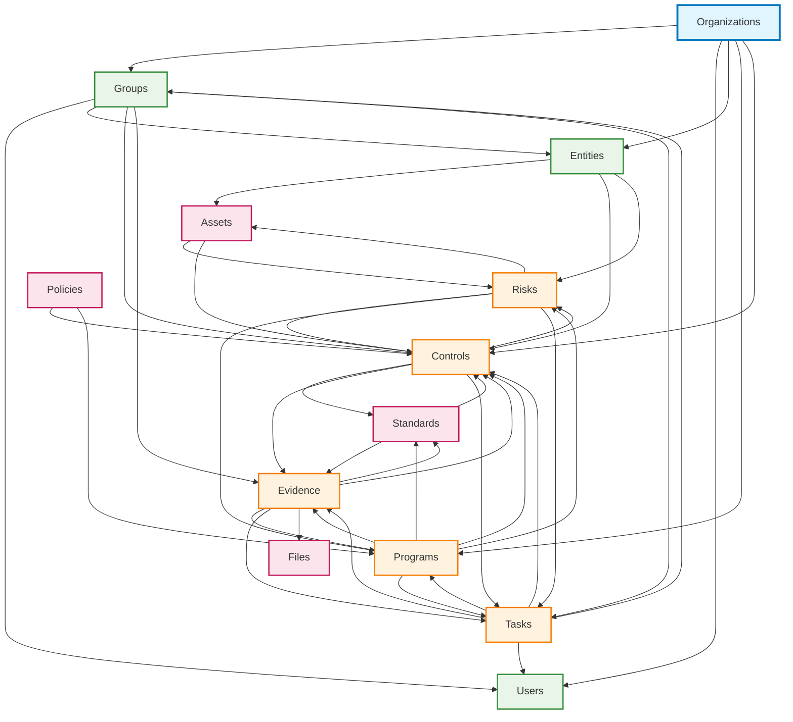

This page provides comprehensive visual representations of all primary relationships between compliance objects in the Openlane platform,
making it easier to understand how different components interact and depend on each other.

## Primary Relationships Table

| Source Object | Related Object | Relationship Type | Description |
|---------------|----------------|-------------------|-------------|
| **Controls** | Standards | Implementation | Controls implement specific requirements from compliance standards |
| **Controls** | Evidence | Demonstration | Evidence demonstrates that controls are properly implemented |
| **Controls** | Risks | Mitigation | Controls are implemented to mitigate specific risks |
| **Controls** | Programs | Organization | Controls are organized and managed within compliance programs |
| **Controls** | Tasks | Execution | Tasks track the work required to implement and maintain controls |
| **Entities** | Organizations | Ownership | Entities belong to and are managed by organizations |
| **Entities** | Assets | Association | Assets are associated with specific entities |
| **Entities** | Groups | Structure | Groups represent teams within entities |
| **Entities** | Controls | Implementation | Controls are implemented at the entity level |
| **Entities** | Risks | Assessment | Risks are assessed and managed at the entity level |
| **Evidence** | Controls | Support | Evidence demonstrates that controls are implemented effectively |
| **Evidence** | Programs | Organization | Evidence collection is organized within compliance programs |
| **Evidence** | Standards | Requirements | Evidence requirements are defined by compliance standards |
| **Evidence** | Tasks | Collection | Tasks are created to collect and maintain evidence |
| **Evidence** | Files | Storage | Evidence often includes file attachments and documents |
| **Risks** | Controls | Mitigation | Controls are implemented to mitigate specific risks |
| **Risks** | Action Plans | Treatment | Action plans define steps to address and mitigate risks |
| **Risks** | Programs | Management | Risks are managed within compliance programs |
| **Risks** | Tasks | Assessment | Tasks are created to assess and monitor risks |
| **Risks** | Assets | Association | Risks are often associated with specific IT assets |
| **Groups** | Organizations | Structure | Groups belong to organizations and provide internal structure |
| **Groups** | Users | Membership | Users are members of groups and inherit permissions |
| **Groups** | Entities | Access Control | Groups control access to specific business entities |
| **Groups** | Controls | Responsibility | Groups are assigned responsibility for controls |
| **Groups** | Evidence | Management | Groups collect, review, and maintain evidence |
| **Organizations** | Users | Membership | Users are members of organizations |
| **Organizations** | Groups | Structure | Groups provide organizational structure within organizations |
| **Organizations** | Entities | Ownership | Organizations own and manage business entities |
| **Organizations** | Programs | Management | Organizations manage compliance programs |
| **Organizations** | Controls | Implementation | Organizations implement and maintain controls |
| **Programs** | Organizations | Ownership | Programs are owned and managed by organizations |
| **Programs** | Standards | Implementation | Programs implement specific compliance standards |
| **Programs** | Controls | Coordination | Programs organize and coordinate control implementation |
| **Programs** | Evidence | Collection | Programs coordinate evidence collection and organization |
| **Programs** | Tasks | Management | Programs manage tasks and activities for compliance |
| **Tasks** | Users | Assignment | Tasks are assigned to users for completion |
| **Tasks** | Programs | Organization | Tasks are organized within compliance programs |
| **Tasks** | Groups | Coordination | Groups coordinate task assignments |
| **Tasks** | Controls | Implementation | Tasks implement, validate, and maintain controls |
| **Tasks** | Evidence | Collection | Tasks coordinate evidence collection and organization |

## Relationship Network Diagram



## Detailed Relationship Categories

### Organizational Structure

- **Organizations** → Groups, Users, Entities, Programs
- **Groups** → Users, Entities (access control)
- **Users** → Tasks (assignment), Groups (membership)

### Compliance Framework

- **Programs** → Standards, Controls, Evidence, Tasks
- **Standards** → Controls, Evidence (requirements)
- **Controls** → Evidence, Risks, Tasks

### Risk Management

- **Risks** → Controls (mitigation), Tasks (assessment), Assets (association)
- **Controls** → Risks (address), Evidence (demonstrate)

### Evidence and Documentation

- **Evidence** → Controls (support), Programs (organization), Files (storage)
- **Files** → Evidence (contain), Programs (document)

### Operational Execution

- **Tasks** → Users (assigned to), Programs (organized by), Controls (implement)
- **Groups** → Tasks (coordinate), Evidence (manage)

## Common Relationship Patterns

### 1. Hierarchical Relationships

```text
Organizations
├── Groups
│   └── Users
├── Entities
│   └── Assets
└── Programs
    ├── Controls
    ├── Evidence
    └── Tasks
```

### 2. Cross-Functional Relationships

- **Controls** ↔ **Evidence** ↔ **Tasks** (Implementation cycle)
- **Risks** ↔ **Controls** ↔ **Programs** (Risk management cycle)
- **Standards** ↔ **Programs** ↔ **Evidence** (Compliance cycle)

### 3. Access Control Relationships

- **Organizations** → **Groups** → **Users** (Permission inheritance)
- **Groups** → **Entities** → **Assets** (Scope control)
- **Users** → **Tasks** → **Evidence** (Responsibility chain)

## Navigation by Relationship Type

### Primary Functional Relationships

- [Controls Overview](docs/platform/compliance-management/controls/overview.mdx)
- [Evidence Overview](docs/platform/compliance-management/evidence/overview.mdx)
- [Risks Overview](docs/platform/risk-management/overview.mdx)
- [Programs Overview](docs/platform/compliance-management/programs/overview.mdx)

### Organizational Relationships

- [Organizations Overview](docs/platform/basics/organizations/overview.mdx)
- [Groups Overview](docs/platform/basics/groups/overview.mdx)
- [Entities Overview](docs/platform/basics/entities/overview.mdx)

### Operational Relationships

- [Tasks Overview](docs/platform/basics/tasks/overview.mdx)
- [Standards Overview](docs/platform/compliance-management/standards/overview.mdx)

## Usage Tips

1. **Start with Organizations**: Begin relationship mapping from the organization level
2. **Follow the Flow**: Use the diagram to trace relationships between objects
3. **Understand Dependencies**: Some relationships are dependent (e.g., Evidence depends on Controls)
4. **Plan Implementation**: Use relationships to plan implementation order
5. **Troubleshoot Issues**: Use relationships to identify potential integration points

This visual representation helps you understand how all compliance objects interconnect and supports better decision-making when designing compliance programs and workflows.
