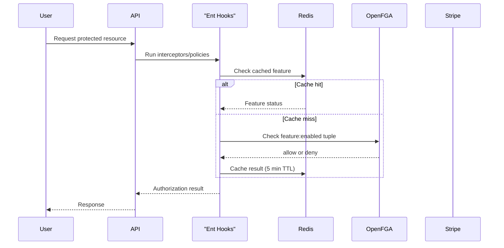

# Billing Integration

Openlane integrates with Stripe to provide module-based billing and subscription management. The billing system manages organization subscriptions, feature entitlements, and usage-based pricing through a combination of Stripe APIs, OpenFGA authorization, and Redis caching.

## Architecture Overview

The billing system consists of several interconnected components:

- **Stripe Integration** - Customer, subscription, and webhook management
- **Module Catalog** - Defines available modules and add-ons with pricing
- **Entitlements Service** - Manages feature authorization and usage limits
- **OpenFGA Tuples** - Authorization checks for module-based features
- **Redis Cache** - Performance optimization for feature checks

## Module-Based Billing

### Modules vs Add-ons

Openlane uses a two-tier billing structure:

| Type | Purpose | Pricing | Required | Examples |
|------|---------|---------|----------|----------|
| **Modules** | Core platform functionality | $20-$100/month | At least one required | `compliance_module`, `trust_center_module` |
| **Add-ons** | Optional enhancements | $1-$10/month | Optional | `domain_scanning_addon`, `extra_evidence_storage_addon` |

### Available Modules

#### Core Modules
- **Base Module** - Free core system access (included with all subscriptions)
- **Compliance Module** - Core compliance automation and standards library ($450/month)
- **Trust Center Module** - Public security portal ($300/month)
- **Entity Management Module** - Vendor risk management ($200/month)
- **Vulnerability Management Module** - Vulnerability tracking ($100/month)

#### Available Add-ons
- **Domain Scanning Add-on** - Domain and vulnerability scanning ($100/month)
- **Extra Evidence Storage** - Additional 100GB storage ($10/month)
- **Policy Management Add-on** - Policy and procedure management ($10/month)
- **Risk Management Add-on** - Enhanced risk management ($10/month)

## Stripe Integration

### Core Components

#### StripeClient
The `pkg/entitlements` package provides a wrapper around the official Stripe Go client:

```go
type StripeClient struct {
    Client   *stripe.Client
    Config   Config
    backends *stripe.Backends
}
```

#### Configuration
Stripe integration is configured through the main application config:

```go
type Config struct {
    Enabled                        bool     `default:"false"`
    PublicStripeKey               string
    PrivateStripeKey              string   `sensitive:"true"`
    StripeWebhookSecret           string   `sensitive:"true"`
    TrialSubscriptionPriceID      string
    PersonalOrgSubscriptionPriceID string
    StripeWebhookURL              string
    StripeBillingPortalSuccessURL string
    StripeCancellationReturnURL   string
    StripeWebhookEvents           []string
}
```

### Key Integration Points

#### Customer Management
Organizations are represented as Stripe customers:

```go
type OrganizationCustomer struct {
    OrganizationID string
    Email          string
    Name           string
    // Additional customer fields
}
```

#### Subscription Management
Module subscriptions are managed through Stripe subscriptions with specific price IDs corresponding to catalog entries.

#### Webhook Handling
Supported Stripe webhook events:

- `customer.subscription.updated`
- `customer.subscription.deleted`
- `customer.subscription.paused`
- `customer.subscription.trial_will_end`
- `payment_method.attached`

## Module Catalog System

### Catalog Structure

The module catalog is defined in `pkg/catalog/catalog.yaml` and includes:

```yaml
version: v0.0.4
modules:
  compliance_module:
    display_name: Core Compliance Module
    lookup_key: compliance_module
    description: Core Compliance Automation and Standards Library
    billing:
      prices:
        - interval: month
          unit_amount: 45000  # $450.00
          nickname: price_compliance_monthly
          lookup_key: price_compliance_monthly
          price_id: price_1RizUuBvxky1R7SvelsIjdkf
        - interval: year
          unit_amount: 500000  # $5000.00
          nickname: price_compliance_annually
          lookup_key: price_compliance_annually
          price_id: price_1RizUuBvxky1R7SvCQ1cygv9
    audience: public
    usage:
      evidence_storage_gb: 25000
    product_id: prod_SeI5Umu5pAUVMP
    include_with_trial: true
addons:
  extra_evidence_storage_addon:
    display_name: Additional Evidence Storage (100GB)
    lookup_key: extra_evidence_storage_addon
    description: Additional Evidence Storage (100GB)
    billing:
      prices:
        - interval: month
          unit_amount: 1000  # $10.00
          nickname: extra_evidence_storage_100gb
          lookup_key: extra_evidence_storage_100gb
          metadata:
            increment_gb: "100"
          price_id: price_1RizV0Bvxky1R7SvQ7xVtID7
    audience: public
    product_id: prod_SeI5CFhlkNjcwx
```

### Catalog Management

#### Automatic Stripe Synchronization
On server startup, the system automatically:

1. Loads the catalog configuration
2. Ensures all products exist in Stripe
3. Creates missing prices with proper metadata
4. Updates the catalog with Stripe IDs

#### CLI Tools
The `cmd/catalog` utility provides catalog management:

```bash
# Compare catalog with Stripe and create missing products/prices
go run cmd/catalog/main.go --write=true --stripe-key="sk_test_..."

# Migrate subscriptions between price IDs
go run cmd/catalog/pricemigrate.go --old-price="price_old" --new-price="price_new"
```

## Feature Authorization

### Entitlements Flow



### TupleChecker
The `TupleChecker` utility manages feature authorization:

```go
type TupleChecker struct {
    fgaClient   fgax.Client
    redisClient *redis.Client
}

// Check if a feature is enabled for an organization
allowed, err := tupleChecker.CheckFeatureTuple(ctx, FeatureTuple{
    UserID:  "user_123",
    Feature: "compliance-module",
    Context: map[string]any{"org": "org_456"},
})
```

### Feature Annotations
Ent schemas declare required modules using annotations:

```go
// Annotations in schema definition
func (Control) Annotations() []schema.Annotation {
    return []schema.Annotation{
        entx.Features("compliance-module"),
    }
}
```

## Webhook Processing

### Event Handling

Webhook events are processed to maintain feature state synchronization:

```go
func (h *Handler) WebhookReceiverHandler(ctx echo.Context) error {
    // Verify webhook signature
    event, err := webhook.ConstructEvent(payload, signature, secret)

    // Process supported event types
    switch event.Type {
    case stripe.EventTypeCustomerSubscriptionUpdated:
        return h.processSubscriptionUpdate(ctx, event)
    case stripe.EventTypeCustomerSubscriptionDeleted:
        return h.processSubscriptionCancellation(ctx, event)
    // ... other event types
    }
}
```

### Subscription State Management

When subscription events are received:

1. **Extract subscription data** from Stripe webhook
2. **Update organization subscription** in the database
3. **Synchronize OpenFGA tuples** for enabled features
4. **Refresh Redis cache** to reflect changes
5. **Update usage limits** based on subscription tier

## Usage Limits and Metering

### Storage Limits
Modules can define usage limits that are enforced at runtime:

```yaml
usage:
  evidence_storage_gb: 25000  # 25GB included with compliance module
```

### Add-on Increments
Add-ons can increase usage limits:

```yaml
metadata:
  increment_gb: "100"  # Additional 100GB storage
```

### Enforcement
Usage limits are enforced through:

- **Database constraints** for hard limits
- **Application logic** for soft limits and warnings
- **Billing portal integration** for usage monitoring

## Development and Testing

### Local Development Setup

1. **Configure Stripe keys** in your development environment:
```bash
export STRIPE_PRIVATE_KEY="sk_test_..."
export STRIPE_WEBHOOK_SECRET="whsec_..."
```

2. **Set up webhook forwarding** using Stripe CLI:
```bash
stripe login
stripe listen --forward-to localhost:17608/v1/stripe/webhook
```

3. **Test webhook events**:
```bash
stripe trigger customer.subscription.updated
stripe trigger payment_intent.succeeded
```

### Testing Environment

For testing, create a separate Stripe account and:

1. Generate test API keys
2. Create a clean catalog configuration
3. Use the catalog CLI to seed products and prices
4. Test webhook integration with Stripe CLI

### Sandbox Seeding

Example of seeding a new Stripe sandbox:

```bash
# Remove existing price/product IDs from catalog
# Run catalog sync to create fresh products and prices
go run cmd/catalog/main.go --write=true --stripe-key="sk_test_sandbox_key"
```
