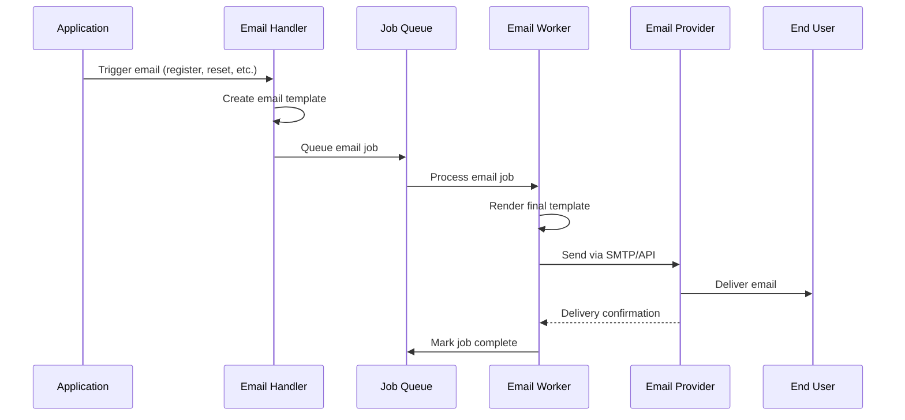

import Tabs from '@theme/Tabs';
import TabItem from '@theme/TabItem';

# Email Services Integration

Openlane uses a sophisticated email delivery system built on the `emailtemplates` library with asynchronous processing via the Riverboat job queue system. This architecture ensures reliable, scalable email delivery for user notifications, authentication flows, and business communications.

## Architecture Overview

### Email Processing Flow



### System Components

- **emailtemplates Library** - Template rendering and email formatting
- **Riverboat Job Queue** - Asynchronous job processing with River
- **Email Workers** - Dedicated workers for email delivery
- **Template System** - Structured email templates with variables
- **Delivery Tracking** - Job status monitoring and retry logic

## Email Template System

### Template Library Integration

Openlane uses the `github.com/theopenlane/emailtemplates` library for consistent, branded email communications:

```go
// Email configuration in handlers
type Handler struct {
    Emailer emailtemplates.Config
    DBClient *ent.Client
    // ... other fields
}

// Creating verification email
email, err := h.Emailer.NewVerifyEmail(emailtemplates.Recipient{
    Email:     user.Email,
    FirstName: user.FirstName,
    LastName:  user.LastName,
}, token)
```

### Supported Email Types

#### Authentication Emails
- **Email Verification** - New user account verification
- **Password Reset** - Secure password reset with tokens
- **Password Reset Success** - Confirmation of password changes
- **Login Notifications** - Security alerts for account access

#### Business Communications
- **User Invitations** - Organization and team invitations
- **Subscriber Confirmations** - Newsletter and update subscriptions
- **Notification Emails** - System alerts and updates
- **Welcome Messages** - Onboarding communications

### Template Configuration

<Tabs>
<TabItem value="go" label="Go Configuration">

```go
// Email configuration structure
type emailtemplates.Config struct {
    // Company Information
    CompanyName    string `json:"companyName" koanf:"companyName"`
    CompanyAddress string `json:"companyAddress" koanf:"companyAddress"`
    Corporation    string `json:"corporation" koanf:"corporation"`
    Year          int    `json:"year" koanf:"year"`

    // Sender Configuration
    FromEmail    string `json:"fromEmail" koanf:"fromEmail"`
    SupportEmail string `json:"supportEmail" koanf:"supportEmail"`
    LogoURL      string `json:"logoURL" koanf:"logoURL"`

    // URL Configuration
    URLs struct {
        Root            string `json:"root" koanf:"root"`
        Product         string `json:"product" koanf:"product"`
        Docs            string `json:"docs" koanf:"docs"`
        Verify          string `json:"verify" koanf:"verify"`
        Invite          string `json:"invite" koanf:"invite"`
        Reset           string `json:"reset" koanf:"reset"`
        VerifySubscriber string `json:"verifySubscriber" koanf:"verifySubscriber"`
        VerifyBilling   string `json:"verifyBilling" koanf:"verifyBilling"`
    } `json:"urls" koanf:"urls"`

    // Template Path
    TemplatesPath string `json:"templatesPath" koanf:"templatesPath"`
}
```

</TabItem>
<TabItem value="yaml" label="YAML Configuration">

```yaml
email:
  companyName: "Openlane"
  companyAddress: "123 Business Ave, Suite 100, City, State 12345"
  corporation: "Openlane Inc."
  year: 2024
  fromEmail: "noreply@theopenlane.io"
  supportEmail: "support@theopenlane.io"
  logoURL: "https://theopenlane.io/logo.png"
  urls:
    root: "https://theopenlane.io"
    product: "https://console.theopenlane.io"
    docs: "https://docs.theopenlane.io"
    verify: "https://console.theopenlane.io/verify"
    invite: "https://console.theopenlane.io/invite"
    reset: "https://console.theopenlane.io/reset"
    verifySubscriber: "https://console.theopenlane.io/verify-subscriber"
    verifyBilling: "https://console.theopenlane.io/billing/verify"
  templatesPath: "./templates"
```

</TabItem>
<TabItem value="env" label="Environment Variables">

```bash
# Company Information
CORE_EMAIL_COMPANYNAME=Openlane
CORE_EMAIL_COMPANYADDRESS="123 Business Ave, Suite 100, City, State 12345"
CORE_EMAIL_CORPORATION="Openlane Inc."
CORE_EMAIL_YEAR=2024

# Sender Configuration
CORE_EMAIL_FROMEMAIL=noreply@theopenlane.io
CORE_EMAIL_SUPPORTEMAIL=support@theopenlane.io
CORE_EMAIL_LOGOURL=https://theopenlane.io/logo.png

# URL Configuration with Domain Inheritance
CORE_DOMAIN=theopenlane.io
CORE_EMAIL_URLS_ROOT=https://theopenlane.io
CORE_EMAIL_URLS_PRODUCT=https://console.theopenlane.io
CORE_EMAIL_URLS_DOCS=https://docs.theopenlane.io
CORE_EMAIL_URLS_VERIFY=https://console.theopenlane.io/verify
CORE_EMAIL_URLS_INVITE=https://console.theopenlane.io/invite
CORE_EMAIL_URLS_RESET=https://console.theopenlane.io/reset
```

</TabItem>
</Tabs>

## Riverboat Job Queue Integration

### Job Queue Architecture

Openlane uses Riverboat (River) for asynchronous email processing:

```go
// Email job definition
type EmailArgs struct {
    Message emailtemplates.Message `json:"message"`
}

// Job insertion for email delivery
_, err = h.DBClient.Job.Insert(ctx, jobs.EmailArgs{
    Message: *email,
}, nil)
```

### Email Workers

Email processing is handled by dedicated workers in the Riverboat system:

```yaml
# Riverboat worker configuration
riverboat:
  workers:
    emailWorker:
      configDevMode: "false"
      configToken: "your-email-service-token"
      configFromEmail: "noreply@theopenlane.io"
```

### Job Processing Flow

1. **Email Creation** - Application creates email with template data
2. **Job Queuing** - Email job added to River queue with message payload
3. **Worker Processing** - Email worker picks up job and renders final template
4. **Delivery Attempt** - Worker sends email via configured provider
5. **Status Tracking** - Job marked complete or retried on failure
6. **Error Handling** - Failed jobs moved to dead letter queue after retries

## Email Delivery Methods

### Development Mode

For development and testing:

```go
// Development configuration
emailConfig := emailtemplates.Config{
    DevMode: true, // Logs emails instead of sending
    // ... other config
}
```

### Production Delivery

<Tabs>
<TabItem value="smtp" label="SMTP Configuration">

```yaml
# SMTP provider configuration
email:
  provider: "smtp"
  smtp:
    host: "smtp.sendgrid.net"
    port: 587
    username: "apikey"
    password: "${SENDGRID_API_KEY}"
    tls: true
```

</TabItem>
<TabItem value="api" label="API-based Providers">

```yaml
# API-based email providers
email:
  provider: "sendgrid"  # or "mailgun", "postmark"
  apiKey: "${EMAIL_API_KEY}"
  apiUrl: "https://api.sendgrid.com/v3/mail/send"
```

</TabItem>
<TabItem value="local" label="Local Testing">

```yaml
# Local SMTP server for testing
email:
  provider: "smtp"
  smtp:
    host: "localhost"
    port: 1025  # mailhog or similar
    username: ""
    password: ""
    tls: false
```

</TabItem>
</Tabs>

## Email Types and Implementation

### User Verification Email

```go
// Send verification email during registration
func (h *Handler) sendVerificationEmail(ctx context.Context, user *User, token string) error {
    email, err := h.Emailer.NewVerifyEmail(emailtemplates.Recipient{
        Email:     user.Email,
        FirstName: user.FirstName,
        LastName:  user.LastName,
    }, token)
    if err != nil {
        return err
    }

    _, err = h.DBClient.Job.Insert(ctx, jobs.EmailArgs{
        Message: *email,
    }, nil)
    return err
}
```

### Password Reset Email

```go
// Send password reset email
func (h *Handler) sendPasswordResetRequestEmail(ctx context.Context, user *User) error {
    email, err := h.Emailer.NewPasswordResetRequestEmail(emailtemplates.Recipient{
        Email:     user.Email,
        FirstName: user.FirstName,
        LastName:  user.LastName,
    }, user.GetPasswordResetToken())
    if err != nil {
        return err
    }

    _, err = h.DBClient.Job.Insert(ctx, jobs.EmailArgs{
        Message: *email,
    }, nil)
    return err
}
```

### Invitation Email

```go
// Send organization invitation email
func (h *Handler) sendInvitationEmail(ctx context.Context, invite *Invite, org *Organization) error {
    email, err := h.Emailer.NewInviteEmail(emailtemplates.Recipient{
        Email:     invite.Recipient,
        FirstName: "", // May not be known for invitations
        LastName:  "",
    }, org.DisplayName, invite.Token, invite.Role)
    if err != nil {
        return err
    }

    _, err = h.DBClient.Job.Insert(ctx, jobs.EmailArgs{
        Message: *email,
    }, nil)
    return err
}
```

### Subscriber Confirmation Email

```go
// Send subscriber confirmation email
func (h *Handler) sendSubscriberEmail(ctx context.Context, user *User, orgID string) error {
    org, err := h.getOrgByID(ctx, orgID)
    if err != nil {
        return err
    }

    email, err := h.Emailer.NewSubscriberEmail(emailtemplates.Recipient{
        Email:     user.Email,
        FirstName: user.FirstName,
        LastName:  user.LastName,
    }, org.DisplayName, user.GetVerificationToken())
    if err != nil {
        return err
    }

    _, err = h.DBClient.Job.Insert(ctx, jobs.EmailArgs{
        Message: *email,
    }, nil)
    return err
}
```

## Email Template Customization

### Template Structure

Email templates support rich HTML formatting with variable substitution:

```html
<!DOCTYPE html>
<html>
<head>
    <meta charset="UTF-8">
    <title>{{.Subject}}</title>
</head>
<body>
    <div style="max-width: 600px; margin: 0 auto;">
        

        <h1>Welcome to {{.CompanyName}}!</h1>

        <p>Hello {{.FirstName}},</p>

        <p>Please verify your email address by clicking the button below:</p>

        <a href="{{.VerifyURL}}" style="background-color: #007bff; color: white; padding: 12px 24px; text-decoration: none; border-radius: 4px;">
            Verify Email
        </a>

        <p>If the button doesn't work, copy and paste this link:</p>
        <p><a href="{{.VerifyURL}}">{{.VerifyURL}}</a></p>

        <hr>
        <p><small>{{.CompanyName}} | {{.CompanyAddress}}</small></p>
    </div>
</body>
</html>
```

### Variable Substitution

Templates support dynamic content via variables:

```go
// Template variables available
type TemplateData struct {
    // User information
    FirstName string
    LastName  string
    Email     string

    // Company information
    CompanyName    string
    CompanyAddress string
    LogoURL        string

    // Action URLs
    VerifyURL   string
    ResetURL    string
    InviteURL   string

    // Context-specific data
    Token          string
    OrganizationName string
    ExpiryTime     time.Time
}
```

## Error Handling and Reliability

### Job Retry Logic

```go
// Email job with retry configuration
type EmailWorker struct {
    river.WorkerDefaults[EmailArgs]
}

func (EmailWorker) Work(ctx context.Context, job *river.Job[EmailArgs]) error {
    // Attempt email delivery
    if err := sendEmail(job.Args.Message); err != nil {
        // Return error for automatic retry
        return fmt.Errorf("failed to send email: %w", err)
    }
    return nil
}

// Worker configuration with retry settings
&river.WorkerConfig{
    MaxAttempts: 3,
    Queue:       "email",
    Retry: river.RetryConfig{
        InitialInterval: 1 * time.Minute,
        MaxInterval:     10 * time.Minute,
        Multiplier:      2.0,
    },
}
```

### Error Monitoring

```go
// Email delivery metrics
var (
    emailsSentTotal = prometheus.NewCounterVec(
        prometheus.CounterOpts{
            Name: "emails_sent_total",
            Help: "Total emails sent",
        },
        []string{"type", "status"},
    )

    emailDeliveryDuration = prometheus.NewHistogramVec(
        prometheus.HistogramOpts{
            Name: "email_delivery_duration_seconds",
            Help: "Email delivery latency",
        },
        []string{"type", "provider"},
    )
)
```

### Dead Letter Queue

Failed emails are moved to a dead letter queue for manual review:

```sql
-- Query failed email jobs
SELECT
    id,
    kind,
    args,
    errors,
    attempted_at,
    finalized_at
FROM river_job
WHERE state = 'discarded'
  AND kind = 'email'
ORDER BY attempted_at DESC;
```

## Configuration Examples

### Development Setup

```yaml
# Local development configuration
email:
  companyName: "Openlane Dev"
  fromEmail: "dev@localhost"
  supportEmail: "dev@localhost"
  urls:
    root: "http://localhost:3001"
    product: "http://localhost:3001"
    verify: "http://localhost:3001/verify"
  # Use console output for development
  provider: "console"
```

### Production Setup

```yaml
# Production configuration
email:
  companyName: "Openlane"
  fromEmail: "noreply@theopenlane.io"
  supportEmail: "support@theopenlane.io"
  logoURL: "https://theopenlane.io/assets/logo.png"
  urls:
    root: "https://theopenlane.io"
    product: "https://console.theopenlane.io"
    docs: "https://docs.theopenlane.io"
    verify: "https://console.theopenlane.io/verify"
    invite: "https://console.theopenlane.io/invite"
    reset: "https://console.theopenlane.io/reset"
  # Use production email service
  provider: "sendgrid"
  apiKey: "${SENDGRID_API_KEY}"
```

### Domain Inheritance

```bash
# Set global domain for automatic URL configuration
CORE_DOMAIN=theopenlane.io

# Automatically configures:
# - Verify URL: https://console.theopenlane.io/verify
# - Reset URL: https://console.theopenlane.io/reset
# - Invite URL: https://console.theopenlane.io/invite
```

## Monitoring and Observability

### Email Metrics Dashboard

Key metrics to monitor:

- **Email Queue Depth** - Number of pending email jobs
- **Delivery Success Rate** - Percentage of successfully delivered emails
- **Delivery Latency** - Time from job creation to delivery
- **Error Rate by Type** - Failed deliveries categorized by error type
- **Template Rendering Time** - Performance of template processing

### Health Checks

```go
// Email system health check
func (h *Handler) EmailHealthCheck() error {
    // Check job queue connectivity
    if err := h.DBClient.Job.Ping(context.Background()); err != nil {
        return fmt.Errorf("job queue unhealthy: %w", err)
    }

    // Check email service connectivity
    if err := h.Emailer.HealthCheck(); err != nil {
        return fmt.Errorf("email service unhealthy: %w", err)
    }

    return nil
}
```

### Alerting Thresholds

```yaml
# Recommended alerting thresholds
alerts:
  email_queue_depth_high:
    threshold: 1000
    duration: "5m"
  email_delivery_failure_rate_high:
    threshold: 5  # 5% failure rate
    duration: "10m"
  email_delivery_latency_high:
    threshold: 300  # 5 minutes
    duration: "5m"
```

## Testing and Development

### Email Testing Tools

```go
// Test email delivery in development
func TestEmailDelivery(t *testing.T) {
    // Use test configuration
    config := emailtemplates.Config{
        DevMode: true,
        CompanyName: "Test Company",
        FromEmail: "test@example.com",
    }

    // Create test recipient
    recipient := emailtemplates.Recipient{
        Email:     "user@example.com",
        FirstName: "Test",
        LastName:  "User",
    }

    // Generate test email
    email, err := config.NewVerifyEmail(recipient, "test-token")
    assert.NoError(t, err)
    assert.Contains(t, email.Subject, "Verify")
    assert.Contains(t, email.HTML, "Test")
}
```

### Local SMTP Server

Use Mailhog for local email testing:

```bash
# Start Mailhog for local email testing
docker run -d -p 1025:1025 -p 8025:8025 mailhog/mailhog

# Configure Openlane to use Mailhog
export CORE_EMAIL_SMTP_HOST=localhost
export CORE_EMAIL_SMTP_PORT=1025
export CORE_EMAIL_SMTP_TLS=false

# View emails at http://localhost:8025
```

## Security Considerations

### Email Security
- **SPF/DKIM/DMARC** records for email authentication
- **Encrypted SMTP** connections (TLS/SSL)
- **Rate limiting** to prevent email abuse
- **Content sanitization** to prevent XSS in templates
- **Token expiry** for time-sensitive links

### Data Protection
- **PII handling** in email content and logs
- **Encryption** of sensitive data in job queue
- **Audit logging** of email delivery events
- **Retention policies** for email job data
- **GDPR compliance** for EU recipients

This email system provides reliable, scalable, and secure email delivery for all Openlane communications while maintaining excellent developer experience and operational visibility.