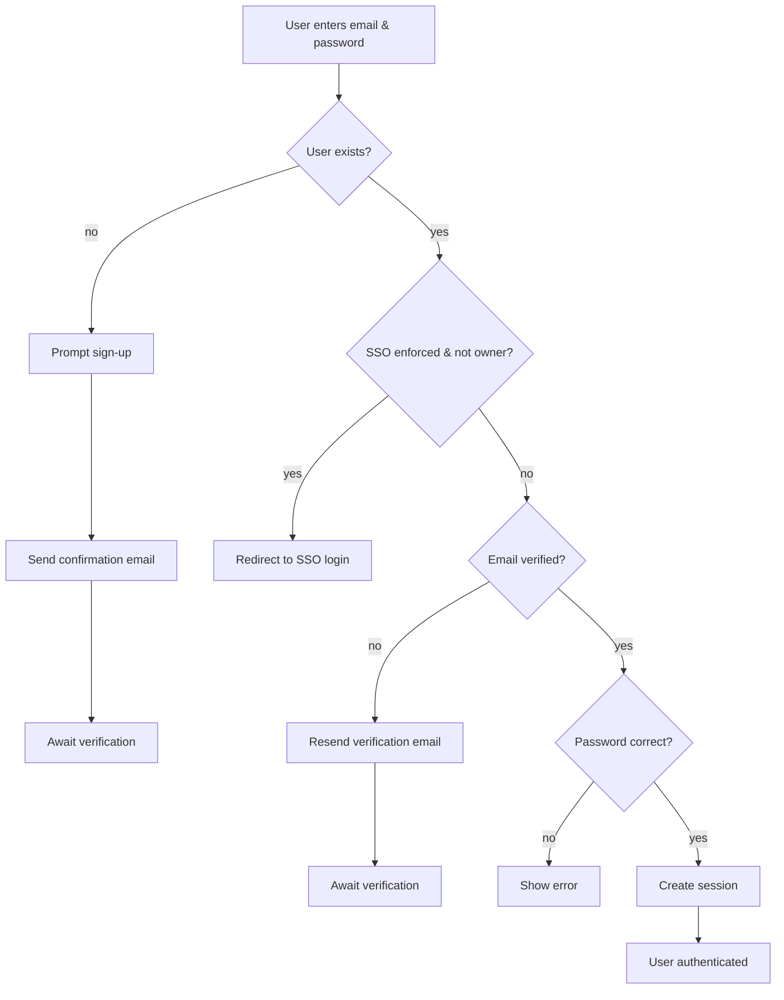
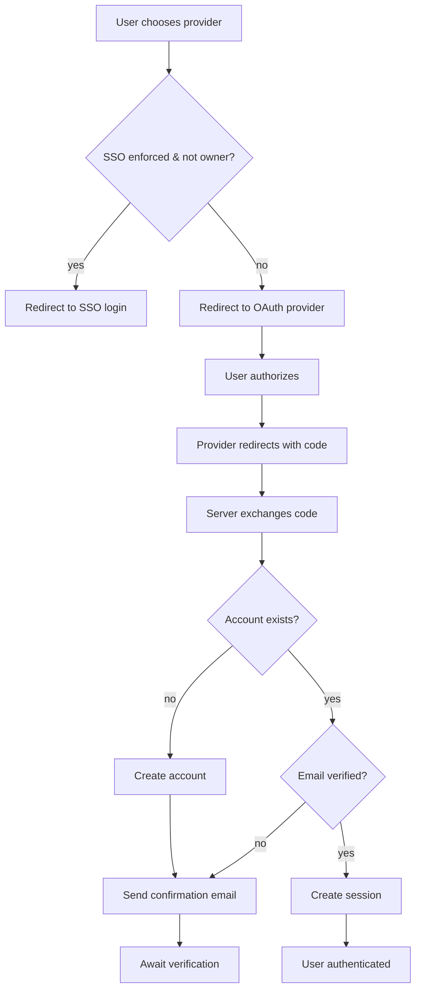
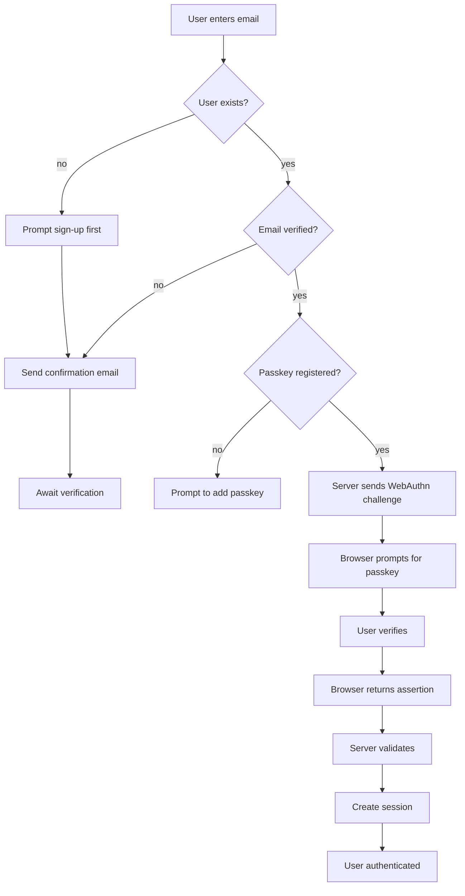
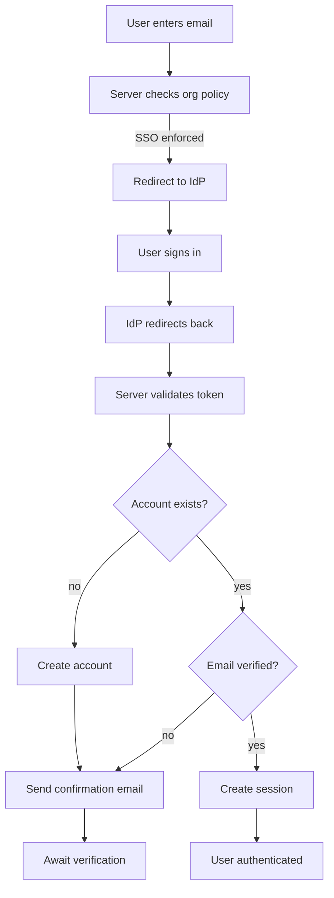
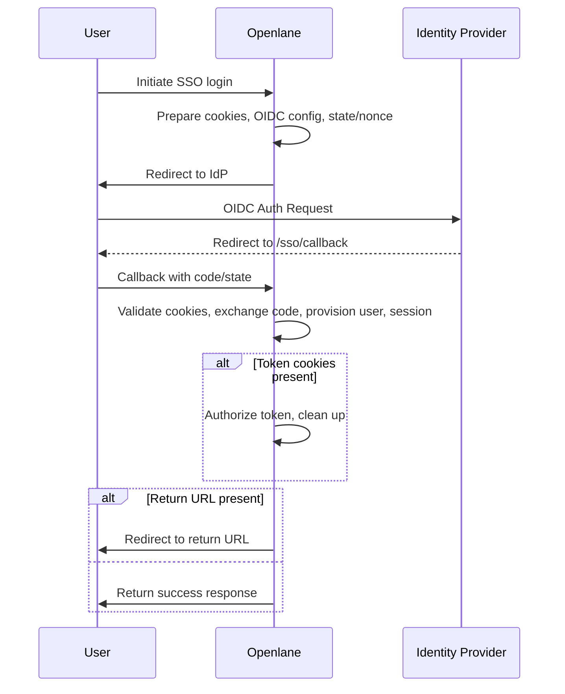
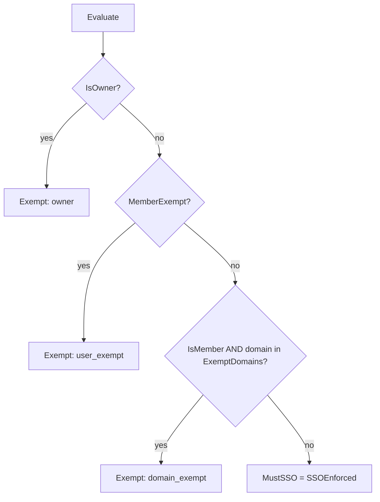
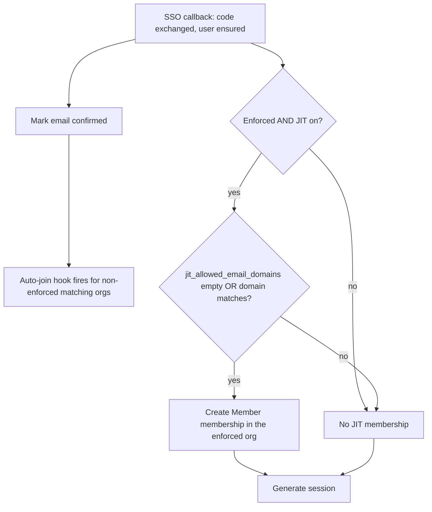
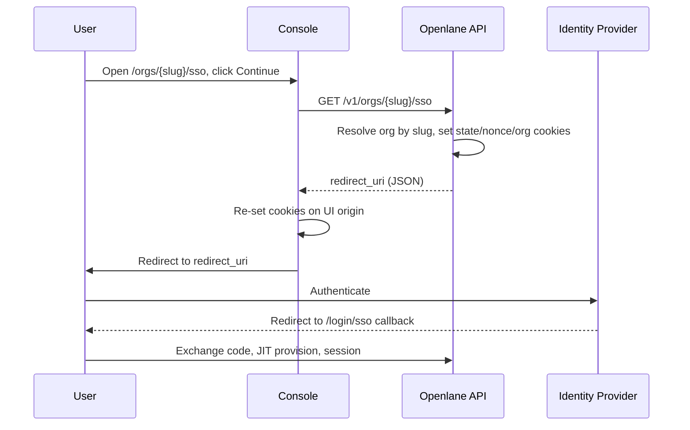

## Login Flows

Openlane supports credential, OAuth, passkey, and organization-enforced single sign-on (SSO) login, backed by a WebFinger discovery endpoint and SSO enforcement and provisioning logic. The flows below trace how each login request moves through the handlers, which tells you where to look when debugging a failed login.

### Credential Login



The credential handler is implemented in `internal/httpserve/handlers/login.go`:

- `LoginHandler` parses a `LoginRequest` and calls `getUserByEmail` to fetch the account.
- If the account does not exist, `RegisterHandler` creates the user and `sendVerificationEmail` dispatches the confirmation email.
- `ssoOrgForUser` determines if the organization enforces SSO for the email and
  redirects non-owner users to `SSOLoginHandler` when required.
- Unverified users can request a new token via `ResendEmail`, which invokes `storeAndSendEmailVerificationToken`.
- When the password is validated with `passwd.VerifyDerivedKey`, `AuthManager.GenerateUserAuthSession` issues the access and refresh tokens and `updateUserLastSeen` records the login.

### OAuth / Social Login



The OAuth handlers are defined in `internal/httpserve/handlers/oauth_login.go` and
`oauth_register.go`:

- `GetGoogleLoginHandlers` and `GetGitHubLoginHandlers` redirect users to the provider.
- After the provider callback, `issueGoogleSession` or `issueGitHubSession` call `CheckAndCreateUser` to create or update the user record.
- `ssoOrgForUser` checks the email's organization and redirects to
  `SSOLoginHandler` when SSO is enforced for non-owner members.
- New accounts are verified by `sendVerificationEmail` inside `storeAndSendEmailVerificationToken`.
- A session is created via `AuthManager.GenerateOauthAuthSession` and the last login is stored with `updateUserLastSeen`.

### Passkey Login



Passkey operations live in `internal/httpserve/handlers/webauthn.go`:

- `BeginWebauthnLogin` issues a challenge with `WebAuthn.BeginDiscoverableLogin` and stores it in the session.
- `FinishWebauthnLogin` parses the response using `protocol.ParseCredentialRequestResponseBody` and validates it with `WebAuthn.ValidateDiscoverableLogin`.
- The user is loaded with `getUserByID`, then `AuthManager.GenerateUserAuthSession` creates the token pair.
- `updateUserLastSeen` records that the login was via a passkey.

### Organization-Enforced SSO



SSO logic is implemented in `internal/httpserve/handlers/sso.go`:

- `SSOLoginHandler` checks the organization policy via `fetchSSOStatus` and redirects to the configured IdP.
- On return, `SSOCallbackHandler` exchanges the authorization code with `rp.CodeExchange` and retrieves the user data.
- The account is ensured using `CheckAndCreateUser`; new users receive a verification email via `sendVerificationEmail`.
- `AuthManager.GenerateOauthAuthSession` issues the session and the login time is recorded with `updateUserLastSeen`.

## WebFinger Endpoint

WebFinger is an HTTP discovery protocol defined by [RFC 7033](https://datatracker.ietf.org/doc/html/rfc7033). It allows a client to look up information about a resource, typically identified by a URI such as an email address.

Openlane exposes a WebFinger endpoint at `/.well-known/webfinger`. The login page queries this endpoint to determine whether an organization requires SSO authentication and which identity provider should be used.

### Querying the Endpoint

Send a `GET` request to `/.well-known/webfinger` with a `resource` parameter.

```text
/.well-known/webfinger?resource=acct:alice@example.com
/.well-known/webfinger?resource=org:01HAC1M7J3A2YHC4ZK6B2QWJNT
```

The endpoint returns an `SSOStatusReply` structure:

```json
{
  "success": true,
  "enforced": true,
  "provider": "OKTA",
  "discovery_url": "https://id.example.com/.well-known/openid-configuration",
  "organization_id": "01HAC1M7J3A2YHC4ZK6B2QWJNT"
}
```

### Why WebFinger?

Using WebFinger provides a lightweight way for the UI to discover if SSO is enforced before the user authenticates. When the email entered on the login form maps to an organization that enforces SSO, the browser can immediately redirect to the configured identity provider without any additional API calls or user interaction.

## OIDC Handler Flows



## SSO Enforcement & Exemptions

Whether a member must use SSO is decided by `Evaluate` in `pkg/ssoutils/enforcement.go`, fed by `LoadEnforcement` in `pkg/ssoutils/load.go`. `LoadEnforcement` reads the organization setting (`identity_provider_login_enforced`, `multifactor_auth_enforced`, `sso_exempt_domains`) and, when a user id is supplied, the member's `role` and `sso_exempt` flag.

`Evaluate` resolves exemption with first-match precedence, then computes `MustSSO = SSOEnforced && !Exempt`:



- Two-factor authentication (TFA) is independent: `TFARequired` mirrors `multifactor_auth_enforced` regardless of SSO exemption.
- The same decision is consulted at every entry point: `login.go` and `oauth_login.go` call `orgEnforcementsForUser` → `fetchSSOStatus`; `switch.go` calls `fetchSSOStatus` for the target org; `webfinger.go` exposes it for the UI. `fetchSSOStatus` (in `sso.go`) only applies the per-user exemptions when a user id is provided, so an `org:`-scoped webfinger lookup reports raw enforcement while an `acct:` lookup reports the specific user's requirement.

## JIT Provisioning

`SSOCallbackHandler` (in `sso.go`) provisions membership after a successful IdP exchange, before the session is issued, via `jitProvisionMembership` (in `ent.go`):

- Runs only when the org has `identity_provider_login_enforced` **and** `identity_provider_jit_provisioning` set.
- When `jit_allowed_email_domains` is non-empty, the authenticated email's domain must be in the list; otherwise provisioning is skipped.
- Existing members are left untouched; new memberships are created with the Member role under an org-scoped caller so the membership hooks resolve the organization.

The callback also marks the IdP-verified email confirmed (via `setEmailConfirmed`) before session generation. That confirmation triggers the email-confirmation hook, which drives domain auto-join for **non-enforced** organizations (see below); the enforced target org is joined by just-in-time (JIT) provisioning, not auto-join.



## Domain-Based Membership: Auto-Join vs JIT

`autoJoinOrganizationsForUser` (in `internal/ent/hooks/usersettings.go`) runs from the email-confirmation hook and now filters on `organizationsetting.IdentityProviderLoginEnforced(false)` in addition to `AllowMatchingDomainsAutojoin(true)` and the email domain being contained in `allowed_email_domains`. So:

- **SSO not enforced** → membership by `allowed_email_domains` + auto-join toggle, on email confirmation.
- **SSO enforced** → auto-join is skipped; membership comes from JIT (`jit_allowed_email_domains`) or an invitation.

The two domain lists are independent fields and never apply simultaneously to the same organization.

## Shareable Per-Org SSO Initiation

`SSOInitiateHandler` (in `sso.go`, route `GET /v1/orgs/:slug_name/sso`, unauthenticated) resolves an organization by `slug_name` and mirrors `SSOLoginHandler`: it sets the `state`/`nonce`/`organization_id` cookies and returns the IdP redirect URL as JSON, rather than redirecting from the API directly. The console proxies it so those cookies are re-set on the UI origin, after which the existing `/login/sso` callback page completes the exchange unchanged.

`slug_name` is derived from the organization name in the create hook (`internal/ent/hooks/organization.go`, `strcase.KebabCase`). The org-setting read inside `oidcConfig` uses an allow context so a non-member can start the flow; the client secret is only used server-side for the code exchange and is never returned.



