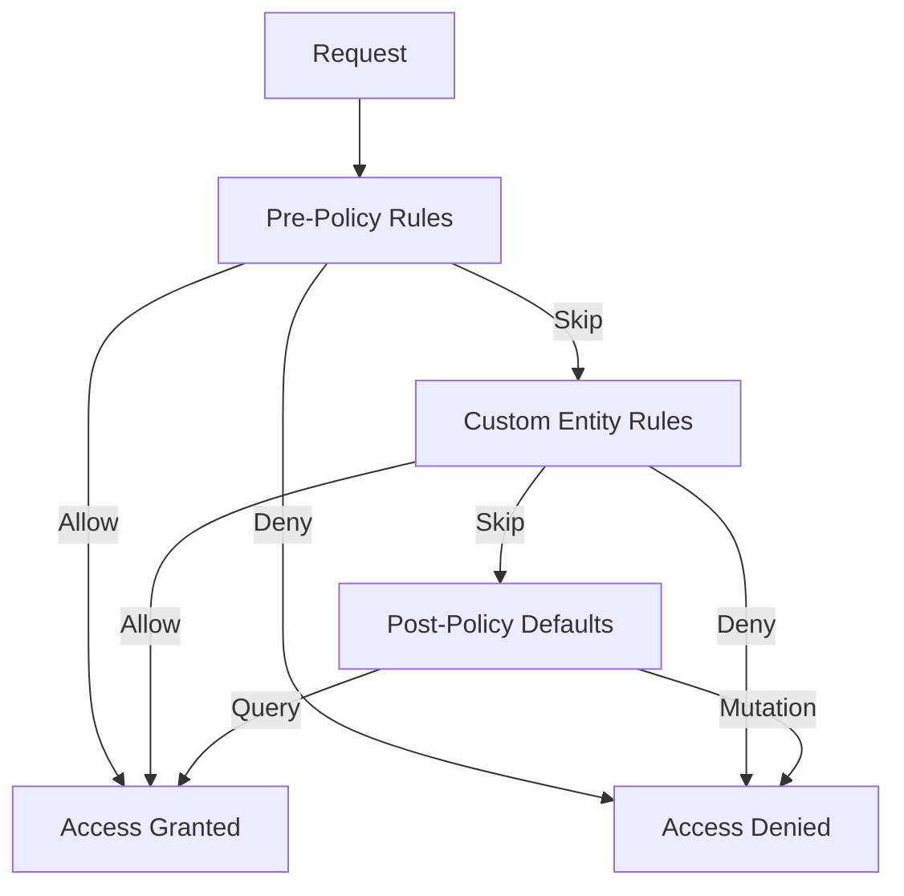
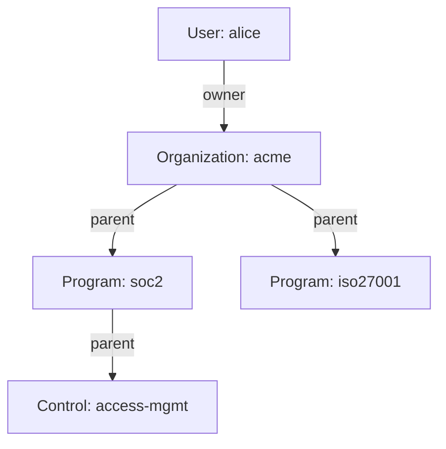
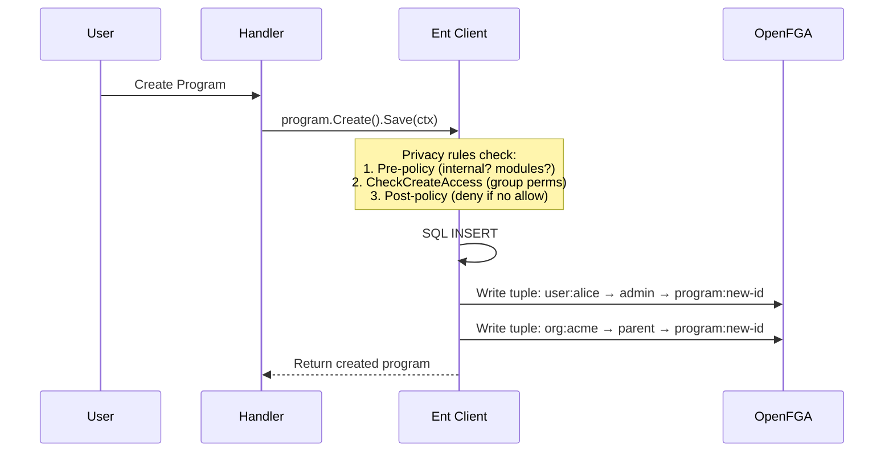

# Privacy and Authorization

Openlane enforces authorization at the ORM layer, not at the resolver or handler level. This means access control follows data everywhere -- whether it is accessed via GraphQL, REST, a hook, or a direct Ent client call. The system combines three mechanisms:

1. **Privacy policies** on Ent schemas that gate every query and mutation
1. **OpenFGA tuples** that model relationships between users and resources
1. **Hooks** that create, update, and delete tuples when data changes

## The Privacy Policy Sandwich

Every entity's privacy policy is assembled from three layers that execute in order. Think of it as a sandwich: pre-policy bread, custom rule fillings, post-policy bread.



### Pre-Policy

Runs first on every operation. Handles special cases that should bypass normal authorization:

* **Internal requests** -- operations triggered by the system itself (migrations, hooks, background jobs) are allowed unconditionally
* **History queries** -- read access to audit history is always permitted
* **Module gating** -- mutations are denied if the organization does not have the required feature module enabled (see [Module Gating](#module-gating) below)

### Custom Rules

Entity-specific rules defined in each schema's `Policy()` method. This is where FGA checks happen:

```go
func (Program) Policy() ent.Policy {
    return policy.NewPolicy(
        policy.WithMutationRules(
            policy.CheckCreateAccess(),
            entfga.CheckEditAccess[*generated.ProgramMutation](),
        ),
    )
}
```

### Post-Policy

The failsafe. If no custom rule returned a decision:

* **Queries** are **allowed** by default -- if you got past pre-policy without a deny, you can read
* **Mutations** are **denied** by default -- if no custom rule explicitly allowed the write, it is blocked

:::warning
This means a new entity with no custom rules will be readable but not writable. If your mutations are silently failing, check that your schema defines mutation rules.
:::

## Rule Decision Values

Every privacy rule returns one of three values:

| Return | Meaning |
|---|---|
| `privacy.Allow` | Grant access immediately, stop checking further rules |
| `privacy.Deny` | Deny access immediately, stop checking further rules |
| `privacy.Skip` | No opinion -- pass to the next rule in the chain |

The first rule to return `Allow` or `Deny` wins. `Skip` means "I do not have enough information to decide, ask someone else."

## FGA Relationships

OpenFGA stores authorization relationships as _tuples_: `subject → relation → object`. When a privacy rule calls `entfga.CheckEditAccess`, it queries OpenFGA to determine whether the authenticated user has the required relation to the target object.

### Common Relations

| Relation | Grants |
|---|---|
| `owner` | Full control, inherited by children |
| `admin` | Administrative access, can manage members |
| `member` | Standard access to organization resources |
| `editor` | Write access to specific entities (often via group membership) |
| `viewer` | Read access to specific entities (often via group membership) |
| `parent` | Establishes ownership hierarchy between organizations or between an org and its entities |
| `blocked` | Explicitly revokes access even if other relations would grant it |
| `can_view`, `can_edit`, `can_delete` | Computed permissions derived from the relations above |

### Relationship Inheritance

Relations flow downward through the `parent` relation. If a user is an `owner` of an organization, they inherit access to all entities owned by that organization:



In this example, alice can edit `soc2`, `iso27001`, and `access-mgmt` because she owns `acme` and ownership propagates through `parent` relations.

### Group-Based Access

Fine-grained access is managed through groups rather than individual user assignments:

```
group:engineering#member → editor → program:soc2
```

This gives all members of the `engineering` group editor access to the `soc2` program. The `blocked` relation can override this -- if a user is both a group member and individually blocked, the block wins.

## Tuple Lifecycle

Tuples are not managed manually. Hooks on entity mutations handle creation and deletion automatically.

### On Entity Creation

When an org-owned entity is created, hooks typically write two tuples:

1. **Creator gets admin** -- `user:creator-id → admin → entity:new-id`
1. **Org gets parent** -- `organization:org-id → parent → entity:new-id`

For API token-authenticated requests, the token gets `can_edit` instead of the user getting `admin`.

### On Entity Deletion

`HookDeletePermissions()` is a global hook that fires on every delete operation. It calls `DeleteAllObjectRelations()` to remove all tuples where the deleted entity is the object. This prevents orphaned tuples from accumulating.

### Example: Program Creation Flow



## Module Gating

The `DenyIfMissingAllModules()` rule in pre-policy checks whether the organization has the required feature modules enabled before allowing mutations. Each entity declares its required modules:

```go
func (Program) Modules() []models.OrgModule {
    return []models.OrgModule{
        models.CatalogComplianceModule,
        models.CatalogEntityManagementModule,
    }
}
```

The check uses `OR` logic -- the organization needs *any* of the listed modules, not all of them.

Module gating is skipped for:

* Internal/system requests
* History mutations
* Organization creation (the org does not exist yet to check modules against)
* System admin users

## Privacy Tokens

Some operations need to bypass normal authorization. Rather than granting broad access, the system uses _privacy tokens_ -- typed markers in the request context that specific rules check for.

| Token | Purpose |
|---|---|
| `SignUpToken` | Email registration flow |
| `OrgInviteToken` | Organization invitation acceptance |
| `ResetToken` | Password reset |
| `VerifyToken` | Email verification |
| `OauthTooToken` | OAuth token exchange |
| `WebauthnToken` | Passkey registration |
| `FileDownloadToken` | Direct file downloads |

Example: the `OrgMembership` schema allows invite tokens to create memberships without requiring edit access:

```go
func (OrgMembership) Policy() ent.Policy {
    return policy.NewPolicy(
        policy.WithMutationRules(
            rule.AllowIfContextHasPrivacyTokenOfType[*token.OrgInviteToken](),
            entfga.CheckEditAccess[*generated.OrgMembershipMutation](),
        ),
    )
}
```

The invite token rule runs first. If the context contains an `OrgInviteToken`, the mutation is allowed without checking FGA.

## Permission Caching

FGA checks involve network round-trips. To reduce latency, the system caches positive authorization decisions in Redis via `pkg/permissioncache/`:

1. Before querying FGA, check the cache
1. If cached, return the cached decision
1. If not cached, query FGA
1. On success, cache the result

Cache entries are keyed by `(subject, object, relation)` and have a configurable TTL. This means permission changes (like removing a user from a group) may take up to one TTL period to take effect.

## Debugging Authorization Failures

When a request returns "not found" or "permission denied" on a record you know exists:

1. **Check the privacy policy** on the entity schema -- does it have the right mutation rules?
1. **Check the user's context** -- is the organization ID set? Is the user authenticated?
1. **Check FGA tuples** -- does a tuple exist granting the user access to the specific object?
1. **Check module gating** -- does the organization have the required feature modules?
1. **Check the permission cache** -- a recently-revoked permission may still be cached

:::tip
For local development, you can inspect FGA tuples directly using the OpenFGA CLI or the built-in FGA playground. The FGA model is defined in `fga/model/model.fga` in the core repository.
:::
