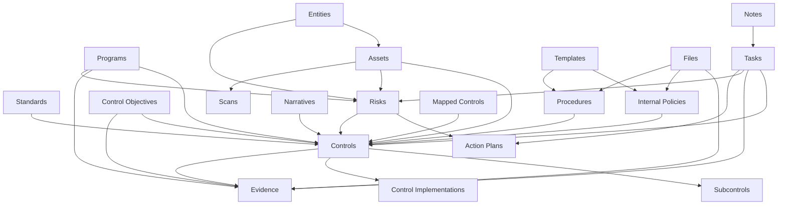

# Openlane Compliance Objects Reference

Openlane provides a comprehensive compliance management platform built around interconnected objects that support various compliance frameworks, risk management, and audit preparation. This reference guide provides detailed documentation for each compliance object type.

## Quick Navigation

### 🏛️ Core Compliance Objects
| Object | Purpose | Key Use Cases |
|--------|---------|---------------|
| **[Standards](../../../platform/standards/overview.mdx)** | Compliance frameworks and regulations | SOC 2, ISO 27001, NIST, PCI DSS |
| **[Controls](../../../platform/controls/overview.mdx)** | Specific compliance requirements | Access controls, encryption, monitoring |
| **[Evidence](../../../platform/programs/evidence/overview.mdx)** | Audit evidence and documentation | Policies, logs, assessments, reports |
| **[Risks](../../../platform/risks/overview.mdx)** | Risk identification and management | Security risks, compliance gaps, business continuity |

### 📋 Program Management
| Object | Purpose | Key Use Cases |
|--------|---------|---------------|
| **[Programs](../../../platform/programs/overview.mdx)** | Compliance program organization | SOC 2 audit, ISO certification, annual reviews |
| **[Control Objectives](../../../platform/controls/overview.mdx)** | High-level control outcomes | Framework alignment, audit preparation |
| **[Control Implementations](../../../platform/controls/implementations.mdx)** | Implementation tracking | Testing schedules, verification records |
| **[Subcontrols](../../../platform/controls/subcontrols.mdx)** | Granular control requirements | Detailed testing, specific procedures |

### 📚 Governance & Documentation
| Object | Purpose | Key Use Cases |
|--------|---------|---------------|
| **[Internal Policies](../../../platform/policies/overview.mdx)** | Organizational policies | Security policies, privacy policies, operational procedures |
| **[Procedures](../../../platform/policies/overview.mdx)** | Operational procedures | Incident response, change management, access provisioning |
| **Narratives** | Compliance narratives | System descriptions, control descriptions, process flows |

### ⚡ Workflow & Collaboration
| Object | Purpose | Key Use Cases |
|--------|---------|---------------|
| **[Tasks](../../../platform/tasks/overview.mdx)** | Work items and assignments | Evidence collection, control testing, remediation |
| **Action Plans** | Remediation plans | Gap remediation, risk mitigation, improvement projects |
| **Notes** | Comments and collaboration | Review comments, discussion threads, clarifications |

### 🗄️ Asset & Entity Management
| Object | Purpose | Key Use Cases |
|--------|---------|---------------|
| **Assets** | IT assets and infrastructure | Server inventory, application catalog, network devices |
| **[Entities](../../../platform/entities/overview.mdx)** | Business entities | Subsidiaries, departments, service providers |
| **Scans** | Security and compliance scans | Vulnerability scans, configuration checks, compliance assessments |

### 🔗 Integration & Templates
| Object | Purpose | Key Use Cases |
|--------|---------|---------------|
| **Mapped Controls** | Cross-framework mappings | Multi-framework compliance, control reuse |
| **Templates** | Document templates | Policy templates, assessment forms, report formats |
| **[Files](../../../platform/files/overview.mdx)** | Document management | Evidence files, policy documents, assessment reports |

## Framework Support

Openlane supports comprehensive compliance management across multiple frameworks:

### 🔒 Security Frameworks
- **SOC 2** - Service Organization Control Type 2 audits
- **ISO 27001/27002** - Information Security Management Systems
- **NIST Cybersecurity Framework** - Risk-based cybersecurity approach
- **NIST 800-53** - Security and Privacy Controls for Federal Information Systems
- **CIS Controls** - Critical Security Controls for Effective Cyber Defense

### 🏥 Industry Regulations
- **HIPAA** - Health Insurance Portability and Accountability Act
- **PCI DSS** - Payment Card Industry Data Security Standard
- **GDPR** - General Data Protection Regulation
- **CCPA** - California Consumer Privacy Act
- **SOX** - Sarbanes-Oxley Act financial controls

### 💻 Development Frameworks
- **NIST SSDF** - Secure Software Development Framework
- **OWASP SAMM** - Software Assurance Maturity Model
- **BSIMM** - Building Security In Maturity Model

## Object Relationships

Understanding how compliance objects relate to each other is crucial for effective compliance management:

## Common Workflows

### 🎯 Compliance Program Setup
1. **Import Standards** - Load compliance frameworks (SOC 2, ISO 27001)
2. **Create Program** - Establish compliance program with scope and timeline
3. **Import Controls** - Add framework controls to the program
4. **Assign Ownership** - Designate control owners and responsibilities
5. **Define Objectives** - Set control objectives and success criteria

### 📊 Control Implementation
1. **Plan Implementation** - Develop control implementation strategies
2. **Document Procedures** - Create operational procedures supporting controls
3. **Implement Safeguards** - Put technical and administrative controls in place
4. **Collect Evidence** - Gather evidence demonstrating control operation
5. **Test Effectiveness** - Validate controls are working as intended

### 🔍 Audit Preparation
1. **Evidence Collection** - Organize and prepare audit evidence
2. **Gap Analysis** - Identify and address control gaps
3. **Documentation Review** - Ensure policies and procedures are current
4. **Risk Assessment** - Update risk assessments and treatment plans
5. **Auditor Readiness** - Prepare evidence packages and documentation

### ⚠️ Risk Management
1. **Risk Identification** - Discover and document potential risks
2. **Risk Assessment** - Evaluate impact and likelihood
3. **Risk Treatment** - Develop mitigation strategies and action plans
4. **Control Mapping** - Map controls to specific risks
5. **Monitoring** - Track risk status and control effectiveness

## API Integration

All compliance objects are accessible through comprehensive APIs:

### GraphQL API
- **Query Operations** - Retrieve individual objects and collections
- **Mutation Operations** - Create, update, and delete operations
- **Search Operations** - Full-text search across object types
- **Bulk Operations** - Efficient bulk create and update operations
- **Relationship Queries** - Traverse object relationships

### REST API
- **CRUD Operations** - Standard create, read, update, delete operations
- **Filtering** - Query objects with advanced filtering
- **Pagination** - Handle large datasets efficiently
- **File Upload** - Upload evidence files and documents
- **Export** - Export compliance data for reporting

## Development Resources

### 🛠️ Developer Documentation
- **Compliance Objects Developer Reference** - Technical implementation details
- **[Core Repository README](https://github.com/theopenlane/core/blob/main/config/README.md)** - Configuration and automation details
- **API Documentation** - Complete API reference

### 📝 Implementation Examples
- **GraphQL Examples** - Common GraphQL queries and mutations
- **REST API Examples** - REST endpoint usage examples
- **Bulk Operations** - Efficient bulk data operations

### ⚙️ Configuration Management
- **[Domain Inheritance](https://github.com/theopenlane/core/blob/main/config/README.md#global-domain-inheritance-system)** - Global domain configuration
- **[Secret Management](https://github.com/theopenlane/core/blob/main/config/README.md#secret-management-workflow)** - Secure configuration handling
- **[Automation](https://github.com/theopenlane/core/blob/main/.buildkite/helm-automation.sh)** - Automated deployment workflows

## Getting Started

### Quick Start Guide
1. **[Platform Overview](../../../platform/overview.mdx)** - Understand Openlane's compliance capabilities
2. **Authentication** - Set up API authentication
3. **[Create Organization](../../../platform/organizations/overview.mdx)** - Set up your compliance organization
4. **[Import Standards](../../../platform/standards/overview.mdx)** - Load compliance frameworks
5. **[Create Program](../../../platform/programs/overview.mdx)** - Start your first compliance program

### Learning Path
1. **Foundations** - Understand compliance objects and relationships
2. **Implementation** - Learn to create and manage controls and evidence
3. **Automation** - Set up automated evidence collection and monitoring
4. **Integration** - Integrate with existing tools and workflows
5. **Optimization** - Optimize processes for efficiency and effectiveness

For detailed information about each compliance object type, click on the links in the tables above or explore the Platform section.
