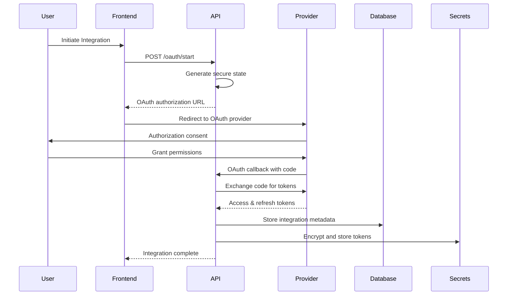
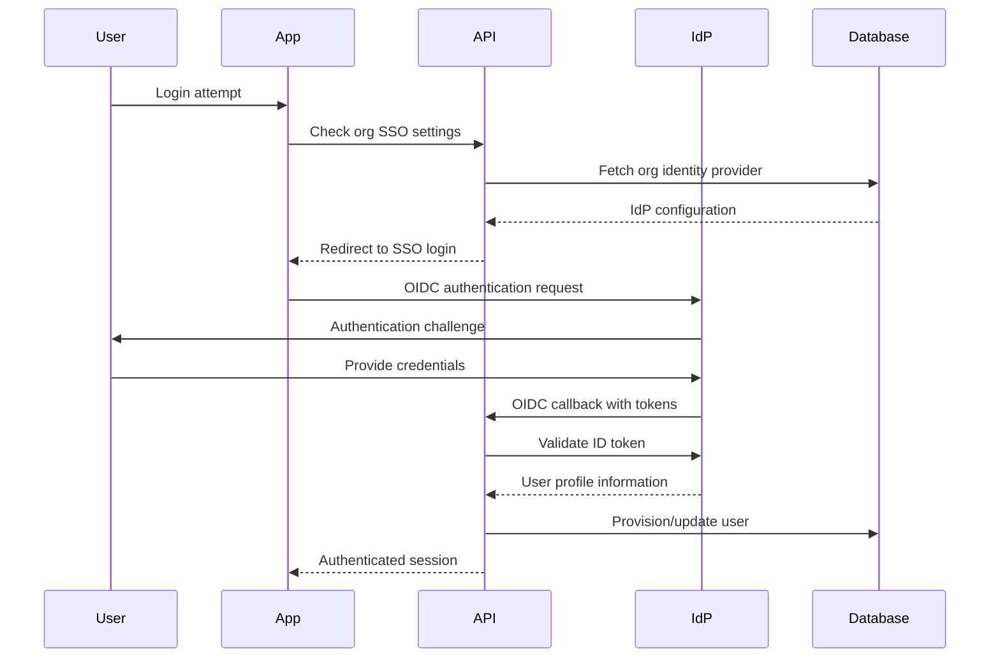
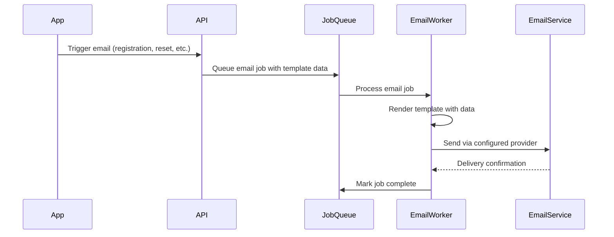

# Platform Integrations Overview

Openlane provides extensive integration capabilities with external services to enhance functionality, automate workflows, and provide seamless user experiences. The platform supports multiple types of integrations including authentication providers, email services, third-party OAuth integrations, and enterprise SSO solutions.

## Integration Categories

### Authentication & Identity
- **Social Login Providers** - Google, GitHub OAuth authentication
- **Enterprise SSO** - OIDC/SAML integration with Okta, Google Workspace, OneLogin
- **WebAuthn** - Hardware security key and biometric authentication
- **Multi-Factor Authentication** - TOTP-based 2FA with backup codes

### Communication & Notifications
- **Email Services** - Template-based email delivery via emailtemplates library
- **Job Queue System** - Riverboat/River for asynchronous email processing
- **Slack Integration** - OAuth-based team communication and notifications
- **Webhook System** - Configurable webhooks for event notifications

### Development & Operations
- **GitHub Integration** - OAuth-based repository access and management
- **Stripe Integration** - Payment processing and subscription management
- **External Secrets** - GCP Secret Manager for secure credential storage
- **Monitoring & Analytics** - OpenTelemetry, Prometheus metrics

### Data & Storage
- **Object Storage** - Multi-provider file storage (GCS, S3, local disk)
- **Database Integration** - PostgreSQL with Redis caching
- **Search & Discovery** - Full-text search capabilities
- **Data Export** - CSV and structured data export functionality

## Architecture Principles

### Security-First Design
All integrations follow security best practices:
- **OAuth 2.0 / OIDC** standards for authentication flows
- **Encrypted token storage** using Hush secrets management
- **Organization-scoped** access controls and data isolation
- **State parameter validation** to prevent CSRF attacks
- **Token lifecycle management** with automatic refresh and expiry handling

### Scalable Infrastructure
Integrations are designed for enterprise scale:
- **Asynchronous processing** via job queues for heavy operations
- **Horizontal scaling** support for stateless services
- **Caching strategies** to optimize external API calls
- **Rate limiting** to respect external service quotas
- **Circuit breaker patterns** for resilient external calls

### Developer Experience
Easy configuration and extensibility:
- **Environment-based configuration** with automatic domain inheritance
- **Comprehensive error handling** with detailed logging
- **Testing interfaces** for integration validation
- **Webhook debugging** tools and event replay
- **Self-service setup** for common integrations

## Integration Flow Patterns

### OAuth Integration Pattern


### SSO Authentication Pattern


### Email Processing Pattern


## Configuration Management

### Environment Variables
All integrations support environment-based configuration:
```bash
# OAuth Provider Configuration
CORE_AUTH_PROVIDERS_GOOGLE_CLIENTID=your-google-client-id
CORE_AUTH_PROVIDERS_GOOGLE_CLIENTSECRET=your-google-client-secret
CORE_AUTH_PROVIDERS_GITHUB_CLIENTID=your-github-client-id
CORE_AUTH_PROVIDERS_GITHUB_CLIENTSECRET=your-github-client-secret

# Integration OAuth Configuration
CORE_INTEGRATIONOAUTHPROVIDER_GITHUB_CLIENTID=integration-github-client-id
CORE_INTEGRATIONOAUTHPROVIDER_SLACK_CLIENTID=integration-slack-client-id

# Email Configuration
CORE_EMAIL_FROMEEMAIL=noreply@your-domain.com
CORE_EMAIL_COMPANYNAME=Your Company

# External Services
CORE_SUBSCRIPTION_PRIVATESTRIPEKEY=sk_live_your-stripe-key
CORE_SLACK_WEBHOOKURL=https://hooks.slack.com/services/your-webhook
```

### Domain Inheritance
Automatic domain-based configuration for multi-environment deployments:
```bash
# Set global domain
CORE_DOMAIN=yourdomain.com

# Auto-configured URLs:
# - Auth redirects: https://api.yourdomain.com/v1/google/callback
# - Webhook URLs: https://api.yourdomain.com/v1/stripe/webhook
# - Trust center: https://trust.yourdomain.com
```

### Helm Chart Integration
All integrations are configurable via Helm values:
```yaml
openlane:
  coreConfiguration:
    auth:
      providers:
        google:
          clientId: "your-google-client-id"
          scopes: ["openid", "email", "profile"]
        github:
          clientId: "your-github-client-id"
          scopes: ["user:email", "read:user"]
    subscription:
      enabled: true
      publicStripeKey: "pk_live_your-public-key"
```

## Security Considerations

### Token Security
- **Encryption at rest** using Hush field-level encryption
- **Secure transmission** over HTTPS only
- **Token rotation** with automatic refresh handling
- **Scope limitation** to minimum required permissions
- **Expiry enforcement** with proactive renewal

### Access Control
- **Organization isolation** for all integration data
- **Role-based permissions** for integration management
- **Audit logging** for all integration activities
- **API rate limiting** to prevent abuse
- **Input validation** on all external data

### Compliance
- **SOC 2 Type II** compliance for data handling
- **GDPR compliance** with data retention policies
- **PCI DSS** compliance for payment processing
- **Regular security audits** of integration endpoints
- **Vulnerability scanning** of dependencies

## Monitoring & Observability

### Metrics Collection
```go
// Integration-specific metrics
var (
    oauthFlowsTotal = prometheus.NewCounterVec(
        prometheus.CounterOpts{
            Name: "oauth_flows_total",
            Help: "Total OAuth flows initiated",
        },
        []string{"provider", "status"},
    )

    integrationAPICallsTotal = prometheus.NewCounterVec(
        prometheus.CounterOpts{
            Name: "integration_api_calls_total",
            Help: "Total integration API calls",
        },
        []string{"provider", "endpoint", "status"},
    )
)
```

### Health Checks
```go
// Integration health monitoring
func (h *Handler) IntegrationHealthCheck() error {
    // Check OAuth provider connectivity
    if err := h.validateOAuthProviders(); err != nil {
        return fmt.Errorf("oauth providers unhealthy: %w", err)
    }

    // Check email service connectivity
    if err := h.validateEmailService(); err != nil {
        return fmt.Errorf("email service unhealthy: %w", err)
    }

    return nil
}
```

### Error Handling
- **Structured logging** with correlation IDs
- **Error classification** (temporary vs permanent failures)
- **Retry strategies** with exponential backoff
- **Dead letter queues** for failed jobs
- **Alert thresholds** for integration failures

## Testing Strategies

### Integration Testing
```go
func TestOAuthFlow(t *testing.T) {
    // Mock OAuth provider
    server := httptest.NewServer(http.HandlerFunc(func(w http.ResponseWriter, r *http.Request) {
        // Mock provider responses
    }))
    defer server.Close()

    // Test complete OAuth flow
    client := testutils.NewTestClient()
    resp := client.StartOAuthFlow("github", []string{"repo"})
    assert.Equal(t, http.StatusOK, resp.StatusCode)
}
```

### End-to-End Testing
- **OAuth flow validation** with test providers
- **Email delivery testing** with mock SMTP
- **Webhook endpoint verification**
- **SSO integration validation**
- **Token lifecycle testing**

## Best Practices

### Development
1. **Use test credentials** for all non-production environments
2. **Implement circuit breakers** for external API calls
3. **Log integration events** for debugging and audit
4. **Handle partial failures** gracefully
5. **Validate all external input** before processing

### Operations
1. **Monitor integration health** continuously
2. **Set up alerting** for critical integration failures
3. **Rotate credentials** regularly
4. **Review access scopes** periodically
5. **Maintain integration documentation** up to date

### Security
1. **Use least privilege** access for all integrations
2. **Encrypt sensitive data** at rest and in transit
3. **Validate OAuth state** parameters
4. **Implement rate limiting** on all endpoints
5. **Regular security reviews** of integration code

The following sections provide detailed documentation for each integration category, including setup instructions, configuration examples, and troubleshooting guides.