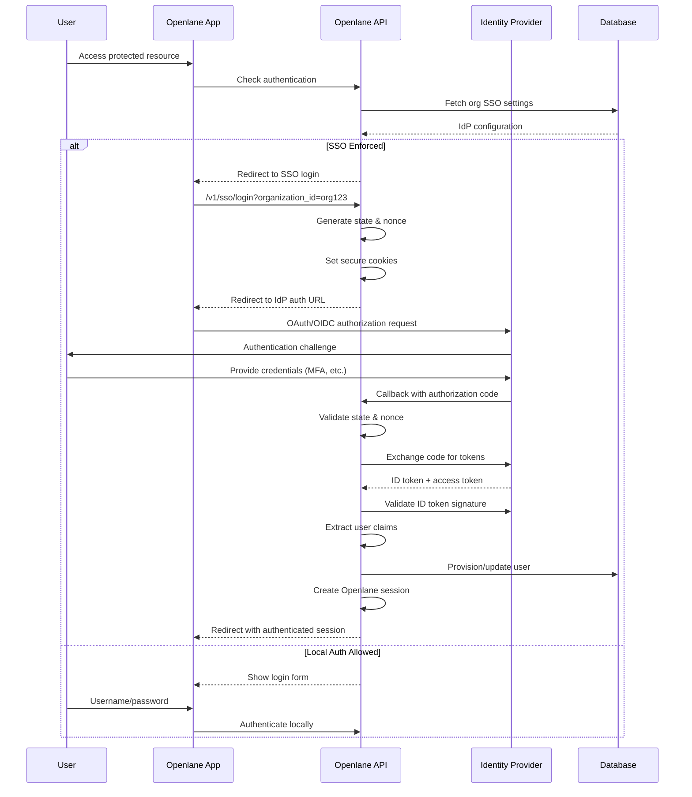

import Tabs from '@theme/Tabs';
import TabItem from '@theme/TabItem';

# SSO & OIDC Integration

Openlane provides comprehensive Single Sign-On (SSO) integration through OpenID Connect (OIDC) standards, enabling organizations to enforce authentication through their preferred identity providers. The system supports major enterprise providers including Okta, Google Workspace, OneLogin, and any OIDC-compliant provider.

## SSO Architecture Overview

### OIDC Authentication Flow



### Security Model

The SSO integration implements enterprise-grade security:

- **State Parameter Validation** - CSRF protection using cryptographically secure state
- **Nonce Binding** - Replay attack prevention with unique nonce values
- **Token Validation** - Full OIDC ID token signature and claims validation
- **Session Management** - Secure session creation with proper cookie settings
- **Organization Isolation** - SSO configuration scoped to individual organizations

## Supported Identity Providers

### Okta Integration

<Tabs>
<TabItem value="setup" label="Okta Setup">

1. **Create Application in Okta**:
   - Navigate to **Applications → Create App Integration**
   - Select **OIDC - Web Application**
   - Configure redirect URI: `https://your-domain.com/oidc/callback`

2. **Configuration Values**:
   ```bash
   # Okta configuration
   Client ID: 0oa1234567890abcdef
   Client Secret: your-client-secret
   Issuer URI: https://dev-123456.okta.com/oauth2/default
   Discovery Endpoint: https://dev-123456.okta.com/oauth2/default/.well-known/openid-configuration
   ```

3. **Required Scopes**:
   - `openid` (required for OIDC)
   - `profile` (user profile information)
   - `email` (user email address)

</TabItem>
<TabItem value="config" label="Organization Configuration">

```graphql
mutation UpdateOrgSSO {
  updateOrganizationSetting(
    id: "org-setting-id"
    input: {
      identityProvider: OKTA
      identityProviderClientID: "0oa1234567890abcdef"
      identityProviderClientSecret: "your-client-secret"
      oidcDiscoveryEndpoint: "https://dev-123456.okta.com/oauth2/default"
      identityProviderLoginEnforced: true
    }
  ) {
    organizationSetting {
      id
      identityProvider
      identityProviderLoginEnforced
    }
  }
}
```

</TabItem>
<TabItem value="testing" label="Testing Integration">

```bash
# Test OIDC discovery endpoint
curl -s https://dev-123456.okta.com/oauth2/default/.well-known/openid-configuration | jq

# Verify required endpoints
{
  "issuer": "https://dev-123456.okta.com/oauth2/default",
  "authorization_endpoint": "https://dev-123456.okta.com/oauth2/default/v1/authorize",
  "token_endpoint": "https://dev-123456.okta.com/oauth2/default/v1/token",
  "userinfo_endpoint": "https://dev-123456.okta.com/oauth2/default/v1/userinfo",
  "jwks_uri": "https://dev-123456.okta.com/oauth2/default/v1/keys"
}
```

</TabItem>
</Tabs>

### Google Workspace Integration

<Tabs>
<TabItem value="setup" label="Google Workspace Setup">

1. **Create OAuth Application**:
   - Go to [Google Cloud Console](https://console.cloud.google.com/)
   - Navigate to **APIs & Services → Credentials**
   - Create **OAuth 2.0 Client ID** for web application
   - Add authorized redirect URI: `https://your-domain.com/oidc/callback`

2. **Configuration Values**:
   ```bash
   # Google Workspace configuration
   Client ID: 123456789-abcdef.apps.googleusercontent.com
   Client Secret: your-google-client-secret
   Discovery Endpoint: https://accounts.google.com
   ```

3. **Domain Restriction** (Optional):
   Configure Google Workspace to restrict sign-ins to your organization's domain.

</TabItem>
<TabItem value="config" label="Organization Configuration">

```graphql
mutation UpdateOrgSSO {
  updateOrganizationSetting(
    id: "org-setting-id"
    input: {
      identityProvider: GOOGLEWORKSPACE
      identityProviderClientID: "123456789-abcdef.apps.googleusercontent.com"
      identityProviderClientSecret: "your-google-client-secret"
      oidcDiscoveryEndpoint: "https://accounts.google.com"
      identityProviderLoginEnforced: true
    }
  ) {
    organizationSetting {
      id
      identityProvider
      identityProviderLoginEnforced
    }
  }
}
```

</TabItem>
<TabItem value="domain" label="Domain Verification">

```bash
# Verify Google OIDC configuration
curl -s https://accounts.google.com/.well-known/openid-configuration | jq

# Check domain restrictions
{
  "issuer": "https://accounts.google.com",
  "authorization_endpoint": "https://accounts.google.com/o/oauth2/v2/auth",
  "token_endpoint": "https://oauth2.googleapis.com/token",
  "userinfo_endpoint": "https://openidconnect.googleapis.com/v1/userinfo",
  "jwks_uri": "https://www.googleapis.com/oauth2/v3/certs"
}
```

</TabItem>
</Tabs>

### Custom OIDC Providers

<Tabs>
<TabItem value="generic" label="Generic OIDC Setup">

For any OIDC-compliant provider:

```graphql
mutation UpdateOrgSSO {
  updateOrganizationSetting(
    id: "org-setting-id"
    input: {
      identityProvider: OIDC
      identityProviderClientID: "your-client-id"
      identityProviderClientSecret: "your-client-secret"
      oidcDiscoveryEndpoint: "https://your-provider.com/auth/realms/your-realm"
      identityProviderLoginEnforced: true
    }
  ) {
    organizationSetting {
      id
      identityProvider
      identityProviderLoginEnforced
    }
  }
}
```

</TabItem>
<TabItem value="keycloak" label="Keycloak Example">

```bash
# Keycloak configuration example
OIDC_DISCOVERY_ENDPOINT=https://keycloak.company.com/auth/realms/company
CLIENT_ID=openlane-production
CLIENT_SECRET=your-keycloak-client-secret

# Test discovery endpoint
curl -s $OIDC_DISCOVERY_ENDPOINT/.well-known/openid-configuration
```

</TabItem>
<TabItem value="azure" label="Azure AD Example">

```bash
# Azure AD configuration
OIDC_DISCOVERY_ENDPOINT=https://login.microsoftonline.com/your-tenant-id/v2.0
CLIENT_ID=your-azure-app-id
CLIENT_SECRET=your-azure-client-secret

# Test discovery endpoint
curl -s $OIDC_DISCOVERY_ENDPOINT/.well-known/openid-configuration
```

</TabItem>
</Tabs>

## SSO Implementation Details

### OIDC Configuration Builder

```go
// Build OIDC relying party configuration
func (h *Handler) oidcConfig(ctx context.Context, orgID string) (*rp.RelyingParty, error) {
    // Fetch organization SSO settings
    orgSetting, err := h.getOrgSetting(ctx, orgID)
    if err != nil {
        return nil, err
    }

    // Validate SSO configuration
    if !orgSetting.HasValidSSO() {
        return nil, ErrInvalidSSOConfig
    }

    // Build OIDC configuration
    config := &oidc.Config{
        ClientID:     orgSetting.IdentityProviderClientID,
        ClientSecret: orgSetting.IdentityProviderClientSecret,
        RedirectURI:  h.buildRedirectURI(),
        Scopes:       []string{"openid", "profile", "email"},
    }

    // Create relying party with discovery
    return rp.NewRelyingPartyOIDC(
        ctx,
        orgSetting.OIDCDiscoveryEndpoint,
        config.ClientID,
        config.ClientSecret,
        config.RedirectURI,
        config.Scopes,
    )
}
```

### State and Nonce Management

```go
// Generate secure state and nonce for OIDC flow
func (h *Handler) SSOLoginHandler(ctx echo.Context) error {
    orgID := getOrgIDFromRequest(ctx)

    // Generate cryptographically secure values
    state := ulids.New().String()
    nonce := ulids.New().String()

    // Set secure cookies for validation
    cfg := sessions.CookieConfig{
        Path:     "/",
        HTTPOnly: true,
        SameSite: http.SameSiteLaxMode,
        Secure:   !h.IsTest,
    }

    sessions.SetCookie(ctx.Response().Writer, state, "state", cfg)
    sessions.SetCookie(ctx.Response().Writer, nonce, "nonce", cfg)
    sessions.SetCookie(ctx.Response().Writer, orgID, "organization_id", cfg)

    // Build authorization URL
    rpCfg, err := h.oidcConfig(ctx.Request().Context(), orgID)
    if err != nil {
        return h.BadRequest(ctx, err)
    }

    authURL := rpCfg.OAuthConfig().AuthCodeURL(state,
        oauth2.SetAuthURLParam("nonce", nonce))

    return ctx.Redirect(http.StatusFound, authURL)
}
```

### Token Validation and User Provisioning

```go
// Handle OIDC callback and provision user
func (h *Handler) SSOCallbackHandler(ctx echo.Context) error {
    reqCtx := ctx.Request().Context()

    // Validate state and nonce
    if err := h.validateOIDCState(ctx); err != nil {
        return h.BadRequest(ctx, err)
    }

    // Get organization configuration
    orgID := getOrgIDFromCookie(ctx)
    rpCfg, err := h.oidcConfig(reqCtx, orgID)
    if err != nil {
        return h.BadRequest(ctx, err)
    }

    // Exchange code for tokens
    tokens, err := rpCfg.CodeExchange(reqCtx, getCodeFromRequest(ctx))
    if err != nil {
        return h.BadRequest(ctx, err)
    }

    // Validate ID token
    idTokenClaims, err := rpCfg.IDTokenVerifier().Verify(reqCtx, tokens.IDToken)
    if err != nil {
        return h.BadRequest(ctx, err)
    }

    // Extract user information
    userInfo := &SSOUserInfo{
        Subject:     idTokenClaims.Subject,
        Email:       idTokenClaims.Email,
        Name:        idTokenClaims.Name,
        GivenName:   idTokenClaims.GivenName,
        FamilyName:  idTokenClaims.FamilyName,
        Provider:    getProviderFromOrgSetting(orgSetting),
    }

    // Provision or update user
    user, err := h.provisionSSOUser(reqCtx, userInfo, orgID)
    if err != nil {
        return h.InternalServerError(ctx, err)
    }

    // Create Openlane session
    return h.createAuthenticatedSession(ctx, user)
}
```

## User Provisioning and Management

### Automatic User Provisioning

```go
// Provision user from SSO claims
func (h *Handler) provisionSSOUser(ctx context.Context, userInfo *SSOUserInfo, orgID string) (*ent.User, error) {
    // Check if user already exists
    user, err := h.DBClient.User.Query().
        Where(user.Email(userInfo.Email)).
        First(ctx)

    if err != nil && !ent.IsNotFound(err) {
        return nil, err
    }

    if user != nil {
        // Update existing user
        return h.updateUserFromSSO(ctx, user, userInfo)
    }

    // Create new user
    return h.createUserFromSSO(ctx, userInfo, orgID)
}

func (h *Handler) createUserFromSSO(ctx context.Context, userInfo *SSOUserInfo, orgID string) (*ent.User, error) {
    // Create user with SSO claims
    user, err := h.DBClient.User.Create().
        SetEmail(userInfo.Email).
        SetFirstName(userInfo.GivenName).
        SetLastName(userInfo.FamilyName).
        SetDisplayName(userInfo.Name).
        SetEmailVerified(true). // SSO users are pre-verified
        SetAuthProvider(enums.AuthProviderOIDC).
        Save(ctx)
    if err != nil {
        return nil, err
    }

    // Add user to organization
    _, err = h.DBClient.OrgMembership.Create().
        SetUserID(user.ID).
        SetOrganizationID(orgID).
        SetRole(enums.RoleMember). // Default role
        Save(ctx)
    if err != nil {
        return nil, err
    }

    return user, nil
}
```

### Role Mapping and Claims

```go
// Map OIDC claims to Openlane roles
type SSOUserInfo struct {
    Subject    string   `json:"sub"`
    Email      string   `json:"email"`
    Name       string   `json:"name"`
    GivenName  string   `json:"given_name"`
    FamilyName string   `json:"family_name"`
    Groups     []string `json:"groups,omitempty"`
    Roles      []string `json:"roles,omitempty"`
}

func (h *Handler) mapSSORole(userInfo *SSOUserInfo, orgSetting *ent.OrganizationSetting) enums.Role {
    // Default role
    defaultRole := enums.RoleMember

    // Check for admin groups/roles
    for _, group := range userInfo.Groups {
        if group == orgSetting.AdminGroup {
            return enums.RoleAdmin
        }
    }

    // Check for owner roles
    for _, role := range userInfo.Roles {
        if role == "owner" || role == "admin" {
            return enums.RoleOwner
        }
    }

    return defaultRole
}
```

## Security Features

### Session Security

```go
// Create authenticated session with proper security
func (h *Handler) createAuthenticatedSession(ctx echo.Context, user *ent.User) error {
    // Set authenticated context
    userCtx := setAuthenticatedContext(ctx.Request().Context(), user)

    // Generate session tokens
    accessToken, refreshToken, err := h.TokenManager.CreateTokenPair(userCtx, user.ID)
    if err != nil {
        return err
    }

    // Set secure cookies
    secureCookieConfig := sessions.CookieConfig{
        Path:     "/",
        HTTPOnly: true,
        SameSite: http.SameSiteLaxMode,
        Secure:   !h.IsTest,
        MaxAge:   int(h.SessionConfig.AccessTokenTTL.Seconds()),
    }

    sessions.SetCookie(ctx.Response().Writer, accessToken, "access_token", secureCookieConfig)
    sessions.SetCookie(ctx.Response().Writer, refreshToken, "refresh_token", secureCookieConfig)

    // Clear SSO flow cookies
    h.clearSSOCookies(ctx)

    // Redirect to application
    returnURL := getReturnURLFromCookie(ctx)
    if returnURL == "" {
        returnURL = "/dashboard"
    }

    return ctx.Redirect(http.StatusFound, returnURL)
}
```

### CSRF Protection

```go
// Validate OIDC state parameter to prevent CSRF
func (h *Handler) validateOIDCState(ctx echo.Context) error {
    // Get state from request
    requestState := ctx.QueryParam("state")
    if requestState == "" {
        return ErrMissingState
    }

    // Get state from cookie
    stateCookie, err := sessions.GetCookie(ctx.Request(), "state")
    if err != nil {
        return ErrMissingStateCookie
    }

    // Validate state matches
    if requestState != stateCookie.Value {
        return ErrInvalidState
    }

    // Validate nonce if present
    if nonceCookie, err := sessions.GetCookie(ctx.Request(), "nonce"); err == nil {
        // Nonce validation would be done during token verification
        log.Debug().Str("nonce", nonceCookie.Value).Msg("validating nonce")
    }

    return nil
}
```

### Organization Enforcement

```go
// Check if SSO is enforced for organization
func (h *Handler) ssoOrgForUser(ctx context.Context, email string) (string, bool) {
    // Find user's organization with SSO enforcement
    user, err := h.DBClient.User.Query().
        Where(user.Email(email)).
        WithOrgMemberships(func(q *ent.OrgMembershipQuery) {
            q.WithOrganization(func(oq *ent.OrganizationQuery) {
                oq.WithSetting()
            })
        }).
        First(ctx)

    if err != nil {
        return "", false
    }

    // Check each organization for SSO enforcement
    for _, membership := range user.Edges.OrgMemberships {
        org := membership.Edges.Organization
        if org.Edges.Setting != nil &&
           org.Edges.Setting.IdentityProviderLoginEnforced {
            return org.ID, true
        }
    }

    return "", false
}
```

## Configuration Examples

### Helm Chart Configuration

<Tabs>
<TabItem value="okta" label="Okta Configuration">

```yaml
openlane:
  coreConfiguration:
    auth:
      enabled: true
      providers:
        # Social login still available for non-SSO orgs
        google:
          clientId: "social-google-client-id"
          clientSecret: "social-google-secret"
        github:
          clientId: "social-github-client-id"
          clientSecret: "social-github-secret"

# Organization-specific SSO configured via GraphQL API
# after deployment, not in Helm chart
```

</TabItem>
<TabItem value="env" label="Environment Variables">

```bash
# Core authentication settings
CORE_AUTH_ENABLED=true

# Social login providers (organization-independent)
CORE_AUTH_PROVIDERS_GOOGLE_CLIENTID=social-google-client-id
CORE_AUTH_PROVIDERS_GOOGLE_CLIENTSECRET=social-google-secret
CORE_AUTH_PROVIDERS_GITHUB_CLIENTID=social-github-client-id
CORE_AUTH_PROVIDERS_GITHUB_CLIENTSECRET=social-github-secret

# Domain configuration for redirect URIs
CORE_DOMAIN=theopenlane.io
# Auto-configures: https://api.theopenlane.io/oidc/callback

# JWT token configuration
CORE_AUTH_TOKEN_ISSUER=https://auth.theopenlane.io
CORE_AUTH_TOKEN_AUDIENCE=https://theopenlane.io
CORE_AUTH_TOKEN_JWKSENDPOINT=https://api.theopenlane.io/.well-known/jwks.json
```

</TabItem>
<TabItem value="dev" label="Development Setup">

```yaml
# Development configuration
auth:
  enabled: true
  providers:
    # Use Okta dev instance
    oidc:
      discoveryEndpoint: "https://dev-123456.okta.com/oauth2/default"
      clientId: "dev-client-id"
      clientSecret: "dev-client-secret"

# Disable SSO enforcement for development
organizationSettings:
  identityProviderLoginEnforced: false
```

</TabItem>
</Tabs>

### Organization-Specific Configuration

```graphql
# Query current SSO configuration
query GetOrgSSO($orgId: ID!) {
  organizationSetting(id: $orgId) {
    id
    identityProvider
    identityProviderClientID
    oidcDiscoveryEndpoint
    identityProviderLoginEnforced
  }
}

# Update SSO configuration
mutation UpdateSSO($orgId: ID!, $config: UpdateOrganizationSettingInput!) {
  updateOrganizationSetting(id: $orgId, input: $config) {
    organizationSetting {
      id
      identityProvider
      identityProviderLoginEnforced
    }
  }
}
```

## Testing and Validation

### SSO Flow Testing

```go
func TestSSOFlow(t *testing.T) {
    // Create test organization with SSO
    org := createTestOrgWithSSO(t)

    // Start SSO login
    resp := testClient.GET("/v1/sso/login?organization_id=" + org.ID)
    assert.Equal(t, http.StatusFound, resp.StatusCode)

    // Verify redirect to IdP
    location := resp.Header.Get("Location")
    assert.Contains(t, location, "accounts.google.com")
    assert.Contains(t, location, "state=")
    assert.Contains(t, location, "nonce=")

    // Extract state and simulate callback
    state := extractStateFromURL(location)
    callbackResp := testClient.GET("/oidc/callback?code=test-code&state=" + state)
    assert.Equal(t, http.StatusFound, callbackResp.StatusCode)
}
```

### Integration Testing

```bash
# Test OIDC discovery endpoints
curl -s https://accounts.google.com/.well-known/openid-configuration | jq .issuer
curl -s https://dev-123456.okta.com/oauth2/default/.well-known/openid-configuration | jq .issuer

# Validate JWT tokens
echo $ID_TOKEN | jwt decode --no-verify

# Test SSO enforcement
curl -i https://api.theopenlane.io/v1/sso/login?organization_id=test-org
```

## Monitoring and Troubleshooting

### SSO Metrics

```go
// SSO-specific metrics
var (
    ssoLoginAttemptsTotal = prometheus.NewCounterVec(
        prometheus.CounterOpts{
            Name: "sso_login_attempts_total",
            Help: "Total SSO login attempts",
        },
        []string{"provider", "org_id", "status"},
    )

    ssoTokenValidationDuration = prometheus.NewHistogramVec(
        prometheus.HistogramOpts{
            Name: "sso_token_validation_duration_seconds",
            Help: "SSO token validation latency",
        },
        []string{"provider"},
    )
)
```

### Common Issues and Solutions

<Tabs>
<TabItem value="discovery" label="Discovery Endpoint Issues">

```bash
# Problem: OIDC discovery fails
# Solution: Verify endpoint accessibility
curl -v https://your-idp.com/.well-known/openid-configuration

# Check network connectivity
nslookup your-idp.com
telnet your-idp.com 443

# Verify TLS certificate
openssl s_client -connect your-idp.com:443 -servername your-idp.com
```

</TabItem>
<TabItem value="redirect" label="Redirect URI Mismatch">

```bash
# Problem: redirect_uri_mismatch error
# Solution: Ensure URIs match exactly

# In IdP configuration:
https://api.theopenlane.io/oidc/callback

# In Openlane logs:
grep "redirect_uri" /var/log/openlane/app.log

# Verify domain configuration:
echo $CORE_DOMAIN
echo $CORE_AUTH_PROVIDERS_GOOGLE_REDIRECTURL
```

</TabItem>
<TabItem value="tokens" label="Token Validation Errors">

```bash
# Problem: Token signature validation fails
# Solution: Check issuer and audience claims

# Decode ID token
echo $ID_TOKEN | base64 -d | jq .

# Verify issuer matches configuration
curl -s $OIDC_DISCOVERY_ENDPOINT/.well-known/openid-configuration | jq .issuer

# Check JWKS endpoint
curl -s $JWKS_URI | jq .keys
```

</TabItem>
</Tabs>

### Debugging Commands

```bash
# View SSO configuration for organization
kubectl exec -it openlane-pod -- /openlane org-setting get --org-id=ORG_ID

# Check OIDC token validation
kubectl logs openlane-pod | grep "token validation"

# Monitor SSO flows
kubectl logs -f openlane-pod | grep "sso"

# Test organization SSO enforcement
curl -H "Authorization: Bearer $TOKEN" \
  https://api.theopenlane.io/query \
  -d '{"query": "{ organization(id: \"ORG_ID\") { setting { identityProviderLoginEnforced } } }"}'
```

This SSO integration provides enterprise-grade authentication while maintaining security, usability, and operational excellence across all supported identity providers.