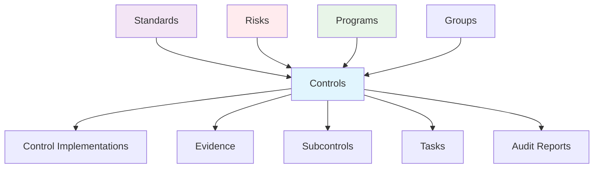
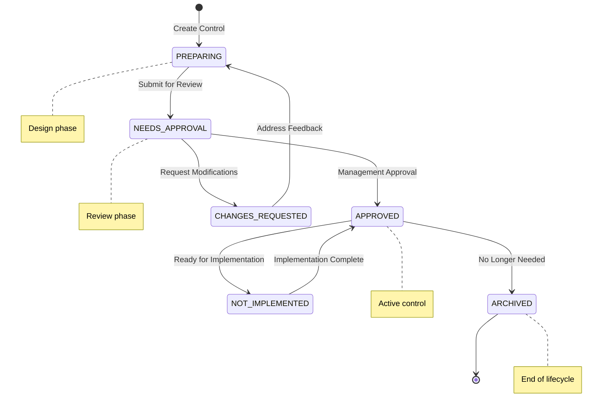

import Tabs from '@theme/Tabs';
import TabItem from '@theme/TabItem';

# Controls

Controls are the core building blocks of compliance management in Openlane. They represent specific security, privacy, or operational requirements that organizations must implement to meet compliance standards and manage risks effectively.

According to ISACA, "internal controls" include the policies, standards, procedures and other organizational structures that are designed to provide reasonable assurance that business objectives will be achieved and undesired events will be prevented, detected and corrected.

The Institute of Internal Auditors (IIA) defines control, the control environment, and control processes as follows: A control is any action taken by management, the board, and other parties to manage risk and increase the likelihood that established objectives and goals will be achieved.

## What is a Control?

A Control in Openlane represents a specific compliance requirement, security safeguard, or operational procedure that an organization implements to achieve compliance with standards and manage risks. Controls define what needs to be done, how it should be implemented, and how it will be tested or verified.

## Control Types

<Tabs className="unique-tabs">
  <TabItem value="Detective" label="Detective">
    Controls which alert employees to an action.
     
    **Example**: Log Monitoring with Alerts, Data leak Prevention, Intrusion Detection System
  </TabItem>
  <TabItem value="Preventative" label="Preventative">
    Controls used to help prevent certain events from occurring. 
     
    **Example**: A signature is required before an employee spends over $2,000.00 on a service or equipment 
     
    **Example**: Firewalls, access controls, encryption
  </TabItem>
  <TabItem value="Corrective" label="Corrective">
    Controls that take corrective action based upon an event that occurred. 
     
    **Example**: The DevOps team developed a script to spin up in a new region if their current region goes down
  </TabItem>
    <TabItem value="Compensating" label="Compensating">
    Compensating controls are used when a process or technology is deficient and would require enormous changes, or it would be very costly for the organization to remediate. Oftentimes compensating controls are used more to assist information systems and IT processes, rather than business processes. It's important to understand what controls are, and the different types that can be implemented.
  </TabItem>
</Tabs>

## Compliance Significance

| Aspect | Purpose | Benefit |
|--------|---------|----------|
| **Requirements Implementation** | Translate standards into actionable controls | Converts abstract compliance into specific, testable requirements |
| **Evidence Foundation** | Enable systematic evidence collection | Provides clear audit trail and compliance demonstration |
| **Risk Management** | Address specific threats through controls | Reduces organizational risk through preventive/detective measures |
| **Assessment Framework** | Enable systematic compliance evaluation | Allows measurement and improvement of compliance posture |
| **Certification Support** | Provide foundation for formal certifications | Enables SOC 2, ISO 27001, and other compliance certifications |

## Relationship Diagram

## Control Categories

| **Control Category** | **Description** |
| --------------------- | --------------- |
| Administrative         | Administrative controls are policies, procedures, and guidelines that are put in place to manage security risks. Examples include security training, incident response plans, and access control policies. |
| Technical             | Technical controls are hardware and software solutions that are put in place to manage security risks. Examples include firewalls, intrusion detection systems, and encryption. |
| Physical              | Physical controls are measures that are put in place to protect physical assets. Examples include security cameras, access control systems, and security guards. |

## Key Points to Remember

* Policies set the direction:
    * Policies define the overall goals and expectations for managing risks, acting as the foundation for creating controls.
* Controls are the active measures:
    * Controls are the actual mechanisms or processes used to manage risks, including things like approvals, verifications, monitoring systems, and security protocols.
* Procedures provide the steps:
    * Procedures outline the specific actions and steps employees need to take to follow the policies and implement the controls effectively.

## Control Classifications

### By Function
| Type | Purpose | Example |
|------|---------|----------|
| **Preventive** | Prevent incidents before they occur | Multi-factor authentication, firewalls |
| **Detective** | Identify incidents when they happen | Log monitoring, intrusion detection |
| **Corrective** | Fix issues after detection | Incident response, patch management |
| **Deterrent** | Discourage potential violations | Security awareness, penalty policies |

### By Source
| Type | Use Case | Examples |
|------|----------|----------|
| **Framework** | Standard compliance requirements | SOC 2 CC6.1, ISO 27001 A.9.1.1 |
| **Custom** | Organization-specific needs | Cryptocurrency controls, industry-specific |
| **Template** | Common implementation patterns | Basic access control template |
| **Imported** | External or legacy systems | Previous audit controls, vendor controls |

## Control Status Lifecycle

| Status | Meaning | Next Actions |
|--------|---------|-------------|
| `PREPARING` | Control being designed and planned | Complete implementation guidance, assign owners |
| `NEEDS_APPROVAL` | Ready for management review | Review requirements, approve or request changes |
| `CHANGES_REQUESTED` | Requires modifications before approval | Address feedback, resubmit for approval |
| `APPROVED` | Approved and ready for implementation | Begin implementation, collect evidence |
| `NOT_IMPLEMENTED` | Approved but not yet active | Complete implementation activities |
| `ARCHIVED` | No longer active or relevant | Document reason for archival |
