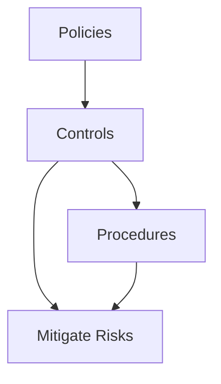

import Tabs from '@theme/Tabs';
import TabItem from '@theme/TabItem';

# Controls

According to ISACA, “internal controls” include the policies, standards, procedures and other organizational structures that are designed to provide reasonable assurance that business objectives will be achieved and undesired events will be prevented, detected and corrected.

The Institute of Internal Auditors (IIA) defines control, the control environment, and control processes as follows: A control is any action taken by management, the board, and other parties to manage risk and increase the likelihood that established objectives and goals will be achieved.

A Control is a measure that is put in place to mitigate risk.

## Control Types

<Tabs className="unique-tabs">
  <TabItem value="Detective" label="Detective">
    Controls which alert employees to an action.
    Examples: Log Monitoring with Alerts, Data leak Prevention, Intrusion Detection System
  </TabItem>
  <TabItem value="Preventative" label="Preventative">
    Controls used to help prevent certain events from occurring.
    Examples: A signature is required before an employee spends over $2,000.00 on a service or equipment
    Examples: Firewalls, access controls, encryption
  </TabItem>
  <TabItem value="Corrective" label="Corrective">
    Controls that take corrective action based upon an event that occurred.
    Examples: The DevOps team developed a script to spin up in a new region if their current region goes down
  </TabItem>
    <TabItem value="Compensating" label="Compensating">
    Compensating controls are used when a process or technology is deficient and would require enormous changes, or it would be very costly for the organization to remediate.
    Oftentimes compensating controls are used more to assist information systems and IT processes, rather than business processes. It's important to understand what controls are, and the different types that can be implemented.
  </TabItem>
</Tabs>

## Relationship Diagram

## Control Categories

| **Control Category** | **Description** |
| --------------------- | --------------- |
| Administrative         | Administrative controls are policies, procedures, and guidelines that are put in place to manage security risks. Examples include security training, incident response plans, and access control policies. |
| Technical             | Technical controls are hardware and software solutions that are put in place to manage security risks. Examples include firewalls, intrusion detection systems, and encryption. |
| Physical              | Physical controls are measures that are put in place to protect physical assets. Examples include security cameras, access control systems, and security guards. |

## Key Points to Remember

* Policies set the direction:
    * Policies define the overall goals and expectations for managing risks, acting as the foundation for creating controls.
* Controls are the active measures:
    * Controls are the actual mechanisms or processes used to manage risks, including things like approvals, verifications, monitoring systems, and security protocols.
* Procedures provide the steps:
    * Procedures outline the specific actions and steps employees need to take to follow the policies and implement the controls effectively.
