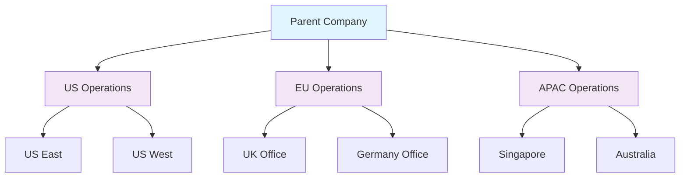

# Entities

Entities represent business units, subsidiaries, departments, or other organizational components that require separate compliance management and oversight within Openlane.

## What Are Entities?

Entities are organizational units or business components that have distinct compliance requirements, operational boundaries, or regulatory obligations. They enable organizations to manage compliance at granular levels while maintaining centralized oversight and coordination.

## Compliance Significance

Entities are essential for:
- **Regulatory Compliance**: Meeting jurisdiction-specific requirements for subsidiaries
- **Organizational Structure**: Mapping compliance responsibilities to business units
- **Risk Management**: Isolating and managing risks at the entity level
- **Audit Scope**: Defining audit boundaries and responsibilities
- **Resource Allocation**: Assigning compliance resources to specific entities

## Entity Types

### Legal Entities
- **Definition**: Legally distinct organizations (subsidiaries, joint ventures)
- **Compliance Scope**: Full regulatory compliance responsibilities
- **Examples**: Regional subsidiaries, acquired companies, partnerships
- **Characteristics**: Separate legal identity, distinct regulatory requirements

### Business Units
- **Definition**: Operational divisions within a legal entity
- **Compliance Scope**: Operational compliance and control implementation
- **Examples**: Product divisions, regional offices, functional departments
- **Characteristics**: Shared legal identity, specialized compliance needs

### Functional Entities
- **Definition**: Cross-functional groups with specific compliance roles
- **Compliance Scope**: Specialized compliance activities and controls
- **Examples**: IT security team, compliance department, audit committee
- **Characteristics**: Specialized expertise, cross-organizational responsibilities

### Geographic Entities
- **Definition**: Location-based organizational units
- **Compliance Scope**: Jurisdiction-specific compliance requirements
- **Examples**: Regional offices, country operations, data centers
- **Characteristics**: Geographic boundaries, local regulatory requirements

## Properties

### Core Information
- **ID**: Unique identifier for the entity
- **Name**: Official entity name
- **Display Name**: User-friendly name for the entity
- **Description**: Purpose and scope of the entity
- **Entity Type**: Classification of the entity (legal, business unit, etc.)

### Organizational Structure
- **Parent Entity**: Hierarchical relationship to parent entities
- **Child Entities**: Subordinate entities under this entity
- **Organization**: Parent organization that owns the entity
- **Status**: Current operational status (active, inactive, merged)

### Geographic and Operational
- **Domains**: Associated domains and web properties
- **Locations**: Physical locations and addresses
- **Jurisdictions**: Applicable legal jurisdictions
- **Operational Scope**: Areas of business operation

### Compliance Integration
- **Contacts**: Associated personnel and contact information
- **Assets**: IT assets and infrastructure associated with the entity
- **Documents**: Relevant documentation and records
- **Scans**: Security and compliance scans performed on entity assets

## GraphQL Operations

### Query Entities
```graphql
query GetEntities($first: Int, $where: EntityWhereInput) {
  entities(first: $first, where: $where) {
    edges {
      node {
        id
        name
        displayName
        description
        domains
        createdAt
        updatedAt
        owner {
          id
          name
        }
        contacts {
          edges {
            node {
              id
              fullName
              email
            }
          }
        }
      }
    }
  }
}
```

### Get Entity Details
```graphql
query GetEntityDetails($id: ID!) {
  entity(id: $id) {
    id
    name
    displayName
    description
    domains
    entityTypeID
    status
    createdAt
    updatedAt
    owner {
      id
      name
    }
    contacts {
      edges {
        node {
          id
          fullName
          email
          phoneNumber
          address
        }
      }
    }
    assets {
      edges {
        node {
          id
          name
          assetType
          status
        }
      }
    }
    notes {
      edges {
        node {
          id
          text
          createdAt
          createdBy {
            id
            displayName
          }
        }
      }
    }
  }
}
```

### Search Entities
```graphql
query SearchEntities($query: String!) {
  entitySearch(query: $query) {
    edges {
      node {
        id
        name
        displayName
        description
        domains
      }
    }
  }
}
```

### Create Entity
```graphql
mutation CreateEntity($input: CreateEntityInput!) {
  createEntity(input: $input) {
    entity {
      id
      name
      displayName
      description
      domains
    }
  }
}
```

### Update Entity
```graphql
mutation UpdateEntity($id: ID!, $input: UpdateEntityInput!) {
  updateEntity(id: $id, input: $input) {
    entity {
      id
      name
      displayName
      description
      domains
      updatedAt
    }
  }
}
```

### Delete Entity
```graphql
mutation DeleteEntity($id: ID!) {
  deleteEntity(id: $id) {
    deletedID
  }
}
```

## REST API Endpoints

### List Entities
```http
GET /v1/entities
```

Query parameters:
- `page[size]`: Number of results per page
- `page[number]`: Page number
- `filter[name]`: Filter by entity name
- `filter[domain]`: Filter by domain
- `sort`: Sort field and direction (e.g., `name`, `-createdAt`)

### Get Entity
```http
GET /v1/entities/:id
```

### Create Entity
```http
POST /v1/entities
Content-Type: application/json

{
  "name": "European Operations",
  "displayName": "EU Ops",
  "description": "European subsidiary operations",
  "domains": ["example.eu", "example.co.uk"],
  "entityTypeID": "legal-entity-type-id"
}
```

### Update Entity
```http
PATCH /v1/entities/:id
Content-Type: application/json

{
  "displayName": "EU Operations",
  "description": "Updated description",
  "domains": ["example.eu", "example.de", "example.fr"]
}
```

### Delete Entity
```http
DELETE /v1/entities/:id
```

## Common Workflows

### Entity Hierarchy Setup


### Multi-Entity Compliance Management
1. **Define Entity Structure**: Map organizational hierarchy
2. **Assign Compliance Scope**: Determine which regulations apply to each entity
3. **Allocate Resources**: Assign compliance teams to entities
4. **Implement Controls**: Deploy entity-specific controls
5. **Monitor Compliance**: Track compliance status by entity
6. **Consolidate Reporting**: Roll up compliance metrics to parent entities

### Entity-Based Risk Assessment
1. **Identify Entity Risks**: Assess risks specific to each entity
2. **Evaluate Impact**: Determine potential impact on parent organization
3. **Implement Controls**: Deploy entity-specific risk controls
4. **Monitor Risk Indicators**: Track entity-level risk metrics
5. **Report Consolidation**: Aggregate risks for enterprise view

## Best Practices

### Entity Structure Design
- **Clear Boundaries**: Define clear operational and compliance boundaries
- **Avoid Overlap**: Minimize overlapping responsibilities between entities
- **Scalable Hierarchy**: Design for future growth and changes
- **Compliance Alignment**: Align entity structure with regulatory requirements

### Entity Management
- **Regular Reviews**: Periodically review and update entity information
- **Contact Updates**: Maintain current contact information for each entity
- **Asset Association**: Keep asset inventories current for each entity
- **Documentation**: Maintain entity-specific documentation and records

### Compliance Integration
- **Control Mapping**: Map controls to appropriate entities
- **Risk Alignment**: Align risk assessments with entity boundaries
- **Audit Planning**: Use entity structure for audit scope definition
- **Resource Planning**: Allocate compliance resources based on entity needs

## Integration Points

### With Organizations
- Entities belong to and are managed by organizations
- Organization policies cascade to entities
- Centralized organization management with distributed entity operations

### With Assets
- Assets are associated with specific entities
- Entity boundaries determine asset ownership
- Asset risks impact entity compliance status

### With Contacts
- Contacts are assigned to entities for communication
- Entity-specific compliance responsibilities
- Contact roles defined at entity level

### With Documents
- Documents associated with entity-specific compliance
- Entity-level policy and procedure documentation
- Audit evidence organized by entity

## Advanced Features

### Entity Domains
Entities can have associated domains for:
- **Web Properties**: Tracking online presence
- **Email Domains**: Managing communication boundaries
- **API Endpoints**: Defining technical boundaries
- **Network Ranges**: IP address associations

### Entity Status Management
Track entity lifecycle with statuses:
- **Active**: Operational and requiring compliance management
- **Inactive**: Suspended operations but maintaining records
- **Merged**: Combined with another entity
- **Divested**: Sold or separated from organization
- **Planned**: Future entity not yet operational

### Compliance Inheritance
Entities can inherit compliance requirements:
- **From Parent**: Inherit parent entity requirements
- **From Organization**: Apply organization-wide policies
- **Override Capability**: Entity-specific exceptions
- **Cascade Down**: Push requirements to child entities