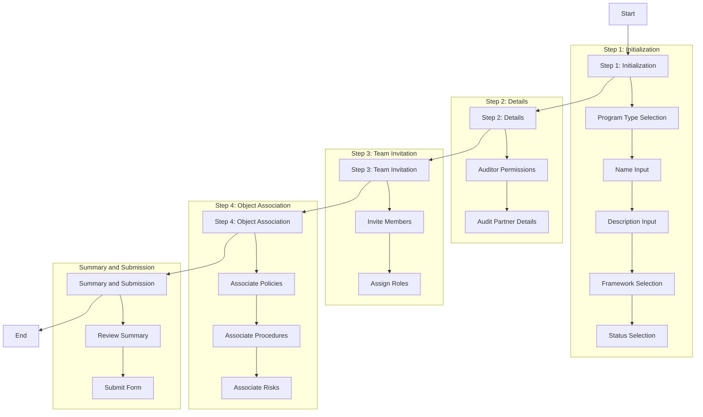

# Overview

Within Openlane, Programs are a centerpiece for managing compliance and regulatory requirements. Think of a program as a large, high-level grouping of work; it represents a significant body of work that can be broken down into smaller, more manageable tasks. Essentially, it's a big picture initiative that can spans moths or possibly a year+, and can encompass work across different teams.

In more "audit-centric" terminology, a Program is a collection of evidence, tasks, and other resources that are related to achieving the necessary pre-requisites to go through a compliance or regulatory audit, or the audit itself. Programs can be used to track progress, manage resources, and collaborate with others to obtain a compliance attestation or certification, perform a risk assessment, or any other number of tasks.

## Program Wizard

We've created a wizard to walk you through the steps of creating a program; these are the high level steps that the wizard will guide you through:

1. Step 1: Initialization
    1. This step collects basic information about the program. You'll select the program type, enter the program name and description, choose the framework, and set the program's status. This foundational information is essential for defining the program's identity and scope.
1. Step 2: Details
    1. In this step, you will configure detailed information about the program. This includes setting auditor permissions and providing details about audit partners. These configurations ensure that the program has the necessary oversight and collaboration settings in place.
1. Step 3: Team Invitation
    1. This step allows users to invite team members to the program. Users can specify the roles of the invitees, such as members or admins. This step is crucial for assembling the team that will work on the program and defining their responsibilities.
1. Step 4: Object Association
    1. Users associate existing objects, such as policies, procedures, and risks, with the program in this step. This association helps in linking relevant resources and documentation to the program, ensuring that all necessary elements are connected and accessible.
1. Summary and Submission
    1. The final step provides a summary of all the information entered in the previous steps. Users can review the summary to ensure accuracy and completeness before submitting the program creation form. This step is important for final validation and confirmation of the program details.

### Reference Diagram

