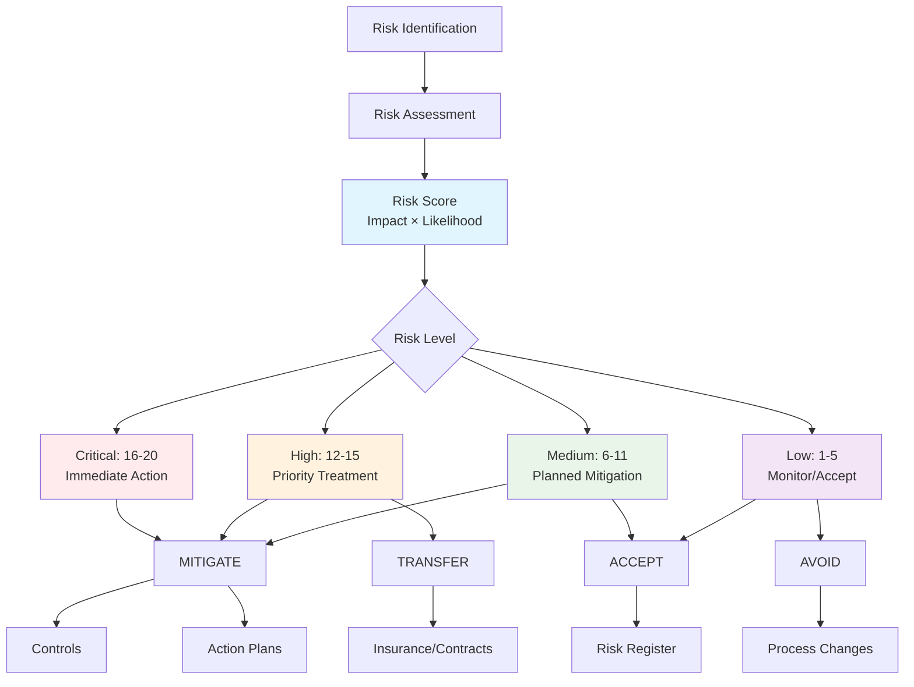

# Risks

Risk management is a foundational element of effective compliance programs. Openlane's risk management system enables organizations to identify, assess, track, and mitigate risks that could impact compliance, security, and business operations.

There are many bodies of thought and frameworks for how to create and define risks, which you can find in the [Risk Frameworks](riskmanagement.mdx) section. Regardless of what framework you choose, Openlane's risk definitions and structure is relatively simple and flexible.

We realize that we cannot accommodate every risk framework and strategy, so we have created a simple and flexible risk management system that can be adapted to your needs.



## What is Risk Management?

Risk management is the process of identifying all of the various risks your organization faces and finding ways to either control and mitigate any potential adverse effects they could have on your organization or leverage and exploit them to generate strategic advantage.

Risk management looks a little different at every organization, but it typically follows this general framework:

1. **Identify your risks**: Paint a complete picture of all of the risks your organization faces. This can be done through data analysis, stakeholder interviews, review of external media and global trends, and other methods. Use this research to build a list of all your organization risks, known as a risk register.

2. **Assess your risks**: For each risk in your risk register, measure the potential impact it could have on your business if it were to turn into a risk event. You can use qualitative methods, quantitative methods, or both to accomplish this.

3. **Prioritize your risks**: Rank your risks in order of their potential business impact.

4. **Mitigate or exploit your risks**: Using your ranked list, begin exploring ways to either mitigate your risks or, if appropriate, exploit them to drive growth.

5. **Monitor the results**: Keep a continuous eye on how your mitigation efforts or risk exploitation strategies are performing, and adjust as needed.

Rinse and repeat: Risk management is a marathon, not a sprint. Repeat this process on a regular, ongoing basis.

## What is a Risk?

A Risk in Openlane represents a potential threat, vulnerability, or uncertainty that could negatively impact an organization's ability to achieve its objectives, maintain compliance, or protect assets. Risks are assessed based on their likelihood and potential impact, then managed through appropriate controls and mitigation strategies.

## Compliance Significance

| Aspect | Purpose | Benefit |
|--------|---------|----------|
| **Threat Identification** | Systematic discovery of compliance and security risks | Comprehensive risk coverage and early threat detection |
| **Effort Prioritization** | Focus resources on highest-impact risks | Efficient resource allocation and maximum risk reduction |
| **Control Selection** | Risk-driven control implementation decisions | Targeted controls that address actual threats |
| **Due Diligence** | Demonstrate systematic risk management to auditors | Regulatory compliance and audit readiness |
| **Decision Support** | Risk-informed business and security decisions | Better outcomes through risk-aware choices |
| **Continuous Improvement** | Ongoing identification of enhancement opportunities | Evolving security posture and reduced exposure |

## Risk Classifications

### By Category
| Type | Scope | Examples |
|------|-------|----------|
| **Strategic** | Organizational direction and objectives | Market disruption, competitive threats, regulatory changes |
| **Operational** | Day-to-day business operations | Process failures, supply chain disruption, staff turnover |
| **Financial** | Financial assets and reporting | Fraud, market volatility, credit risk |
| **Technology** | Information systems and infrastructure | Cyber attacks, system failures, data breaches |
| **Compliance** | Regulatory and contractual obligations | Regulation violations, audit failures, contract breaches |
| **External** | External environment factors | Natural disasters, economic downturns, vendor failures |

### By Impact Domain
| Domain | Risk Focus | Business Impact |
|--------|------------|----------------|
| **Confidentiality** | Unauthorized data disclosure | Competitive advantage loss, regulatory fines |
| **Integrity** | Data or system compromise | Decision-making errors, operational failures |
| **Availability** | Service disruption or downtime | Revenue loss, customer dissatisfaction |
| **Privacy** | Personal data misuse or breach | Regulatory penalties, reputation damage |
| **Reputation** | Brand or public perception damage | Customer loss, market devaluation |
| **Financial** | Direct financial loss or penalties | Immediate monetary impact, cash flow issues |

## Risk Assessment Framework

### Impact Levels
| Level | Description | Business Consequences |
|-------|-------------|----------------------|
| `CRITICAL` | Severe, potentially existential impact | Business shutdown, major regulatory action, massive financial loss |
| `HIGH` | Significant impact requiring major response | Substantial revenue loss, regulatory fines, operational disruption |
| `MEDIUM` | Moderate impact, manageable with effort | Limited revenue impact, minor compliance issues, temporary disruption |
| `LOW` | Minor impact with limited consequences | Minimal financial impact, operational inconvenience only |

### Likelihood Probabilities
| Level | Probability Range | Timeframe Expectation |
|-------|------------------|----------------------|
| `VERY_HIGH` | >90% | Almost certain within 1 year |
| `HIGH` | 70-90% | Likely within 1-2 years |
| `MEDIUM` | 30-70% | Possible within 2-5 years |
| `LOW` | 10-30% | Unlikely within 5 years |
| `VERY_LOW` | <10% | Rare or theoretical |

### Risk Status Lifecycle
| Status | Meaning | Management Action |
|--------|---------|------------------|
| `OPEN` | Active risk requiring attention | Implement mitigation strategies |
| `MITIGATED` | Reduced to acceptable levels | Monitor and maintain controls |
| `ONGOING` | Being actively managed | Continue treatment activities |
| `ARCHIVED` | No longer relevant or resolved | Document lessons learned |

## Risk Scoring Matrix

Openlane uses a 20-point risk scoring system based on impact and likelihood:

```mermaid
graph TB
    subgraph "Risk Assessment Matrix"
        subgraph " "
            A1[VL: 0.5] --> B1[2.5]
            A1 --> B2[2]
            A1 --> B3[1.5]
            A1 --> B4[1]
            A1 --> B5[0.5]

            A2[L: 1] --> C1[5]
            A2 --> C2[4]
            A2 --> C3[3]
            A2 --> C4[2]
            A2 --> C5[1]

            A3[M: 2] --> D1[10]
            A3 --> D2[8]
            A3 --> D3[6]
            A3 --> D4[4]
            A3 --> D5[2]

            A4[H: 3] --> E1[15]
            A4 --> E2[12]
            A4 --> E3[9]
            A4 --> E4[6]
            A4 --> E5[3]

            A5[VH: 4] --> F1[20]
            A5 --> F2[16]
            A5 --> F3[12]
            A5 --> F4[8]
            A5 --> F5[4]
        end

        G[Critical: 5] -.-> B1
        G -.-> C1
        G -.-> D1
        G -.-> E1
        G -.-> F1

        H[High: 4] -.-> B2
        H -.-> C2
        H -.-> D2
        H -.-> E2
        H -.-> F2

        I[Medium: 3] -.-> B3
        I -.-> C3
        I -.-> D3
        I -.-> E3
        I -.-> F3

        J[Low: 2] -.-> B4
        J -.-> C4
        J -.-> D4
        J -.-> E4
        J -.-> F4

        K[Very Low: 1] -.-> B5
        K -.-> C5
        K -.-> D5
        K -.-> E5
        K -.-> F5
    end

    style F1 fill:#ffebee
    style E1 fill:#ffebee
    style F2 fill:#fff3e0
    style E2 fill:#fff3e0
    style D1 fill:#fff3e0
    style F3 fill:#e8f5e8
    style E3 fill:#e8f5e8
    style D2 fill:#e8f5e8
```



### Impact Levels
- **Critical (5)**: Severe consequences, major business disruption
- **High (4)**: Significant consequences, notable business impact
- **Medium (3)**: Moderate consequences, manageable impact
- **Low (2)**: Minor consequences, limited impact
- **Very Low (1)**: Minimal consequences, negligible impact

### Likelihood Levels
- **Very High (4)**: >90% probability of occurrence
- **High (3)**: 70-90% probability of occurrence
- **Medium (2)**: 30-70% probability of occurrence
- **Low (1)**: 10-30% probability of occurrence
- **Very Low (0.5)**: <10% probability of occurrence

### Risk Score Calculation
**Risk Score = Impact × Likelihood**

| Impact/Likelihood | Very Low (0.5) | Low (1) | Medium (2) | High (3) | Very High (4) |
|-------------------|----------------|---------|------------|----------|---------------|
| **Critical (5)**  | 2.5           | 5       | 10         | 15       | 20            |
| **High (4)**      | 2             | 4       | 8          | 12       | 16            |
| **Medium (3)**    | 1.5           | 3       | 6          | 9        | 12            |
| **Low (2)**       | 1             | 2       | 4          | 6        | 8             |
| **Very Low (1)**  | 0.5           | 1       | 2          | 3        | 4             |

## Common Workflows

### 1. Risk Identification and Assessment

```graphql
# Create new risk with initial assessment
mutation CreateNewRisk {
  createRisk(input: {
    name: "Cloud Service Provider Outage"
    details: "Risk of extended service outage due to cloud provider infrastructure failure"
    category: "AVAILABILITY"
    riskType: "EXTERNAL"
    impact: HIGH
    likelihood: LOW
    businessCosts: "50000-200000"
    status: OPEN
    stakeholderID: "infrastructure-team-id"
  }) {
    risk {
      id
      name
      impact
      likelihood
      score
      status
    }
  }
}
```

### 2. Risk Mitigation Planning

```graphql
# Create action plan for risk mitigation
mutation CreateRiskActionPlan($riskId: ID!) {
  createActionPlan(input: {
    name: "Implement Multi-Cloud Strategy"
    details: "Develop and implement multi-cloud architecture to reduce single point of failure risk"
    priority: HIGH
    dueDate: "2024-06-30T00:00:00Z"
    source: "RISK_ASSESSMENT"
    status: DRAFT
    riskIDs: [$riskId]
  }) {
    actionPlan {
      id
      name
      priority
      dueDate
      risks {
        edges {
          node {
            id
            name
          }
        }
      }
    }
  }
}
```

### 3. Risk Monitoring and Review

```graphql
# Find high-priority risks for review
query RisksForReview {
  risks(where: {
    score: { gte: 12 }
    status: { in: [OPEN, ONGOING] }
  }, orderBy: [
    { field: score, direction: DESC }
    { field: updatedAt, direction: ASC }
  ]) {
    edges {
      node {
        id
        name
        impact
        likelihood
        score
        status
        updatedAt
        actionPlans {
          edges {
            node {
              id
              name
              dueDate
              status
            }
          }
        }
      }
    }
  }
}
```

### 4. Risk Treatment and Closure

```graphql
# Update risk status after mitigation
mutation MitigateRisk($riskId: ID!) {
  updateRisk(id: $riskId, input: {
    status: MITIGATED
    impact: LOW
    likelihood: LOW
    mitigation: "Multi-cloud architecture implemented with automated failover capabilities. Regular disaster recovery testing established."
  }) {
    risk {
      id
      name
      status
      impact
      likelihood
      score
      mitigation
      updatedAt
    }
  }
}
```

## Integration Points

### With Controls
- Controls are implemented to mitigate specific risks
- Risk assessments drive control selection and prioritization
- Control effectiveness impacts risk ratings

### With Action Plans
- Action plans define specific steps to address risks
- Risk mitigation strategies are implemented through action plans
- Action plan completion affects risk status

### With Programs
- Risks are managed within compliance program contexts
- Program risk assessments inform compliance strategies
- Risk treatment aligns with program objectives

### Integration Patterns

| Integration | Relationship | Business Value |
|-------------|--------------|---------------|
| **Controls** | Risks drive control selection and implementation | Targeted risk mitigation through appropriate controls |
| **Action Plans** | Risks generate specific mitigation activities | Structured approach to risk treatment |
| **Programs** | Risks managed within compliance program contexts | Aligned risk management with compliance objectives |
| **Assets & Entities** | Risks associated with specific business components | Granular risk management and accountability |

For detailed guidance on risk management for specific compliance frameworks, see the framework-specific documentation in the [Standards section](../standards/overview.mdx).

## Related Documentation

- [GraphQL Operations](./overview-graphql.mdx) - Detailed GraphQL API operations for risk management
- [Risk Management Guide](./risk-management-guide.mdx) - Practical guide for identifying and assessing risks
- [Advanced Practices](./advanced-practices.mdx) - Mature risk management program practices
- [Risk Frameworks](./riskmanagement.mdx) - Different risk management frameworks and methodologies
