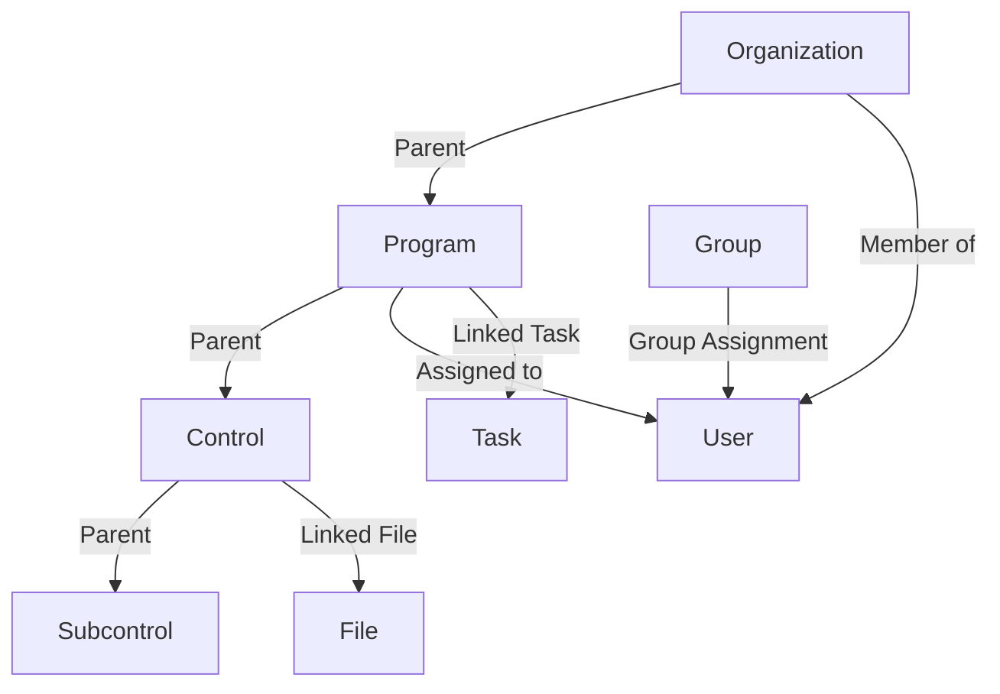

# Permissions Model Documentation

## 1. Overview
This document provides a comprehensive overview of the Openlane permissions model, detailing all object types, relations, and their respective permissions.
The model leverages inheritance, granular access controls, and role-based permissions to define access to system objects.

---

## 2. Key Roles and Permissions

| Role                   | Description                                                                 |
|------------------------|-----------------------------------------------------------------------------|
| **Owner**              | Full control, including deletion of objects.                              |
| **Admin**              | Read/write access to manage objects and members.                          |
| **Member**             | Read-only access to objects.                                              |
| **Auditor**            | Granular access to specific parts of a program (e.g., controls, risks).   |
| **Audit Log Viewer**   | View-only access to audit logs.                                            |

---

## 3. Object Types and Permissions

### 3.1. **User**
| Relation         | Description                                        |
|------------------|----------------------------------------------------|
| **_self**        | Represents the user object itself.                |

---

### 3.2. **Service**
| Relation         | Description                                        |
|------------------|----------------------------------------------------|
| **_self**        | Represents the service object itself.             |

---

### 3.3. **Organization**
| Relation            | Description                                                                 |
|---------------------|-----------------------------------------------------------------------------|
| **admin**           | Grants admin access to the organization.                                   |
| **member**          | Grants member access, which includes view access.                         |
| **owner**           | Grants full control, including delete access.                             |

---

### 3.4. **Group**
| Relation         | Description                                                                |
|------------------|----------------------------------------------------------------------------|
| **admin**        | Grants admin access to the group.                                         |
| **member**       | Grants member access, which includes view access.                        |

---

### 3.5. **Program**
| Relation         | Description                                                                |
|------------------|----------------------------------------------------------------------------|
| **admin**        | Grants admin access to the program.                                       |
| **member**       | Grants member access, including basic view access.                       |
| **auditor**      | Grants granular access to specific program parts (e.g., controls).       |

---

### 3.6. **Control**
| Relation         | Description                                                                |
|------------------|----------------------------------------------------------------------------|
| **viewer**       | Allows group members to view the control.                                 |
| **editor**       | Grants group members edit access.                                         |
| **blocked**      | Explicitly blocks access for users or groups.                            |

---

### 3.7. **Task**
| Relation         | Description                                                                |
|------------------|----------------------------------------------------------------------------|
| **assignee**     | Grants view and edit access to the task assignee.                        |

---

### 3.8. **File**
| Relation         | Description                                                                |
|------------------|----------------------------------------------------------------------------|
| **parent**       | Defines the parent object (e.g., control, procedure, program) which controls the permissions        |

---

### 3.9. **Internal Policy and Procedures**
| Relation         | Description                                                                |
|------------------|----------------------------------------------------------------------------|
| **viewer**       | Grants view access via the associated program auditor role.               |
| **editor**       | Allows edit access for group members.                                     |
| **blocked**      | Explicitly blocks access for users or groups.                            |

---

### 3.10. **Template**
| Relation         | Description                                                                |
|------------------|----------------------------------------------------------------------------|
| **viewer**       | Grants view access to group members.                                      |
| **editor**       | Allows edit access for group members.                                     |
| **blocked**      | Explicitly blocks access for users or groups.                            |

---

## 4. Inheritance and Granularity

- **Inheritance**: Permissions cascade from parent objects (e.g., organization → program → control).
- **Overrides**: Granular permissions allow for exceptions, such as blocking a specific user or group.

---

## 5. Visual Representation

Below is a visualization of the relations and permissions:

