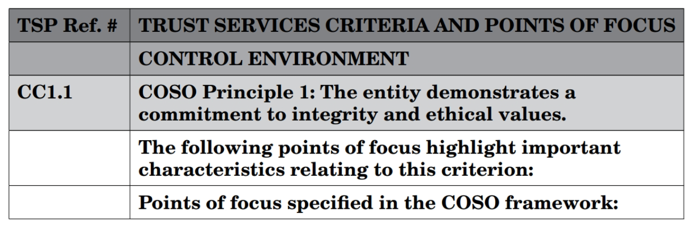

import Tabs from '@theme/Tabs';
import TabItem from '@theme/TabItem';

# SOC 2

SOC Stands for Service Organization Controls (SOC). The controls that you design and implement inside your control environment will vary based upon the people, technology, and products your company develops. Service organizations have a responsibility to protect the customers data they collect as well as the products they develop and build. The customers of service organizations will rely greatly on ensuring the organization is providing a safe, secure, and reliable platform that customers utilize to help conduct business.You can think of the product or solutions organizations develop and provide, as a small piece of the puzzle to other organizations' infrastructure and operating procedures. Compile many of these services and they help a business operate and thrive.

## AICPA COSO Framework

**What is the COSO Framework?**

The COSO Framework is a framework for designing, implementing, and monitoring internal controls to be incorporated into business processes. Additionally, the framework provides a level of assurance that the organization is ethically sound, transparent in its operating procedures, and aligned with industry best practices.

**What makes up the framework?**

The framework consists of five different components. Along with three internal objectives. The three internal objectives that the COSO framework aims to achieve are the following:

1. Operations Objectives
1. Reporting Objectives
1. Compliance Objectives

**The five components that help achieve the objectives above are the following**

1. Control Environment
1. Risk Assessment
1. Control Activities
1. Information & Communication
1. Monitoring Activities

It’s important to note that the control environment is the scope of the environment where control activities are taking place. Oftentimes companies and auditors will limit the scope of the environment depending on the size of the organization and how the data is moved across the platform. This will then impact things such as risk assessments and control activities.

Risk assessments should be actively taking place in the organization. This will include a subset of controls such as evaluating vendor risk and software vendors. In today's fast-paced business world security assessments often come in the form of a security questionnaire. Which is then evaluated by the business from a security perspective. Alternatively, businesses are also requesting attestation reports such as a SOC 2, or ISO 270001 report before deciding between vendors.  Monitoring activities come in the form of many different processes and procedures. However, with regards to SOC 2, there are two different types. Administrative, and technical. As we continue through this course you will start to see and notate the difference between administrative and technical controls.

## Trust Services Criteria and Points of Focus

**What are Trust Service Criteria?**

The trust service criteria are the overall criteria that your organization will be audited on. The organization will have gone over the criteria beforehand with the auditor. Or if you're an auditor, you will go over the Trust Service Criteria with your client to ensure that a proper scope has been defined before the auditing period begins. The Trust Service Criteria are listed below.

<Tabs className="unique-tabs">
  <TabItem value="Security">Ensuring that the information systems and data are protected against unauthorized access and disclosure. Also make sure that damage from malicious software doesn't impact your information systems to the extent that it would impact confidentiality, integrity, or availability. Also known as the CIA triad.</TabItem>
  <TabItem value="Availability">Ensuring that your Information Systems are operational during normal operating hours, and their intended use is not impacted by your organizations' processes.</TabItem>
  <TabItem value="Processing Integrity">The system or solution that has been developed, processes information correctly, in a timely manner, and encompasses proper authorization when doing so. Meaning proper access is defined and reports or data can not be accessed by a user who doesn't have the appropriate access rights.</TabItem>
  <TabItem value="Confidentiality">Information that has been classified as confidential is secure within the documented scope of Information systems and is free from tampering or misuse.</TabItem>
  <TabItem value="Privacy">Customer or personal information that is obtained, used, disclosed, or retained is properly obtained using legal methods; such as a DPA, Contract, Data sharing agreement. Also, the organization should have a policy and process in place for collection methods, and data deletion.</TabItem>
</Tabs>

When reviewing the trust services criteria it is important to note that not all of the trust service criteria have to be met in order to obtain a satisfactory SOC 2 report. However, the business has to meet the objectives that have been defined as part of the scope between the business and the auditing firm. Also at a minimum, the business will need to comply with the common criteria.

### Points of Focus

Points of Focus are intended for you as a SOC implementor or consultant to help customers achieve controls that are suitable to their organization. You can think of points of focus like helpful hints, tips, and tricks in regards to what the control is trying to prevent, mitigate or detect. Additionally, organizations that are trying to achieve a SOC 2 attestation do not have to comply with all of the Points of Focus. It's important to understand that these are not requirements.

**Example**

Let's review several examples of point-of-focus statements.

When reviewing the above figure you can see how the trust service criteria, component of COSO (control environment), common criteria, and point of focus are laid out.

**Point of Focus Example**

There are two points of focus mentioned above. They are the following;

1. Uses Defined Configuration Standards
1. Monitors Infrastructure and Software

Breaking down the points of focus. Using the scope that was defined early on in the audit engagement. You as a SOC 2 Lead Implementer should know what information systems and processes are in scope. The first point of focus talks about configuration management. This is talking about the configuration standards for the information systems that are in scope.The second point of focus is referring to infrastructure and monitoring of software. The organization should be monitoring for system outages or more specifically when the CIA triad is violated. The second part of this point of focus is the organization should be monitoring what type of software is deployed in the environment.

