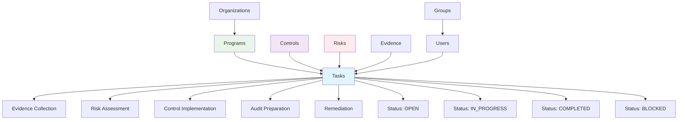
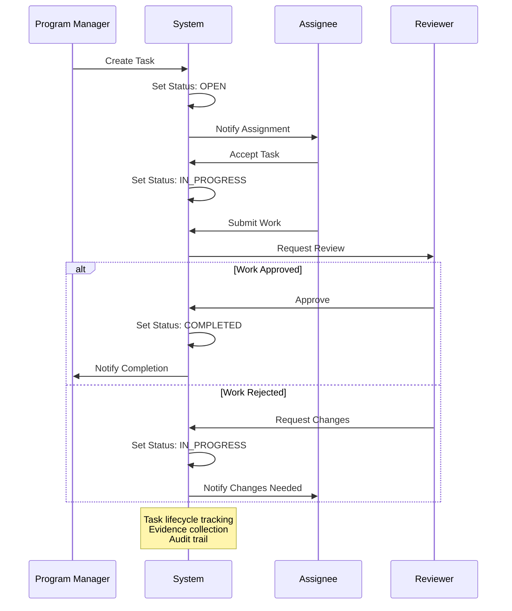

# Tasks

Tasks represent work items, assignments, and activities that need to be completed as part of compliance, risk management, and security operations within Openlane.

Tasks are just like how they sound - individual pieces of work that can be assigned to users and created either directly from the Tasks page, or from other objects within the Openlane system. A task could be assigned as a part of proposed changes to a policy or procedure, created as a part of a program, associated to objects and assigned a user, due date, and other attributes.



## What Are Tasks?

Tasks are actionable work items that enable organizations to track, assign, and manage compliance-related activities. They provide structure for breaking down complex compliance requirements into manageable, trackable work units with clear ownership and deadlines.

The overarching goal of Tasks within Openlane is to reduce or eliminate the need for the use of manual tracking or additional external systems to manage work related to managing a comprehensive security and compliance program within your business.

## Compliance Significance

Tasks are essential for:
- **Workload Management**: Breaking down compliance requirements into actionable items
- **Accountability**: Assigning clear ownership and responsibility for compliance activities
- **Progress Tracking**: Monitoring progress toward compliance objectives
- **Audit Evidence**: Documenting completion of required compliance activities
- **Resource Planning**: Planning and allocating resources for compliance work

## Task Categories

### Evidence Collection Tasks
- **Purpose**: Collect and organize evidence for compliance requirements
- **Examples**: Document upload, artifact collection, screenshot capture
- **Dependencies**: Related to specific controls or audit requirements
- **Deliverables**: Evidence artifacts, documentation, attestations

### Risk Assessment Tasks
- **Purpose**: Identify, assess, and mitigate organizational risks
- **Examples**: Risk analysis, threat modeling, vulnerability assessment
- **Dependencies**: Related to risk management processes and frameworks
- **Deliverables**: Risk assessments, mitigation plans, monitoring reports

### Control Implementation Tasks
- **Purpose**: Implement and verify security and compliance controls
- **Examples**: Policy updates, system configuration, procedure implementation
- **Dependencies**: Related to specific controls and standards
- **Deliverables**: Implemented controls, verification evidence, documentation

### Audit Preparation Tasks
- **Purpose**: Prepare for internal and external compliance audits
- **Examples**: Document preparation, process review, stakeholder coordination
- **Dependencies**: Related to audit schedules and requirements
- **Deliverables**: Audit-ready documentation, process evidence, compliance reports

### Remediation Tasks
- **Purpose**: Address identified gaps, findings, or non-compliance issues
- **Examples**: Gap remediation, finding resolution, corrective actions
- **Dependencies**: Related to audit findings or risk assessments
- **Deliverables**: Remediation evidence, corrective action plans, validation reports



## Properties

### Core Information
- **ID**: Unique identifier for the task
- **Title**: Descriptive title of the task
- **Details**: Detailed description of the work to be performed
- **Category**: Type of task (evidence collection, risk review, etc.)
- **Status**: Current status (open, in progress, completed, etc.)

### Assignment and Ownership
- **Assignee**: User assigned to complete the task
- **Assigner**: User who created or assigned the task
- **Due Date**: Deadline for task completion
- **Priority**: Task priority level (low, medium, high, critical)

### Context and Relationships
- **Parent Objects**: Associated controls, risks, policies, or programs
- **Evidence**: Linked evidence items or deliverables
- **Comments**: Notes and collaboration on the task
- **Dependencies**: Related tasks or prerequisites

### Lifecycle Tracking
- **Created At**: Task creation timestamp
- **Completed At**: Task completion timestamp
- **Updated At**: Last modification timestamp
- **History**: Audit trail of task changes and status updates

## GraphQL Operations

### Query Tasks
```graphql
query GetTasks($first: Int, $where: TaskWhereInput, $orderBy: [TaskOrder!]) {
  tasks(first: $first, where: $where, orderBy: $orderBy) {
    edges {
      node {
        id
        displayID
        title
        details
        category
        status
        due
        createdAt
        updatedAt
        owner {
          id
          name
        }
      }
    }
    pageInfo {
      hasNextPage
      hasPreviousPage
      startCursor
      endCursor
    }
    totalCount
  }
}
```

### Create Task
```graphql
mutation CreateTask($input: CreateTaskInput!) {
  createTask(input: $input) {
    task {
      id
      displayID
      title
      details
      category
      status
      due
      createdAt
    }
  }
}
```

### Update Task
```graphql
mutation UpdateTask($id: ID!, $input: UpdateTaskInput!) {
  updateTask(id: $id, input: $input) {
    task {
      id
      displayID
      title
      details
      status
      updatedAt
    }
  }
}
```

### Delete Task
```graphql
mutation DeleteTask($id: ID!) {
  deleteTask(id: $id) {
    deletedID
  }
}
```

## API Access

Tasks are managed exclusively through GraphQL operations. There are no REST endpoints for task CRUD operations.

## Task Workflows

### Evidence Collection Workflow
```javascript
// Automated evidence collection task creation
const createEvidenceCollectionTasks = async (controlId, evidenceTypes) => {
  const mutation = `
    mutation CreateTask($input: CreateTaskInput!) {
      createTask(input: $input) {
        task {
          id
          displayID
          title
          category
          status
          due
        }
      }
    }
  `;

  const tasks = [];
  const dueDate = new Date();
  dueDate.setDate(dueDate.getDate() + 14); // 2 weeks from now

  for (const evidenceType of evidenceTypes) {
    const variables = {
      input: {
        title: `Collect ${evidenceType} evidence for control ${controlId}`,
        details: `Collect and organize ${evidenceType} evidence to demonstrate control effectiveness`,
        category: 'evidence_collection',
        due: dueDate.toISOString(),
        controlIds: [controlId]
      }
    };

    const response = await fetch('https://api.openlane.io/query', {
      method: 'POST',
      headers: {
        'Authorization': `Bearer ${apiToken}`,
        'Content-Type': 'application/json'
      },
      body: JSON.stringify({
        query: mutation,
        variables: variables
      })
    });

    const result = await response.json();
    tasks.push(result.data.createTask.task);
  }

  return tasks;
};
```

### Risk Assessment Task Automation
```javascript
// Automated risk assessment task creation
const createRiskAssessmentTasks = async (riskIds) => {
  const mutation = `
    mutation CreateTask($input: CreateTaskInput!) {
      createTask(input: $input) {
        task {
          id
          displayID
          title
          details
          category
          status
          due
        }
      }
    }
  `;

  const tasks = [];
  const dueDate = new Date();
  dueDate.setDate(dueDate.getDate() + 30); // 1 month from now

  for (const riskId of riskIds) {
    const variables = {
      input: {
        title: `Quarterly Risk Assessment - ${riskId}`,
        details: `
          Conduct quarterly risk assessment including:
          - Reassess risk impact and likelihood
          - Review current mitigation effectiveness
          - Update risk mitigation strategies if needed
          - Document any changes in risk profile
        `,
        category: 'risk_assessment',
        due: dueDate.toISOString(),
        riskIds: [riskId]
      }
    };

    const response = await fetch('https://api.openlane.io/query', {
      method: 'POST',
      headers: {
        'Authorization': `Bearer ${apiToken}`,
        'Content-Type': 'application/json'
      },
      body: JSON.stringify({
        query: mutation,
        variables: variables
      })
    });

    const result = await response.json();
    tasks.push(result.data.createTask.task);
  }

  return tasks;
};
```

### Audit Preparation Tasks
```javascript
// Create comprehensive audit preparation task suite
const createAuditPrepTasks = async (auditDate, auditType) => {
  const prepTasks = [
    {
      title: 'Prepare control evidence',
      category: 'audit_preparation',
      due: new Date(auditDate - 14 * 24 * 60 * 60 * 1000), // 2 weeks before
      details: 'Prepare comprehensive control evidence for upcoming audit'
    },
    {
      title: 'Review policy documentation',
      category: 'audit_preparation',
      due: new Date(auditDate - 10 * 24 * 60 * 60 * 1000), // 10 days before
      details: 'Review and update all policy documentation for audit readiness'
    },
    {
      title: 'Coordinate stakeholder interviews',
      category: 'audit_preparation',
      due: new Date(auditDate - 7 * 24 * 60 * 60 * 1000), // 1 week before
      details: 'Coordinate and schedule stakeholder interviews with auditors'
    }
  ];

  const createdTasks = [];
  for (const taskData of prepTasks) {
    const task = await createTask({
      title: taskData.title,
      details: taskData.details,
      category: taskData.category,
      due: taskData.due.toISOString()
    });
    createdTasks.push(task);
  }

  return createdTasks;
};
```

## Task Templates

### Control Implementation Template
```yaml
template:
  title: "Implement Control: {{control.name}}"
  category: "control_implementation"
  details: |
    Implement security control {{control.ref_code}} - {{control.name}}

    Requirements:
    - Review control requirements
    - Design implementation approach
    - Implement control measures
    - Document implementation
    - Validate effectiveness

    Deliverables:
    - Implementation documentation
    - Configuration evidence
    - Validation test results
  priority: "high"
  estimated_hours: 8
  checklist:
    - "Review control requirements"
    - "Design implementation approach"
    - "Implement control measures"
    - "Document implementation"
    - "Validate effectiveness"
```

### Evidence Collection Template
```yaml
template:
  title: "Collect Evidence: {{evidence.type}}"
  category: "evidence_collection"
  details: |
    Collect {{evidence.type}} evidence for {{control.name}}

    Instructions:
    - Gather required documentation
    - Take necessary screenshots
    - Collect system outputs
    - Organize and upload evidence

    Evidence Requirements:
    - {{evidence.requirements}}
  priority: "medium"
  estimated_hours: 2
  checklist:
    - "Gather documentation"
    - "Collect artifacts"
    - "Organize evidence"
    - "Upload to platform"
```

## Performance Metrics

### Task Completion Analytics
```javascript
// Calculate comprehensive task metrics
const getTaskMetrics = async (timeframe) => {
  const query = `
    query GetTaskMetrics($timeframe: String!) {
      tasks(where: {
        createdAt: { gte: $timeframe }
      }) {
        edges {
          node {
            id
            status
            category
            due
            createdAt
            updatedAt
          }
        }
        totalCount
      }
    }
  `;

  const response = await fetch('https://api.openlane.io/query', {
    method: 'POST',
    headers: {
      'Authorization': `Bearer ${apiToken}`,
      'Content-Type': 'application/json'
    },
    body: JSON.stringify({
      query: query,
      variables: { timeframe }
    })
  });

  const result = await response.json();
  const tasks = result.data.tasks.edges.map(edge => edge.node);

  const completed = tasks.filter(t => t.status === 'completed').length;
  const overdue = tasks.filter(t => new Date(t.due) < new Date() && t.status !== 'completed').length;

  return {
    completionRate: completed / tasks.length,
    totalTasks: tasks.length,
    completedTasks: completed,
    overdueCount: overdue,
    byCategory: groupByCategory(tasks),
    byStatus: groupByStatus(tasks)
  };
};
```

## Integration Patterns

| Integration | Relationship | Business Impact |
|-------------|--------------|----------------|
| **Users** | Assignment and accountability | Clear ownership and progress tracking |
| **Evidence** | Task completion generates proof | Systematic evidence collection |
| **Controls** | Tasks implement and validate controls | Structured control deployment |
| **Risks** | Tasks address risk mitigation | Systematic risk management |
| **Programs** | Tasks organized by compliance scope | Coordinated compliance efforts |
| **Standards** | Tasks fulfill specific requirements | Comprehensive compliance coverage |

## Best Practices

### Task Creation
1. **Clear Titles**: Use descriptive, actionable titles for tasks
2. **Detailed Descriptions**: Provide clear instructions and requirements
3. **Appropriate Categories**: Use consistent categorization for reporting
4. **Realistic Deadlines**: Set achievable deadlines based on complexity

### Assignment and Management
1. **Skill-Based Assignment**: Assign tasks to users with appropriate skills
2. **Workload Balancing**: Distribute tasks evenly across team members
3. **Priority Management**: Use priority levels to guide work focus
4. **Regular Reviews**: Conduct regular reviews of task progress and status

### Documentation and Evidence
1. **Evidence Linking**: Link relevant evidence to task completion
2. **Progress Updates**: Document progress and any obstacles encountered
3. **Completion Documentation**: Thoroughly document task completion
4. **Lessons Learned**: Capture insights for future task planning

### Automation and Integration
1. **Template Usage**: Use templates for common task types
2. **Automated Creation**: Automate task creation for recurring activities
3. **Integration Points**: Integrate with external systems for evidence collection
4. **Notification Systems**: Implement appropriate notification and reminder systems

Tasks provide the operational foundation for executing compliance activities and maintaining accountability within Openlane's compliance management framework.