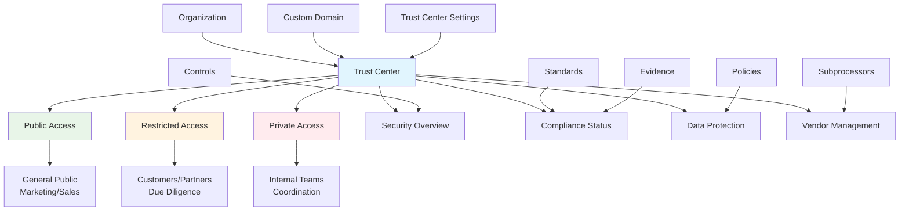

# Trust Center

The Trust Center is Openlane's customer-facing security and compliance transparency portal that provides stakeholders with visibility into an organization's security posture, compliance status, and data protection practices.



## What Is a Trust Center?

A Trust Center is a public or restricted web portal that organizations use to communicate their security and compliance posture to customers, prospects, partners, and other stakeholders. It serves as a centralized hub for security documentation, compliance certifications, and transparency reports.

## Compliance Significance

| Aspect | Purpose | Benefit |
|--------|---------|----------|
| **Transparency** | Visibility into security practices and compliance | Builds customer trust and confidence |
| **Customer Due Diligence** | Enable vendor security assessment | Streamlines customer procurement processes |
| **Regulatory Compliance** | Meet transparency requirements | Satisfies regulatory and contractual obligations |
| **Sales Enablement** | Proactive security communication | Accelerates sales cycles and reduces friction |
| **Risk Management** | Demonstrate security commitment | Reduces customer and partner risk concerns |

## Trust Center Types

| Type | Access Model | Content Level | Primary Use Case |
|------|-------------|---------------|------------------|
| **Public** | No authentication required | General security overview, public certifications | Marketing, transparency, public communication |
| **Restricted** | Authentication or invitation | Detailed documentation, sensitive reports | Customer due diligence, partner assessments |
| **Private** | Internal organization only | Internal documentation, operational details | Internal communication, compliance coordination |

## Trust Center Configuration

| Configuration Aspect | Options | Business Impact |
|---------------------|---------|----------------|
| **Access Level** | Public, Restricted, Private | Controls audience and information sensitivity |
| **Custom Domain** | Branded domain integration | Professional appearance and brand consistency |
| **Content Sections** | Modular security information | Organized presentation of compliance data |
| **Document Management** | Certification and policy hosting | Centralized access to security documentation |
| **Subprocessor Transparency** | Third-party vendor disclosure | Regulatory compliance and customer assurance |

## GraphQL Operations

### Query Trust Centers
```graphql
query GetTrustCenters($first: Int, $where: TrustCenterWhereInput) {
  trustCenters(first: $first, where: $where) {
    edges {
      node {
        id
        slug
        customDomainID
        createdAt
        updatedAt
        owner {
          id
          name
        }
      }
    }
    pageInfo {
      hasNextPage
      hasPreviousPage
      startCursor
      endCursor
    }
    totalCount
  }
}
```

### Create Trust Center
```graphql
mutation CreateTrustCenter($input: CreateTrustCenterInput!) {
  createTrustCenter(input: $input) {
    trustCenter {
      id
      slug
      customDomainID
      createdAt
      owner {
        id
        name
      }
    }
  }
}
```

### Update Trust Center
```graphql
mutation UpdateTrustCenter($id: ID!, $input: UpdateTrustCenterInput!) {
  updateTrustCenter(id: $id, input: $input) {
    trustCenter {
      id
      slug
      customDomainID
      updatedAt
    }
  }
}
```

## API Access

Trust centers are managed exclusively through GraphQL operations. There are no REST endpoints for trust center CRUD operations.

## Trust Center Sections

### Security Overview
- **Security Framework**: High-level security architecture and approach
- **Certifications**: Current security certifications and compliance status
- **Policies**: Links to relevant security policies and procedures
- **Incident Response**: High-level incident response capabilities

### Compliance Status
- **Standards**: Compliance with industry standards (SOC 2, ISO 27001, etc.)
- **Regulations**: Compliance with regulatory requirements (GDPR, HIPAA, etc.)
- **Attestations**: Third-party attestations and audit reports
- **Certifications**: Current certifications and renewal schedules

### Data Protection
- **Data Classification**: How data is classified and protected
- **Privacy Policies**: Links to privacy policies and data processing agreements
- **Data Residency**: Information about data storage locations
- **Data Rights**: Customer rights regarding their data

### Vendor Management
- **Subprocessors**: List of third-party vendors and their purposes
- **Vendor Assessment**: Vendor security assessment processes
- **Supply Chain**: Security measures for supply chain partners
- **Vendor Monitoring**: Ongoing monitoring of vendor security posture

## Customization Options

### Branding and Theme
```javascript
// Trust center theme configuration
const trustCenterConfig = {
  theme: {
    primaryColor: '#2563eb',
    secondaryColor: '#1f2937',
    fontFamily: 'Inter, sans-serif',
    logoUrl: 'https://cdn.acme.com/logo.png'
  },
  layout: {
    headerStyle: 'minimal',
    navigationStyle: 'sidebar',
    contentLayout: 'cards'
  }
};
```

### Content Sections
```yaml
# Trust center content configuration
sections:
  - name: "Security Overview"
    type: "content"
    public: true
    content: |
      Our comprehensive security program...

  - name: "Compliance Certifications"
    type: "compliance"
    public: true
    show_certificates: true
    show_expiration: false

  - name: "Subprocessors"
    type: "subprocessors"
    public: true
    show_locations: true
    show_data_types: false
```

## Integration Examples

### Automated Compliance Status Updates
```javascript
// Update trust center compliance status via GraphQL
const updateCompliance = async (standardId, status) => {
  const response = await fetch('https://api.openlane.io/query', {
    method: 'POST',
    headers: {
      'Authorization': `Bearer ${apiToken}`,
      'Content-Type': 'application/json'
    },
    body: JSON.stringify({
      query: `
        mutation CreateTrustCenterCompliance($input: CreateTrustCenterComplianceInput!) {
          createTrustCenterCompliance(input: $input) {
            trustCenterCompliance {
              id
              status
            }
          }
        }
      `,
      variables: {
        input: {
          trustCenterID: trustCenterId,
          standardID: standardId,
          status: status
        }
      }
    })
  });

  return response.json();
};
```

### Subprocessor Management
```javascript
// Add subprocessor to trust center via GraphQL
const addSubprocessor = async (subprocessorData) => {
  const response = await fetch('https://api.openlane.io/query', {
    method: 'POST',
    headers: {
      'Authorization': `Bearer ${apiToken}`,
      'Content-Type': 'application/json'
    },
    body: JSON.stringify({
      query: `
        mutation CreateTrustCenterSubprocessor($input: CreateTrustCenterSubprocessorInput!) {
          createTrustCenterSubprocessor(input: $input) {
            trustCenterSubprocessor {
              id
              name
              purpose
            }
          }
        }
      `,
      variables: {
        input: {
          trustCenterID: trustCenterId,
          name: subprocessorData.name,
          purpose: subprocessorData.purpose
        }
      }
    })
  });

  return response.json();
};
```

## Best Practices

### Content Management
1. **Accuracy**: Ensure all information is accurate and up-to-date
2. **Consistency**: Maintain consistent messaging across all sections
3. **Transparency**: Balance transparency with security considerations
4. **Regular Updates**: Keep compliance status and certifications current

### Security Considerations
1. **Information Classification**: Carefully classify information before public disclosure
2. **Access Controls**: Implement appropriate access controls for sensitive sections
3. **Monitoring**: Monitor trust center access for unusual patterns
4. **Incident Response**: Include trust center updates in incident response procedures

### User Experience
1. **Navigation**: Provide clear navigation and search functionality
2. **Mobile Optimization**: Ensure trust center works well on mobile devices
3. **Performance**: Optimize for fast loading and good user experience
4. **Accessibility**: Ensure trust center meets accessibility standards

### Compliance Integration
1. **Automation**: Automate compliance status updates where possible
2. **Audit Trail**: Maintain complete audit trail of trust center changes
3. **Documentation**: Document trust center content approval processes
4. **Review Cycles**: Implement regular review cycles for trust center content

Trust Centers are essential for building customer confidence and meeting transparency requirements in today's security-conscious business environment.