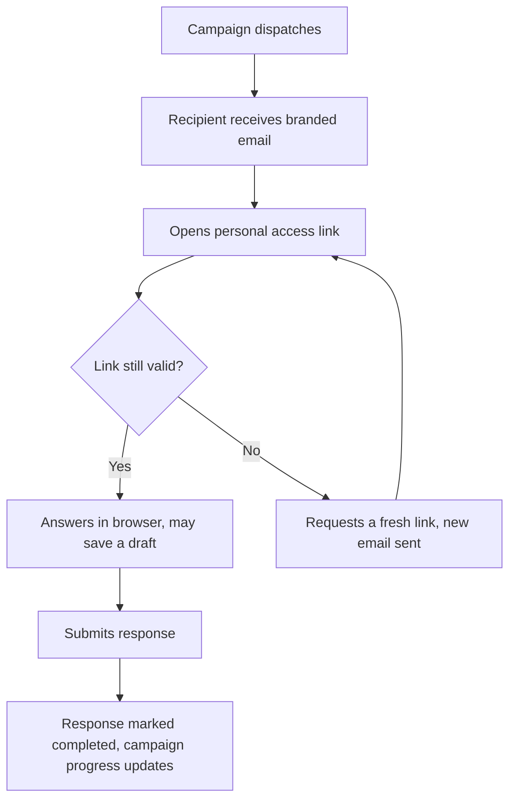

import Tabs from '@theme/Tabs';
import TabItem from '@theme/TabItem';
import Term from '@site/src/components/Term';

# Questionnaires

Questionnaires are the customizable, reusable definitions you pair with [campaigns](./campaigns.mdx) to collect structured responses from vendors, employees, and internal teams. Recipients answer through a secure personal link and every response is tracked from send to submission.

Two objects work together. The assessment (this page) is the reusable questionnaire definition: the questions, the type (internal or external), and the response window. A [campaign](./campaigns.mdx) is the distribution run: who receives it, per-recipient completion tracking, and follow-up sends to anyone who hasn't finished. Define once, run repeatedly; the same vendor questionnaire run as an annual campaign produces year-over-year comparable responses.

Together they form the questionnaire half of an end-to-end <Term t="third-party-risk-management">third-party risk management (TPRM)</Term> workflow: [vendor records](../registry/entities.mdx) hold the relationship and its review cadence, campaigns distribute the due-diligence questionnaire to [vendor contacts](../registry/contacts.mdx), and completed responses become the auditable record (who answered, what they said, and when) that periodic-review and supplier-evaluation requirements expect. The same machinery runs internal attestations and periodic self-assessments.

## Building a Questionnaire

An assessment is a form definition: the questions, their types, and the layout recipients see. There are two ways to create one. Starting from a questionnaire template inherits its form definition and layout, which is the fastest path and keeps repeated questionnaires consistent; you can adjust from there. Defining the form from scratch covers whatever a template doesn't.

Each assessment is either **internal** (answered by people inside your organization, such as a periodic self-assessment) or **external** (answered by outsiders, such as a vendor security review). The type is fixed at creation and determines how access is granted.

Every assessment also carries a default response window, how long respondents have to answer once assigned (7 days unless you set otherwise). Individual sends can override it with an explicit due date.

## Sending a Questionnaire

Pair the assessment with a [campaign](./campaigns.mdx) to distribute it. The campaign owns the audience and the schedule; the assessment supplies the content. When the campaign dispatches, each recipient gets a branded email containing their personal access link, and a response record is created to track them individually.

You can send a test to yourself first: test sends use the real email template and access flow but create no tracking records.

## How Recipients Respond

The access link in the email is personal and secure: a short-lived signed token scoped to that one questionnaire and that one email address. Recipients click through and answer in the browser; no Openlane account or sign-up is required.

While answering, recipients can save a draft and come back; the response is only submitted when they finish. If the link expires before they respond, they can request a fresh one from the questionnaire page itself, which sends a new email (resends are capped at five per recipient).



## Tracking Responses and Progress

Every recipient has a response record that tracks when the questionnaire was assigned, when they started, and when they submitted. Responses past their due date flip to overdue automatically, so identifying who needs follow-up never requires checking dates by hand.

Delivery is tracked at the email level too: whether the message was delivered, opened, and clicked, and how many times. That lets you distinguish a vendor who never received the email from one who opened it and stalled, and to target [resends](./campaigns.mdx#follow-ups-and-resends) accordingly.

Submitted answers are stored with the response, so the record an auditor sees carries who was asked, when they answered, and what they said. Respondents who aren't already in your registry are added as contacts automatically, and the response status rolls up to the campaign, which completes itself when the last recipient finishes.

## Common Uses

- **Vendor due diligence**: a vendor risk team sends its security baseline questionnaire to every third party and tracks completion before renewal decisions
- **Policy attestation**: a compliance team runs a quarterly acknowledgment campaign across all active personnel, resending to anyone incomplete
- **Periodic reviews**: recurring internal self-assessments that keep review <Term t="evidence">evidence</Term> current between audits

## FAQ

<details>
<summary>What's the difference between a questionnaire and an assessment?</summary>

Nothing; "assessment" is what Openlane calls the questionnaire definition.

</details>

<details>
<summary>How do I send a questionnaire to a list of vendors or employees?</summary>

Create a [campaign](./campaigns.mdx) tied to the assessment and add your recipients, individually or via CSV. The campaign tracks each recipient's status and handles resends.

</details>

<details>
<summary>Can questionnaires run on a schedule?</summary>

Yes. Campaigns support recurrence (quarterly policy attestations, annual vendor reviews), which keeps recurring questionnaire evidence on schedule. See [Campaigns](./campaigns.mdx).

</details>

<details>
<summary>What happens when a recipient's access link expires?</summary>

They request a fresh link from the questionnaire page and receive a new email. Resends are capped at five per recipient, and each new link invalidates nothing they've already saved: drafts persist across links.

</details>

<details>
<summary>Can respondents save and come back later?</summary>

Yes. Responses can be saved as drafts and submitted later; the tracking record shows drafts distinctly from completed submissions.

</details>

<details>
<summary>Where do responses end up?</summary>

Responses live on the campaign, tracked per recipient. Completion records serve as evidence of participation for audits.

</details>

## Examples

<Tabs groupId="api-format" queryString>
  <TabItem value="csv" label="CSV">

```csv
# Recipient targets for an assessment campaign
Email,FullName,Status
security@vendor-one.com,Vendor One Security Team,NOT_STARTED
security@vendor-two.com,Vendor Two Security Team,NOT_STARTED
```

  </TabItem>
  <TabItem value="graphql" label="GraphQL">

```graphql
mutation {
  createAssessment(
    input: {
      name: "Vendor Security Baseline Questionnaire"
      assessmentType: EXTERNAL
      responseDueDuration: 1209600
    }
  ) {
    assessment {
      id
      name
    }
  }
}
```

```graphql
mutation {
  updateAssessment(
    id: "ASM01J9ASMT1111111111111"
    input: {
      name: "Vendor Security Baseline Questionnaire v2"
      responseDueDuration: 604800
    }
  ) {
    assessment {
      id
      name
      responseDueDuration
    }
  }
}
```

  </TabItem>
  <TabItem value="go-client" label="Go Client">

```go
ctx := context.Background()

responseDueDuration := int64(1209600)
_, err := client.CreateAssessment(ctx, graphclient.CreateAssessmentInput{
	Name:                "Vendor Security Baseline Questionnaire",
	ResponseDueDuration: &responseDueDuration,
})
if err != nil {
	return err
}

updatedDuration := int64(604800)
name := "Vendor Security Baseline Questionnaire v2"
_, err = client.UpdateAssessment(ctx, "ASM01J9ASMT1111111111111", graphclient.UpdateAssessmentInput{
	Name:                &name,
	ResponseDueDuration: &updatedDuration,
})
if err != nil {
	return err
}
```

  </TabItem>
  <TabItem value="cli" label="CLI">

```bash
openlane assessment create \
  --name "Vendor Security Baseline Questionnaire" \
  --type EXTERNAL

openlane assessment update \
  --id "ASM01J9ASMT1111111111111" \
  --name "Vendor Security Baseline Questionnaire v2"
```

  </TabItem>
</Tabs>
