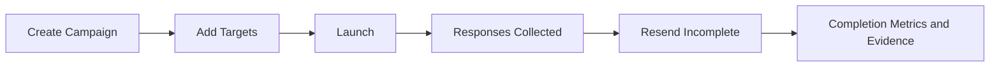

import Tabs from '@theme/Tabs';
import TabItem from '@theme/TabItem';

# Campaigns

## Overview

Campaigns are structured outreach runs for policy attestations, training acknowledgements, and questionnaire requests. They let you target many recipients, track progress at the recipient level, and manage follow-up sends from one workflow.

Campaign records are most commonly tied to an assessment template and a recipient audience (such as personnel, contacts, users, or groups).

## Campaign Lifecycle



## Compliance Significance

- SOC 2: CC1, CC2, CC5 communication and governance evidence
- ISO 27001: awareness, policy communication, and recurring control operation

## Practical Examples

- A security team launches quarterly policy acknowledgment campaigns for all personnel.
- A vendor risk team runs an annual questionnaire campaign and tracks completion before renewal decisions.

## Examples

<Tabs>
  <TabItem value="csv" label="CSV">

| Operation | API |
| --- | --- |
| Create campaign | `createBulkCSVCampaign` |
| Create campaign with recipients | `createCampaignWithTargetsCSV` |
| Update campaign | `updateCampaign` |

```csv
# Create campaign
Name,CampaignType,Status,DueDate,IsRecurring,RecurrenceFrequency
Q2 Security Policy Acknowledgment,POLICY_ATTESTATION,DRAFT,2026-04-15T00:00:00Z,true,QUARTERLY
Vendor Security Questionnaire 2026,VENDOR_ASSESSMENT,DRAFT,2026-05-01T00:00:00Z,false,
```

```csv
# Recipient targets
Email,FullName,Status
avery@acme.io,Avery Jordan,NOT_STARTED
riley@vendor-partner.com,Riley Chen,NOT_STARTED
```

  </TabItem>
  <TabItem value="graphql" label="GraphQL">

| Operation | Mutation |
| --- | --- |
| Create | `createCampaign` |
| Update | `updateCampaign` |

```graphql
mutation {
  createCampaign(
    input: {
      name: "Q2 Security Policy Acknowledgment"
      campaignType: POLICY_ATTESTATION
      status: DRAFT
      isRecurring: true
    }
  ) {
    campaign {
      id
      name
    }
  }
}
```

```graphql
mutation {
  updateCampaign(
    id: "CMP01J9CAMP11111111111111"
    input: {
      status: SCHEDULED
      recurrenceFrequency: QUARTERLY
    }
  ) {
    campaign {
      id
      status
    }
  }
}
```

  </TabItem>
  <TabItem value="go-client" label="Go Client">

| Operation | Method |
| --- | --- |
| Create | `client.CreateCampaign(ctx, input)` |
| Update | `client.UpdateCampaign(ctx, id, input)` |

```go
ctx := context.Background()

description := "Quarterly policy acknowledgment run"
_, err := client.CreateCampaign(ctx, graphclient.CreateCampaignInput{
	Name:        "Q2 Security Policy Acknowledgment",
	Description: &description,
})
if err != nil {
	return err
}

isRecurring := true
_, err = client.UpdateCampaign(ctx, "CMP01J9CAMP11111111111111", graphclient.UpdateCampaignInput{
	IsRecurring: &isRecurring,
})
if err != nil {
	return err
}
```

  </TabItem>
  <TabItem value="cli" label="CLI">

| Operation | Command |
| --- | --- |
| Create | `openlane campaign create` |
| Create with targets | `openlane campaign create-with-targets` |
| Update | `openlane campaign update` |

```bash
openlane campaign create \
  --name "Q2 Security Policy Acknowledgment" \
  --type POLICY_ATTESTATION \
  --status DRAFT

openlane campaign create-with-targets \
  --name "Vendor Security Questionnaire 2026" \
  --type VENDOR_ASSESSMENT \
  --targets-file targets.csv

openlane campaign update \
  --id "CMP01J9CAMP11111111111111" \
  --status SCHEDULED
```

  </TabItem>
</Tabs>
