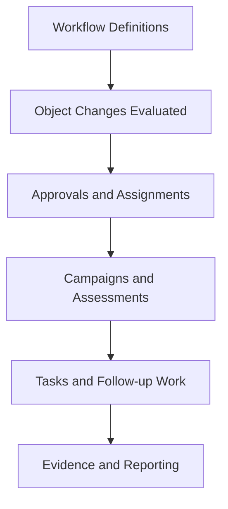

# Automation

Automation helps your team execute compliance work on time with less manual coordination and better audit trails.

## Automation Flow

## Why It Matters

- Standardizes recurring governance workflows
- Reduces manual handoffs and missed deadlines
- Improves traceability for audits and customer assurance

## What's in This Section

- [Workflows and Approvals](./workflows.mdx) - Configure workflow behavior and understand engine-managed approvals
- [Tasks](./tasks.mdx) - Track assigned compliance work and completion status
- [Campaigns](./campaigns.mdx) - Run bulk outreach for attestations and questionnaires
- [Assessments (Questionnaires)](./assessments.mdx) - Define and manage reusable questionnaire content
