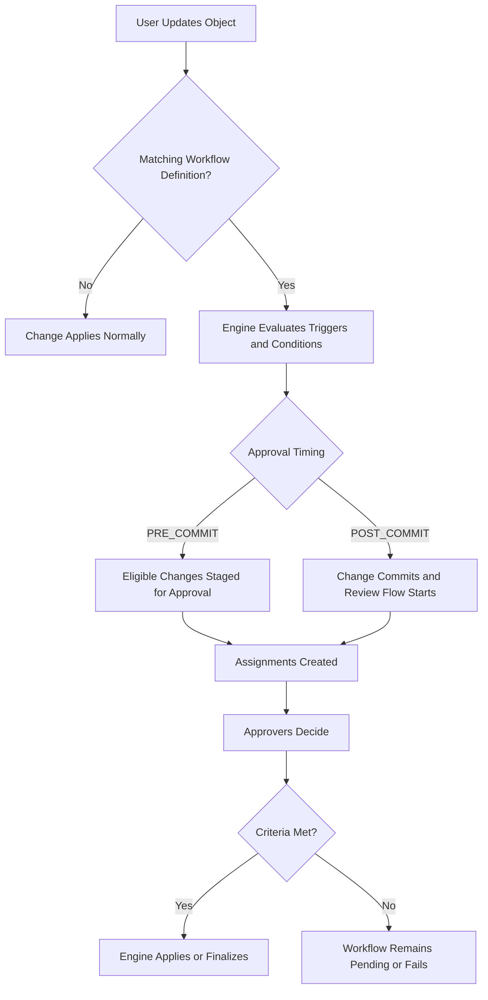

import Tabs from '@theme/Tabs';
import TabItem from '@theme/TabItem';

# Workflows and Approvals

## Overview

Workflows in Openlane let you automate governance decisions around object changes by defining triggers, conditions, and actions. Typical actions include approvals, notifications, and follow-up automation.

From a user perspective, you configure workflow definitions. The workflow engine then evaluates changes, creates the required workflow records, and manages approval routing and state transitions.

For approval-based workflows, Openlane supports pre-commit and post-commit behavior:

- `PRE_COMMIT`: approval-eligible changes are staged before applying
- `POST_COMMIT`: changes commit first and approval/review activity runs afterward

## How It Works



## What You Configure vs. What the Engine Manages

You configure:

- `WorkflowDefinition` content (`triggers`, `conditions`, `actions`)
- Scope and targeting choices (schema type, selectors, target groups/users/resolvers)
- Operational state (`active`, revisioning, lifecycle updates)

The engine manages automatically:

- Workflow instance creation and progression
- Proposal staging for approval-gated changes
- Assignment generation, quorum checks, and completion logic
- Event timeline updates and workflow state transitions

Current implementation detail from the workflow package docs:

- `AUTO_SUBMIT` is the effective submission mode for approval workflows today
- draft proposal submission is not currently exposed as a user-facing flow

## Compliance Significance

- SOC 2: CC2 and CC5 (governance and controlled change)
- ISO 27001: change management and approval traceability

## Practical Examples

- Require approval before changing high-impact fields on compliance-critical records.
- Route different approval actions to different groups based on workflow conditions.
- Trigger notifications after approvals complete to keep owners informed.

## Examples

<Tabs>
  <TabItem value="csv" label="CSV">

| Operation | API |
| --- | --- |
| Create | `createBulkCSVWorkflowDefinition` |
| Update | `updateWorkflowDefinition` |

```csv
# Create
Name,WorkflowKind,SchemaType,Draft,Active,CooldownSeconds
Control Status Governance Workflow,APPROVAL,Control,false,true,60
Evidence Review Workflow,APPROVAL,Evidence,false,true,60
```

```csv
# Update
ID,Revision,Active,Draft
WFD01J9WFLOW1111111111111,2,true,false
WFD01J9WFLOW2222222222222,2,true,false
```

  </TabItem>
  <TabItem value="graphql" label="GraphQL">

| Operation | GraphQL |
| --- | --- |
| Create definition | `createWorkflowDefinition` |
| Update definition | `updateWorkflowDefinition` |
| Review assignments | `myWorkflowAssignments`, `approveWorkflowAssignment`, `rejectWorkflowAssignment` |

```graphql
mutation {
  createWorkflowDefinition(
    input: {
      name: "Control Status Governance Workflow"
      workflowKind: APPROVAL
      schemaType: "Control"
      draft: false
      active: true
      cooldownSeconds: 60
    }
  ) {
    workflowDefinition {
      id
      name
      active
    }
  }
}
```

```graphql
mutation {
  updateWorkflowDefinition(
    id: "WFD01J9WFLOW1111111111111"
    input: {
      revision: 2
      active: true
    }
  ) {
    workflowDefinition {
      id
      revision
      active
    }
  }
}
```

```graphql
query {
  myWorkflowAssignments(first: 20) {
    edges {
      node {
        id
        status
        dueAt
      }
    }
  }
}
```

```graphql
mutation {
  approveWorkflowAssignment(id: "WFA01J9ASSIGN111111111111") {
    workflowAssignment {
      id
      status
    }
  }
}
```

```graphql
mutation {
  rejectWorkflowAssignment(
    id: "WFA01J9ASSIGN111111111111"
    reason: "Needs additional evidence"
  ) {
    workflowAssignment {
      id
      status
    }
  }
}
```

  </TabItem>
  <TabItem value="go-client" label="Go Client">

| Operation | Method |
| --- | --- |
| Create definition | `client.CreateWorkflowDefinition(ctx, input)` |
| Update definition | `client.UpdateWorkflowDefinition(ctx, id, input)` |
| Approvals | `client.GetMyWorkflowAssignments`, `client.ApproveWorkflowAssignment`, `client.RejectWorkflowAssignment` |

```go
ctx := context.Background()

active := true
draft := false

_, err := client.CreateWorkflowDefinition(ctx, graphclient.CreateWorkflowDefinitionInput{
	Name:         "Control Status Governance Workflow",
	WorkflowKind: "APPROVAL",
	SchemaType:   "Control",
	Active:       &active,
	Draft:        &draft,
})
if err != nil {
	return err
}

revision := int64(2)
_, err = client.UpdateWorkflowDefinition(ctx, "WFD01J9WFLOW1111111111111", graphclient.UpdateWorkflowDefinitionInput{
	Revision: &revision,
	Active:   &active,
})
if err != nil {
	return err
}

first := int64(20)
_, err = client.GetMyWorkflowAssignments(ctx, &first, nil, nil, nil, nil, nil)
if err != nil {
	return err
}

_, err = client.ApproveWorkflowAssignment(ctx, "WFA01J9ASSIGN111111111111")
if err != nil {
	return err
}

reason := "Needs additional evidence"
_, err = client.RejectWorkflowAssignment(ctx, "WFA01J9ASSIGN111111111111", &reason)
if err != nil {
	return err
}
```

  </TabItem>
  <TabItem value="cli" label="CLI">

| Operation | Command |
| --- | --- |
| List workflow instances | `openlane workflowInstance get` |
| List workflow assignments | `openlane workflowAssignment get` |
| Get assignment details | `openlane workflowAssignment get --id ... --show-targets` |

```bash
openlane workflowInstance get --first 20
openlane workflowAssignment get --first 20
openlane workflowAssignment get --id "WFA01J9ASSIGN111111111111" --show-targets
```

Definition create/update is currently documented through GraphQL and Go client operations.

  </TabItem>
</Tabs>
