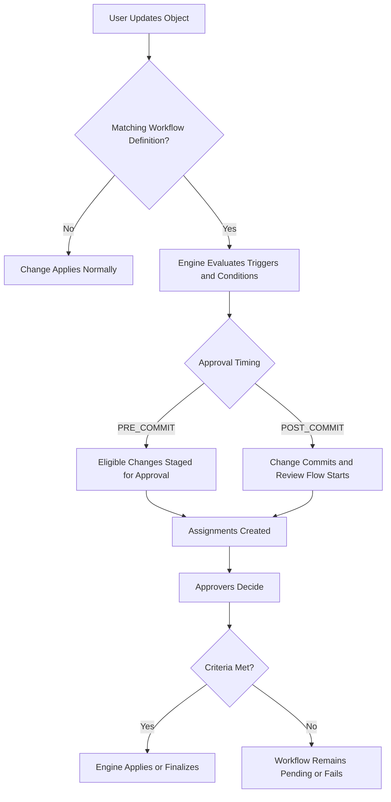

import Tabs from '@theme/Tabs';
import TabItem from '@theme/TabItem';

# Workflows and Approvals

Workflows gate object changes behind reviews and approvals. You author a workflow definition with triggers, conditions, and actions (approvals, notifications, and follow-up automation); the engine evaluates changes, routes approvals, and applies the result. See [Authoring Workflow Definitions](./workflow-definitions.mdx) for the full reference and copyable examples.

## How It Works

For approval workflows, Openlane supports pre-commit and post-commit behavior:

* `PRE_COMMIT`: approval-eligible changes are staged before applying
* `POST_COMMIT`: changes commit first and approval or review activity runs afterward



## What You Configure and What the Engine Manages

You configure:

* `WorkflowDefinition` content (`triggers`, `conditions`, `actions`)
* Scope and targeting choices (schema type, selectors, target groups, users, and resolvers)
* Operational state (`active`, revisioning, lifecycle updates)

The engine manages automatically:

* Workflow instance creation and progression
* Proposal staging for approval-gated changes
* Assignment generation, quorum checks, and completion logic
* Event timeline updates and workflow state transitions

:::info
Current implementation detail from the workflow package docs: `AUTO_SUBMIT` is the effective submission mode for approval workflows today, and draft proposal submission is not currently exposed as a user-facing flow.
:::

## Examples

<Tabs groupId="api-format" queryString>
  <TabItem value="csv" label="CSV">

```csv
# Create
Name,WorkflowKind,SchemaType,Draft,Active,CooldownSeconds
Control Status Governance Workflow,APPROVAL,Control,false,true,60
Evidence Review Workflow,APPROVAL,Evidence,false,true,60
```

  </TabItem>
  <TabItem value="graphql" label="GraphQL">

```graphql
mutation {
  createWorkflowDefinition(
    input: {
      name: "Control Status Governance Workflow"
      workflowKind: APPROVAL
      schemaType: "Control"
      draft: false
      active: true
      cooldownSeconds: 60
    }
  ) {
    workflowDefinition {
      id
      name
      active
    }
  }
}
```

```graphql
mutation {
  updateWorkflowDefinition(
    id: "WFD01J9WFLOW1111111111111"
    input: {
      revision: 2
      active: true
    }
  ) {
    workflowDefinition {
      id
      revision
      active
    }
  }
}
```

```graphql
query {
  myWorkflowAssignments(first: 20) {
    edges {
      node {
        id
        status
        dueAt
      }
    }
  }
}
```

```graphql
mutation {
  approveWorkflowAssignment(id: "WFA01J9ASSIGN111111111111") {
    workflowAssignment {
      id
      status
    }
  }
}
```

```graphql
mutation {
  rejectWorkflowAssignment(
    id: "WFA01J9ASSIGN111111111111"
    reason: "Needs additional evidence"
  ) {
    workflowAssignment {
      id
      status
    }
  }
}
```

  </TabItem>
  <TabItem value="go-client" label="Go Client">

```go
ctx := context.Background()

active := true
draft := false

_, err := client.CreateWorkflowDefinition(ctx, graphclient.CreateWorkflowDefinitionInput{
	Name:         "Control Status Governance Workflow",
	WorkflowKind: "APPROVAL",
	SchemaType:   "Control",
	Active:       &active,
	Draft:        &draft,
})
if err != nil {
	return err
}

revision := int64(2)
_, err = client.UpdateWorkflowDefinition(ctx, "WFD01J9WFLOW1111111111111", graphclient.UpdateWorkflowDefinitionInput{
	Revision: &revision,
	Active:   &active,
})
if err != nil {
	return err
}

first := int64(20)
_, err = client.GetMyWorkflowAssignments(ctx, &first, nil, nil, nil, nil, nil)
if err != nil {
	return err
}

_, err = client.ApproveWorkflowAssignment(ctx, "WFA01J9ASSIGN111111111111")
if err != nil {
	return err
}

reason := "Needs additional evidence"
_, err = client.RejectWorkflowAssignment(ctx, "WFA01J9ASSIGN111111111111", &reason)
if err != nil {
	return err
}
```

  </TabItem>
  <TabItem value="cli" label="CLI">

```bash
openlane workflowInstance get --first 20
openlane workflowAssignment get --first 20
openlane workflowAssignment get --id "WFA01J9ASSIGN111111111111" --show-targets
```

Definition create/update is currently documented through GraphQL and Go client operations.

  </TabItem>
</Tabs>
