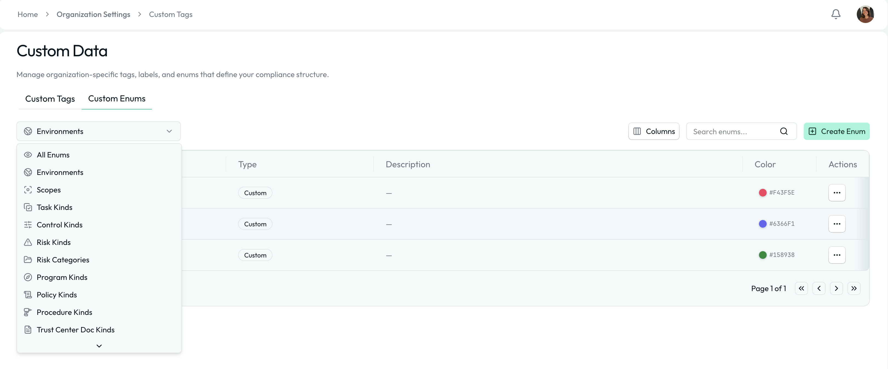
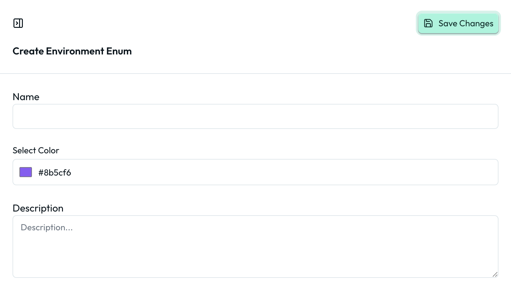

# Custom Enums

Custom Enums allow organizations to define structured dropdown values that shape how compliance data is categorized across Openlane.

Located in Organization Settings → Custom Data → Custom Enums, this feature lets you tailor key object types such as environments, scopes, control kinds, risk categories, and more — without changing your core workflows.

## What Are Custom Enums?

A Custom Enum is a predefined list of selectable values used throughout the platform to classify objects consistently.

Unlike free-form fields, enums:
- Ensure standardized categorization
- Reduce inconsistent data entry
- Enable filtering and reporting
- Maintain audit-ready structure

Each enum value can include:

- Name
- Description (optional)
- Color

## Global vs. Object-Specific Enums

Some enums are global and can be used across multiple object types (e.g., Environments), while others are specific to certain objects (e.g., Control Kinds for controls). When creating custom enums, be mindful of where they will be applied to ensure they fit the intended use case.

## System-Managed Enums

In addition to organization-created enums, some categories include System-Managed Enums. These are common, standardized values provided by Openlane to help organizations get started quickly and align with widely used terminology.

Key Characteristics

1. Provided by Openlane
1. Cannot be deleted
1. Can be used like any other enum value
1. Are not editable, but can be supplemented with custom values
1. Designed to support common compliance patterns

System-managed enums ensure consistency across organizations while still allowing flexibility through additional custom values.

For example:

- Default task kinds
- Standard risk categories
- Common document types for Trust Centers

You are free to use system-managed values, ignore them, or supplement them with your own organization-specific enums.

## How to Create a Custom Enum Value

1. Navigate to Organization Settings → Custom Data → Custom Enums
1. Select the enum category (e.g., Environments)
1. Click Create Enum and provide the following details:
   - **Name**: The name of the enum value (e.g., "Production", "High Risk", etc)
   - **Description**: Optional additional context about the value
   - **Color**: Choose a color to visually distinguish this value in dropdowns and reports
1. Click Save to create the new enum value

The new value will immediately become available in dropdowns across the platform.

## How Custom Enums Differ from Custom Tags

| Custom Tags                         | Custom Enums                        |
| ----------------------------------- | ----------------------------------- |
| Flexible, multi-select labels       | Structured dropdown categories      |
| Used for lightweight classification | Used for core object structure      |
| Free-form and optional              | Controlled, standardized values     |
| Great for filtering                 | Critical for reporting + governance |
