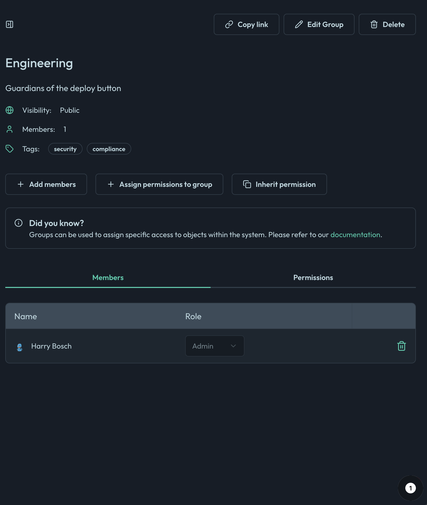
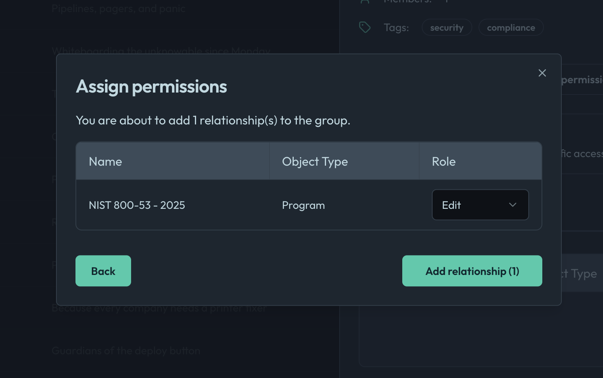
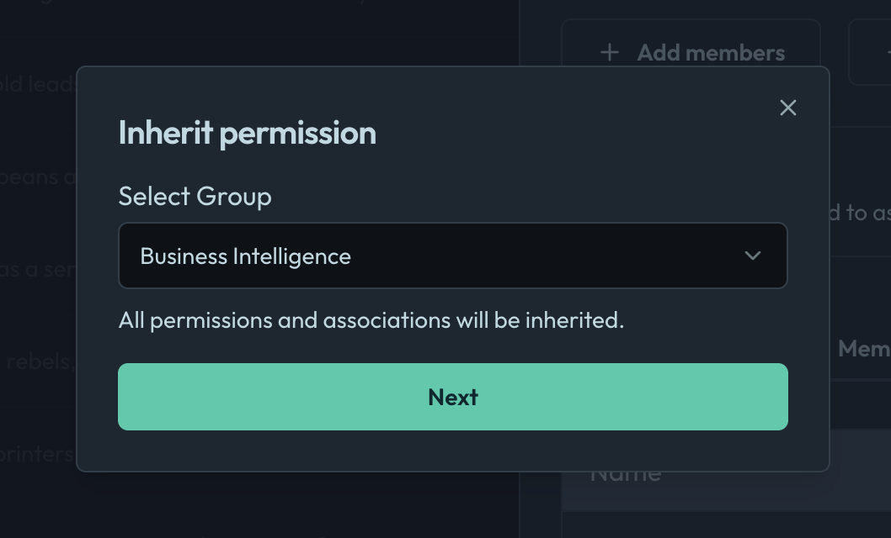
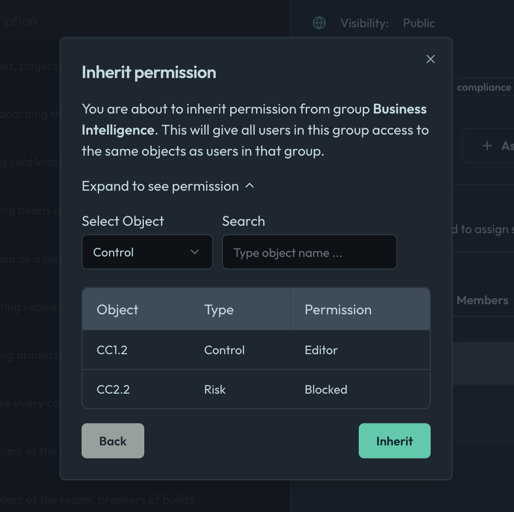

# Permissions

Groups control permissions for various objects in the system. These permissions determine what actions members of the group can perform on these objects. You can use GraphQL queries and mutations to view and/or define the relationships between various objects (e.g., programs, controls) and the permissions that can be assigned to users or groups.

## Permission Inheritance

Permission inheritance in the system allows permissions to be propagated from one object to another, typically from a parent object to its child objects. This mechanism ensures that permissions are consistently applied across related objects without the need to explicitly define them for each object.

**How Permission Inheritance Works**:
1. Defining Relationships:
    * Relationships between objects are defined in the system's underlying data model.
    * These relationships specify how permissions are inherited from one object to another.
1. Inheritance Rules:
    * Permissions can be inherited directly or through intermediary relationships.
    * For example, a user who is an editor of a group can inherit editor permissions for all programs associated with that group.

## Permission Overlap

When a user is in multiple groups with different permissions for the same object, the most permissive set of permissions typically applies. In this case, if a user is in one group that can edit a program and another group that can only view the program, the user will have the higher level of access, which is the ability to edit the program.

**Example Scenario**:
    * **Group A**: Has editor permissions for `Program1`.
    * **Group B**: Has viewer permissions for `Program1`.
    * **User1**: Is a member of both `Group A` and `Group B`.

Resulting Permissions for `User1`
    * **Program1**: `User1` will have editor permissions because the editor permission is more permissive than the viewer permission.

## Managing Group Permissions in the UI

You can manage group permissions directly through the OpenLane user interface without writing GraphQL queries. The UI provides intuitive controls for assigning and revoking permissions for groups and users.

**Steps to Manage Permissions in the UI:**

1. **Navigate to Groups:**
  Go to the "Groups" section from the main navigation menu.

2. **Select a Group:**
  Click on the group you want to manage. This opens the group's detail page.

  

3. **Manage Members:**
  - Use the "Add Members" tab to add or remove users from the group.
  - Assign roles (e.g., viewer, editor, owner) to each member as needed.

4. **Assign Permissions to Objects:**
  - In the group's detail view, locate the "Permissions" tab.
  - Select the object type (e.g., Program, Control) you want to manage.
  - Assign the desired permission level (viewer, editor, owner) for each object.

  

5. **Inherit Permissions from Another Group:**
  - In the group's detail view, you can configure the group to inherit permissions from another group.
  - Use the "Inherit Permissions" option to select the group whose permissions should be inherited.
    
  - Members of the current group will automatically receive the permissions assigned to the other group.
  

