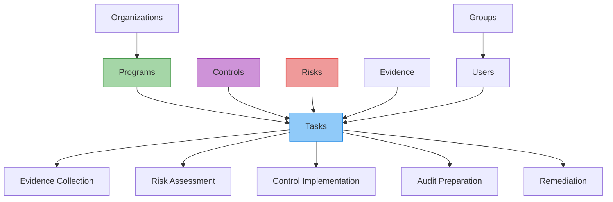

# Tasks

Tasks represent work items, assignments, and activities that need to be completed as part of compliance, risk management, and security operations within Openlane.

Tasks are just like how they sound - individual pieces of work that can be assigned to users and created either directly from the Tasks page, or from other objects within the Openlane system. A task could be assigned as a part of proposed changes to a policy or procedure, created as a part of a program, associated to objects and assigned a user, due date, and other attributes.

## What Are Tasks?

Tasks are actionable work items that enable organizations to track, assign, and manage compliance-related activities. They provide structure for breaking down complex compliance requirements into manageable, trackable work units with clear ownership and deadlines.

The overarching goal of Tasks within Openlane is to reduce or eliminate the need for the use of manual tracking or additional external systems to manage work related to managing a comprehensive security and compliance program within your business.

## Compliance Significance

Tasks are essential for:

- **Workload Management**: Breaking down compliance requirements into actionable items
- **Accountability**: Assigning clear ownership and responsibility for compliance activities
- **Progress Tracking**: Monitoring progress toward compliance objectives
- **Audit Evidence**: Documenting completion of required compliance activities
- **Resource Planning**: Planning and allocating resources for compliance work

## Task Categories

### Evidence Collection Tasks

- **Purpose**: Collect and organize evidence for compliance requirements
- **Examples**: Document upload, artifact collection, screenshot capture
- **Dependencies**: Related to specific controls or audit requirements
- **Deliverables**: Evidence artifacts, documentation, attestations

### Risk Assessment Tasks

- **Purpose**: Identify, assess, and mitigate organizational risks
- **Examples**: Risk analysis, threat modeling, vulnerability assessment
- **Dependencies**: Related to risk management processes and frameworks
- **Deliverables**: Risk assessments, mitigation plans, monitoring reports

### Control Implementation Tasks

- **Purpose**: Implement and verify security and compliance controls
- **Examples**: Policy updates, system configuration, procedure implementation
- **Dependencies**: Related to specific controls and standards
- **Deliverables**: Implemented controls, verification evidence, documentation

### Audit Preparation Tasks

- **Purpose**: Prepare for internal and external compliance audits
- **Examples**: Document preparation, process review, stakeholder coordination
- **Dependencies**: Related to audit schedules and requirements
- **Deliverables**: Audit-ready documentation, process evidence, compliance reports

### Remediation Tasks

- **Purpose**: Address identified gaps, findings, or non-compliance issues
- **Examples**: Gap remediation, finding resolution, corrective actions
- **Dependencies**: Related to audit findings or risk assessments
- **Deliverables**: Remediation evidence, corrective action plans, validation reports

## Properties

### Core Information

- **ID**: Unique identifier for the task
- **Title**: Descriptive title of the task
- **Details**: Detailed description of the work to be performed
- **Category**: Type of task (evidence collection, risk review, etc.)
- **Status**: Current status (open, in progress, completed, etc.)

### Assignment and Ownership

- **Assignee**: User assigned to complete the task
- **Assigner**: User who created or assigned the task
- **Due Date**: Deadline for task completion
- **Priority**: Task priority level (low, medium, high, critical)

### Context and Relationships

- **Parent Objects**: Associated controls, risks, policies, or programs
- **Evidence**: Linked evidence items or deliverables
- **Comments**: Notes and collaboration on the task
- **Dependencies**: Related tasks or prerequisites

### Lifecycle Tracking

- **Created At**: Task creation timestamp
- **Completed At**: Task completion timestamp
- **Updated At**: Last modification timestamp
- **History**: Audit trail of task changes and status updates
