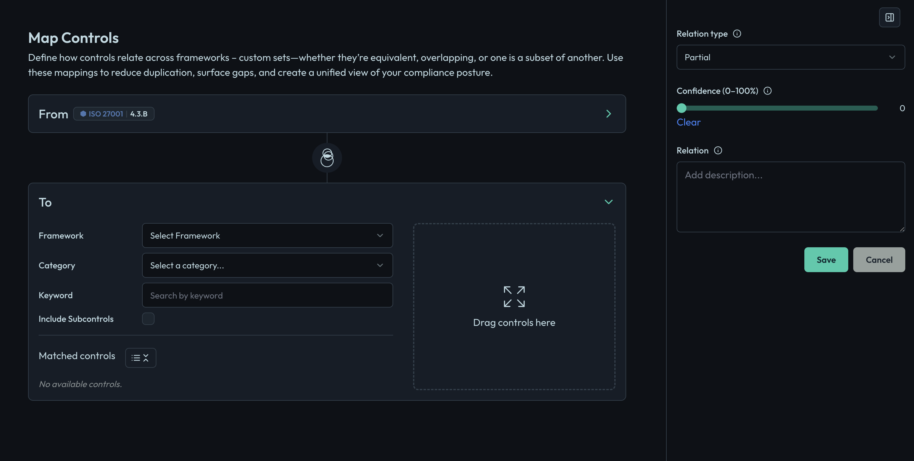

# Control Mapping

Control mapping is a crucial aspect of compliance management, allowing organizations to align controls across various frameworks and standards and eliminate duplicate work. This guide provides an overview of how to effectively map controls within the Openlane platform.

## What is Control Mapping?

Control mapping involves linking controls from one compliance framework to another, enabling organizations to demonstrate compliance with multiple standards without redundant effort. This process helps in identifying overlapping requirements and ensuring that all necessary controls are addressed.

## Benefits of Control Mapping

1. **Efficiency**: Reduces duplication of effort by reusing existing controls across frameworks.
2. **Clarity**: Provides a clear view of how different standards align, making it easier to manage compliance.
3. **Risk Management**: Helps identify gaps in controls and areas of potential risk.
4. **Streamlined Audits**: Simplifies the audit process by providing a unified view of compliance efforts.
5. **Improved Collaboration**: Facilitates communication between teams working on different compliance frameworks.

## How to Map Controls

1. **Identify Controls**: Start by identifying the controls that need to be mapped. This can include controls from different frameworks such as SOC 2, ISO 27001, NIST, etc.
2. **Access Control Mapping**: Navigate to the control mapping section in the Openlane Console
    - Go to the [Controls](https://console.theopenlane.io/controls) page.
    - Select the control you want to map
    - Go to Related Controls
3. **Create a Mapping**
        
    - Click on the "Map Control" button.
    - Select the source control (the control you are mapping from).
    - Select the target control (the control you are mapping to).
    - Provide a description of the mapping to clarify the relationship between the controls.
4. **Review and Save**: Review the mapping details and click "Save" to create the mapping.
