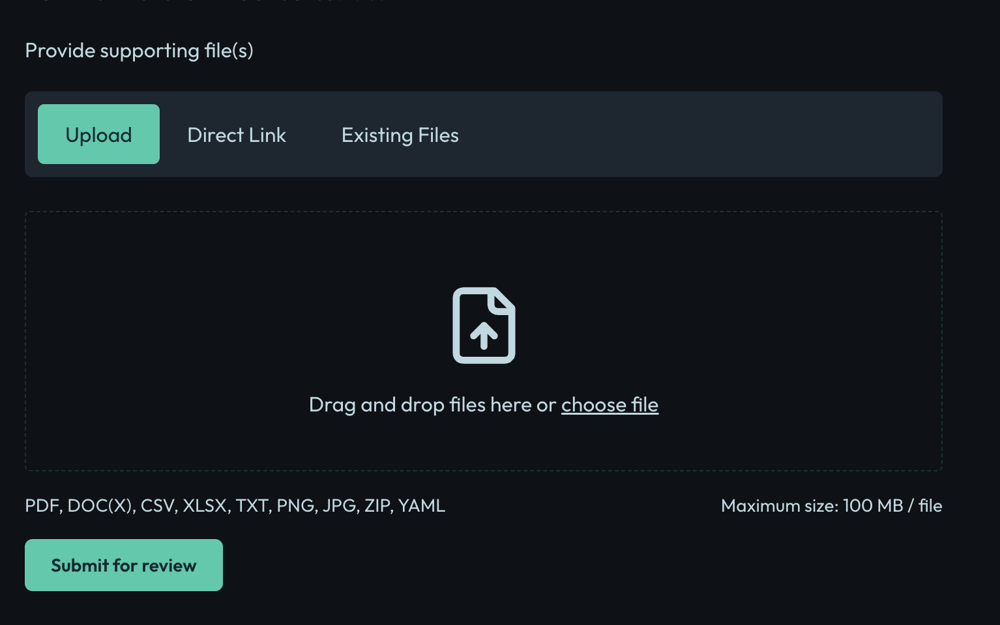

# Create Evidence

This guide explains how to create evidence in the Openlane Console for compliance management.

## Prerequisites

- Access to the Openlane Console
- Appropriate permissions to manage compliance evidence

## Steps to Create Evidence

1. **Log in** to the Openlane Console.
2. Navigate to [Evidence](https://console.theopenlane.io/evidence)
3. Click the **Submit Evidence** button.
4. Fill in the required details:
    - **Evidence Name**: A descriptive name for the evidence.
    - **Description**: Briefly describe the evidence.
    - **Collection Procedure**: Specify how the evidence was collected with a detailed description.
    - **Source**: Indicate the system or process that generated the evidence.
    - **Upload File**: Attach relevant files if needed.
    

    - **Tags**: Add tags for easier searching and categorization.
    - **Renewal Date**: Set a date for when the evidence should be reviewed or renewed.
    - **Associated Controls**: Link the evidence to relevant controls or compliance requirements.
5. Click **Submit for review** to create the evidence record.

## Tips

- Ensure all required fields are completed.
- Use clear and descriptive names for easier identification.
- Attach supporting documents to strengthen your evidence.

## Next Steps

After creating evidence, you can link it to controls or compliance requirements as needed.

For more information, see the compliance management [documentation](../../index.mdx).