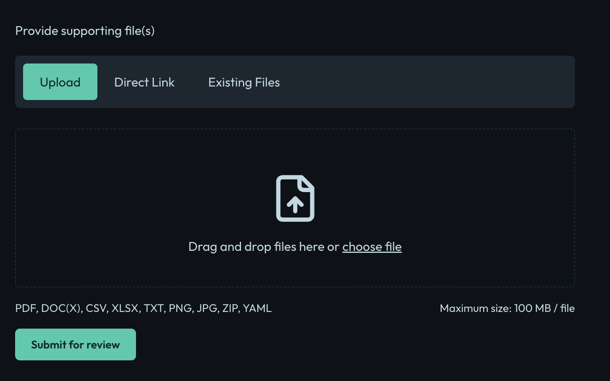

import Steps from '@site/src/components/Steps';

# Create Evidence

This guide explains how to create evidence in the Openlane Console for compliance management.

:::info Prerequisites
- Access to the Openlane Console
- Appropriate permissions to manage compliance evidence
:::

## Steps to Create Evidence

<Steps>

1. **Log in** to the Openlane Console.
2. Navigate to [Evidence](https://console.theopenlane.io/evidence)
3. Click the **Submit Evidence** button.
4. Fill in the details. Three fields do the heavy lifting for audit readiness:
    - **Collection Procedure** and **Source** are what let an auditor (or a teammate re-collecting next quarter) reproduce the evidence; write them for that reader
    - **Renewal Date** is what turns evidence from a one-time upload into a maintained artifact; most evidence goes stale, so set it
    - **Associated Controls** connect the artifact to what it proves; unlinked evidence helps nobody at audit time

    
5. Click **Submit for review** to create the evidence record.

</Steps>

## Next Steps

After creating evidence, you can link it to controls or compliance requirements as needed.

For more information, see the compliance management [documentation](../overview.mdx).