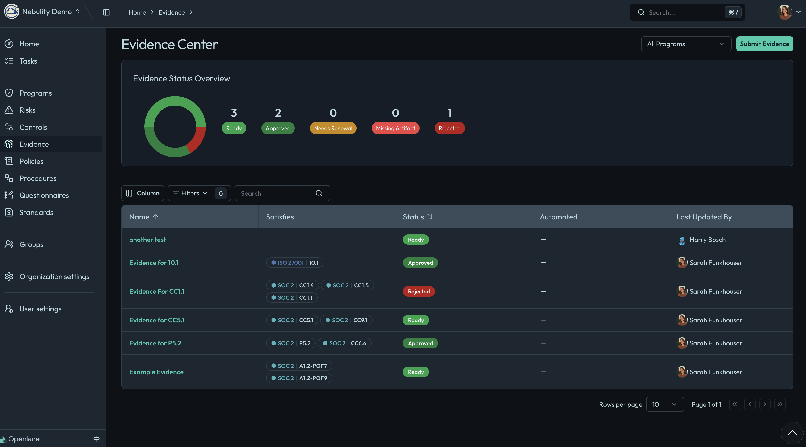

## Evidence Dashboard Overview

The dashboard provides a visual summary of all evidence items, their statuses, and collection methods. This helps compliance teams quickly assess the state of evidence collection and identify any gaps or items requiring attention.

### Evidence Statuses

Each evidence item is assigned a status, such as:

- **Ready**: Evidence has been collected and is available for review.
- **Approved**: Evidence has been reviewed and accepted.
- **Needs Renewal**: Evidence is outdated and must be updated or recollected.
- **Rejected**: Evidence did not meet requirements and needs to be replaced.

Statuses are visually indicated in the dashboard, making it easy to prioritize actions.

### Filtering and Searching

Use the search bar and filter options to:

- Locate evidence by name, status, or associated control.
- Filter by collection method (automated or manual).
- Narrow results to specific frameworks or compliance requirements.

### Automated vs. Manual Evidence

- **Automated Evidence**: Collected directly from integrated systems (e.g., cloud providers, ticketing systems) with minimal manual intervention.
- **Manual Evidence**: Uploaded or entered by users, such as policy documents or screenshots.

Both types are displayed in the dashboard, with clear indicators of their source.

### Continuous and Point-in-Time Evidence

- **Continuous Monitoring**: Evidence that is updated regularly, ensuring ongoing compliance.
- **Point-in-Time Evidence**: Captured at a specific date, useful for audits or periodic reviews.

The dashboard allows users to distinguish between these types and manage them accordingly.

## Managing Evidence

From the dashboard, users can:

- Add new evidence items.
- Update or renew existing evidence.
- Assign evidence to specific controls or requirements.
- Export evidence reports for audits.

For more details on creating evidence, see the [Creating Evidence](../creating-evidence) section.