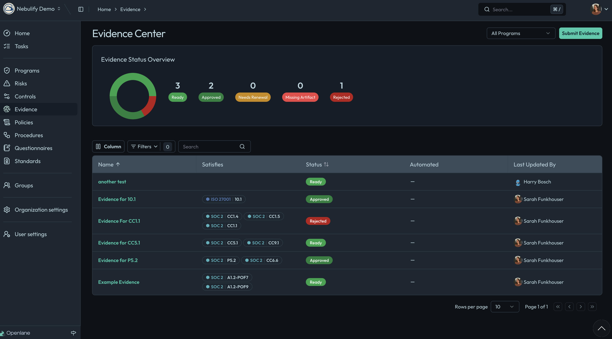

# Evidence Dashboard

The dashboard gives you a visual summary of all evidence items, their statuses, and collection methods, so your team can quickly assess the state of evidence collection and identify any gaps or items requiring attention.

## Evidence Statuses

Each evidence item is assigned a status, visually indicated in the dashboard so you can prioritize actions; see the [status table in the evidence overview](./overview.mdx#evidence-status) for what each status means and what moves it forward.

## Filtering and Searching

Use the search bar and filter options to:

- Locate evidence by name, status, or associated control.
- Filter by collection method (automated or manual).
- Narrow results to specific frameworks or compliance requirements.

## Automated vs. Manual Evidence

- **Automated Evidence**: Collected directly from integrated systems (e.g., cloud providers, ticketing systems) with minimal manual intervention.
- **Manual Evidence**: Uploaded or entered by users, such as policy documents or screenshots.

Both types are displayed in the dashboard, with clear indicators of their source.

## Continuous and Point-in-Time Evidence

- **Continuous Monitoring**: Evidence that is updated regularly, ensuring ongoing compliance.
- **Point-in-Time Evidence**: Captured at a specific date, useful for audits or periodic reviews.

The dashboard lets you distinguish between these types and manage them accordingly.

## Managing Evidence

From the dashboard, you can:

- Add new evidence items.
- Update or renew existing evidence.
- Assign evidence to specific controls or requirements.
- Export evidence reports for audits.

For more details on creating evidence, see the [Creating Evidence](create.mdx) section.