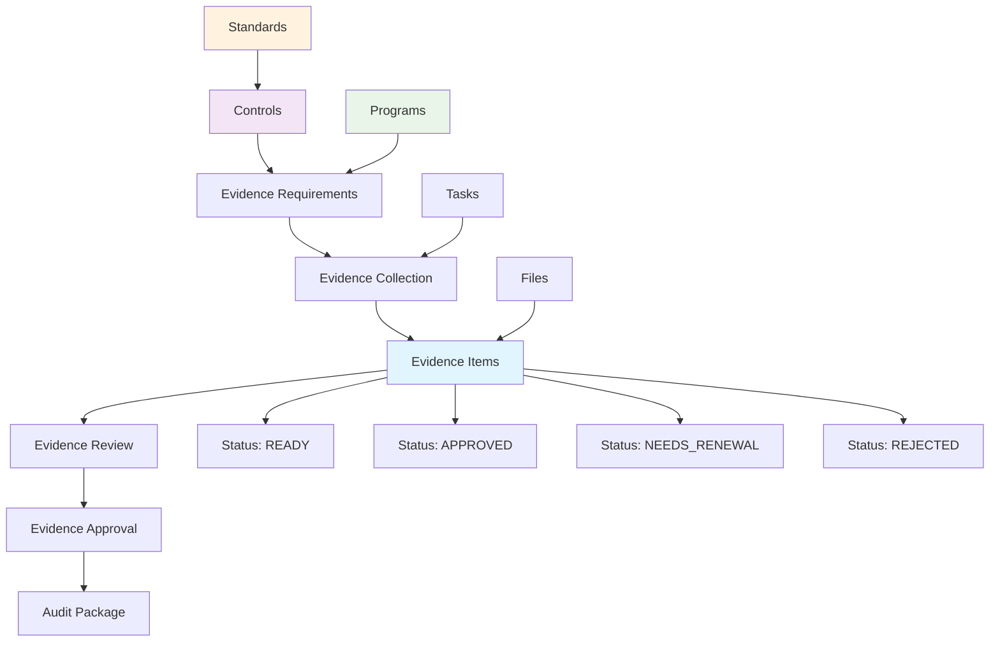
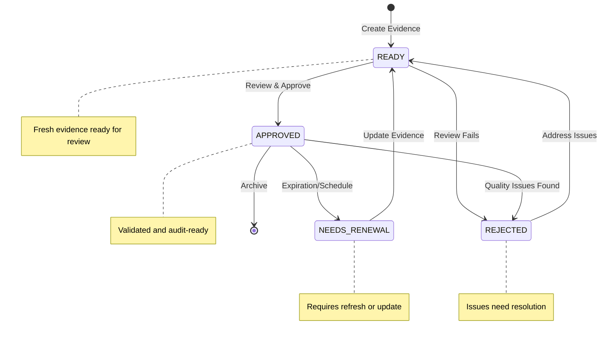

# Evidence

Evidence management is a critical component of compliance programs, providing the documentation and artifacts needed to demonstrate compliance with standards and regulations. Openlane's evidence system centralizes the collection, organization, and management of audit evidence.



## What is Evidence?

Evidence in Openlane represents any artifact, document, record, or data that demonstrates compliance with controls, standards, or regulatory requirements. Evidence serves as proof that controls are properly implemented, operating effectively, and achieving their intended objectives.

## Compliance Relevance

Evidence is essential for compliance because it:

- **Demonstrates Compliance**: Provides concrete proof that controls are implemented and operating
- **Supports Audits**: Gives auditors the documentation they need to assess compliance
- **Enables Certification**: Provides the foundation for compliance certifications and attestations
- **Reduces Risk**: Documents proper implementation reducing compliance risk
- **Facilitates Reviews**: Enables ongoing compliance monitoring and assessment
- **Supports Remediation**: Helps identify control gaps and improvement opportunities

## Evidence Types

### By Collection Method
- **Automated**: Evidence collected automatically from systems and tools
- **Manual**: Evidence collected through manual processes and procedures
- **Continuous**: Evidence collected on an ongoing basis
- **Point-in-Time**: Evidence collected at specific moments

### By Evidence Nature
- **Policies**: Written policies and procedures
- **Configurations**: System and application configurations
- **Logs**: Security, access, and audit logs
- **Reports**: Monitoring, scanning, and assessment reports
- **Screenshots**: Visual evidence of system states and configurations
- **Certificates**: Security certificates and attestations
- **Training Records**: Employee training and awareness documentation

### By Control Type
- **Preventive Evidence**: Demonstrates controls prevent issues
- **Detective Evidence**: Shows controls detect problems
- **Corrective Evidence**: Proves controls address identified issues
- **Administrative Evidence**: Documents governance and oversight

## Evidence Properties

### Core Information
- **Name**: Descriptive name for the evidence
- **Description**: Detailed description of what the evidence demonstrates
- **Collection Procedure**: How the evidence was collected
- **Source**: System or process that generated the evidence
- **URL**: External link to evidence location (if applicable)

### Lifecycle Management
- **Creation Date**: When the evidence was originally created
- **Renewal Date**: When the evidence should be renewed or updated
- **Status**: Current evidence status
  - `READY` - Evidence is current and ready for use
  - `APPROVED` - Evidence has been reviewed and approved
  - `NEEDS_RENEWAL` - Evidence needs to be updated or renewed
  - `REJECTED` - Evidence has been rejected and needs revision



### Automation
- **Is Automated**: Indicates if evidence is automatically collected
- **Renewal Frequency**: How often automated evidence is refreshed
- **Collection Schedule**: When automated collection occurs

### Relationships
- **Controls**: Controls that this evidence supports
- **Control Objectives**: Specific objectives this evidence addresses
- **Programs**: Compliance programs using this evidence
- **Tasks**: Tasks related to evidence collection or review


### Choosing the Right Evidence Type

#### For Preventive Controls
**Control Example:** "Multi-factor authentication required for admin access"

**Best Evidence Types:**
- **Configuration screenshots** showing MFA enabled
- **Policy documents** requiring MFA
- **User provisioning procedures** that include MFA setup
- **System reports** showing MFA enrollment rates

**Why these work:** Preventive controls need evidence that the preventive measure is in place and configured correctly.

#### For Detective Controls
**Control Example:** "Monitor and review access logs for suspicious activity"

**Best Evidence Types:**
- **Log analysis reports** showing review activities
- **Alert configurations** for suspicious patterns
- **Investigation reports** for flagged activities
- **Monitoring dashboards** with access patterns

**Why these work:** Detective controls need evidence that monitoring is happening and abnormal activities are detected.

#### For Corrective Controls
**Control Example:** "Incident response procedures for security breaches"

**Best Evidence Types:**
- **Incident response playbooks** and procedures
- **Incident tickets** showing response process
- **Post-incident reports** with lessons learned
- **Response time metrics** and improvement plans

**Why these work:** Corrective controls need evidence that problems are identified and resolved effectively.

### Evidence Collection Methods by Risk Level

#### High-Risk Controls (Critical/High Impact)
**Collection frequency:** Monthly or quarterly
**Evidence depth:** Comprehensive, multiple evidence types
**Automation level:** Highly automated with manual validation

**Example - Database Access Control:**
```
Automated Evidence:
- Monthly database access reports
- Quarterly privilege escalation logs
- Real-time failed login alerts

Manual Evidence:
- Quarterly access review sign-offs
- Annual database admin training records
- Semi-annual penetration test results
```

#### Medium-Risk Controls (Medium Impact)
**Collection frequency:** Quarterly or semi-annually
**Evidence depth:** Focused on key indicators
**Automation level:** Mostly automated with periodic manual review

**Example - Email Security:**
```
Automated Evidence:
- Quarterly spam/phishing block reports
- Monthly email encryption usage stats

Manual Evidence:
- Semi-annual email policy acknowledgments
- Annual phishing simulation results
```

#### Lower-Risk Controls (Low Impact)
**Collection frequency:** Annually
**Evidence depth:** Basic demonstration of implementation
**Automation level:** Primarily automated

**Example - Physical Security:**
```
Automated Evidence:
- Annual badge access reports
- Quarterly visitor log summaries

Manual Evidence:
- Annual physical security policy review
- Annual emergency procedure testing
```

### Evidence Quality Framework

| Quality Attribute | Requirements | Red Flags |
|------------------|--------------|----------|
| **Authenticity** | Authoritative sources, timestamps, metadata, source identification | User screenshots, undated files, missing attribution |
| **Completeness** | Full control scope, success/failure cases, trending data | Sample data only, missing timeframes, partial coverage |
| **Relevance** | Direct control demonstration, audit period coverage, current state | Outdated evidence, indirect correlation, wrong timeframe |
| **Reliability** | Independent verification, controlled access, audit trails | Manual manipulation possible, inconsistent methods, no validation |

#### Evidence Red Flags

**❌ Poor Evidence Examples:**
- User-provided screenshots (can be manipulated)
- Undated documents or reports
- Sample data that's not representative
- Evidence from development/test environments
- Reports with no source attribution

**✅ Good Evidence Examples:**
- System-generated reports with metadata
- Timestamped configuration exports
- Comprehensive audit logs
- Production system evidence
- Reports with clear source identification
