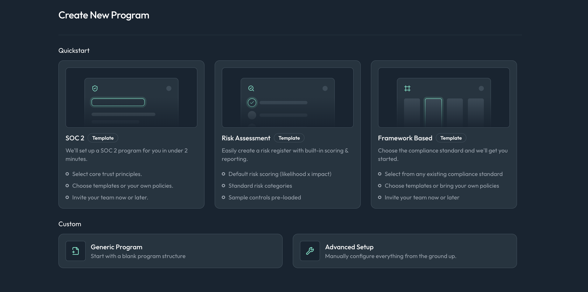

# Program Wizard

We've created a wizard to walk you through the steps of creating a program to fit your compliance needs. To help with programs of a variety of different frameworks and sizes, there are five different paths you can take when creating a program:

1. **SOC 2**: Create a program based on the SOC 2 framework based on system defaults to get you started quickly.
1. **Risk Assessment**: Create a custom program focused on risk assessments, allowing you to define your own risks and score them based on likelihood and impact.
1. **Framework Based**: Create a program based on a specific compliance framework, such as ISO 27001 or HIPAA, with pre-defined controls and requirements.
1. **Generic Program**: Create a blank program where you can define your own structure, controls, and requirements from scratch.
1. **Advanced**: Create a program with advanced options, allowing for more customization and configuration of the program settings.

## Creating a Program

To create a new program, follow these steps:

1. From any page within the Openlane console, click the `+` button in the top left of the side navigation bar.
1. Select `Create Program` from the dropdown menu.
1. Choose one of the five program creation paths listed above.
1. Follow the prompts in the wizard to configure your program settings, based on the path you selected.
1. Once you've completed the wizard, click `Create` to finalize the creation of your program.

:::info
Programs based on specific frameworks (e.g., SOC 2, ISO 27001) will come pre-populated with relevant controls and requirements to help you get started quickly. For a SOC 2 program, you will additionally have the option during creation to only include specific domains (e.g., Security, Availability) if you do not wish to include all Trust Service Criteria.

Controls can always be added or removed after program creation to better fit your organization's needs using the program settings or from the [standards catalog](https://console.theopenlane.io/standards).
:::

After program creation, you can change any of the fields you set during the creation via the main programs page or the program settings page.

