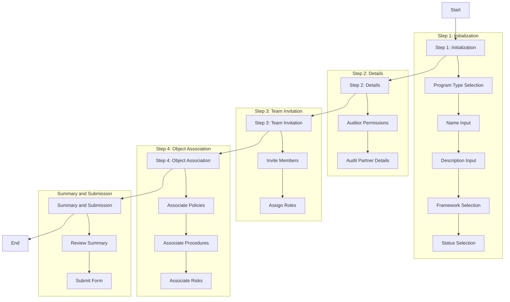

# Programs

Programs are the organizational framework that coordinates compliance activities, controls, and evidence collection efforts. They provide structure for compliance initiatives, audit preparation, and ongoing compliance management across different standards and frameworks.

Within Openlane, Programs are a centerpiece for managing compliance and regulatory requirements. Think of a program as a large, high-level grouping of work; it represents a significant body of work that can be broken down into smaller, more manageable tasks. Essentially, it's a big picture initiative that can spans months or possibly a year+, and can encompass work across different teams.

## What is a Program?

A Program in Openlane represents a structured compliance initiative that organizes controls, evidence, and activities around specific objectives such as achieving certification, preparing for audits, or maintaining ongoing compliance. Programs provide the context and coordination needed to manage complex compliance efforts effectively.

In more "audit-centric" terminology, a Program is a collection of evidence, tasks, and other resources that are related to achieving the necessary prerequisites to go through a compliance or regulatory audit, or the audit itself. Programs can be used to track progress, manage resources, and collaborate with others to obtain a compliance attestation or certification, perform a risk assessment, or any other number of tasks.

## Compliance Significance

Programs are essential for compliance management because they:

- **Organize Compliance Efforts**: Provide structure for complex compliance initiatives
- **Coordinate Activities**: Align controls, evidence collection, and assessment activities
- **Track Progress**: Monitor compliance program status and readiness
- **Facilitate Audits**: Organize evidence and documentation for audit processes
- **Manage Timelines**: Coordinate compliance activities with business schedules
- **Enable Reporting**: Provide program-level visibility into compliance status

## Program Types

### By Framework
- **SOC 2 Programs**: Service Organization Control Type 2 audit programs
- **ISO 27001 Programs**: Information Security Management System certification
- **NIST Programs**: NIST Cybersecurity Framework implementation
- **Custom Programs**: Organization-specific compliance programs

### By Purpose
- **Certification Programs**: Achieve formal certification or attestation
- **Audit Programs**: Prepare for external or internal audits
- **Assessment Programs**: Conduct compliance assessments and gap analyses
- **Monitoring Programs**: Ongoing compliance monitoring and maintenance
- **Remediation Programs**: Address compliance gaps and deficiencies

### By Scope
- **Enterprise Programs**: Organization-wide compliance programs
- **Service Programs**: Service-specific compliance (e.g., cloud services)
- **Product Programs**: Product-specific compliance requirements
- **Regional Programs**: Geographic or regulatory region-specific compliance

## Program Properties

### Core Information
- **Name**: Descriptive name for the program
- **Display ID**: Human-readable program identifier
- **Description**: Detailed description of program objectives and scope

### Program Management
- **Status**: Current program status
  - `NOT_STARTED` - Program planned but not yet initiated
  - `IN_PROGRESS` - Program actively running
  - `COMPLETED` - Program successfully completed
  - `ON_HOLD` - Program temporarily suspended
  - `CANCELLED` - Program cancelled or discontinued

- **Program Type**: Classification of the program
  - `FRAMEWORK` - Based on compliance framework
  - `CUSTOM` - Custom organizational program
  - `ASSESSMENT` - Assessment-focused program
  - `CERTIFICATION` - Certification-focused program

### Framework Association
- **Framework Name**: Associated compliance standard or framework
- **Framework Version**: Version of the framework being implemented

### Timeline Management
- **Start Date**: Program initiation date
- **End Date**: Program completion target date
- **Audit Period**: Specific audit period covered by the program

### Audit Information
- **Auditor Ready**: Indicates if program is ready for audit
- **Audit Firm**: External audit firm conducting assessment
- **Auditor**: Specific auditor or audit team
- **Audit Date**: Scheduled audit date

### Relationships
- **Controls**: Controls included in the program scope
- **Evidence**: Evidence collected for the program
- **Risks**: Risks managed within the program
- **Tasks**: Tasks and activities for program execution
- **Users**: Team members and stakeholders involved

### Reference Diagram

## Program Management Best Practices

### Program Planning
1. **Clear Objectives**: Define specific, measurable program objectives
2. **Scope Definition**: Clearly define program scope and boundaries
3. **Timeline Planning**: Set realistic timelines with appropriate buffers
4. **Resource Allocation**: Ensure adequate resources for program success

### Team Management
1. **Role Definition**: Clearly define roles and responsibilities
2. **Communication Plan**: Establish regular communication cadences
3. **Progress Tracking**: Monitor program progress against milestones
4. **Issue Management**: Track and resolve program issues promptly

### Evidence Management
1. **Collection Strategy**: Plan evidence collection activities
2. **Quality Standards**: Ensure evidence meets audit requirements
3. **Organization**: Organize evidence for easy auditor access
4. **Version Control**: Maintain evidence version control and updates

### Risk Management
1. **Risk Assessment**: Identify program-specific risks
2. **Mitigation Planning**: Develop risk mitigation strategies
3. **Contingency Planning**: Prepare for potential issues
4. **Regular Reviews**: Conduct regular program risk reviews

## Integration Points

### With Standards
- Programs implement specific compliance standards and frameworks
- Program scope determines which standard requirements apply
- Standards provide the control framework for program activities

### With Controls
- Programs organize and coordinate control implementation
- Control readiness impacts program audit readiness
- Program timelines drive control implementation schedules

### With Evidence
- Programs coordinate evidence collection across controls
- Evidence organization supports program audit preparation
- Program requirements determine evidence collection strategies

### With Tasks
- Program activities are managed through task assignments
- Task completion impacts program progress and readiness
- Program milestones drive task priorities and deadlines

### With Risks
- Programs manage risks related to compliance objectives
- Program risk assessments inform control priorities
- Risk mitigation activities are coordinated within programs

For detailed information about implementing specific types of programs, see the framework-specific documentation in the [Standards section](../../standards/overview.mdx).
