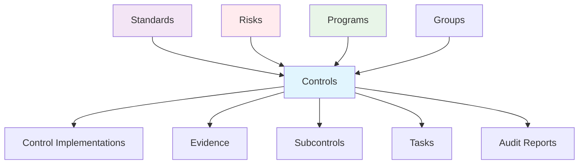
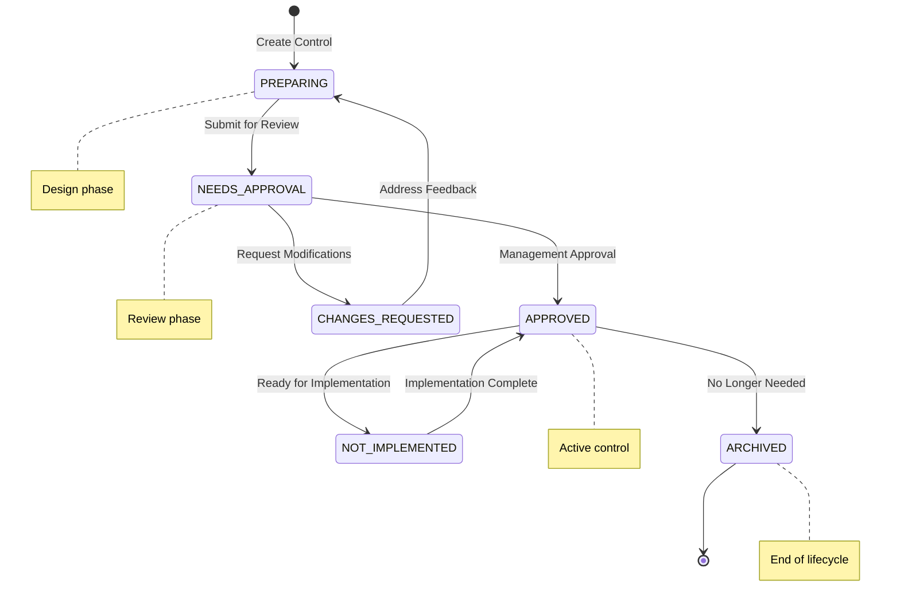
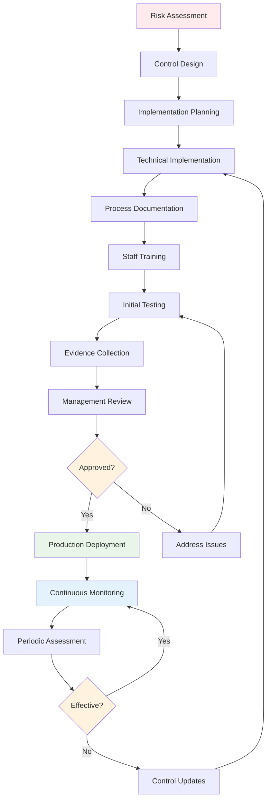

# Controls

Controls are the core building blocks of compliance management in Openlane. They represent specific security, privacy, or operational requirements that organizations must implement to meet compliance standards and manage risks effectively.



## What is a Control?

A Control in Openlane represents a specific compliance requirement, security safeguard, or operational procedure that an organization implements to achieve compliance with standards and manage risks. Controls define what needs to be done, how it should be implemented, and how it will be tested or verified.

## Compliance Significance

| Aspect | Purpose | Benefit |
|--------|---------|----------|
| **Requirements Implementation** | Translate standards into actionable controls | Converts abstract compliance into specific, testable requirements |
| **Evidence Foundation** | Enable systematic evidence collection | Provides clear audit trail and compliance demonstration |
| **Risk Management** | Address specific threats through controls | Reduces organizational risk through preventive/detective measures |
| **Assessment Framework** | Enable systematic compliance evaluation | Allows measurement and improvement of compliance posture |
| **Certification Support** | Provide foundation for formal certifications | Enables SOC 2, ISO 27001, and other compliance certifications |

## Control Classifications

### By Function
| Type | Purpose | Example |
|------|---------|----------|
| **Preventive** | Prevent incidents before they occur | Multi-factor authentication, firewalls |
| **Detective** | Identify incidents when they happen | Log monitoring, intrusion detection |
| **Corrective** | Fix issues after detection | Incident response, patch management |
| **Deterrent** | Discourage potential violations | Security awareness, penalty policies |

### By Implementation Method
| Type | Description | Examples |
|------|-------------|----------|
| **Administrative** | Policy and procedure-based | Security policies, training programs |
| **Technical** | Technology-implemented | Encryption, access controls, monitoring |
| **Physical** | Physical environment controls | Locks, cameras, environmental controls |

### By Source
| Type | Use Case | Examples |
|------|----------|----------|
| **Framework** | Standard compliance requirements | SOC 2 CC6.1, ISO 27001 A.9.1.1 |
| **Custom** | Organization-specific needs | Cryptocurrency controls, industry-specific |
| **Template** | Common implementation patterns | Basic access control template |
| **Imported** | External or legacy systems | Previous audit controls, vendor controls |

## Control Status Lifecycle



| Status | Meaning | Next Actions |
|--------|---------|-------------|
| `PREPARING` | Control being designed and planned | Complete implementation guidance, assign owners |
| `NEEDS_APPROVAL` | Ready for management review | Review requirements, approve or request changes |
| `CHANGES_REQUESTED` | Requires modifications before approval | Address feedback, resubmit for approval |
| `APPROVED` | Approved and ready for implementation | Begin implementation, collect evidence |
| `NOT_IMPLEMENTED` | Approved but not yet active | Complete implementation activities |
| `ARCHIVED` | No longer active or relevant | Document reason for archival |

## GraphQL Operations

### Query Controls

```graphql
# Get all controls with basic information
query GetControls {
  controls {
    edges {
      node {
        id
        displayID
        description
        category
        subcategory
        controlType
        source
        status
        standard {
          name
          shortName
        }
        controlOwner {
          name
        }
      }
    }
  }
}
```

```graphql
# Get detailed control information with relationships
query GetControlDetails($id: ID!) {
  control(id: $id) {
    id
    displayID
    referenceID
    auditorReferenceID
    description
    implementationGuidance
    assessmentObjectives
    assessmentMethods
    exampleEvidence
    category
    subcategory
    mappedCategories
    controlType
    source
    status
    createdAt
    updatedAt

    # Related entities
    standard {
      id
      name
      shortName
      framework
    }

    programs {
      edges {
        node {
          id
          name
          displayID
          status
        }
      }
    }

    subcontrols {
      edges {
        node {
          id
          displayID
          description
          status
        }
      }
    }

    controlImplementations {
      edges {
        node {
          id
          status
          implementationDate
          verified
          verificationDate
          details
        }
      }
    }

    evidence {
      edges {
        node {
          id
          name
          description
          status
          creationDate
        }
      }
    }

    controlOwner {
      id
      name
    }

    delegate {
      id
      name
    }
  }
}
```

### Search Controls

```graphql
# Search controls by description, category, or ID
query SearchControls($query: String!) {
  controlSearch(query: $query) {
    edges {
      node {
        id
        displayID
        description
        category
        controlType
        status
        standard {
          name
          shortName
        }
      }
    }
  }
}
```

### Filter Controls

```graphql
# Filter controls by status and type
query FilterControls($status: ControlControlStatus!, $type: ControlControlType!) {
  controls(where: {
    status: { eq: $status }
    controlType: { eq: $type }
  }) {
    edges {
      node {
        id
        displayID
        description
        category
        status
        controlType
      }
    }
  }
}
```

### Create Control

```graphql
mutation CreateControl($input: CreateControlInput!) {
  createControl(input: $input) {
    control {
      id
      displayID
      description
      category
      controlType
      source
      status
    }
  }
}
```

**Input Example:**
```json
{
  "input": {
    "displayID": "AC-001",
    "description": "Access Control Policy - The organization implements access control policies and procedures",
    "implementationGuidance": "Develop and maintain formal access control policies that define roles, responsibilities, and procedures for granting, modifying, and revoking access to systems and data",
    "assessmentObjectives": "Verify that access control policies are documented, approved, and implemented across the organization",
    "assessmentMethods": "Interview personnel, review policies, examine access control procedures",
    "exampleEvidence": "Access control policy document, procedure documentation, approval records",
    "category": "ACCESS_CONTROL",
    "subcategory": "POLICY_AND_PROCEDURES",
    "controlType": "PREVENTATIVE",
    "source": "USER_DEFINED",
    "status": "PREPARING",
    "standardID": "standard-uuid-here",
    "controlOwnerID": "group-uuid-here"
  }
}
```

### Update Control

```graphql
mutation UpdateControl($id: ID!, $input: UpdateControlInput!) {
  updateControl(id: $id, input: $input) {
    control {
      id
      displayID
      description
      status
      updatedAt
    }
  }
}
```

### Bulk Create Controls

```graphql
mutation BulkCreateControls($input: [CreateControlInput!]!) {
  createBulkControl(input: $input) {
    controls {
      id
      displayID
      description
      status
    }
  }
}
```

## API Access

Controls are managed exclusively through GraphQL operations. There are no REST endpoints for control CRUD operations.

## Common Workflows

### 1. Bulk Import Framework Controls

**Use Case:** Onboarding a new compliance framework (SOC 2, ISO 27001) by importing all standard controls

```go
package main

import (
	"context"
	"fmt"
	"log"

	"github.com/theopenlane/core/pkg/openlaneclient"
	"github.com/theopenlane/core/pkg/enums"
)

// ComplianceAutomation handles bulk control imports for new frameworks
type ComplianceAutomation struct {
	client openlaneclient.OpenlaneGraphClient
}

// ImportSOC2Controls imports all SOC 2 controls for a given standard
func (ca *ComplianceAutomation) ImportSOC2Controls(ctx context.Context, standardID string) error {
	// Define SOC 2 control set
	soc2Controls := []*openlaneclient.CreateControlInput{
		{
			DisplayID: "CC6.1",
			Description: "The entity implements logical access security software, infrastructure, and architectures over protected information assets to protect them from security events",
			Category: "COMMON_CRITERIA",
			Subcategory: openlaneclient.StringPtr("LOGICAL_ACCESS"),
			ControlType: enums.ControlTypePreventative,
			Source: enums.ControlSourceFramework,
			Status: enums.ControlStatusApproved,
			StandardIDs: []string{standardID},
			ImplementationGuidance: openlaneclient.StringPtr("Implement and maintain logical access controls including authentication, authorization, and access monitoring"),
			AssessmentObjectives: openlaneclient.StringPtr("Verify that logical access controls are designed and operating effectively"),
			AssessmentMethods: openlaneclient.StringPtr("Inspect access control configurations, test access controls, review access logs"),
			ExampleEvidence: openlaneclient.StringPtr("Access control matrix, user access reports, authentication logs, system configurations"),
		},
		{
			DisplayID: "CC6.2",
			Description: "Prior to issuing system credentials and granting system access, the entity registers and authorizes new internal and external users",
			Category: "COMMON_CRITERIA",
			Subcategory: openlaneclient.StringPtr("USER_ACCESS"),
			ControlType: enums.ControlTypePreventative,
			Source: enums.ControlSourceFramework,
			Status: enums.ControlStatusApproved,
			StandardIDs: []string{standardID},
			ImplementationGuidance: openlaneclient.StringPtr("Establish user registration and authorization procedures for new users"),
			AssessmentObjectives: openlaneclient.StringPtr("Verify that new user access is properly authorized before granting"),
			AssessmentMethods: openlaneclient.StringPtr("Review user provisioning procedures, test new user workflows, examine authorization records"),
			ExampleEvidence: openlaneclient.StringPtr("User access request forms, approval workflows, new user checklists"),
		},
		// Add remaining SOC 2 controls...
	}

	// Bulk create controls
	resp, err := ca.client.CreateBulkControl(ctx, soc2Controls)
	if err != nil {
		return fmt.Errorf("failed to import SOC 2 controls: %w", err)
	}

	fmt.Printf("Successfully imported %d SOC 2 controls\n", len(resp.CreateBulkControl.Controls))
	return nil
}

// Usage in a job or CLI tool
func main() {
	config := openlaneclient.NewDefaultConfig()
	client, err := openlaneclient.New(config)
	if err != nil {
		log.Fatal(err)
	}

	automation := &ComplianceAutomation{client: client}
	if err := automation.ImportSOC2Controls(context.Background(), "standard-uuid-123"); err != nil {
		log.Fatal(err)
	}
}
```

### 2. Custom Control Creation for Business Requirements

**Use Case:** Creating organization-specific controls for unique business risks or regulatory requirements

```go
package compliance

import (
	"context"
	"fmt"
	"time"

	"github.com/theopenlane/core/pkg/openlaneclient"
	"github.com/theopenlane/core/pkg/enums"
)

// RiskBasedControlCreator creates custom controls based on risk assessments
type RiskBasedControlCreator struct {
	client openlaneclient.OpenlaneGraphClient
}

// CreateVendorSecurityControl creates a custom control for vendor management
func (rcc *RiskBasedControlCreator) CreateVendorSecurityControl(ctx context.Context, ownerGroupID string) (*openlaneclient.CreateControl, error) {
	input := openlaneclient.CreateControlInput{
		DisplayID: "VENDOR-SEC-001",
		Description: "Third-party vendor security assessment and ongoing monitoring",
		ImplementationGuidance: openlaneclient.StringPtr(`
			1. Conduct security assessments for all vendors handling sensitive data
			2. Require vendors to complete security questionnaires annually
			3. Perform risk-based vendor security reviews
			4. Monitor vendor security incidents and breaches
			5. Maintain vendor security documentation repository
		`),
		AssessmentObjectives: openlaneclient.StringPtr("Verify that third-party vendors meet organizational security requirements and maintain adequate security posture"),
		AssessmentMethods: openlaneclient.StringPtr("Review vendor security assessments, examine contracts, validate security controls, test vendor access controls"),
		ExampleEvidence: openlaneclient.StringPtr("Vendor security questionnaires, penetration test reports, security certifications, vendor contracts with security clauses"),
		Category: "VENDOR_MANAGEMENT",
		Subcategory: openlaneclient.StringPtr("SECURITY_ASSESSMENT"),
		ControlType: enums.ControlTypeDetective,
		Source: enums.ControlSourceUserDefined,
		Status: enums.ControlStatusPreparing,
		ControlOwnerIDs: []string{ownerGroupID},
		Tags: []string{"vendor-management", "third-party-risk", "custom"},
	}

	resp, err := rcc.client.CreateControl(ctx, input)
	if err != nil {
		return nil, fmt.Errorf("failed to create vendor security control: %w", err)
	}

	log.Printf("Created custom control %s with ID: %s", resp.CreateControl.Control.DisplayID, resp.CreateControl.Control.ID)
	return resp, nil
}

// CreateCryptocurrencyControl creates controls for cryptocurrency handling
func (rcc *RiskBasedControlCreator) CreateCryptocurrencyControl(ctx context.Context) error {
	// Example: Custom control for organizations dealing with cryptocurrency
	input := openlaneclient.CreateControlInput{
		DisplayID: "CRYPTO-001",
		Description: "Cryptocurrency wallet security and transaction monitoring",
		ImplementationGuidance: openlaneclient.StringPtr(`
			1. Implement multi-signature wallets for all cryptocurrency holdings
			2. Use hardware security modules (HSMs) for private key storage
			3. Monitor all cryptocurrency transactions for suspicious activity
			4. Implement daily reconciliation of cryptocurrency balances
			5. Maintain offline backup of wallet recovery phrases
		`),
		AssessmentObjectives: openlaneclient.StringPtr("Verify that cryptocurrency assets are securely stored and transactions are properly monitored"),
		AssessmentMethods: openlaneclient.StringPtr("Review wallet configurations, test multi-signature requirements, examine transaction logs"),
		ExampleEvidence: openlaneclient.StringPtr("Wallet configuration screenshots, HSM certificates, transaction monitoring reports, balance reconciliation reports"),
		Category: "FINANCIAL_CONTROLS",
		Subcategory: openlaneclient.StringPtr("CRYPTOCURRENCY"),
		ControlType: enums.ControlTypePreventative,
		Source: enums.ControlSourceUserDefined,
		Status: enums.ControlStatusPreparing,
		Tags: []string{"cryptocurrency", "financial-controls", "high-risk"},
	}

	_, err := rcc.client.CreateControl(ctx, input)
	return err
}
```

### 3. Automated Control Lifecycle Management

**Use Case:** Job framework for automatically progressing controls through implementation phases

```go
package jobs

import (
	"context"
	"fmt"
	"time"

	"github.com/theopenlane/core/pkg/openlaneclient"
	"github.com/theopenlane/core/pkg/enums"
)

// ControlLifecycleManager manages control status progression
type ControlLifecycleManager struct {
	client openlaneclient.OpenlaneGraphClient
}

// ProgressControlToApproved moves controls from NEEDS_APPROVAL to APPROVED after validation
func (clm *ControlLifecycleManager) ProgressControlToApproved(ctx context.Context, controlID string, approverID string) error {
	// First, get current control status
	control, err := clm.client.GetControlByID(ctx, controlID)
	if err != nil {
		return fmt.Errorf("failed to get control: %w", err)
	}

	// Validate current status allows progression
	if control.Control.Status != enums.ControlStatusNeedsApproval {
		return fmt.Errorf("control %s is in status %s, cannot approve", controlID, control.Control.Status)
	}

	// Check if all required evidence is present
	if err := clm.validateControlEvidence(ctx, controlID); err != nil {
		return fmt.Errorf("control evidence validation failed: %w", err)
	}

	// Update control status to approved
	updateInput := openlaneclient.UpdateControlInput{
		Status: &enums.ControlStatusApproved,
		UpdatedBy: &approverID,
		// Add approval timestamp to tags or metadata
		Tags: append(control.Control.Tags, fmt.Sprintf("approved:%s", time.Now().Format(time.RFC3339))),
	}

	resp, err := clm.client.UpdateControl(ctx, controlID, updateInput)
	if err != nil {
		return fmt.Errorf("failed to approve control: %w", err)
	}

	log.Printf("Control %s approved by %s at %s",
		resp.UpdateControl.Control.DisplayID,
		approverID,
		resp.UpdateControl.Control.UpdatedAt)

	return nil
}

// BulkUpdateControlStatuses updates multiple controls based on criteria
func (clm *ControlLifecycleManager) BulkUpdateControlStatuses(ctx context.Context) error {
	// Get all controls in PREPARING status that are ready for approval
	controls, err := clm.client.GetControls(ctx, nil, nil, nil, nil, &openlaneclient.ControlWhereInput{
		Status: &enums.ControlStatusPreparing,
	}, nil)
	if err != nil {
		return fmt.Errorf("failed to get controls: %w", err)
	}

	for _, edge := range controls.Controls.Edges {
		control := edge.Node

		// Check if control has been in PREPARING status for more than 30 days
		if time.Since(control.CreatedAt) > 30*24*time.Hour {
			// Auto-progress to NEEDS_APPROVAL if implementation guidance exists
			if control.ImplementationGuidance != nil && *control.ImplementationGuidance != "" {
				updateInput := openlaneclient.UpdateControlInput{
					Status: &enums.ControlStatusNeedsApproval,
					Tags: append(control.Tags, "auto-progressed"),
				}

				_, err := clm.client.UpdateControl(ctx, control.ID, updateInput)
				if err != nil {
					log.Printf("Failed to auto-progress control %s: %v", control.DisplayID, err)
					continue
				}

				log.Printf("Auto-progressed control %s to NEEDS_APPROVAL", control.DisplayID)
			}
		}
	}

	return nil
}

// validateControlEvidence checks if control has sufficient evidence
func (clm *ControlLifecycleManager) validateControlEvidence(ctx context.Context, controlID string) error {
	// In a real implementation, you'd query for evidence associated with this control
	// For now, we'll do a simple check
	control, err := clm.client.GetControlByID(ctx, controlID)
	if err != nil {
		return err
	}

	// Check if control has implementation guidance (minimum requirement)
	if control.Control.ImplementationGuidance == nil || *control.Control.ImplementationGuidance == "" {
		return fmt.Errorf("control missing implementation guidance")
	}

	// Check if control has assessment objectives
	if control.Control.AssessmentObjectives == nil || *control.Control.AssessmentObjectives == "" {
		return fmt.Errorf("control missing assessment objectives")
	}

	return nil
}
```

### 4. Control Discovery and Analysis

**Use Case:** Backend service for compliance reporting and gap analysis

```go
package reporting

import (
	"context"
	"fmt"
	"strings"

	"github.com/theopenlane/core/pkg/openlaneclient"
	"github.com/theopenlane/core/pkg/enums"
)

// ComplianceReporter generates reports and performs gap analysis
type ComplianceReporter struct {
	client openlaneclient.OpenlaneGraphClient
}

// ControlAnalysis represents analysis results for a set of controls
type ControlAnalysis struct {
	TotalControls     int
	ByStatus         map[string]int
	ByCategory       map[string]int
	ByControlType    map[string]int
	HighRiskControls []*openlaneclient.Control
}

// AnalyzeAccessControls performs comprehensive analysis of access control implementations
func (cr *ComplianceReporter) AnalyzeAccessControls(ctx context.Context) (*ControlAnalysis, error) {
	// Find all access control related controls
	accessCategories := []string{"ACCESS_CONTROL", "LOGICAL_ACCESS", "PHYSICAL_ACCESS", "IDENTITY_MANAGEMENT"}

	var allAccessControls []*openlaneclient.Control

	for _, category := range accessCategories {
		controls, err := cr.client.GetControls(ctx, nil, nil, nil, nil, &openlaneclient.ControlWhereInput{
			Category: &category,
		}, nil)
		if err != nil {
			return nil, fmt.Errorf("failed to get controls for category %s: %w", category, err)
		}

		for _, edge := range controls.Controls.Edges {
			allAccessControls = append(allAccessControls, edge.Node)
		}
	}

	// Analyze the controls
	analysis := &ControlAnalysis{
		TotalControls: len(allAccessControls),
		ByStatus:     make(map[string]int),
		ByCategory:   make(map[string]int),
		ByControlType: make(map[string]int),
	}

	for _, control := range allAccessControls {
		// Count by status
		analysis.ByStatus[string(control.Status)]++

		// Count by category
		analysis.ByCategory[control.Category]++

		// Count by control type
		analysis.ByControlType[string(control.ControlType)]++

		// Identify high-risk controls (those not approved)
		if control.Status != enums.ControlStatusApproved {
			analysis.HighRiskControls = append(analysis.HighRiskControls, control)
		}
	}

	return analysis, nil
}

// FindControlGaps identifies missing controls by comparing against frameworks
func (cr *ComplianceReporter) FindControlGaps(ctx context.Context, frameworkName string) ([]string, error) {
	// Get all controls for a specific framework
	controls, err := cr.client.GetControls(ctx, nil, nil, nil, nil, &openlaneclient.ControlWhereInput{
		Standards: &openlaneclient.StandardWhereInput{
			Framework: &frameworkName,
		},
	}, nil)
	if err != nil {
		return nil, fmt.Errorf("failed to get controls for framework %s: %w", frameworkName, err)
	}

	// Framework-specific control requirements
	requiredControlsByFramework := map[string][]string{
		"SOC2-2017": {"CC6.1", "CC6.2", "CC6.3", "CC6.7", "CC6.8", "CC7.1", "CC7.2", "CC8.1"},
		"ISO27001-2022": {"A.5.1", "A.8.1", "A.8.2", "A.8.3", "A.9.1", "A.9.2", "A.9.3", "A.9.4"},
	}

	requiredControls, exists := requiredControlsByFramework[frameworkName]
	if !exists {
		return nil, fmt.Errorf("unknown framework: %s", frameworkName)
	}

	// Create map of existing controls
	existingControls := make(map[string]bool)
	for _, edge := range controls.Controls.Edges {
		existingControls[edge.Node.DisplayID] = true
	}

	// Find gaps
	var gaps []string
	for _, required := range requiredControls {
		if !existingControls[required] {
			gaps = append(gaps, required)
		}
	}

	return gaps, nil
}

// GenerateComplianceReport creates a comprehensive compliance status report
func (cr *ComplianceReporter) GenerateComplianceReport(ctx context.Context) (string, error) {
	// Get all controls
	allControls, err := cr.client.GetAllControls(ctx)
	if err != nil {
		return "", fmt.Errorf("failed to get all controls: %w", err)
	}

	// Analyze access controls specifically
	accessAnalysis, err := cr.AnalyzeAccessControls(ctx)
	if err != nil {
		return "", fmt.Errorf("failed to analyze access controls: %w", err)
	}

	// Build report
	var report strings.Builder
	report.WriteString("# Compliance Status Report\n\n")
	report.WriteString(fmt.Sprintf("Generated: %s\n\n", time.Now().Format(time.RFC3339)))

	report.WriteString("## Overall Statistics\n")
	report.WriteString(fmt.Sprintf("- Total Controls: %d\n", len(allControls.Controls.Edges)))
	report.WriteString(fmt.Sprintf("- Access Controls: %d\n", accessAnalysis.TotalControls))

	report.WriteString("\n## Control Status Distribution\n")
	for status, count := range accessAnalysis.ByStatus {
		report.WriteString(fmt.Sprintf("- %s: %d\n", status, count))
	}

	report.WriteString("\n## High Risk Controls (Not Approved)\n")
	for _, control := range accessAnalysis.HighRiskControls {
		report.WriteString(fmt.Sprintf("- %s: %s (Status: %s)\n",
			control.DisplayID, control.Description, control.Status))
	}

	return report.String(), nil
}
```

## Control Design and Implementation Guide

### When to Create Custom Controls

Custom controls are needed when:

1. **Framework gaps exist**: Standard frameworks don't address your specific risks
   - Example: You use a specialized technology not covered by SOC 2
   - Example: Industry-specific regulatory requirements (like GDPR Article 25 "data protection by design")

2. **Business context requires specificity**: Generic controls need tailoring
   - Example: SOC 2 CC6.1 is broad - you might create specific controls for API access, database access, and application access

3. **Risk assessment identifies unique threats**: Your threat model reveals specific risks
   - Example: If you handle cryptocurrency, you need controls for wallet security that don't exist in standard frameworks

### How to Design Effective Controls

#### 1. Start with Clear Objectives
**Bad Control Description:**
"Implement access controls"

**Good Control Description:**
"Multi-factor authentication is required for all administrative access to production systems, with authentication attempts logged and monitored for anomalies"

**Why it's better:**
- Specific technology requirement (MFA)
- Clear scope (administrative access to production)
- Measurable outcome (logged and monitored)
- Testable (can verify MFA is configured and logs exist)

#### 2. Include Implementation Guidance
For each control, specify:
- **What to implement**: Specific technologies, processes, or procedures
- **How to implement**: Step-by-step guidance or references to standards
- **Who is responsible**: Roles and responsibilities
- **When to review**: Frequency of assessment and updates

#### 3. Define Assessment Criteria
**Assessment Objectives should answer:**
- How will auditors verify this control?
- What specific evidence demonstrates compliance?
- What constitutes "effective operation"?

**Example Assessment Objective:**
"Verify that MFA is enforced for 100% of administrative accounts, failed authentication attempts are logged with timestamps and user details, and logs are reviewed monthly for suspicious patterns"

### When to Use Subcontrols

```mermaid
graph TD
    A["Main Control:<br/>Access Control Management"] --> B[User Provisioning]
    A --> C[Password Policy]
    A --> D[Privileged Access]
    A --> E[Access Reviews]
    A --> F[Account Deprovisioning]

    G["Main Control:<br/>Data Encryption"] --> H["Data at Rest<br/>(Storage Team)"]
    G --> I["Data in Transit<br/>(Network Team)"]
    G --> J["Key Management<br/>(Security Team)"]
    G --> K["Algorithm Standards<br/>(Architecture Team)"]

    L["Main Control:<br/>Incident Response"] --> M["Detection<br/>(SOC Team)"]
    L --> N["Communication<br/>(PR Team)"]
    L --> O["Legal Notification<br/>(Legal Team)"]
    L --> P["Technical Remediation<br/>(Engineering Team)"]

    style A fill:#e1f5fe
    style G fill:#e1f5fe
    style L fill:#e1f5fe
    style H fill:#f3e5f5
    style I fill:#f3e5f5
    style M fill:#e8f5e8
    style N fill:#e8f5e8
```



Subcontrols break down complex controls into specific, testable components. Use subcontrols when:

#### 1. Control Scope is Too Broad
Break down broad controls into manageable, testable components

#### 2. Different Implementation Methods
Separate controls that require different technical approaches

#### 3. Multiple Responsible Parties
Distribute ownership across teams while maintaining unified control objective

### How to Know if Controls are Meeting Criteria

#### 1. Design Effectiveness
**Questions to ask:**
- Does the control directly address the identified risk?
- Are the control activities sufficient to prevent/detect/correct the risk scenario?
- Are responsibilities clearly assigned and understood?

**Red flags:**
- Control description is vague or unmeasurable
- No clear linkage between control activities and risk mitigation
- Responsibilities are unclear or unassigned

#### 2. Operating Effectiveness
**Evidence to collect:**
- **Preventive controls**: Configuration screenshots, policy acknowledgments, system settings
- **Detective controls**: Log analysis, monitoring reports, exception reports
- **Corrective controls**: Incident reports, remediation documentation, follow-up testing

**Testing frequency:**
- **High-risk controls**: Monthly or quarterly
- **Medium-risk controls**: Semi-annually
- **Low-risk controls**: Annually

#### 3. Common Control Failures

**Design failures:**
- Control doesn't address the actual risk
- Control relies on manual processes that are error-prone
- Control has no monitoring or enforcement mechanism

**Operating failures:**
- Control procedures aren't followed consistently
- Personnel aren't trained on control requirements
- Control monitoring isn't happening or isn't effective
- Exceptions aren't properly documented or approved

### Control Implementation Flow



#### Implementation Timeline

| Phase | Duration | Key Activities | Status Progression |
|-------|----------|----------------|-------------------|
| **Requirements Analysis** | 2-4 weeks | Risk assessment, gap analysis, planning | `PREPARING` |
| **Implementation** | 4-12 weeks | Technical deployment, documentation, training | `NEEDS_APPROVAL` |
| **Validation** | 2-4 weeks | Testing, evidence collection, approval | `APPROVED` |
| **Operations** | Ongoing | Monitoring, assessment, improvements | `APPROVED` |

#### Review Schedule by Risk Level

```mermaid
gantt
    title Control Review Schedule
    dateFormat  X
    axisFormat %s

    section Critical Controls
    Monthly Monitoring     :active, crit_mon, 0, 30
    Quarterly Assessment   :crit_assess, 0, 90

    section Important Controls
    Quarterly Monitoring   :active, imp_mon, 0, 90
    Semi-Annual Assessment :imp_assess, 0, 180

    section Standard Controls
    Semi-Annual Monitoring :active, std_mon, 0, 180
    Annual Assessment      :std_assess, 0, 365
```



## Advanced Control Management

### Control Maturity Levels

#### Level 1: Basic (Ad Hoc)
- Controls are informal and inconsistent
- Reliance on individual knowledge
- Reactive approach to compliance
- High risk of control failures

**Characteristics:**
- Email-based approval processes
- Manual spreadsheet tracking
- Inconsistent evidence collection
- No formal testing procedures

#### Level 2: Managed (Repeatable)
- Documented control procedures
- Regular but manual testing
- Some automation in place
- Basic metrics and reporting

**Characteristics:**
- Standardized control templates
- Quarterly control testing
- Basic monitoring dashboards
- Exception tracking processes

#### Level 3: Defined (Standardized)
- Integrated control framework
- Automated monitoring and testing
- Risk-based control design
- Comprehensive metrics program

**Characteristics:**
- Continuous control monitoring
- Automated evidence collection
- Risk-based testing frequencies
- Real-time compliance dashboards

#### Level 4: Optimized (Adaptive)
- Predictive control analytics
- AI-powered risk assessment
- Self-healing control systems
- Continuous improvement processes

**Characteristics:**
- Machine learning anomaly detection
- Automated control remediation
- Predictive compliance analytics
- Dynamic risk-based controls

### Control Effectiveness Metrics

#### Design Metrics
- **Control coverage ratio**: Percentage of identified risks with corresponding controls
- **Control mapping completeness**: Percentage of standard requirements with mapped controls
- **Control update frequency**: How often controls are reviewed and updated

#### Operating Metrics
- **Control test success rate**: Percentage of controls passing operational tests
- **Exception rate**: Number of control exceptions per period
- **Mean time to remediation**: Average time to fix control deficiencies
- **Evidence collection timeliness**: Percentage of evidence collected on schedule

#### Business Impact Metrics
- **Incident reduction**: Decrease in security incidents due to control implementation
- **Audit findings reduction**: Fewer audit findings over time
- **Compliance cost per control**: Total cost of ownership for each control
- **Time to audit readiness**: How quickly you can prepare for audits

### Common Control Design Patterns

#### Segregation of Duties Pattern
**Use case:** Preventing fraud through role separation
**Implementation:**
```
Control: Financial Transaction Approval
Role 1: Transaction Initiator (cannot approve)
Role 2: Transaction Approver (cannot initiate)
Role 3: Transaction Processor (cannot initiate or approve)
```

#### Defense in Depth Pattern
**Use case:** Layered security approach
**Implementation:**
```
Layer 1: Network firewall (prevent unauthorized access)
Layer 2: Application authentication (verify user identity)
Layer 3: Data encryption (protect sensitive information)
Layer 4: Activity monitoring (detect suspicious behavior)
```

#### Compensating Control Pattern
**Use case:** When primary controls can't be implemented
**Example:**
```
Primary Control: System-enforced password complexity
Compensating Control: If system doesn't support complexity,
  implement monthly password changes + security awareness training
```

### Control Documentation Standards

#### Required Documentation Elements
1. **Control Statement**: What the control does (1-2 sentences)
2. **Control Objective**: Why the control exists (risk it addresses)
3. **Implementation Guidance**: How to implement the control
4. **Assessment Procedures**: How to test the control
5. **Evidence Requirements**: What proves the control is working
6. **Roles and Responsibilities**: Who owns and operates the control
7. **Frequency**: How often control activities occur
8. **Dependencies**: Other controls or systems this control relies on

#### Documentation Quality Checklist
- [ ] Control description is specific and measurable
- [ ] Implementation guidance includes concrete steps
- [ ] Assessment procedures are testable by a third party
- [ ] Evidence requirements are clearly specified
- [ ] Roles are assigned to actual people/teams
- [ ] Control frequency is appropriate for the risk level
- [ ] Dependencies are identified and documented
- [ ] Control maps to specific compliance requirements

### Risk-Based Control Selection

#### High-Risk Areas (Implement First)
- Data containing PII, PHI, or financial information
- Systems accessible from the internet
- Administrative access to production systems
- Financial transaction processing
- Code deployment to production environments

#### Medium-Risk Areas (Implement Second)
- Internal network access controls
- Employee onboarding/offboarding processes
- Vendor access management
- Development environment security
- Business continuity procedures

#### Lower-Risk Areas (Implement Last)
- Physical security for low-sensitivity areas
- General employee training (beyond security awareness)
- Documentation management
- Asset inventory for non-critical assets
- General IT support processes

## Integration Points

### With Standards
- Controls implement specific requirements from compliance standards
- Multiple controls can map to a single standard requirement
- Control inheritance from framework standards

### With Programs
- Controls are organized and managed through compliance programs
- Program scope determines which controls are active
- Program timelines drive control implementation schedules

### With Evidence
- Each control should have associated evidence demonstrating compliance
- Evidence collection procedures align with control assessment methods
- Evidence retention follows control-specific requirements

### With Risks
- Controls mitigate specific risks identified in risk assessments
- Control effectiveness impacts overall risk ratings
- Risk treatment plans reference specific controls

### With Subcontrols

| Aspect | Approach | Rationale |
|--------|----------|----------|
| **When to Use** | Multiple technologies, processes, or responsible parties | Enables granular testing and accountability |
| **Inheritance** | Risk ratings, compliance mappings, ownership flow down | Maintains consistency while allowing specialization |
| **Evidence Collection** | At most granular testable level | Balances detail with audit efficiency |
| **Testing Strategy** | Independent testing for different implementations | Ensures each component works effectively |

For detailed information about implementing controls for specific frameworks, see the framework-specific documentation in the [Standards section](../standards/overview.mdx).