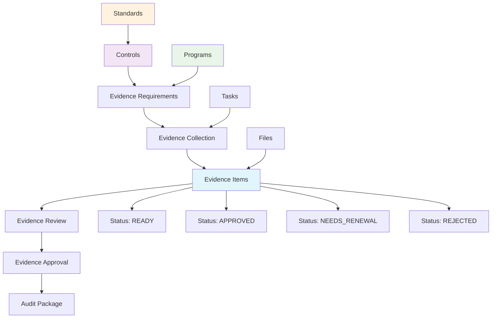
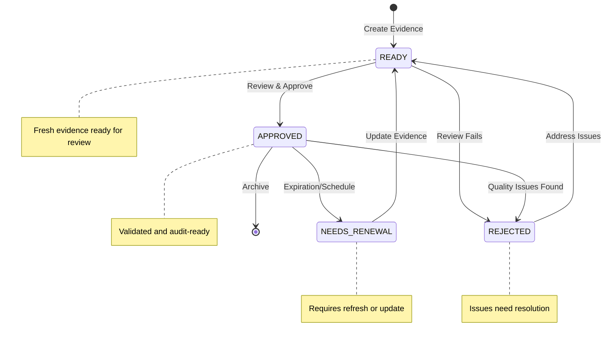
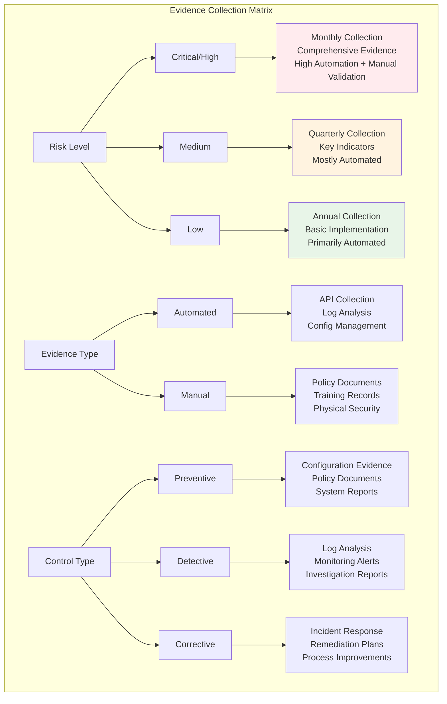

# Evidence

Evidence management is a critical component of compliance programs, providing the documentation and artifacts needed to demonstrate compliance with standards and regulations. Openlane's evidence system centralizes the collection, organization, and management of audit evidence.



## What is Evidence?

Evidence in Openlane represents any artifact, document, record, or data that demonstrates compliance with controls, standards, or regulatory requirements. Evidence serves as proof that controls are properly implemented, operating effectively, and achieving their intended objectives.

## Compliance Relevance

Evidence is essential for compliance because it:

- **Demonstrates Compliance**: Provides concrete proof that controls are implemented and operating
- **Supports Audits**: Gives auditors the documentation they need to assess compliance
- **Enables Certification**: Provides the foundation for compliance certifications and attestations
- **Reduces Risk**: Documents proper implementation reducing compliance risk
- **Facilitates Reviews**: Enables ongoing compliance monitoring and assessment
- **Supports Remediation**: Helps identify control gaps and improvement opportunities

## Evidence Types

### By Collection Method
- **Automated**: Evidence collected automatically from systems and tools
- **Manual**: Evidence collected through manual processes and procedures
- **Continuous**: Evidence collected on an ongoing basis
- **Point-in-Time**: Evidence collected at specific moments

### By Evidence Nature
- **Policies**: Written policies and procedures
- **Configurations**: System and application configurations
- **Logs**: Security, access, and audit logs
- **Reports**: Monitoring, scanning, and assessment reports
- **Screenshots**: Visual evidence of system states and configurations
- **Certificates**: Security certificates and attestations
- **Training Records**: Employee training and awareness documentation

### By Control Type
- **Preventive Evidence**: Demonstrates controls prevent issues
- **Detective Evidence**: Shows controls detect problems
- **Corrective Evidence**: Proves controls address identified issues
- **Administrative Evidence**: Documents governance and oversight

## Evidence Properties

### Core Information
- **Name**: Descriptive name for the evidence
- **Description**: Detailed description of what the evidence demonstrates
- **Collection Procedure**: How the evidence was collected
- **Source**: System or process that generated the evidence
- **URL**: External link to evidence location (if applicable)

### Lifecycle Management
- **Creation Date**: When the evidence was originally created
- **Renewal Date**: When the evidence should be renewed or updated
- **Status**: Current evidence status
  - `READY` - Evidence is current and ready for use
  - `APPROVED` - Evidence has been reviewed and approved
  - `NEEDS_RENEWAL` - Evidence needs to be updated or renewed
  - `REJECTED` - Evidence has been rejected and needs revision



### Automation
- **Is Automated**: Indicates if evidence is automatically collected
- **Renewal Frequency**: How often automated evidence is refreshed
- **Collection Schedule**: When automated collection occurs

### Relationships
- **Controls**: Controls that this evidence supports
- **Control Objectives**: Specific objectives this evidence addresses
- **Programs**: Compliance programs using this evidence
- **Tasks**: Tasks related to evidence collection or review

## GraphQL Operations

### Query Evidence

```graphql
# Get all evidence with basic information
query GetEvidence {
  evidence {
    edges {
      node {
        id
        name
        description
        source
        status
        isAutomated
        creationDate
        renewalDate
        url
        collectionProcedure
        createdAt
        updatedAt
      }
    }
  }
}
```

```graphql
# Get detailed evidence information with relationships
query GetEvidenceDetails($id: ID!) {
  evidence(id: $id) {
    id
    name
    description
    collectionProcedure
    source
    url
    isAutomated
    creationDate
    renewalDate
    status
    createdAt
    updatedAt

    # Related controls
    controls {
      edges {
        node {
          id
          displayID
          description
          category
          standard {
            name
            shortName
          }
        }
      }
    }

    # Related control objectives
    controlObjectives {
      edges {
        node {
          id
          name
          desiredOutcome
          status
        }
      }
    }

    # Related programs
    programs {
      edges {
        node {
          id
          name
          displayID
          programType
        }
      }
    }

    # Associated files
    files {
      edges {
        node {
          id
          fileName
          fileSize
          categoryType
          presignedURL
          mimeType
        }
      }
    }

    # Related tasks
    tasks {
      edges {
        node {
          id
          title
          status
          category
          due
        }
      }
    }
  }
}
```

### Search Evidence

```graphql
# Search evidence by name, description, or source
query SearchEvidence($query: String!) {
  evidenceSearch(query: $query) {
    edges {
      node {
        id
        name
        description
        source
        status
        isAutomated
        creationDate
      }
    }
  }
}
```

### Filter Evidence

```graphql
# Filter evidence by status and automation
query FilterEvidence($status: EvidenceEvidenceStatus!, $automated: Boolean!) {
  evidence(where: {
    status: { eq: $status }
    isAutomated: { eq: $automated }
  }) {
    edges {
      node {
        id
        name
        description
        source
        status
        isAutomated
        renewalDate
      }
    }
  }
}
```

### Create Evidence

```graphql
mutation CreateEvidence($input: CreateEvidenceInput!, $files: [Upload!]) {
  createEvidence(input: $input, evidenceFiles: $files) {
    evidence {
      id
      name
      description
      source
      status
      isAutomated
      creationDate
      files {
        edges {
          node {
            id
            fileName
            presignedURL
          }
        }
      }
    }
  }
}
```

**Input Example:**
```json
{
  "input": {
    "name": "Access Control Matrix",
    "description": "Comprehensive matrix showing user access rights and permissions across all systems",
    "collectionProcedure": "Extract user access data from identity management system and compile into matrix format",
    "source": "Identity Management System",
    "isAutomated": true,
    "creationDate": "2024-01-15T00:00:00Z",
    "renewalDate": "2024-04-15T00:00:00Z",
    "status": "READY",
    "controlIDs": ["control-uuid-1", "control-uuid-2"],
    "programIDs": ["program-uuid-1"]
  }
}
```

### Update Evidence

```graphql
mutation UpdateEvidence($id: ID!, $input: UpdateEvidenceInput!) {
  updateEvidence(id: $id, input: $input) {
    evidence {
      id
      name
      status
      renewalDate
      updatedAt
    }
  }
}
```

### Create Evidence with File Upload

```graphql
mutation CreateEvidenceWithFiles($input: CreateEvidenceInput!, $files: [Upload!]!) {
  createEvidence(input: $input, evidenceFiles: $files) {
    evidence {
      id
      name
      description
      status
      files {
        edges {
          node {
            id
            fileName
            fileSize
            mimeType
            presignedURL
          }
        }
      }
    }
  }
}
```

## API Access

Evidence is managed exclusively through GraphQL operations. There are no REST endpoints for evidence CRUD operations.

## Common Workflows

### 1. Automated Evidence Collection from Systems

**Use Case:** Scheduled job that collects evidence from AWS, monitoring systems, and internal tools

```go
package jobs

import (
	"context"
	"fmt"
	"time"
	"encoding/json"
	"os"

	"github.com/aws/aws-sdk-go/aws"
	"github.com/aws/aws-sdk-go/service/ec2"
	"github.com/theopenlane/core/pkg/openlaneclient"
	"github.com/theopenlane/core/pkg/enums"
)

// EvidenceCollector handles automated evidence collection from various sources
type EvidenceCollector struct {
	client openlaneclient.OpenlaneGraphClient
	awsClient *ec2.EC2
}

// CollectAWSSecurityGroupEvidence collects security group configurations as evidence
func (ec *EvidenceCollector) CollectAWSSecurityGroupEvidence(ctx context.Context, controlID string) error {
	// Get security group configurations from AWS
	resp, err := ec.awsClient.DescribeSecurityGroups(&ec2.DescribeSecurityGroupsInput{
		Filters: []*ec2.Filter{
			{
				Name:   aws.String("group-name"),
				Values: []*string{aws.String("production-*")},
			},
		},
	})
	if err != nil {
		return fmt.Errorf("failed to get security groups: %w", err)
	}

	// Convert to JSON for storage
	sgData, err := json.MarshalIndent(resp.SecurityGroups, "", "  ")
	if err != nil {
		return fmt.Errorf("failed to marshal security group data: %w", err)
	}

	// Create evidence in Openlane
	creationDate := time.Now()
	renewalDate := creationDate.AddDate(0, 3, 0) // Renew quarterly

	input := openlaneclient.CreateEvidenceInput{
		Name: fmt.Sprintf("AWS Security Groups - %s", creationDate.Format("2006-01-02")),
		Description: "Production security group configurations showing network access controls",
		CollectionProcedure: openlaneclient.StringPtr("Automated collection via AWS EC2 API using production read-only credentials"),
		Source: "AWS EC2 API",
		IsAutomated: true,
		CreationDate: &creationDate,
		RenewalDate: &renewalDate,
		Status: enums.EvidenceStatusReady,
		ControlIDs: []string{controlID},
		URL: openlaneclient.StringPtr("https://console.aws.amazon.com/ec2/v2/home#SecurityGroups"),
	}

	// Create a temporary file with the security group data
	tempFile, err := os.CreateTemp("", "security-groups-*.json")
	if err != nil {
		return fmt.Errorf("failed to create temp file: %w", err)
	}
	defer os.Remove(tempFile.Name())

	if _, err := tempFile.Write(sgData); err != nil {
		return fmt.Errorf("failed to write temp file: %w", err)
	}
	tempFile.Close()

	// Upload as evidence with file attachment
	// Note: In a real implementation, you'd handle file upload properly
	evidence, err := ec.client.CreateEvidence(ctx, input, nil) // Files would be handled separately
	if err != nil {
		return fmt.Errorf("failed to create evidence: %w", err)
	}

	log.Printf("Created AWS security group evidence: %s (ID: %s)",
		evidence.CreateEvidence.Evidence.Name,
		evidence.CreateEvidence.Evidence.ID)

	return nil
}

// CollectUserAccessReportEvidence generates user access reports from identity systems
func (ec *EvidenceCollector) CollectUserAccessReportEvidence(ctx context.Context, controlID string) error {
	// In a real implementation, this would connect to your identity provider
	// (Okta, Azure AD, etc.) and generate access reports

	creationDate := time.Now()
	renewalDate := creationDate.AddDate(0, 1, 0) // Monthly renewal

	// Mock user access data - in reality this comes from your IdP
	userAccessData := map[string]interface{}{
		"reportDate": creationDate.Format(time.RFC3339),
		"totalUsers": 150,
		"activeUsers": 142,
		"adminUsers": 8,
		"suspendedUsers": 3,
		"lastAccessReview": creationDate.AddDate(0, -1, 0).Format(time.RFC3339),
		"mfaEnabled": 98.5, // percentage
		"source": "Okta API",
	}

	reportJSON, _ := json.MarshalIndent(userAccessData, "", "  ")

	input := openlaneclient.CreateEvidenceInput{
		Name: fmt.Sprintf("User Access Report - %s", creationDate.Format("2006-01-02")),
		Description: "Monthly user access review report showing active users, permissions, and MFA status",
		CollectionProcedure: openlaneclient.StringPtr("Automated collection via Okta API, processed through internal reporting system"),
		Source: "Okta Identity Provider",
		IsAutomated: true,
		CreationDate: &creationDate,
		RenewalDate: &renewalDate,
		Status: enums.EvidenceStatusReady,
		ControlIDs: []string{controlID},
		URL: openlaneclient.StringPtr("https://company.okta.com/admin/reports"),
	}

	evidence, err := ec.client.CreateEvidence(ctx, input, nil)
	if err != nil {
		return fmt.Errorf("failed to create user access evidence: %w", err)
	}

	log.Printf("Created user access evidence with %d users reported",
		userAccessData["totalUsers"])

	return nil
}
```

### 2. SIEM and Log Analysis Evidence Collection

**Use Case:** Integration with SIEM systems (Splunk, ELK, etc.) for log-based evidence

```go
package integrations

import (
	"context"
	"fmt"
	"time"
	"encoding/json"
	"net/http"
	"bytes"

	"github.com/theopenlane/core/pkg/openlaneclient"
	"github.com/theopenlane/core/pkg/enums"
)

// SIEMIntegration handles evidence collection from SIEM systems
type SIEMIntegration struct {
	client openlaneclient.OpenlaneGraphClient
	splunkURL string
	splunkToken string
}

// SplunkSearchResult represents results from Splunk search
type SplunkSearchResult struct {
	TotalEvents int `json:"total_events"`
	FailedLogins int `json:"failed_logins"`
	SuccessfulLogins int `json:"successful_logins"`
	UniqueUsers int `json:"unique_users"`
	AnomalousActivity int `json:"anomalous_activity"`
	SearchQuery string `json:"search_query"`
	TimeRange string `json:"time_range"`
}

// CollectAuthenticationLogEvidence queries SIEM for authentication events
func (si *SIEMIntegration) CollectAuthenticationLogEvidence(ctx context.Context, controlIDs []string) error {
	// Splunk search query for authentication events
	searchQuery := `
		search index=security sourcetype=authentication
		| stats count by result, user
		| eval category=if(result="success", "successful", "failed")
		| stats count by category
	`

	// Execute Splunk search (simplified - real implementation would use Splunk SDK)
	result, err := si.executeSplunkSearch(searchQuery)
	if err != nil {
		return fmt.Errorf("failed to execute Splunk search: %w", err)
	}

	creationDate := time.Now()
	renewalDate := creationDate.AddDate(0, 1, 0) // Monthly

	// Create evidence record
	input := openlaneclient.CreateEvidenceInput{
		Name: fmt.Sprintf("Authentication Log Analysis - %s", creationDate.Format("2006-01")),
		Description: "Monthly analysis of authentication events showing login success rates, failed attempts, and user activity patterns",
		CollectionProcedure: openlaneclient.StringPtr("Automated Splunk search across all authentication logs with statistical analysis"),
		Source: "Splunk SIEM",
		IsAutomated: true,
		CreationDate: &creationDate,
		RenewalDate: &renewalDate,
		Status: enums.EvidenceStatusReady,
		ControlIDs: controlIDs,
		URL: openlaneclient.StringPtr(fmt.Sprintf("%s/app/search", si.splunkURL)),
	}

	evidence, err := si.client.CreateEvidence(ctx, input, nil)
	if err != nil {
		return fmt.Errorf("failed to create authentication evidence: %w", err)
	}

	log.Printf("Created authentication log evidence: %d total events, %d failed logins",
		result.TotalEvents, result.FailedLogins)

	return nil
}

// executeSplunkSearch simulates a Splunk API call
func (si *SIEMIntegration) executeSplunkSearch(query string) (*SplunkSearchResult, error) {
	// In a real implementation, this would use the Splunk REST API
	// Here's a simplified version showing the pattern

	payload := map[string]string{
		"search": query,
		"output_mode": "json",
		"earliest_time": "-30d@d",
		"latest_time": "now",
	}

	jsonPayload, _ := json.Marshal(payload)
	req, err := http.NewRequest("POST", si.splunkURL+"/services/search/jobs", bytes.NewBuffer(jsonPayload))
	if err != nil {
		return nil, err
	}

	req.Header.Set("Authorization", "Bearer "+si.splunkToken)
	req.Header.Set("Content-Type", "application/json")

	// Simulate response for example
	return &SplunkSearchResult{
		TotalEvents: 15420,
		FailedLogins: 23,
		SuccessfulLogins: 15397,
		UniqueUsers: 142,
		AnomalousActivity: 2,
		SearchQuery: query,
		TimeRange: "Last 30 days",
	}, nil
}

// CollectVulnerabilityEvidence collects vulnerability scan results
func (si *SIEMIntegration) CollectVulnerabilityEvidence(ctx context.Context, controlID string) error {
	// This would integrate with vulnerability scanners like Nessus, Qualys, etc.
	creationDate := time.Now()
	renewalDate := creationDate.AddDate(0, 0, 7) // Weekly

	// Mock vulnerability data - in reality from scanner API
	vulnData := map[string]interface{}{
		"scanDate": creationDate.Format(time.RFC3339),
		"hostsScanned": 45,
		"criticalVulns": 0,
		"highVulns": 2,
		"mediumVulns": 8,
		"lowVulns": 15,
		"scanner": "Nessus Professional",
		"complianceScore": 94.2,
	}

	input := openlaneclient.CreateEvidenceInput{
		Name: fmt.Sprintf("Vulnerability Scan Results - %s", creationDate.Format("2006-01-02")),
		Description: "Weekly vulnerability assessment showing security posture of production infrastructure",
		CollectionProcedure: openlaneclient.StringPtr("Automated Nessus scan of production network with risk scoring"),
		Source: "Nessus Vulnerability Scanner",
		IsAutomated: true,
		CreationDate: &creationDate,
		RenewalDate: &renewalDate,
		Status: enums.EvidenceStatusReady,
		ControlIDs: []string{controlID},
	}

	evidence, err := si.client.CreateEvidence(ctx, input, nil)
	if err != nil {
		return fmt.Errorf("failed to create vulnerability evidence: %w", err)
	}

	log.Printf("Created vulnerability evidence: %d hosts scanned, %d critical vulnerabilities",
		vulnData["hostsScanned"], vulnData["criticalVulns"])

	return nil
}
```

### 3. Evidence Lifecycle Management Job

**Use Case:** Scheduled job for evidence renewal, expiration management, and automated refreshes

```go
package jobs

import (
	"context"
	"fmt"
	"time"

	"github.com/theopenlane/core/pkg/openlaneclient"
	"github.com/theopenlane/core/pkg/enums"
	"github.com/theopenlane/utils/ulids"
)

// EvidenceLifecycleManager manages evidence renewal and expiration
type EvidenceLifecycleManager struct {
	client openlaneclient.OpenlaneGraphClient
	collectors map[string]EvidenceCollector // Different collectors for different evidence types
}

// EvidenceCollector interface for different evidence collection methods
type EvidenceCollector interface {
	Collect(ctx context.Context, evidenceID string) error
	GetType() string
}

// ProcessEvidenceRenewals runs as a scheduled job to handle evidence lifecycle
func (elm *EvidenceLifecycleManager) ProcessEvidenceRenewals(ctx context.Context) error {
	now := time.Now()
	upcomingRenewalDate := now.AddDate(0, 0, 7) // 7 days from now

	// Find evidence that needs renewal soon or is overdue
	evidence, err := elm.client.GetEvidences(ctx, &openlaneclient.EvidenceWhereInput{
		Or: []*openlaneclient.EvidenceWhereInput{
			{
				Status: &enums.EvidenceStatusNeedsRenewal,
			},
			{
				RenewalDate: &openlaneclient.TimeWhereInput{
					Lt: &upcomingRenewalDate,
				},
			},
		},
	})
	if err != nil {
		return fmt.Errorf("failed to get evidence needing renewal: %w", err)
	}

	log.Printf("Found %d evidence items needing renewal", len(evidence.Evidences.Edges))

	for _, edge := range evidence.Evidences.Edges {
		evid := edge.Node

		if err := elm.processEvidenceRenewal(ctx, evid); err != nil {
			log.Printf("Failed to renew evidence %s: %v", evid.Name, err)
			continue
		}
	}

	return nil
}

// processEvidenceRenewal handles renewal of a single evidence item
func (elm *EvidenceLifecycleManager) processEvidenceRenewal(ctx context.Context, evidence *openlaneclient.Evidence) error {
	// If evidence is automated, try to re-collect it
	if evidence.IsAutomated {
		return elm.renewAutomatedEvidence(ctx, evidence)
	}

	// For manual evidence, mark as needs renewal and notify responsible parties
	return elm.flagManualEvidenceForRenewal(ctx, evidence)
}

// renewAutomatedEvidence attempts to automatically refresh evidence
func (elm *EvidenceLifecycleManager) renewAutomatedEvidence(ctx context.Context, evidence *openlaneclient.Evidence) error {
	// Determine evidence type from source or tags
	collectorType := elm.determineCollectorType(evidence)
	collector, exists := elm.collectors[collectorType]
	if !exists {
		return fmt.Errorf("no collector available for evidence type: %s", collectorType)
	}

	// Attempt to collect fresh evidence
	if err := collector.Collect(ctx, evidence.ID); err != nil {
		// If automated collection fails, mark for manual attention
		return elm.markEvidenceCollectionFailed(ctx, evidence, err)
	}

	// Update evidence with new renewal date
	newRenewalDate := elm.calculateNextRenewalDate(evidence)
	updateInput := openlaneclient.UpdateEvidenceInput{
		Status: &enums.EvidenceStatusReady,
		RenewalDate: &newRenewalDate,
		CreationDate: openlaneclient.TimePtr(time.Now()),
	}

	_, err := elm.client.UpdateEvidence(ctx, evidence.ID, updateInput, nil)
	if err != nil {
		return fmt.Errorf("failed to update renewed evidence: %w", err)
	}

	log.Printf("Successfully renewed automated evidence: %s", evidence.Name)
	return nil
}

// flagManualEvidenceForRenewal marks manual evidence for human attention
func (elm *EvidenceLifecycleManager) flagManualEvidenceForRenewal(ctx context.Context, evidence *openlaneclient.Evidence) error {
	updateInput := openlaneclient.UpdateEvidenceInput{
		Status: &enums.EvidenceStatusNeedsRenewal,
	}

	_, err := elm.client.UpdateEvidence(ctx, evidence.ID, updateInput, nil)
	if err != nil {
		return fmt.Errorf("failed to flag evidence for renewal: %w", err)
	}

	// In a real implementation, you'd also:
	// 1. Send notifications to responsible parties
	// 2. Create tasks for evidence renewal
	// 3. Update compliance dashboards
	log.Printf("Flagged manual evidence for renewal: %s", evidence.Name)
	return nil
}

// markEvidenceCollectionFailed handles failed automated collection
func (elm *EvidenceLifecycleManager) markEvidenceCollectionFailed(ctx context.Context, evidence *openlaneclient.Evidence, collectErr error) error {
	updateInput := openlaneclient.UpdateEvidenceInput{
		Status: &enums.EvidenceStatusNeedsRenewal,
		// Add failure information to tags or description
		Tags: append(evidence.Tags, fmt.Sprintf("collection-failed:%s", time.Now().Format("2006-01-02"))),
	}

	_, err := elm.client.UpdateEvidence(ctx, evidence.ID, updateInput, nil)
	if err != nil {
		return fmt.Errorf("failed to mark evidence collection as failed: %w", err)
	}

	log.Printf("Marked evidence collection as failed: %s (error: %v)", evidence.Name, collectErr)
	return nil
}

// Helper functions
func (elm *EvidenceLifecycleManager) determineCollectorType(evidence *openlaneclient.Evidence) string {
	switch evidence.Source {
	case "AWS EC2 API":
		return "aws"
	case "Splunk SIEM":
		return "splunk"
	case "Nessus Vulnerability Scanner":
		return "vulnerability"
	default:
		return "generic"
	}
}

func (elm *EvidenceLifecycleManager) calculateNextRenewalDate(evidence *openlaneclient.Evidence) time.Time {
	// Calculate renewal based on evidence type and risk level
	now := time.Now()

	// High-frequency evidence (security logs, access reports)
	if evidence.Source == "Splunk SIEM" || evidence.Source == "AWS EC2 API" {
		return now.AddDate(0, 1, 0) // Monthly
	}

	// Medium-frequency evidence (vulnerability scans)
	if evidence.Source == "Nessus Vulnerability Scanner" {
		return now.AddDate(0, 0, 7) // Weekly
	}

	// Default quarterly renewal
	return now.AddDate(0, 3, 0)
}
```

### 4. Evidence Review and Approval

```graphql
# Find evidence pending approval
query PendingApprovalEvidence {
  evidence(where: {
    status: { eq: READY }
  }) {
    edges {
      node {
        id
        name
        description
        source
        creationDate
        controls {
          edges {
            node {
              displayID
              description
            }
          }
        }
      }
    }
  }
}

# Approve evidence
mutation ApproveEvidence($evidenceId: ID!) {
  updateEvidence(id: $evidenceId, input: {
    status: APPROVED
  }) {
    evidence {
      id
      name
      status
      updatedAt
    }
  }
}
```

## Evidence Collection Strategy Guide



### Choosing the Right Evidence Type

#### For Preventive Controls
**Control Example:** "Multi-factor authentication required for admin access"

**Best Evidence Types:**
- **Configuration screenshots** showing MFA enabled
- **Policy documents** requiring MFA
- **User provisioning procedures** that include MFA setup
- **System reports** showing MFA enrollment rates

**Why these work:** Preventive controls need evidence that the preventive measure is in place and configured correctly.

#### For Detective Controls
**Control Example:** "Monitor and review access logs for suspicious activity"

**Best Evidence Types:**
- **Log analysis reports** showing review activities
- **Alert configurations** for suspicious patterns
- **Investigation reports** for flagged activities
- **Monitoring dashboards** with access patterns

**Why these work:** Detective controls need evidence that monitoring is happening and abnormal activities are detected.

#### For Corrective Controls
**Control Example:** "Incident response procedures for security breaches"

**Best Evidence Types:**
- **Incident response playbooks** and procedures
- **Incident tickets** showing response process
- **Post-incident reports** with lessons learned
- **Response time metrics** and improvement plans

**Why these work:** Corrective controls need evidence that problems are identified and resolved effectively.

### Evidence Collection Methods by Risk Level

#### High-Risk Controls (Critical/High Impact)
**Collection frequency:** Monthly or quarterly
**Evidence depth:** Comprehensive, multiple evidence types
**Automation level:** Highly automated with manual validation

**Example - Database Access Control:**
```
Automated Evidence:
- Monthly database access reports
- Quarterly privilege escalation logs
- Real-time failed login alerts

Manual Evidence:
- Quarterly access review sign-offs
- Annual database admin training records
- Semi-annual penetration test results
```

#### Medium-Risk Controls (Medium Impact)
**Collection frequency:** Quarterly or semi-annually
**Evidence depth:** Focused on key indicators
**Automation level:** Mostly automated with periodic manual review

**Example - Email Security:**
```
Automated Evidence:
- Quarterly spam/phishing block reports
- Monthly email encryption usage stats

Manual Evidence:
- Semi-annual email policy acknowledgments
- Annual phishing simulation results
```

#### Lower-Risk Controls (Low Impact)
**Collection frequency:** Annually
**Evidence depth:** Basic demonstration of implementation
**Automation level:** Primarily automated

**Example - Physical Security:**
```
Automated Evidence:
- Annual badge access reports
- Quarterly visitor log summaries

Manual Evidence:
- Annual physical security policy review
- Annual emergency procedure testing
```

### Evidence Quality Framework

| Quality Attribute | Requirements | Red Flags |
|------------------|--------------|----------|
| **Authenticity** | Authoritative sources, timestamps, metadata, source identification | User screenshots, undated files, missing attribution |
| **Completeness** | Full control scope, success/failure cases, trending data | Sample data only, missing timeframes, partial coverage |
| **Relevance** | Direct control demonstration, audit period coverage, current state | Outdated evidence, indirect correlation, wrong timeframe |
| **Reliability** | Independent verification, controlled access, audit trails | Manual manipulation possible, inconsistent methods, no validation |

#### Evidence Red Flags

**❌ Poor Evidence Examples:**
- User-provided screenshots (can be manipulated)
- Undated documents or reports
- Sample data that's not representative
- Evidence from development/test environments
- Reports with no source attribution

**✅ Good Evidence Examples:**
- System-generated reports with metadata
- Timestamped configuration exports
- Comprehensive audit logs
- Production system evidence
- Reports with clear source identification

### Automated Evidence Collection Strategies

#### API-Based Collection
**Best for:** Cloud services, SaaS applications, modern systems

**Implementation approach:**
```javascript
// Example: Automated AWS security group evidence
const collectSecurityGroupEvidence = async () => {
  const evidence = {
    name: 'AWS Security Group Configuration',
    description: 'Production security group rules for web tier',
    source: 'AWS EC2 API',
    collectionDate: new Date().toISOString(),
    data: await ec2.describeSecurityGroups({
      GroupIds: ['sg-production-web']
    }).promise()
  };

  return createEvidence(evidence);
};
```

#### Log Analysis Collection
**Best for:** Authentication systems, network devices, applications

**Implementation approach:**
- Configure log forwarding to centralized system (SIEM/SOAR)
- Create automated reports for control-specific metrics
- Set up alerts for control failures or exceptions
- Generate monthly/quarterly trend analysis

#### Configuration Management
**Best for:** Infrastructure, applications, security tools

**Implementation approach:**
- Use Infrastructure as Code (IaC) for configuration evidence
- Implement configuration drift detection
- Automated backup of critical system configurations
- Version control for all configuration changes

### Manual Evidence Collection Workflows

#### When Manual Collection is Necessary
1. **Legal or regulatory documents** (contracts, certifications)
2. **Human process evidence** (training records, approvals)
3. **Third-party assessments** (vendor security reviews)
4. **Incident documentation** (investigation reports)
5. **Physical security evidence** (facility tours, photos)

#### Manual Collection Best Practices

**1. Standardize Collection Procedures**
```
Document Template:
- Evidence Name: [Descriptive name]
- Collection Date: [Date collected]
- Collector: [Person who collected it]
- Source: [Where it came from]
- Purpose: [Which control(s) it supports]
- Review Date: [When it needs renewal]
- File Location: [Where it's stored]
```

**2. Create Collection Checklists**
```
Quarterly Evidence Collection:
□ Policy review minutes from board meeting
□ Training completion reports from HR system
□ Vendor security assessment updates
□ Incident response drill documentation
□ Physical security walk-through photos
```

**3. Implement Review Workflows**
- Evidence collected by one person
- Reviewed and approved by another
- Quality checked by compliance team
- Stored in secure, controlled location

### Evidence Organization and Management

#### Naming Conventions
**Standard format:** `[CONTROL-ID]_[EVIDENCE-TYPE]_[DATE]_[VERSION]`

**Examples:**
- `CC6.1_AccessReport_2024-01-15_v1.pdf`
- `CC6.2_UserProvisioning_2024-Q1_v2.xlsx`
- `CC8.1_ChangeLog_2024-01-01_2024-03-31_v1.csv`

#### Folder Structure
```
Compliance Evidence/
├── SOC2-2024/
│   ├── CC6-LogicalAccess/
│   │   ├── CC6.1-AccessControls/
│   │   ├── CC6.2-UserProvisioning/
│   │   └── CC6.3-UserTermination/
│   ├── CC7-SystemOperations/
│   └── CC8-ChangeManagement/
├── ISO27001-2024/
└── Custom-Controls/
```

#### Version Control
- Track all evidence versions
- Maintain change logs
- Archive superseded versions
- Document why evidence was updated

## Evidence Organization

### By Control Framework
- Organize evidence by the controls and standards they support
- Map evidence to specific control requirements
- Track evidence completeness across frameworks

### By Evidence Type
- Group similar evidence types together
- Standardize evidence naming and formatting
- Create templates for common evidence types

### By Collection Schedule
- Organize by collection frequency (daily, weekly, monthly, quarterly)
- Track renewal dates and collection schedules
- Automate reminders for evidence updates

### By Program Phase
- Organize evidence by compliance program phases
- Track evidence readiness for audit periods
- Prepare evidence packages for specific assessments

## Audit Preparation and Evidence Presentation

### Preparing Evidence for Auditors

#### Evidence Package Organization
Create separate evidence packages for each control:

**Package Contents:**
1. **Control Summary** - One-page overview of the control
2. **Evidence Index** - List of all evidence with descriptions
3. **Supporting Documentation** - All evidence files organized chronologically
4. **Testing Results** - Any internal testing or validation performed
5. **Exception Documentation** - Any control failures and remediation

#### Evidence Presentation Format

**For Technical Evidence:**
```
Evidence Summary:
- Type: System Configuration Report
- Source: AWS Security Hub
- Date Range: January 1, 2024 - March 31, 2024
- Scope: All production EC2 instances
- Key Findings: 100% compliance with security group rules
- Exceptions: None
- Collection Method: Automated via API
```

**For Process Evidence:**
```
Evidence Summary:
- Type: Access Review Process
- Source: HR System + Manual Review
- Date Range: Q1 2024
- Scope: All employees with admin access
- Key Findings: 95% reviews completed on time
- Exceptions: 3 late reviews (documented reasons)
- Collection Method: Semi-automated report + manual validation
```

### Common Evidence Challenges and Solutions

#### Challenge: "We don't have evidence for this period"
**Solution:**
- Implement prospective evidence collection
- Use compensating controls temporarily
- Document remediation plan with timeline
- Provide evidence of control design even if operating evidence is limited

#### Challenge: "Our system doesn't generate this type of report"
**Solution:**
- Export raw data and create custom reports
- Use alternative evidence that demonstrates the same control objective
- Implement manual processes with documented procedures
- Consider system upgrades for future periods

#### Challenge: "Evidence contains sensitive information"
**Solution:**
- Redact sensitive data while preserving control demonstration
- Provide summary reports instead of detailed logs
- Use statistical sampling for large datasets
- Offer live system demonstrations instead of static reports

### Evidence Retention and Lifecycle Management

#### Retention Schedules
**SOC 2 Requirements:** 7 years minimum
**ISO 27001 Requirements:** 3 years minimum
**GDPR Requirements:** Varies by data type
**Industry Standards:** Follow longest applicable requirement

#### Lifecycle Stages
1. **Active** (0-1 year): Current evidence, readily accessible
2. **Archive** (1-3 years): Stored securely, accessible on request
3. **Long-term** (3-7 years): Compressed storage, formal retrieval process
4. **Disposal** (7+ years): Secure deletion following retention policies

#### Storage Requirements
- **Encryption:** All evidence encrypted at rest and in transit
- **Access Control:** Role-based access with audit trails
- **Backup:** Multiple backup copies in different locations
- **Integrity:** Hash verification to detect tampering
- **Availability:** 99.9% uptime for active evidence

### Evidence Metrics and KPIs

#### Collection Efficiency Metrics
- **Automation Rate:** Percentage of evidence collected automatically
- **Collection Time:** Average time to collect evidence per control
- **Error Rate:** Percentage of evidence requiring manual correction
- **Completeness Rate:** Percentage of controls with complete evidence

#### Quality Metrics
- **Audit Exception Rate:** Percentage of evidence rejected by auditors
- **Rework Rate:** Percentage of evidence requiring revision
- **Timeliness Rate:** Percentage of evidence collected on schedule
- **Coverage Rate:** Percentage of control requirements with supporting evidence

#### Cost Metrics
- **Cost per Control:** Total evidence collection cost per control
- **Cost per Evidence Item:** Average cost to collect each piece of evidence
- **ROI of Automation:** Cost savings from automated vs. manual collection
- **Audit Preparation Cost:** Time and resources spent preparing for audits

## Integration Patterns

| Integration | Relationship | Business Impact |
|-------------|--------------|----------------|
| **Controls** | Evidence proves control effectiveness | Enables control testing and validation |
| **Programs** | Evidence collection organized by program scope | Drives audit readiness and certification timelines |
| **Tasks** | Evidence collection assigned as trackable work | Ensures accountability and deadline management |
| **Files** | Evidence includes supporting documentation | Provides comprehensive audit packages |
| **Standards** | Evidence mapped to specific requirements | Demonstrates compliance with frameworks |

For detailed guidance on evidence collection for specific frameworks, see the framework-specific documentation in the [Standards section](../standards/overview.mdx).