# Risks

Risk management is a foundational element of effective compliance programs. Openlane's risk management system enables organizations to identify, assess, track, and mitigate risks that could impact compliance, security, and business operations.

```mermaid
graph TD
    A[Risk Identification] --> B[Risk Assessment]
    B --> C[Risk Score<br/>Impact × Likelihood]
    C --> D{Risk Level}

    D --> E[Critical: 16-20<br/>Immediate Action]
    D --> F[High: 12-15<br/>Priority Treatment]
    D --> G[Medium: 6-11<br/>Planned Mitigation]
    D --> H[Low: 1-5<br/>Monitor/Accept]

    E --> I[MITIGATE]
    F --> I
    F --> J[TRANSFER]
    G --> I
    G --> K[ACCEPT]
    H --> K
    H --> L[AVOID]

    I --> M[Controls]
    I --> N[Action Plans]
    J --> O[Insurance/Contracts]
    K --> P[Risk Register]
    L --> Q[Process Changes]

    style C fill:#e1f5fe
    style E fill:#ffebee
    style F fill:#fff3e0
    style G fill:#e8f5e8
    style H fill:#f3e5f5
```



## What is a Risk?

A Risk in Openlane represents a potential threat, vulnerability, or uncertainty that could negatively impact an organization's ability to achieve its objectives, maintain compliance, or protect assets. Risks are assessed based on their likelihood and potential impact, then managed through appropriate controls and mitigation strategies.

## Compliance Significance

| Aspect | Purpose | Benefit |
|--------|---------|----------|
| **Threat Identification** | Systematic discovery of compliance and security risks | Comprehensive risk coverage and early threat detection |
| **Effort Prioritization** | Focus resources on highest-impact risks | Efficient resource allocation and maximum risk reduction |
| **Control Selection** | Risk-driven control implementation decisions | Targeted controls that address actual threats |
| **Due Diligence** | Demonstrate systematic risk management to auditors | Regulatory compliance and audit readiness |
| **Decision Support** | Risk-informed business and security decisions | Better outcomes through risk-aware choices |
| **Continuous Improvement** | Ongoing identification of enhancement opportunities | Evolving security posture and reduced exposure |

## Risk Classifications

### By Category
| Type | Scope | Examples |
|------|-------|----------|
| **Strategic** | Organizational direction and objectives | Market disruption, competitive threats, regulatory changes |
| **Operational** | Day-to-day business operations | Process failures, supply chain disruption, staff turnover |
| **Financial** | Financial assets and reporting | Fraud, market volatility, credit risk |
| **Technology** | Information systems and infrastructure | Cyber attacks, system failures, data breaches |
| **Compliance** | Regulatory and contractual obligations | Regulation violations, audit failures, contract breaches |
| **External** | External environment factors | Natural disasters, economic downturns, vendor failures |

### By Impact Domain
| Domain | Risk Focus | Business Impact |
|--------|------------|----------------|
| **Confidentiality** | Unauthorized data disclosure | Competitive advantage loss, regulatory fines |
| **Integrity** | Data or system compromise | Decision-making errors, operational failures |
| **Availability** | Service disruption or downtime | Revenue loss, customer dissatisfaction |
| **Privacy** | Personal data misuse or breach | Regulatory penalties, reputation damage |
| **Reputation** | Brand or public perception damage | Customer loss, market devaluation |
| **Financial** | Direct financial loss or penalties | Immediate monetary impact, cash flow issues |

## Risk Assessment Framework

### Impact Levels
| Level | Description | Business Consequences |
|-------|-------------|----------------------|
| `CRITICAL` | Severe, potentially existential impact | Business shutdown, major regulatory action, massive financial loss |
| `HIGH` | Significant impact requiring major response | Substantial revenue loss, regulatory fines, operational disruption |
| `MEDIUM` | Moderate impact, manageable with effort | Limited revenue impact, minor compliance issues, temporary disruption |
| `LOW` | Minor impact with limited consequences | Minimal financial impact, operational inconvenience only |

### Likelihood Probabilities
| Level | Probability Range | Timeframe Expectation |
|-------|------------------|----------------------|
| `VERY_HIGH` | >90% | Almost certain within 1 year |
| `HIGH` | 70-90% | Likely within 1-2 years |
| `MEDIUM` | 30-70% | Possible within 2-5 years |
| `LOW` | 10-30% | Unlikely within 5 years |
| `VERY_LOW` | <10% | Rare or theoretical |

### Risk Status Lifecycle
| Status | Meaning | Management Action |
|--------|---------|------------------|
| `OPEN` | Active risk requiring attention | Implement mitigation strategies |
| `MITIGATED` | Reduced to acceptable levels | Monitor and maintain controls |
| `ONGOING` | Being actively managed | Continue treatment activities |
| `ARCHIVED` | No longer relevant or resolved | Document lessons learned |

## GraphQL Operations

### Query Risks

```graphql
# Get all risks with basic information
query GetRisks {
  risks {
    edges {
      node {
        id
        name
        details
        category
        riskType
        impact
        likelihood
        score
        status
        businessCosts
        createdAt
        updatedAt
      }
    }
  }
}
```

```graphql
# Get detailed risk information with relationships
query GetRiskDetails($id: ID!) {
  risk(id: $id) {
    id
    name
    details
    category
    riskType
    impact
    likelihood
    score
    businessCosts
    mitigation
    satisfies
    status
    createdAt
    updatedAt

    # Related entities
    stakeholder {
      id
      name
    }

    delegate {
      id
      name
    }

    controls {
      edges {
        node {
          id
          displayID
          description
          status
          controlType
        }
      }
    }

    procedures {
      edges {
        node {
          id
          name
          status
        }
      }
    }

    actionPlans {
      edges {
        node {
          id
          name
          dueDate
          priority
          status
        }
      }
    }

    tasks {
      edges {
        node {
          id
          title
          status
          due
          category
        }
      }
    }

    programs {
      edges {
        node {
          id
          name
          displayID
          programType
        }
      }
    }
  }
}
```

### Search Risks

```graphql
# Search risks by name or details
query SearchRisks($query: String!) {
  riskSearch(query: $query) {
    edges {
      node {
        id
        name
        details
        category
        riskType
        impact
        likelihood
        score
        status
      }
    }
  }
}
```

### Filter Risks

```graphql
# Filter risks by impact and status
query HighImpactRisks {
  risks(where: {
    impact: { in: [CRITICAL, HIGH] }
    status: { eq: OPEN }
  }, orderBy: [
    { field: score, direction: DESC }
  ]) {
    edges {
      node {
        id
        name
        impact
        likelihood
        score
        status
        businessCosts
      }
    }
  }
}
```

### Create Risk

```graphql
mutation CreateRisk($input: CreateRiskInput!) {
  createRisk(input: $input) {
    risk {
      id
      name
      details
      category
      riskType
      impact
      likelihood
      score
      status
    }
  }
}
```

**Input Example:**
```json
{
  "input": {
    "name": "Data Breach from Insufficient Access Controls",
    "details": "Risk of unauthorized access to sensitive customer data due to inadequate access control mechanisms, potentially resulting in data breach and regulatory penalties",
    "category": "DATA_SECURITY",
    "riskType": "OPERATIONAL",
    "impact": "CRITICAL",
    "likelihood": "MEDIUM",
    "businessCosts": "500000-2000000",
    "mitigation": "Implement multi-factor authentication, regular access reviews, and zero-trust architecture",
    "satisfies": "MITIGATE",
    "status": "OPEN",
    "stakeholderID": "security-team-group-id"
  }
}
```

### Update Risk

```graphql
mutation UpdateRisk($id: ID!, $input: UpdateRiskInput!) {
  updateRisk(id: $id, input: $input) {
    risk {
      id
      name
      impact
      likelihood
      score
      status
      updatedAt
    }
  }
}
```

### Risk Assessment Calculation

```graphql
# Update risk with new assessment
mutation UpdateRiskAssessment($id: ID!) {
  updateRisk(id: $id, input: {
    impact: HIGH
    likelihood: HIGH
    # Score automatically calculated: HIGH(4) * HIGH(4) = 16
  }) {
    risk {
      id
      name
      impact
      likelihood
      score
      status
    }
  }
}
```

## API Access

Risks are managed exclusively through GraphQL operations. There are no REST endpoints for risk CRUD operations.

## Risk Scoring Matrix

Openlane uses a 20-point risk scoring system based on impact and likelihood:


### Impact Levels
- **Critical (5)**: Severe consequences, major business disruption
- **High (4)**: Significant consequences, notable business impact
- **Medium (3)**: Moderate consequences, manageable impact
- **Low (2)**: Minor consequences, limited impact
- **Very Low (1)**: Minimal consequences, negligible impact

### Likelihood Levels
- **Very High (4)**: >90% probability of occurrence
- **High (3)**: 70-90% probability of occurrence
- **Medium (2)**: 30-70% probability of occurrence
- **Low (1)**: 10-30% probability of occurrence
- **Very Low (0.5)**: <10% probability of occurrence

### Risk Score Calculation
**Risk Score = Impact × Likelihood**

| Impact/Likelihood | Very Low (0.5) | Low (1) | Medium (2) | High (3) | Very High (4) |
|-------------------|----------------|---------|------------|----------|---------------|
| **Critical (5)**  | 2.5           | 5       | 10         | 15       | 20            |
| **High (4)**      | 2             | 4       | 8          | 12       | 16            |
| **Medium (3)**    | 1.5           | 3       | 6          | 9        | 12            |
| **Low (2)**       | 1             | 2       | 4          | 6        | 8             |
| **Very Low (1)**  | 0.5           | 1       | 2          | 3        | 4             |

## Common Workflows

### 1. Risk Identification and Assessment

```graphql
# Create new risk with initial assessment
mutation CreateNewRisk {
  createRisk(input: {
    name: "Cloud Service Provider Outage"
    details: "Risk of extended service outage due to cloud provider infrastructure failure"
    category: "AVAILABILITY"
    riskType: "EXTERNAL"
    impact: HIGH
    likelihood: LOW
    businessCosts: "50000-200000"
    status: OPEN
    stakeholderID: "infrastructure-team-id"
  }) {
    risk {
      id
      name
      impact
      likelihood
      score
      status
    }
  }
}
```

### 2. Risk Mitigation Planning

```graphql
# Create action plan for risk mitigation
mutation CreateRiskActionPlan($riskId: ID!) {
  createActionPlan(input: {
    name: "Implement Multi-Cloud Strategy"
    details: "Develop and implement multi-cloud architecture to reduce single point of failure risk"
    priority: HIGH
    dueDate: "2024-06-30T00:00:00Z"
    source: "RISK_ASSESSMENT"
    status: DRAFT
    riskIDs: [$riskId]
  }) {
    actionPlan {
      id
      name
      priority
      dueDate
      risks {
        edges {
          node {
            id
            name
          }
        }
      }
    }
  }
}
```

### 3. Risk Monitoring and Review

```graphql
# Find high-priority risks for review
query RisksForReview {
  risks(where: {
    score: { gte: 12 }
    status: { in: [OPEN, ONGOING] }
  }, orderBy: [
    { field: score, direction: DESC }
    { field: updatedAt, direction: ASC }
  ]) {
    edges {
      node {
        id
        name
        impact
        likelihood
        score
        status
        updatedAt
        actionPlans {
          edges {
            node {
              id
              name
              dueDate
              status
            }
          }
        }
      }
    }
  }
}
```

### 4. Risk Treatment and Closure

```graphql
# Update risk status after mitigation
mutation MitigateRisk($riskId: ID!) {
  updateRisk(id: $riskId, input: {
    status: MITIGATED
    impact: LOW
    likelihood: LOW
    mitigation: "Multi-cloud architecture implemented with automated failover capabilities. Regular disaster recovery testing established."
  }) {
    risk {
      id
      name
      status
      impact
      likelihood
      score
      mitigation
      updatedAt
    }
  }
}
```

## Practical Risk Management Guide

### Risk Identification Techniques

#### Threat Modeling Approach
**When to use:** New systems, applications, or significant changes

**Process:**
1. **Asset Inventory**: List what you're protecting (data, systems, processes)
2. **Threat Actor Analysis**: Who might attack (internal, external, nation-state, criminals)
3. **Attack Vector Mapping**: How they might attack (network, application, physical, social)
4. **Impact Analysis**: What happens if they succeed

**Example Output:**
```
Asset: Customer Credit Card Database
Threat: External cybercriminals
Attack Vectors:
- SQL injection through web application
- Privilege escalation through stolen credentials
- Network lateral movement from compromised workstation
Impact:
- $2M+ in PCI fines
- $500K+ in incident response costs
- Brand reputation damage
- Customer churn
```

#### Compliance Gap Analysis
**When to use:** Preparing for new regulations or standards

**Process:**
1. **Requirement Mapping**: Map each compliance requirement to current controls
2. **Gap Identification**: Find requirements without adequate controls
3. **Risk Assessment**: Evaluate risks of non-compliance
4. **Prioritization**: Focus on highest-risk gaps first

**Example:**
```
GDPR Article 32 - Security of Processing
Current State: Basic encryption, no key rotation
Gap: Lack of encryption key management
Risk: €20M fine potential + data breach exposure
Priority: High (implement within 90 days)
```

#### Business Process Risk Review
**When to use:** Regular business reviews or process changes

**Focus Areas:**
- **Financial processes**: Fraud, errors, unauthorized transactions
- **HR processes**: Insider threats, privileged access abuse
- **IT operations**: System failures, data loss, security breaches
- **Vendor relationships**: Third-party failures, data exposure

### Risk Assessment Methodologies

#### Quantitative Risk Assessment
**Best for:** Financial risks, business-critical systems

**Formula:** `Risk = Probability × Impact (in dollars)`

**Example Calculation:**
```
Scenario: Ransomware Attack
Probability: 15% per year (based on industry data)
Impact Components:
- System downtime: $50,000/day × 3 days = $150,000
- Recovery costs: $75,000
- Regulatory fines: $200,000
- Reputation damage: $300,000
Total Impact: $725,000

Annual Risk Exposure: 15% × $725,000 = $108,750
```

**Decision Making:**
- If mitigation costs < $108,750, implement controls
- If mitigation costs > $108,750, consider accepting or transferring risk

#### Qualitative Risk Assessment
**Best for:** Emerging threats, reputation risks, complex scenarios

**Assessment Matrix:**
```
           Very Low  Low    Medium  High   Very High
Critical      5      10      15      20       25
High         4       8       12      16       20
Medium       3       6        9      12       15
Low          2       4        6       8       10
Very Low     1       2        3       4        5
```

**Scoring Guidelines:**

**Impact Levels:**
- **Critical (5)**: Existential threat to organization
- **High (4)**: Severe operational or financial impact
- **Medium (3)**: Moderate impact, manageable consequences
- **Low (2)**: Minor impact, minimal disruption
- **Very Low (1)**: Negligible impact

**Likelihood Levels:**
- **Very High**: Almost certain to occur within 1 year
- **High**: Likely to occur within 1-2 years
- **Medium**: Possible within 2-5 years
- **Low**: Unlikely within 5 years
- **Very Low**: Rare or theoretical

### Risk Treatment Decision Framework

#### When to ACCEPT Risk
**Criteria:**
- Risk score ≤ 6 (Low × Medium or below)
- Cost of mitigation > potential impact
- Risk aligns with organization's risk appetite
- No regulatory requirements for mitigation

**Example:**
```
Risk: Employee personal device theft
Impact: Low (devices have remote wipe capability)
Likelihood: Medium (theft does happen)
Score: 6
Decision: Accept with monitoring
Rationale: Remote wipe capability limits exposure
```

#### When to MITIGATE Risk
**Criteria:**
- Risk score ≥ 12 (High impact or likelihood)
- Cost-effective mitigation available
- Regulatory compliance requires it
- Risk affects critical business operations

**Example:**
```
Risk: Database SQL injection
Impact: Critical (customer data exposure)
Likelihood: High (common attack vector)
Score: 20
Decision: Implement parameterized queries + WAF
Cost: $50,000 implementation + $20,000/year
Benefit: Reduces risk score to 4
```

#### When to TRANSFER Risk
**Criteria:**
- High financial impact but low likelihood
- Specialized risks outside expertise
- Cost of insurance < cost of mitigation
- Contractual requirements allow transfer

**Example:**
```
Risk: Natural disaster affecting data center
Impact: Critical ($2M+ business interruption)
Likelihood: Very Low (1 in 100 year event)
Decision: Business interruption insurance
Cost: $25,000/year premium
Coverage: $5M business interruption
```

#### When to AVOID Risk
**Criteria:**
- Risk is unacceptable and unmitigatable
- Activity provides low business value
- Regulatory environment too risky
- Reputational risks too high

**Example:**
```
Risk: Cryptocurrency trading platform
Regulatory Risk: Unclear/changing regulations
Reputational Risk: Association with criminal activity
Decision: Avoid - don't enter this market
Rationale: Risk/reward ratio unfavorable
```

### Risk Monitoring and KPIs

#### Leading Indicators (Predict Future Risk)
- **Security awareness training completion rates**
- **Patch management timelines**
- **Configuration drift detection**
- **Vendor security assessment scores**
- **Employee security incident reporting rates**

#### Lagging Indicators (Show Past Performance)
- **Actual security incidents**
- **Audit findings and violations**
- **Insurance claims filed**
- **Regulatory fines and penalties**
- **Customer complaints related to security/privacy**

#### Risk Trend Analysis
**Monthly Risk Dashboard:**
```
New Risks Identified: 5
Risks Closed/Mitigated: 3
Risk Score Trends:
- Critical risks: 2 (no change)
- High risks: 8 (+2 from last month)
- Medium risks: 15 (-1 from last month)
- Low risks: 22 (+3 from last month)

Top Emerging Risks:
1. Supply chain compromise (new vendor)
2. Remote work security gaps
3. Cloud misconfiguration drift
```

### Risk Communication Strategies

#### Executive Risk Reporting
**Format:** One-page dashboard with:
- Top 5 risks by score
- Risk trend over last 6 months
- Key risk indicators (green/yellow/red)
- Required decisions or approvals
- Budget implications

**Sample Executive Summary:**
```
Q1 2024 Risk Summary:
🔴 CRITICAL: Vendor X security incident affecting our data
🟡 HIGH: Increasing phishing attacks (25% uptick)
🟢 MEDIUM: Cloud migration risks well-managed

Action Required:
- Approve $100K for vendor security assessment
- Decision needed on cyber insurance increase
```

#### Operational Risk Reporting
**Format:** Detailed risk register with:
- Current mitigation status
- Control effectiveness metrics
- Action plan progress
- Resource requirements
- Timeline updates

#### Board-Level Risk Reporting
**Format:** Quarterly strategic overview:
- Enterprise risk landscape
- Risk appetite vs. actual exposure
- Regulatory compliance status
- Competitive risk positioning
- Long-term risk strategy

## Advanced Risk Management Practices

### Risk Appetite and Tolerance Framework

#### Defining Risk Appetite
**Risk appetite** = the amount and type of risk an organization is willing to take to achieve objectives

**Example Risk Appetite Statements:**
```
Financial Risks:
- Maximum annual loss from any single risk: $500,000
- Total annual risk budget: $2,000,000
- No single risk should exceed 5% of annual revenue

Operational Risks:
- Maximum acceptable downtime: 4 hours per month
- Customer data breach: Zero tolerance
- Regulatory violations: Zero tolerance

Strategic Risks:
- Market entry risks: Willing to invest up to 10% of capital
- Technology risks: Willing to be "fast follower" not "first mover"
```

#### Setting Risk Tolerances
**Risk tolerance** = specific maximum level of risk for different activities

**Implementation:**
```
Risk Category: Information Security
Risk Appetite: Very low tolerance for customer data exposure
Risk Tolerance Limits:
- Critical vulnerabilities: Must fix within 24 hours
- High vulnerabilities: Must fix within 1 week
- Medium vulnerabilities: Must fix within 1 month
- Penetration test findings: Zero critical findings acceptable
```

### Risk-Based Decision Making

#### Investment Prioritization
**Framework:** Compare risk reduction value across investments

**Example Analysis:**
```
Security Investment Options:
Option A: Advanced email security ($100K)
- Reduces phishing risk score from 16 to 4
- Risk reduction value: 12 points
- Cost per risk point: $8,333

Option B: Endpoint detection ($150K)
- Reduces malware risk score from 20 to 8
- Risk reduction value: 12 points
- Cost per risk point: $12,500

Decision: Choose Option A (better risk reduction per dollar)
```

#### Resource Allocation
**Principle:** Allocate resources proportional to risk exposure

**Implementation:**
```
Business Unit Risk Exposure:
- Sales (handles customer data): 40% of total risk
- Engineering (builds products): 35% of total risk
- HR (handles employee data): 15% of total risk
- Finance (handles financial data): 10% of total risk

Security Resource Allocation:
- Sales: 40% of security budget and staff time
- Engineering: 35% of security budget and staff time
- HR: 15% of security budget and staff time
- Finance: 10% of security budget and staff time
```

### Emerging Risk Management

#### Technology Risk Horizon Scanning
**Process:** Identify risks from emerging technologies

**Current Focus Areas:**
- **AI/ML Security**: Model poisoning, bias, privacy
- **Quantum Computing**: Cryptographic obsolescence
- **IoT Expansion**: Device security, network exposure
- **Edge Computing**: Distributed security challenges
- **Blockchain/DeFi**: Regulatory uncertainty, smart contract bugs

#### Regulatory Risk Monitoring
**Process:** Track emerging regulations and their impacts

**Monitoring Sources:**
- Regulatory agency announcements
- Industry association alerts
- Legal counsel updates
- Competitor compliance changes
- International regulatory trends

#### Supply Chain Risk Evolution
**Focus Areas:**
- **Geopolitical risks**: Trade restrictions, sanctions
- **Cyber supply chain**: Software bills of materials (SBOM)
- **Environmental risks**: Climate change impacts
- **Social risks**: Labor practices, human rights

### Risk Maturity Assessment

#### Level 1: Basic (Reactive)
**Characteristics:**
- Risk management is informal
- Reactive to incidents and audit findings
- Limited risk visibility
- Inconsistent risk documentation

**Typical Organizations:**
- Startups with <50 employees
- Organizations not subject to compliance requirements
- Companies in low-risk industries

#### Level 2: Managed (Proactive)
**Characteristics:**
- Formal risk register maintained
- Regular risk assessments conducted
- Basic risk monitoring in place
- Risk committee established

**Typical Organizations:**
- Growing companies (50-500 employees)
- Organizations with basic compliance requirements
- Companies beginning to focus on risk management

#### Level 3: Defined (Integrated)
**Characteristics:**
- Risk framework integrated with business processes
- Quantitative risk analysis used
- Risk-based decision making
- Regular board-level risk reporting

**Typical Organizations:**
- Mature companies (500+ employees)
- Regulated industries
- Organizations with complex risk profiles

#### Level 4: Optimized (Predictive)
**Characteristics:**
- Predictive risk analytics
- Real-time risk monitoring
- Automated risk response
- Risk-aware culture throughout organization

**Typical Organizations:**
- Large enterprises
- Financial services, healthcare
- Organizations with sophisticated risk management needs

### Risk Culture Development

#### Building Risk Awareness
**Strategies:**
- Include risk metrics in performance reviews
- Reward proactive risk identification
- Share "near miss" stories and lessons learned
- Make risk training engaging and relevant

#### Risk Communication Best Practices
**Do's:**
- Use visual risk dashboards
- Tell stories about real impacts
- Connect risks to business objectives
- Provide clear action items

**Don'ts:**
- Overwhelm with too much data
- Use technical jargon without explanation
- Present risks without solutions
- Create fear without empowerment

#### Embedding Risk in Business Processes
**Examples:**
- Project approval requires risk assessment
- Vendor selection includes risk evaluation
- Product development includes security reviews
- Budget planning considers risk mitigation costs

## Integration Points

### With Controls
- Controls are implemented to mitigate specific risks
- Risk assessments drive control selection and prioritization
- Control effectiveness impacts risk ratings

### With Action Plans
- Action plans define specific steps to address risks
- Risk mitigation strategies are implemented through action plans
- Action plan completion affects risk status

### With Programs
- Risks are managed within compliance program contexts
- Program risk assessments inform compliance strategies
- Risk treatment aligns with program objectives

### Integration Patterns

| Integration | Relationship | Business Value |
|-------------|--------------|---------------|
| **Controls** | Risks drive control selection and implementation | Targeted risk mitigation through appropriate controls |
| **Action Plans** | Risks generate specific mitigation activities | Structured approach to risk treatment |
| **Programs** | Risks managed within compliance program contexts | Aligned risk management with compliance objectives |
| **Assets & Entities** | Risks associated with specific business components | Granular risk management and accountability |

For detailed guidance on risk management for specific compliance frameworks, see the framework-specific documentation in the [Standards section](../standards/overview.mdx).