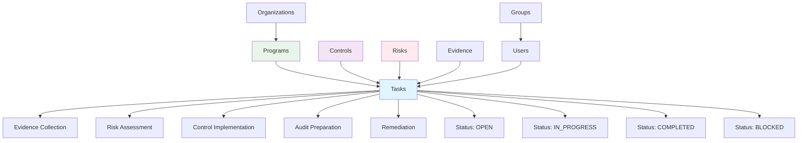
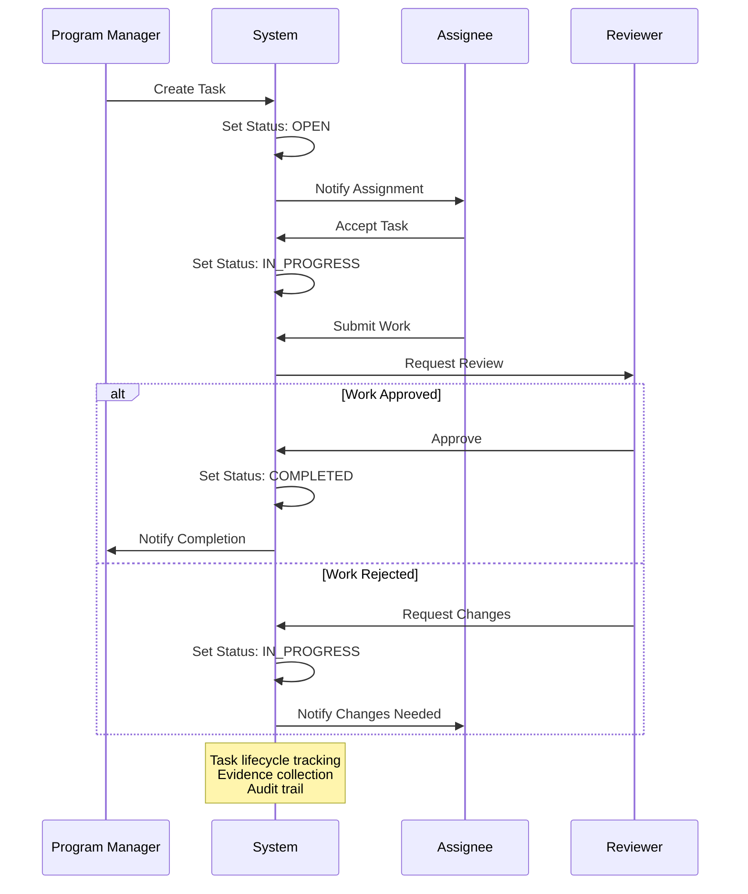

# Tasks

Tasks represent work items, assignments, and activities that need to be completed as part of compliance, risk management, and security operations within Openlane.



## What Are Tasks?

Tasks are actionable work items that enable organizations to track, assign, and manage compliance-related activities. They provide structure for breaking down complex compliance requirements into manageable, trackable work units with clear ownership and deadlines.

## Compliance Significance

Tasks are essential for:
- **Workload Management**: Breaking down compliance requirements into actionable items
- **Accountability**: Assigning clear ownership and responsibility for compliance activities
- **Progress Tracking**: Monitoring progress toward compliance objectives
- **Audit Evidence**: Documenting completion of required compliance activities
- **Resource Planning**: Planning and allocating resources for compliance work

## Task Categories

### Evidence Collection Tasks
- **Purpose**: Collect and organize evidence for compliance requirements
- **Examples**: Document upload, artifact collection, screenshot capture
- **Dependencies**: Related to specific controls or audit requirements
- **Deliverables**: Evidence artifacts, documentation, attestations

### Risk Assessment Tasks
- **Purpose**: Identify, assess, and mitigate organizational risks
- **Examples**: Risk analysis, threat modeling, vulnerability assessment
- **Dependencies**: Related to risk management processes and frameworks
- **Deliverables**: Risk assessments, mitigation plans, monitoring reports

### Control Implementation Tasks
- **Purpose**: Implement and verify security and compliance controls
- **Examples**: Policy updates, system configuration, procedure implementation
- **Dependencies**: Related to specific controls and standards
- **Deliverables**: Implemented controls, verification evidence, documentation

### Audit Preparation Tasks
- **Purpose**: Prepare for internal and external compliance audits
- **Examples**: Document preparation, process review, stakeholder coordination
- **Dependencies**: Related to audit schedules and requirements
- **Deliverables**: Audit-ready documentation, process evidence, compliance reports

### Remediation Tasks
- **Purpose**: Address identified gaps, findings, or non-compliance issues
- **Examples**: Gap remediation, finding resolution, corrective actions
- **Dependencies**: Related to audit findings or risk assessments
- **Deliverables**: Remediation evidence, corrective action plans, validation reports



## Properties

### Core Information
- **ID**: Unique identifier for the task
- **Title**: Descriptive title of the task
- **Details**: Detailed description of the work to be performed
- **Category**: Type of task (evidence collection, risk review, etc.)
- **Status**: Current status (open, in progress, completed, etc.)

### Assignment and Ownership
- **Assignee**: User assigned to complete the task
- **Assigner**: User who created or assigned the task
- **Due Date**: Deadline for task completion
- **Priority**: Task priority level (low, medium, high, critical)

### Context and Relationships
- **Parent Objects**: Associated controls, risks, policies, or programs
- **Evidence**: Linked evidence items or deliverables
- **Comments**: Notes and collaboration on the task
- **Dependencies**: Related tasks or prerequisites

### Lifecycle Tracking
- **Created At**: Task creation timestamp
- **Completed At**: Task completion timestamp
- **Updated At**: Last modification timestamp
- **History**: Audit trail of task changes and status updates

## GraphQL Operations

### Query Tasks
```graphql
query GetTasks($first: Int, $where: TaskWhereInput, $orderBy: [TaskOrder!]) {
  tasks(first: $first, where: $where, orderBy: $orderBy) {
    edges {
      node {
        id
        displayID
        title
        details
        category
        status
        due
        createdAt
        updatedAt
        owner {
          id
          name
        }
      }
    }
    pageInfo {
      hasNextPage
      hasPreviousPage
      startCursor
      endCursor
    }
    totalCount
  }
}
```

### Create Task
```graphql
mutation CreateTask($input: CreateTaskInput!) {
  createTask(input: $input) {
    task {
      id
      displayID
      title
      details
      category
      status
      due
      createdAt
    }
  }
}
```

### Update Task
```graphql
mutation UpdateTask($id: ID!, $input: UpdateTaskInput!) {
  updateTask(id: $id, input: $input) {
    task {
      id
      displayID
      title
      details
      status
      updatedAt
    }
  }
}
```

### Delete Task
```graphql
mutation DeleteTask($id: ID!) {
  deleteTask(id: $id) {
    deletedID
  }
}
```

## API Access

Tasks are managed exclusively through GraphQL operations. There are no REST endpoints for task CRUD operations.

## Task Workflows

### Compliance Task Automation

**Use Case:** Backend service that automatically creates tasks based on compliance deadlines, control implementations, and audit schedules

```go
package automation

import (
	"context"
	"fmt"
	"time"

	"github.com/theopenlane/core/pkg/openlaneclient"
	"github.com/theopenlane/core/pkg/enums"
)

// ComplianceTaskAutomation handles automatic task creation for compliance activities
type ComplianceTaskAutomation struct {
	client openlaneclient.OpenlaneGraphClient
}

// CreateEvidenceCollectionTasks creates tasks for evidence collection based on control requirements
func (cta *ComplianceTaskAutomation) CreateEvidenceCollectionTasks(ctx context.Context, controlID string, evidenceTypes []string) error {
	// Get control details to understand requirements
	control, err := cta.client.GetControlByID(ctx, controlID)
	if err != nil {
		return fmt.Errorf("failed to get control: %w", err)
	}

	var tasks []*openlaneclient.CreateTaskInput
	dueDate := time.Now().AddDate(0, 0, 14) // 2 weeks from now

	for _, evidenceType := range evidenceTypes {
		task := &openlaneclient.CreateTaskInput{
			Title: fmt.Sprintf("Collect %s evidence for %s", evidenceType, control.Control.DisplayID),
			Details: openlaneclient.StringPtr(fmt.Sprintf(`
				Control: %s
				Evidence Type: %s

				Requirements:
				- Collect %s evidence as specified in control implementation guidance
				- Ensure evidence covers the full scope of the control
				- Validate evidence quality before submission
				- Update evidence status in Openlane upon completion

				Assessment Criteria:
				%s
			`,
				control.Control.DisplayID,
				evidenceType,
				evidenceType,
				control.Control.AssessmentObjectives)),
			Category: openlaneclient.StringPtr("evidence_collection"),
			Status: enums.TaskStatusOpen,
			Due: &dueDate,
			ControlIDs: []string{controlID},
			Tags: []string{"automated", "evidence", evidenceType},
		}
		tasks = append(tasks, task)
	}

	// Bulk create tasks
	resp, err := cta.client.CreateBulkTask(ctx, tasks)
	if err != nil {
		return fmt.Errorf("failed to create evidence collection tasks: %w", err)
	}

	log.Printf("Created %d evidence collection tasks for control %s",
		len(resp.CreateBulkTask.Tasks), control.Control.DisplayID)

	return nil
}

// CreateQuarterlyRiskReviewTasks generates risk review tasks for the quarter
func (cta *ComplianceTaskAutomation) CreateQuarterlyRiskReviewTasks(ctx context.Context, quarter int, year int) error {
	// Get all active risks
	risks, err := cta.client.GetRisks(ctx, &openlaneclient.RiskWhereInput{
		Status: &enums.RiskStatusOpen,
	})
	if err != nil {
		return fmt.Errorf("failed to get risks: %w", err)
	}

	// Calculate quarter end date
	quarterEndMonth := quarter * 3
	quarterEndDate := time.Date(year, time.Month(quarterEndMonth), 1, 0, 0, 0, 0, time.UTC)
	quarterEndDate = quarterEndDate.AddDate(0, 1, -1) // Last day of quarter
	taskDueDate := quarterEndDate.AddDate(0, 0, -7) // Due 1 week before quarter end

	var tasks []*openlaneclient.CreateTaskInput

	for _, edge := range risks.Risks.Edges {
		risk := edge.Node

		task := &openlaneclient.CreateTaskInput{
			Title: fmt.Sprintf("Q%d %d Risk Review: %s", quarter, year, risk.Name),
			Details: openlaneclient.StringPtr(fmt.Sprintf(`
				Quarterly Risk Review - Q%d %d

				Risk: %s
				Current Impact: %s
				Current Likelihood: %s
				Current Score: %d

				Review Requirements:
				1. Reassess risk impact and likelihood
				2. Review current mitigation effectiveness
				3. Update risk mitigation strategies if needed
				4. Document any changes in risk profile
				5. Validate risk owner and stakeholder assignments

				Deliverables:
				- Updated risk assessment
				- Mitigation effectiveness report
				- Recommendations for risk treatment changes
			`,
				quarter, year, risk.Name, risk.Impact, risk.Likelihood, risk.Score)),
			Category: openlaneclient.StringPtr("risk_review"),
			Status: enums.TaskStatusOpen,
			Due: &taskDueDate,
			RiskIDs: []string{risk.ID},
			Tags: []string{"quarterly", "risk-review", fmt.Sprintf("Q%d-%d", quarter, year)},
		}
		tasks = append(tasks, task)
	}

	// Bulk create tasks
	resp, err := cta.client.CreateBulkTask(ctx, tasks)
	if err != nil {
		return fmt.Errorf("failed to create quarterly risk review tasks: %w", err)
	}

	log.Printf("Created %d quarterly risk review tasks for Q%d %d",
		len(resp.CreateBulkTask.Tasks), quarter, year)

	return nil
}
```
```

### Audit Preparation Task Generator

**Use Case:** Automated task creation for audit preparation based on audit type, scope, and timeline

```go
package audit

import (
	"context"
	"fmt"
	"time"

	"github.com/theopenlane/core/pkg/openlaneclient"
	"github.com/theopenlane/core/pkg/enums"
)

// AuditPrepManager handles audit preparation task automation
type AuditPrepManager struct {
	client openlaneclient.OpenlaneGraphClient
}

// AuditInfo contains audit details for task creation
type AuditInfo struct {
	AuditType    string    // "SOC2", "ISO27001", "PCI-DSS", etc.
	AuditDate    time.Time
	AuditorFirm  string
	AuditScope   []string  // Controls or areas being audited
	AuditManager string    // Internal audit manager
}

// CreateAuditPrepTasks creates a comprehensive set of audit preparation tasks
func (apm *AuditPrepManager) CreateAuditPrepTasks(ctx context.Context, audit AuditInfo) error {
	// Define audit preparation timeline (working backwards from audit date)
	tasks := apm.generateAuditTasks(audit)

	// Create all tasks in bulk
	resp, err := apm.client.CreateBulkTask(ctx, tasks)
	if err != nil {
		return fmt.Errorf("failed to create audit prep tasks: %w", err)
	}

	log.Printf("Created %d audit preparation tasks for %s audit on %s",
		len(resp.CreateBulkTask.Tasks), audit.AuditType, audit.AuditDate.Format("2006-01-02"))

	return nil
}

// generateAuditTasks creates the task list for audit preparation
func (apm *AuditPrepManager) generateAuditTasks(audit AuditInfo) []*openlaneclient.CreateTaskInput {
	var tasks []*openlaneclient.CreateTaskInput

	// Task 1: Evidence Collection (8 weeks before)
	tasks = append(tasks, &openlaneclient.CreateTaskInput{
		Title: fmt.Sprintf("Collect %s Audit Evidence", audit.AuditType),
		Details: openlaneclient.StringPtr(fmt.Sprintf(`
			Prepare comprehensive evidence package for %s audit

			Activities:
			- Review evidence requirements for %s framework
			- Collect evidence for all in-scope controls: %v
			- Organize evidence by control and testing period
			- Validate evidence completeness and quality
			- Prepare evidence index and summary documents

			Deliverables:
			- Complete evidence package organized by control
			- Evidence index with descriptions and collection dates
			- Gap analysis for any missing evidence
		`, audit.AuditType, audit.AuditType, audit.AuditScope)),
		Category: openlaneclient.StringPtr("audit_preparation"),
		Status: enums.TaskStatusOpen,
		Due: timePtr(audit.AuditDate.AddDate(0, 0, -56)), // 8 weeks before
		Tags: []string{"audit", audit.AuditType, "evidence-collection"},
	})

	// Task 2: Control Testing (6 weeks before)
	tasks = append(tasks, &openlaneclient.CreateTaskInput{
		Title: fmt.Sprintf("%s Control Testing and Validation", audit.AuditType),
		Details: openlaneclient.StringPtr(`
			Perform internal testing of controls before auditor testing

			Activities:
			- Execute test procedures for all controls
			- Document test results and any exceptions
			- Remediate any control deficiencies identified
			- Validate remediation effectiveness
			- Prepare control testing summary

			Deliverables:
			- Internal control test results
			- Exception reports and remediation evidence
			- Control effectiveness assessment
		`),
		Category: openlaneclient.StringPtr("audit_preparation"),
		Status: enums.TaskStatusOpen,
		Due: timePtr(audit.AuditDate.AddDate(0, 0, -42)), // 6 weeks before
		Tags: []string{"audit", audit.AuditType, "control-testing"},
	})

	// Task 3: Documentation Review (4 weeks before)
	tasks = append(tasks, &openlaneclient.CreateTaskInput{
		Title: fmt.Sprintf("%s Documentation and Policy Review", audit.AuditType),
		Details: openlaneclient.StringPtr(`
			Review and update all policies and documentation

			Activities:
			- Review all policies for currency and accuracy
			- Update policies as needed for audit period
			- Ensure management approval for all policies
			- Prepare policy index and version control documentation
			- Review organizational charts and role descriptions

			Deliverables:
			- Current policy library with approval signatures
			- Policy change log for audit period
			- Organizational documentation
		`),
		Category: openlaneclient.StringPtr("audit_preparation"),
		Status: enums.TaskStatusOpen,
		Due: timePtr(audit.AuditDate.AddDate(0, 0, -28)), // 4 weeks before
		Tags: []string{"audit", audit.AuditType, "documentation"},
	})

	// Task 4: Stakeholder Coordination (2 weeks before)
	tasks = append(tasks, &openlaneclient.CreateTaskInput{
		Title: fmt.Sprintf("%s Audit Stakeholder Coordination", audit.AuditType),
		Details: openlaneclient.StringPtr(fmt.Sprintf(`
			Coordinate with stakeholders and prepare for auditor interactions

			Activities:
			- Schedule stakeholder interviews with %s
			- Prepare interview talking points and documentation
			- Coordinate system access for auditor testing
			- Prepare audit workspace and meeting rooms
			- Brief stakeholders on audit process and expectations

			Deliverables:
			- Interview schedule and logistics
			- Stakeholder briefing materials
			- Auditor access credentials and instructions
		`, audit.AuditorFirm)),
		Category: openlaneclient.StringPtr("audit_preparation"),
		Status: enums.TaskStatusOpen,
		Due: timePtr(audit.AuditDate.AddDate(0, 0, -14)), // 2 weeks before
		Tags: []string{"audit", audit.AuditType, "coordination"},
	})

	// Task 5: Final Audit Readiness (1 week before)
	tasks = append(tasks, &openlaneclient.CreateTaskInput{
		Title: fmt.Sprintf("%s Final Audit Readiness Check", audit.AuditType),
		Details: openlaneclient.StringPtr(`
			Final readiness validation before audit begins

			Activities:
			- Conduct final evidence review and organization
			- Validate all systems and access for auditor testing
			- Confirm stakeholder availability and preparedness
			- Prepare audit kick-off materials
			- Complete pre-audit checklist

			Deliverables:
			- Audit readiness certification
			- Final evidence package
			- Auditor welcome package
		`),
		Category: openlaneclient.StringPtr("audit_preparation"),
		Status: enums.TaskStatusOpen,
		Due: timePtr(audit.AuditDate.AddDate(0, 0, -7)), // 1 week before
		Tags: []string{"audit", audit.AuditType, "final-prep"},
	})

	return tasks
}

// Helper function to create time pointers
func timePtr(t time.Time) *time.Time {
	return &t
}

// CreatePostAuditTasks creates follow-up tasks after audit completion
func (apm *AuditPrepManager) CreatePostAuditTasks(ctx context.Context, auditType string, auditCompletionDate time.Time) error {
	var tasks []*openlaneclient.CreateTaskInput

	// Task 1: Process audit findings
	tasks = append(tasks, &openlaneclient.CreateTaskInput{
		Title: fmt.Sprintf("%s Audit Findings Analysis", auditType),
		Details: openlaneclient.StringPtr(`
			Analyze audit findings and plan remediation

			Activities:
			- Review draft audit report
			- Categorize findings by severity and impact
			- Develop remediation plan for each finding
			- Assign remediation owners and timelines
			- Prepare management response to findings
		`),
		Category: openlaneclient.StringPtr("audit_followup"),
		Status: enums.TaskStatusOpen,
		Due: timePtr(auditCompletionDate.AddDate(0, 0, 14)), // 2 weeks after
		Tags: []string{"audit", auditType, "findings"},
	})

	// Task 2: Implement improvements
	tasks = append(tasks, &openlaneclient.CreateTaskInput{
		Title: fmt.Sprintf("%s Process Improvements Implementation", auditType),
		Details: openlaneclient.StringPtr(`
			Implement process improvements identified during audit

			Activities:
			- Execute approved remediation plans
			- Update policies and procedures based on findings
			- Enhance control documentation and evidence collection
			- Provide additional training as needed
			- Document lessons learned
		`),
		Category: openlaneclient.StringPtr("audit_followup"),
		Status: enums.TaskStatusOpen,
		Due: timePtr(auditCompletionDate.AddDate(0, 1, 0)), // 1 month after
		Tags: []string{"audit", auditType, "improvements"},
	})

	resp, err := apm.client.CreateBulkTask(ctx, tasks)
	if err != nil {
		return fmt.Errorf("failed to create post-audit tasks: %w", err)
	}

	log.Printf("Created %d post-audit tasks for %s audit",
		len(resp.CreateBulkTask.Tasks), auditType)

	return nil
}
```
```

### Audit Preparation Workflow
```javascript
// Audit preparation task automation using GraphQL
const createAuditPrepTasks = async (auditId, auditDate) => {
  const mutation = `
    mutation CreateTask($input: CreateTaskInput!) {
      createTask(input: $input) {
        task {
          id
          displayID
          title
          details
          category
          status
          due
        }
      }
    }
  `;

  const prepTasks = [
    {
      title: 'Prepare control evidence',
      category: 'audit_preparation',
      due: new Date(auditDate - 14 * 24 * 60 * 60 * 1000), // 2 weeks before
      details: 'Prepare control evidence for upcoming audit'
    },
    {
      title: 'Review policy documentation',
      category: 'audit_preparation',
      due: new Date(auditDate - 10 * 24 * 60 * 60 * 1000), // 10 days before
      details: 'Review policy documentation for upcoming audit'
    },
    {
      title: 'Coordinate stakeholder interviews',
      category: 'audit_preparation',
      due: new Date(auditDate - 7 * 24 * 60 * 60 * 1000), // 1 week before
      details: 'Coordinate stakeholder interviews for upcoming audit'
    }
  ];

  const createdTasks = [];
  for (const taskData of prepTasks) {
    const variables = {
      input: {
        title: taskData.title,
        details: taskData.details,
        category: taskData.category,
        due: taskData.due.toISOString()
      }
    };

    const response = await fetch('https://api.openlane.io/query', {
      method: 'POST',
      headers: {
        'Authorization': `Bearer ${apiToken}`,
        'Content-Type': 'application/json'
      },
      body: JSON.stringify({
        query: mutation,
        variables: variables
      })
    });

    const result = await response.json();
    createdTasks.push(result.data.createTask.task);
  }

  return createdTasks;
};
```

## Task Templates

### Control Implementation Template
```yaml
# Control implementation task template
template:
  title: "Implement Control: {{control.name}}"
  category: "control_implementation"
  details: |
    Implement security control {{control.ref_code}} - {{control.name}}

    Requirements:
    - Review control requirements
    - Design implementation approach
    - Implement control measures
    - Document implementation
    - Validate effectiveness

    Deliverables:
    - Implementation documentation
    - Configuration evidence
    - Validation test results
  priority: "high"
  estimated_hours: 8
  checklist:
    - "Review control requirements"
    - "Design implementation approach"
    - "Implement control measures"
    - "Document implementation"
    - "Validate effectiveness"
```

### Evidence Collection Template
```yaml
# Evidence collection task template
template:
  title: "Collect Evidence: {{evidence.type}}"
  category: "evidence_collection"
  details: |
    Collect {{evidence.type}} evidence for {{control.name}}

    Instructions:
    - Gather required documentation
    - Take necessary screenshots
    - Collect system outputs
    - Organize and upload evidence

    Evidence Requirements:
    - {{evidence.requirements}}
  priority: "medium"
  estimated_hours: 2
  checklist:
    - "Gather documentation"
    - "Collect artifacts"
    - "Organize evidence"
    - "Upload to platform"
```

## Performance Metrics

### Task Completion Metrics
```javascript
// Calculate task completion metrics using GraphQL
const getTaskMetrics = async (timeframe) => {
  const query = `
    query GetTaskMetrics($timeframe: String!) {
      tasks(where: {
        createdAt: { gte: $timeframe }
      }) {
        edges {
          node {
            id
            status
            category
            due
            createdAt
            updatedAt
          }
        }
        totalCount
      }
    }
  `;

  const variables = { timeframe };

  const response = await fetch('https://api.openlane.io/query', {
    method: 'POST',
    headers: {
      'Authorization': `Bearer ${apiToken}`,
      'Content-Type': 'application/json'
    },
    body: JSON.stringify({
      query: query,
      variables: variables
    })
  });

  const result = await response.json();
  const tasks = result.data.tasks.edges.map(edge => edge.node);

  const completed = tasks.filter(t => t.status === 'completed').length;
  const overdue = tasks.filter(t => new Date(t.due) < new Date() && t.status !== 'completed').length;

  return {
    completionRate: completed / tasks.length,
    totalTasks: tasks.length,
    completedTasks: completed,
    overdueCount: overdue,
    byCategory: groupByCategory(tasks),
    byStatus: groupByStatus(tasks)
  };
};
```

### Team Performance Dashboard
```javascript
// Team task performance dashboard using GraphQL
const getTeamPerformance = async (teamId) => {
  const query = `
    query GetTeamTasks($teamId: ID!) {
      group(id: $teamId) {
        id
        name
        members {
          edges {
            node {
              user {
                id
                firstName
                lastName
                tasks {
                  edges {
                    node {
                      id
                      title
                      status
                      due
                      createdAt
                      updatedAt
                    }
                  }
                }
              }
            }
          }
        }
      }
    }
  `;

  const variables = { teamId };

  const response = await fetch('https://api.openlane.io/query', {
    method: 'POST',
    headers: {
      'Authorization': `Bearer ${apiToken}`,
      'Content-Type': 'application/json'
    },
    body: JSON.stringify({
      query: query,
      variables: variables
    })
  });

  const result = await response.json();
  const teamData = result.data.group;

  // Aggregate tasks from all team members
  const allTasks = [];
  teamData.members.edges.forEach(member => {
    member.node.user.tasks.edges.forEach(task => {
      allTasks.push(task.node);
    });
  });

  return {
    totalTasks: allTasks.length,
    completedTasks: allTasks.filter(t => t.status === 'completed').length,
    overdueTasks: allTasks.filter(t => new Date(t.due) < new Date() && t.status !== 'completed').length,
    averageTimeToComplete: calculateAverageCompletionTime(allTasks),
    tasksByAssignee: groupTasksByAssignee(allTasks)
  };
};
```

## Integration Patterns

| Integration | Relationship | Business Impact |
|-------------|--------------|----------------|
| **Users** | Assignment and accountability | Clear ownership and progress tracking |
| **Evidence** | Task completion generates proof | Systematic evidence collection |
| **Controls** | Tasks implement and validate controls | Structured control deployment |
| **Risks** | Tasks address risk mitigation | Systematic risk management |
| **Programs** | Tasks organized by compliance scope | Coordinated compliance efforts |
| **Standards** | Tasks fulfill specific requirements | Comprehensive compliance coverage |

## Best Practices

### Task Creation
1. **Clear Titles**: Use descriptive, actionable titles for tasks
2. **Detailed Descriptions**: Provide clear instructions and requirements
3. **Appropriate Categories**: Use consistent categorization for reporting
4. **Realistic Deadlines**: Set achievable deadlines based on complexity

### Assignment and Management
1. **Skill-Based Assignment**: Assign tasks to users with appropriate skills
2. **Workload Balancing**: Distribute tasks evenly across team members
3. **Priority Management**: Use priority levels to guide work focus
4. **Regular Reviews**: Conduct regular reviews of task progress and status

### Documentation and Evidence
1. **Evidence Linking**: Link relevant evidence to task completion
2. **Progress Updates**: Document progress and any obstacles encountered
3. **Completion Documentation**: Thoroughly document task completion
4. **Lessons Learned**: Capture insights for future task planning

### Automation and Integration
1. **Template Usage**: Use templates for common task types
2. **Automated Creation**: Automate task creation for recurring activities
3. **Integration Points**: Integrate with external systems for evidence collection
4. **Notification Systems**: Implement appropriate notification and reminder systems

Tasks provide the operational foundation for executing compliance activities and maintaining accountability within Openlane's compliance management framework.