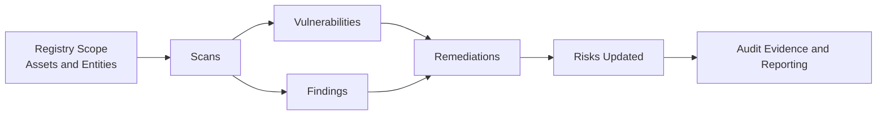

# Exposure

Exposure connects risk decisions to real security work: scans, vulnerabilities, findings, and remediations.

## Exposure Flow

## Why It Matters

- Align technical security data with compliance outcomes
- Prioritize what matters instead of tracking everything equally
- Show auditors a repeatable risk-to-remediation process

## What's in This Section

- [Risks](./risks.mdx) - Define and prioritize business and security risks
- [Scans](./scans.mdx) - Track scan cadence, execution, and coverage context
- [Vulnerabilities](./vulnerabilities.mdx) - Manage known weaknesses and remediation SLAs
- [Findings](./findings.mdx) - Track observed issues from tooling and reviews
- [Remediations](./remediations.mdx) - Document and verify corrective actions

## Compliance Significance

- SOC 2: CC5, CC7, CC8, CC9
- ISO 27001: A.8, A.12, A.16
- HIPAA: Risk analysis and risk management requirements
