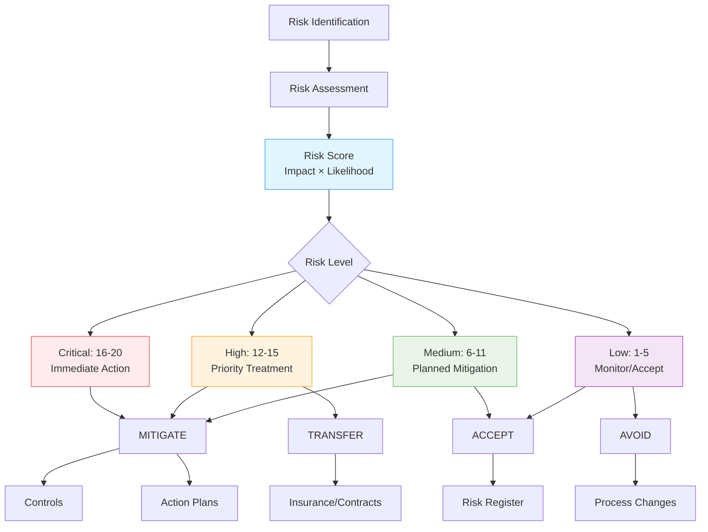

import Tabs from '@theme/Tabs';
import TabItem from '@theme/TabItem';
import Term from '@site/src/components/Term';

# Risks

Track the things that could hurt your organization: score each one by impact and likelihood, decide what to do about it, and keep the whole trail where an auditor can see it. Openlane's risk model works with any risk methodology because it requires only impact, likelihood, and status: there are many schools of thought on defining risks (see [Risk Frameworks](./riskmanagement.mdx)), and whichever you follow, the same lifecycle applies.

Scans, vulnerabilities, and <Term t="finding">findings</Term> are point-in-time technical facts. A risk is the durable business judgment those facts feed: what could go wrong, how bad it would be, and what you have decided to do about it. Promote a technical issue to a register entry when it is systemic (the same finding category recurs across teams), when exposure persists past your service level agreement (SLA) and needs ownership above the security team, or when accepting something significant deserves an accountable owner and periodic review.



Every major framework expects systematic risk management: a maintained register showing that you identify threats, prioritize by severity, and select <Term t="controls">controls</Term> based on actual risk. It answers the auditor's core question (how do you know your controls address your real threats?) and helps you decide where to spend security effort next.

## The Risk Lifecycle

Whatever vocabulary your framework uses, risk management follows the same loop:

1. **Identify.** Paint a complete picture of what could go wrong, through data analysis, stakeholder interviews, and review of external trends. The result is your <Term t="risk-register">risk register</Term>. Risks come from every direction (strategic, operational, financial, technology, compliance, and external events) and can threaten confidentiality, integrity, availability, privacy, reputation, or the balance sheet directly.
2. **Assess.** For each risk, judge how bad it would be (impact) and how likely it is (likelihood), using qualitative methods, quantitative methods, or both.
3. **Prioritize.** Rank by risk score so the worst risks get attention first.
4. **Treat.** Mitigate, transfer, accept, or avoid; see below.
5. **Monitor.** Watch how treatment is performing and adjust. New risks and changed conditions feed back into identification, and the loop starts again.

The [Practical Risk Management Guide](./risk-management-guide.mdx) walks through identification techniques (threat modeling, compliance gap analysis, process reviews) and assessment methods in detail.

## Scoring Risks

Each risk carries an impact and a likelihood, and the risk score is **impact × likelihood**:

| Impact / Likelihood | Very Low (0.5) | Low (1) | Medium (2) | High (3) | Very High (4) |
| ------------------- | -------------- | ------- | ---------- | -------- | ------------- |
| **Critical (5)** | 2.5 | 5 | 10 | 15 | 20 |
| **High (4)** | 2 | 4 | 8 | 12 | 16 |
| **Medium (3)** | 1.5 | 3 | 6 | 9 | 12 |
| **Low (2)** | 1 | 2 | 4 | 6 | 8 |

Scores of 16-20 demand immediate action, 12-15 need priority treatment, 6-11 get planned mitigation, and 1-5 can usually be monitored or accepted.

Status tracks where each risk stands in its lifecycle. The distinction worth getting right is Mitigated versus Archived: a mitigated risk still needs its controls monitored to stay at the reduced level, while an archived risk is resolved or no longer relevant and needs no further attention.

## Treating Risks

You have four options, chosen by score and cost:

- **Mitigate**: implement controls and action plans to reduce the risk. The default for high scores where cost-effective mitigation exists or a regulation requires it.
- **Transfer**: shift the financial impact through insurance or contracts. Fits high-impact, low-likelihood risks like natural disasters.
- **Accept**: live with it, documented in the register. Reasonable for low scores where mitigation would cost more than the exposure.
- **Avoid**: change the process or skip the activity entirely when a risk is unacceptable and can't be mitigated.

The [guide](./risk-management-guide.mdx) gives concrete criteria and worked examples for each decision.

## How Risks Connect

Controls exist to mitigate specific risks; assessments should drive which controls you implement and prioritize, and control effectiveness feeds back into risk ratings. <Term t="action-plan">Action plans</Term> turn treatment decisions into concrete steps, and completing them moves a risk toward Mitigated. Risks can also be managed within compliance program contexts and associated with specific assets and entities, so accountability lands on the right component and the right owner.

For risk guidance specific to individual compliance frameworks, see the [Standards section](../../standards/overview.mdx).


## How Risk Connects to Exposure Work in Openlane

The [exposure pipeline](../overview.mdx) converges on risk: scans surface vulnerabilities and findings, remediations resolve them, and completed remediations update risk posture. The schema wires this directly. [Findings](../findings.mdx) and [vulnerabilities](../vulnerabilities/overview.mdx) link to the risks they evidence, [remediations](../remediations.mdx) link to the risks they reduce, and risks link to the [scans](../scans.mdx) that monitor them, so a register entry can carry its supporting technical record rather than a prose summary of it.

Two fields matter specifically for the exposure loop. A risk's score captures assessed exposure, and its residual score captures what remains after treatment, which is the number completed remediation work should move. Ownership lands on a stakeholder group with an optional delegate, so remediation progress has somewhere to report. Scoring mechanics and the treatment decision are covered above; the full field list is in the [API reference](/graphql).


## Working with Risks in the Exposure Pipeline

### Promote a Finding Pattern to a Risk

When triage keeps surfacing the same category (public storage buckets appearing faster than they close, dependency patches routinely breaching SLA), create a risk describing the systemic issue, link the representative findings or vulnerabilities to it, and assign a stakeholder group. The individual items keep their own remediations; the risk tracks whether the pattern is actually shrinking and gives leadership a single record to review instead of a scanner export.

### Link Remediation Work So Posture Actually Updates

Connect remediations to the risk they reduce as you create them. When the work completes and verification passes, reassess the risk: update the residual score to reflect the reduced exposure and move the status per the lifecycle above. This is the difference between a register that reflects reality and one that still shows last year's assessment after a quarter of engineering work.

### Answer the Auditor's Traceability Question

When an auditor picks a register entry and asks how it is managed, the linked records are the answer: the scans monitoring the affected surface, the findings and vulnerabilities that evidence the risk, and the remediations (with tickets, pull requests, and completion dates) executing the treatment. Walking that chain from judgment to verified work is what auditors ask you to demonstrate.

## Related Documentation

- [Risk GraphQL Examples](../../../developers/graphql-examples/risks.mdx) - Detailed GraphQL API operations for risk management

## FAQ

<details>
<summary>Do I need a formal risk framework to use Openlane?</summary>

No. The model works with the Committee of Sponsoring Organizations of the Treadway Commission (COSO), Factor Analysis of Information Risk (FAIR), ISO 31000, the National Institute of Standards and Technology (NIST), or no named framework at all; impact, likelihood, and status are all you need to start. See [Risk Frameworks](./riskmanagement.mdx) if you want a methodology to lean on.

</details>

<details>
<summary>When does a risk move to MITIGATED versus ARCHIVED?</summary>

Mitigated means you reduced the risk to an acceptable level and are maintaining the controls that keep it there. Archived means the risk is resolved or no longer relevant: the system was decommissioned, the vendor was dropped. Document what you learned before archiving.

</details>

<details>
<summary>Should I assess risks quantitatively or qualitatively?</summary>

Quantitative (dollar-based) assessment works best for financial risks and business-critical systems; qualitative scoring works better for emerging threats and reputation risks. The [guide](./risk-management-guide.mdx) shows both with examples.

</details>

<details>
<summary>When should a finding become a risk?</summary>

When the issue outgrows a single fix: the same finding category recurs across systems, exposure persists past your SLA and needs ownership above the security team, or you are accepting something significant that deserves periodic review. One-off patchable issues stay findings with remediations; systemic patterns and conscious acceptances become register entries.

</details>

## Examples

<Tabs groupId="api-format" queryString>
  <TabItem value="csv" label="CSV">

```csv
# Create
Name,Impact,Likelihood,Status,Details,Mitigation
Privileged access misuse,HIGH,LIKELY,IDENTIFIED,Unauthorized privileged activity could impact production systems.,Enforce MFA and quarterly access reviews.
Delayed patching on internet-facing systems,CRITICAL,HIGHLY_LIKELY,OPEN,Critical fixes may miss SLA windows.,Automate patch validation and escalation.
```

```csv
# Update
ID,Status,Impact,Likelihood,Score,Mitigation
RSK01J9RISK11111111111111,IN_PROGRESS,HIGH,LIKELY,12,Weekly patch board now reviews all critical exposures.
RSK01J9RISK22222222222222,MITIGATED,MODERATE,UNLIKELY,4,Control evidence verified and residual risk accepted.
```

  </TabItem>
  <TabItem value="graphql" label="GraphQL">

```graphql
mutation {
  createRisk(
    input: {
      name: "Privileged access misuse"
      details: "Unauthorized privileged activity could impact production systems."
      mitigation: "Enforce MFA and quarterly access reviews."
    }
  ) {
    risk {
      id
      name
    }
  }
}
```

```graphql
mutation {
  updateRisk(
    id: "RSK01J9RISK11111111111111"
    input: {
      mitigation: "Weekly patch board now reviews all critical exposures."
      businessCosts: "Potential service disruption and incident response cost"
    }
  ) {
    risk {
      id
      mitigation
    }
  }
}
```

  </TabItem>
  <TabItem value="go-client" label="Go Client">

```go
ctx := context.Background()

details := "Unauthorized privileged activity could impact production systems."
mitigation := "Enforce MFA and quarterly access reviews."

_, err := client.CreateRisk(ctx, graphclient.CreateRiskInput{
	Name:       "Privileged access misuse",
	Details:    &details,
	Mitigation: &mitigation,
})
if err != nil {
	return err
}

updatedMitigation := "Weekly patch board now reviews all critical exposures."
_, err = client.UpdateRisk(ctx, "RSK01J9RISK11111111111111", graphclient.UpdateRiskInput{
	Mitigation: &updatedMitigation,
})
if err != nil {
	return err
}
```

  </TabItem>
  <TabItem value="cli" label="CLI">

```bash
openlane risk create \
  --name "Privileged access misuse" \
  --details "Unauthorized privileged activity could impact production systems." \
  --mitigation "Enforce MFA and quarterly access reviews."

openlane risk update \
  --id "RSK01J9RISK11111111111111" \
  --mitigation "Weekly patch board now reviews all critical exposures."
```

  </TabItem>
</Tabs>
