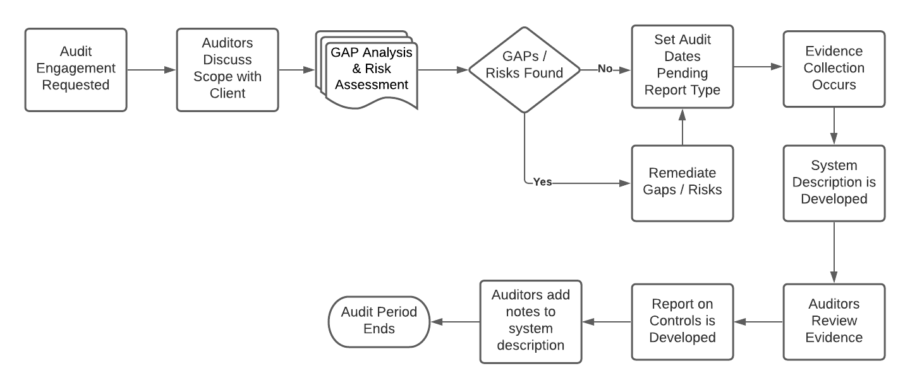

import Term from '@site/src/components/Term';

# Audit Preparation

Before an audit begins there is planning work: setting the timeline, defining the scope, identifying stakeholders, finding and closing gaps, and selecting an audit firm. The pages here are ordered the way that work happens, so you can read them front to back as a preparation plan.

The diagram below does not depict every process in an audit, but it gives you a high-level view of the steps involved in a System and Organization Controls 2 (SOC 2) engagement. Every auditing firm, consultant, and lead implementer has its own processes and techniques for completing the audit.

## Audit Timeline and Period

Different types of audits have different timelines and audit periods. A SOC 2 <Term t="type-i-type-ii">Type 1</Term> report has a minimum auditing period of 3 months; a SOC 2 Type 2 report has a minimum audit period of 6 months. Many organizations first obtain a Type 1 report as a measure of where they stand across people, processes, and technology, then move on to a Type 2 report. The Type 2 report covers the same controls, but over a longer audit period, and requires more evidence.

How much preparation work sits between you and the start of the audit period is what the [gap analysis](./gapanalysis.mdx) and a [risk assessment](../../exposure/risks/risk-management-guide.mdx) tell you: both identify where controls are missing or processes are deficient, and the remediation they surface is what drives your timeline.

## The Preparation Flow

Preparation runs in the following order. Each step links to the page that covers it in detail.

1. [Define the audit scope](./scoping.mdx): what services, systems, and <Term t="trust-services-criteria">Trust Services Categories</Term> the audit covers, and which <Term t="subservice-organization">subservice organizations</Term> are in or out.
1. [Identify key stakeholders](./stakeholders.mdx): who owns control design, <Term t="evidence">evidence</Term> collection, policies, and the <Term t="system-description">system description</Term>.
1. [Perform a gap analysis](./gapanalysis.mdx): compare your current controls and processes against the framework you are targeting, and build a remediation plan. Pair it with a [risk assessment](../../exposure/risks/risk-management-guide.mdx) to identify threats the framework alone will not surface.
1. Remediate: design and implement the controls that close the gaps, covered in [Gap Analysis](./gapanalysis.mdx#from-gaps-to-controls).
1. [Select an audit firm](./firms.mdx) and set the audit dates.

Once the audit begins, the work shifts to evidence collection and auditor interaction; [Audit Procedures](../auditprocedures.mdx) covers how auditors test controls and what evidence they expect.

## The Audit Lifecycle

At a high level, the whole attestation effort runs:

1. Gap analysis performed
1. Remediation where necessary
1. Audit firm selected
1. Audit dates set
1. Audit begins
1. Evidence collected through the audit period
1. Evidence evaluated internally
1. Evidence submitted
1. Evidence reviewed by auditors
1. Opinion provided

Organizations without an internal audit function should still build the internal evidence review into the plan; catching insufficient evidence before submission is far cheaper than a finding.
