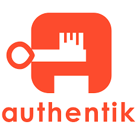

#  Authentik Integration Guide

If your organization runs Authentik as a self-hosted identity provider, this integration pulls your directory data into Openlane so you have the user and group context you need for User Access Reviews, onboarding/offboarding evidence, and identity governance (SOC 2: CC6, ISO 27001: A.9).

## Key Capabilities

- **API Token Authentication:** Connects to your Authentik instance using a static API token scoped to a service account
- **Directory Metadata Sync:** Reads users, groups, and group memberships from Authentik, giving you the identity baseline for access reviews and audits (SOC 2: CC6.2, CC6.3).
- **Service Account Awareness:** Syncs `service_account` and `internal_service_account` user types and maps them to the `SERVICE` account type, keeping your identity roster accurate.
- **Flexible Group Sync:** Group and membership sync can be disabled independently if you only need user data.

## Prerequisites

- A running Authentik instance with a reachable base URL.
- Authentik admin access to create a service account and generate an API token.

## Supported Operations

| Operation | Description |
|---|---|
| `DirectorySync` | Collect Authentik users, groups, and group memberships and emit directory ingest envelopes |

## Step-by-Step Setup

### Step 1: Create an Authentik API Token

1. In the Authentik admin panel, navigate to **Directory** > **Users** and create a dedicated service account for Openlane (or select an existing one).
2. Navigate to **Directory** > **Tokens and App passwords**.
3. Click **Create** and select **API Token** as the token type.
4. Assign the token to your Openlane service account
5. Copy the token value — it is only shown once.

### Step 2: Connect in Openlane

1. Navigate to **Organization Settings** > **Integrations** and find **Authentik**.
2. Click **Configure** and enter the required fields:

| Field | Required | Purpose |
|---|---|---|
| `baseUrl` | Yes | Base URL of your Authentik instance (e.g. `https://authentik.mycompany.com`) |
| `token` | Yes | Static API token used for Bearer token authentication |

3. Click **Save**.

### Step 3: Configure Sync Behavior

Optionally configure which data is collected and how records are filtered before ingestion:

#### Directory Sync

| Setting | Description |
|---|---|
| **Primary Directory** | Designate this connection as the primary directory source for your organization — the primary directory is the authoritative source that populates the majority of fields on identity holder records |
| **Disable Group Sync** | When enabled, only users are synced — groups and memberships are skipped |
| **Filter Expression** | Optional CEL expression evaluated against each record — only records that match are ingested (allows inclusion) |

Filter expression example:

```
payload.type == 'internal'
```

CEL expressions have access to the full raw payload for each record via `payload.<field>`.

## Validate Connection

After saving, Openlane runs a health check against your Authentik instance and displays the result on the **Installed** tab of the Integrations page. A **Healthy** badge confirms connectivity. If the badge shows **Needs Attention**, review the troubleshooting section below.

## What Openlane Syncs

Openlane reads the following resources from Authentik and normalizes them into its internal directory schemas:

| Resource | Authentik Source | Notes |
|---|---|---|
| **DirectoryAccount** | Authentik users | Internal, external, service account, and internal service account types are all synced and mapped to Openlane account types|
| **DirectoryGroup** | Authentik groups | Skipped when Disable Group Sync is enabled |
| **DirectoryMembership** | Group membership relationships | Skipped when Disable Group Sync is enabled |

This data feeds directly into User Access Reviews, onboarding/offboarding verification, and identity scope validation.

## Disconnect

To remove this integration:
1. Navigate to **Organization Settings** > **Integrations**
1. Select the **Installed** tab
1. Open the menu on the integration card and select **Disconnect**
1. Go to API Tokens in Authentik to remove the token

This removes stored credentials and stops all collection activity. You can reconnect later by configuring the integration again.

## Troubleshooting

- **Auth failures:** verify the API token is valid, has not expired, and is assigned to the correct service account.
- **URL issues:** verify the base URL uses HTTPS and does not include a trailing slash (e.g. `https://authentik.mycompany.com`).
- **Missing users:** verify the service account token has read permissions for users, groups, and group memberships in the Authentik admin panel.
- **No group data:** confirm that **Disable Group Sync** is not enabled if you expect group and membership records.

## References

- [Authentik documentation](https://docs.goauthentik.io)
- [Authentik API authentication](https://docs.goauthentik.io/docs/developer-docs/api/#authentication)
- [Authentik token management](https://api.goauthentik.io/authentication)
