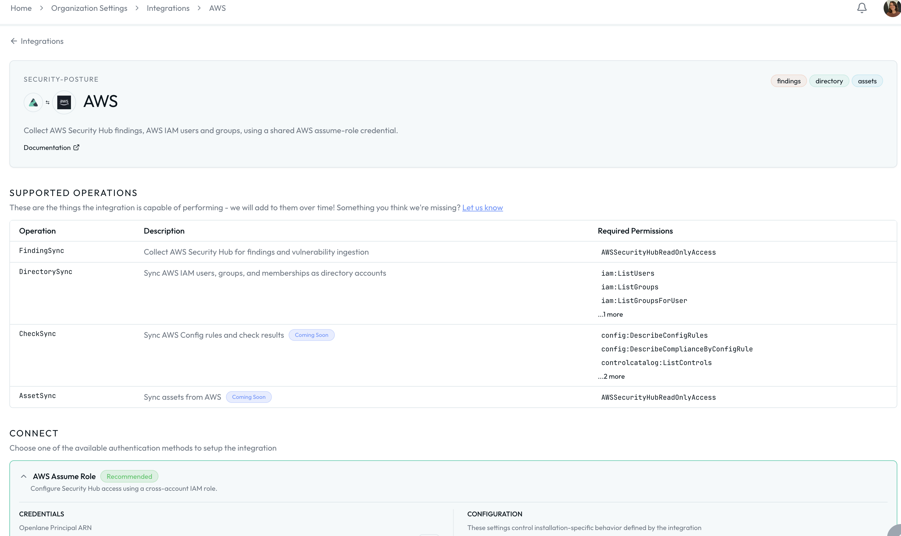

#  AWS Integration Guide

If your team runs infrastructure on AWS, this integration brings Security Hub findings and AWS Config assessment data into Openlane automatically. It uses a read-only, cross-account IAM role, so Openlane reads your security data without touching your configuration.

## Integration Snapshot

| Item | Details |
|---|---|
| Primary use case | Continuous AWS infrastructure security monitoring in Openlane |
| Data direction | One-way (AWS -> Openlane), read-only |
| AWS services used | STS, Security Hub, AWS IAM (optional), AWS Config (optional) |
| Setup model | Cross-account IAM role with `sts:AssumeRole` and `sts:ExternalId` |
| Openlane records created | Vulnerabilities and Findings (created or updated), Directory Accounts (created or updated), linked to your AWS integration |

## Key Capabilities

- **Read-Only Cross-Account Access:** Uses a dedicated IAM role so Openlane can read your environment without making configuration changes.
- **Security Findings Ingestion:** Pulls Security Hub findings and normalizes them into Openlane vulnerability and finding records, giving you a single place to track remediation timelines and SLA compliance (SOC 2: CC7, CC8).
- **AWS IAM:** Optionally read user access and groups and associate with identity holders in Openlane.
- **AWS Config:** Optionally reads config rules and metadata to help validate that compliance controls like change management and access governance are covered.

## Prerequisites

- IAM permissions to create IAM roles and policies in the AWS account that Openlane will access.
- Security Hub enabled in the accounts and regions you want monitored.
- If using the CloudFormation option: [AWS CLI](https://docs.aws.amazon.com/cli/latest/userguide/getting-started-install.html) installed and authenticated against the target account.

## Step-by-Step Setup

### Step 1: Get Your Openlane Connection Values

Before creating anything in AWS, retrieve the two values Openlane provides for your tenant:

# 

1. Navigate to **Organization Settings** > **Integrations** and find **AWS**.
2. Click **Configure**.
3. Copy the pre-generated values shown on the configuration page:
   - **Openlane Principal ARN** — the ARN of the Openlane IAM identity that will assume the role in your account
   - **External ID** — a unique identifier scoped to your Openlane tenant, used to prevent confused deputy attacks

You will need both of these in the next step.

### Step 2: Create the Cross-Account IAM Role

Choose the method that fits your workflow. Both produce the same result — a cross-account IAM role with a trust policy that allows Openlane to assume it.

#### Option A: CloudFormation

Use the Openlane CloudFormation template to create the role. Security Hub access is always granted. IAM and Config access are opt-in and default to disabled.

1. Download the template:

```bash
curl -fsSL https://docs.theopenlane.io/integrations/setup/aws/openlane-aws-integration-role.yaml \
  -o openlane-aws-integration-role.yaml
```

:::info
Run `aws sts get-caller-identity` to confirm you are targeting the correct account before proceeding.
:::

2. Deploy the stack using the values copied from the Openlane configuration page:

```bash
aws cloudformation deploy \
  --stack-name openlane-aws-integration \
  --template-file openlane-aws-integration-role.yaml \
  --capabilities CAPABILITY_NAMED_IAM \
  --parameter-overrides \
    OpenlanePrincipalArn=<OPENLANE_PRINCIPAL_ARN> \
    ExternalId=<OPENLANE_EXTERNAL_ID> \
    HomeRegion=<SECURITY_HUB_HOME_REGION> \
    EnableIAMAccess=false \
    EnableAuditConfig=false
```

Replace the following values before running:

- `<OPENLANE_PRINCIPAL_ARN>` — copied from the **Openlane Principal ARN** field on the configuration page
- `<OPENLANE_EXTERNAL_ID>` — copied from the **External ID** field on the configuration page
- `<SECURITY_HUB_HOME_REGION>` — your Security Hub aggregation home region (e.g. `us-east-1`)

Optionally enable additional data sources by setting `EnableIAMAccess` or `EnableAuditConfig` to `true`.

| Parameter | Required | Description |
|---|---|---|
| `OpenlanePrincipalArn` | Yes | Copied from the Openlane configuration page |
| `ExternalId` | Yes | Copied from the Openlane configuration page |
| `HomeRegion` | Yes | Your Security Hub aggregation home region (e.g. `us-east-1`) |
| `EnableIAMAccess` | No | Set to `true` to grant IAM user and group read access (default: `false`) |
| `EnableAuditConfig` | No | Set to `true` to grant AWS Config and Control Catalog read access (default: `false`) |

3. Once the stack deploys, capture the `RoleArn` output:

```bash
aws cloudformation describe-stacks \
  --stack-name openlane-aws-integration \
  --query 'Stacks[0].Outputs[*].[OutputKey,OutputValue]' \
  --output table
```

Example output:

**DescribeStacks**

| Field | Example Value |
|---|---|
| `HomeRegion` | `us-east-1` |
| `ExternalId` | `openlane-6e322e11-a17c-4308-adf2-11h5f2a1a4ag` |
| `RoleArn` | `arn:aws:iam::<YOUR_ACCOUNT_ID>:role/OpenlaneIntegrationReadOnlyRole` |


Copy the `RoleArn` value — you will enter it into Openlane in Step 4.

#### Option B: AWS Console

1. In the [AWS Console](https://console.aws.amazon.com/), navigate to **IAM** > **Roles** > **Create role**.
2. Under **Trusted entity type**, select **Custom trust policy**.
3. Paste the following, replacing the placeholders with the values from the Openlane configuration page:

<details>
<summary>Trust policy JSON</summary>

```json
{
  "Version": "2012-10-17",
  "Statement": [
    {
      "Effect": "Allow",
      "Principal": {
        "AWS": "<OPENLANE_PRINCIPAL_ARN>"
      },
      "Action": "sts:AssumeRole",
      "Condition": {
        "StringEquals": {
          "sts:ExternalId": "<OPENLANE_EXTERNAL_ID>"
        }
      }
    }
  ]
}
```

</details>

4. Click **Next**.
5. Click **Next** again to skip attaching managed policies — you will add an inline policy instead.
6. Give the role a name (e.g. `OpenlaneIntegrationReadOnlyRole`) and click **Create role**.
7. Open the role you just created, go to the **Permissions** tab, and click **Add permissions** > **Create inline policy**.
8. Switch to the **JSON** editor and paste the policy below, removing any blocks for data sources you do not want to grant:

<details>
<summary>Inline policy JSON</summary>

```json
{
	"Version": "2012-10-17",
	"Statement": [
		{
			"Sid": "HealthCheckIdentity",
			"Effect": "Allow",
			"Action": [
				"securityhub:Describe*"
			],
			"Resource": "*"
		},
		{
			"Sid": "SecurityHubReadFindings",
			"Effect": "Allow",
			"Action": [
				"securityhub:GetFindings",
				"securityhub:Get*",
				"securityhub:List*",
				"securityhub:BatchGet*",
				"securityhub:Describe*"
			],
			"Resource": "*"
		},
		{
			"Sid": "IAMReadUsers",
			"Effect": "Allow",
			"Action": [
				"iam:ListUsers",
				"iam:ListGroups",
				"iam:ListGroupsForUser",
				"iam:ListUserTags"
			],
			"Resource": "*"
		},
		{
			"Sid": "AuditConfigReadRules",
			"Effect": "Allow",
			"Action": [
				"config:DescribeConfigRules",
				"config:DescribeComplianceByConfigRule",
				"controlcatalog:ListControls",
				"controlcatalog:ListControlMappings",
				"controlcatalog:ListCommonControls"
			],
			"Resource": "*"
		}
	]
}
```

</details>

9. Click **Next**, give the policy a name, and click **Save**.
10. Copy the **ARN** shown at the top of the role summary page — you will enter it into Openlane in Step 4.

### Step 3 : Configure Security Hub Coverage

1. Enable Security Hub for the target accounts and regions.
2. If you use AWS Organizations, configure delegated admin and cross-region aggregation.
3. Use the same home region for `HomeRegion` in the CloudFormation parameters and in Openlane.

### Step 4: Connect AWS in Openlane

1. Return to **Organization Settings** > **Integrations** > **AWS** > **Configure**.
2. Enter the following — the External ID is already pre-populated from Step 1 but ensure it matches if you've navigated away from the page:

| Field | Required | Purpose |
|---|---|---|
| `roleArn` | Yes | Cross-account IAM role ARN from the CloudFormation `RoleArn` output |
| `homeRegion` | Yes | Security Hub aggregation home region (default: `us-east-1`) |
| `linkedRegions` | No | Explicit region list to filter findings by region |
| `accountId` | No || AWS account identifier for reference |
| `accountScope` | No | `all` (default) or `specific` to limit to listed account IDs |
| `accountIds` | Conditional | Required when `accountScope` is `specific` |
| `sessionToken` | No | Session token when using temporary static credentials |
| `sessionDuration` | No | STS session duration override (Go duration string, e.g. `1h30m`) |
| `sessionName` | No | STS session name override |
| `accountId` | No | AWS account identifier for reference |

### Configuration

Optionally configure data ingestion behavior:

#### AWS Security Hub Sync

| Setting | Description |
|---|---|
| **Disable** | Turn off Security Hub finding ingestion without disconnecting the integration |
| **Filter Expression** | CEL expression evaluated against each finding — only findings that match are ingested |

Filter expression examples:

```bash
# Ingest only critical and high severity findings
payload.Severity.Label == 'CRITICAL' || payload.Severity.Label == 'HIGH'
```

```bash
# Exclude a specific finding type
payload.Type != 'Software and Configuration Checks/Vulnerabilities/CVE'
```

#### Directory Account Sync

| Setting | Description |
|---|---|
| **Disable** | Turn off IAM user and group ingestion without disconnecting the integration |
| **Disable Group Sync** | Sync IAM users only — skip group membership |
| **Filter Expression** | CEL expression evaluated against each IAM user record — only records that match are ingested |

Filter expression examples:

```
# Ingest only users under the /engineering/ IAM path
payload.path.startsWith('/engineering/')
```

CEL expressions have access to the full raw payload for each record via `payload.<field>`.

## Alternate Authentication: Static Credentials Setup

If cross-account IAM role assumption is not available in your environment — for example, if your AWS account does not support STS, if you are working in an isolated environment, or if you need to get started quickly without setting up a cross-account role — you can authenticate using a long-lived IAM user access key instead.

:::warning
Static credentials do not rotate automatically and carry more risk than the cross-account role approach. Use them only when role assumption is not an option, scope the IAM user permissions as narrowly as possible, and rotate the key on a regular cadence.
:::

### Step 1: Create a Dedicated IAM User

1. In the [AWS Console](https://console.aws.amazon.com/), navigate to **IAM** > **Users** > **Create user**.
2. Enter a name (e.g. `openlane-integration-readonly`) and click **Next**.
3. Select **Attach policies directly** and click **Next** — you will add an inline policy after creation instead of using a managed policy.
4. Click **Create user**.
5. Open the user you just created, go to the **Permissions** tab, and click **Add permissions** > **Create inline policy**.
6. Switch to the **JSON** editor and paste the policy below, removing any blocks for data sources you do not need:

<details>
<summary>Inline policy JSON</summary>

```json
{
	"Version": "2012-10-17",
	"Statement": [
		{
			"Sid": "HealthCheckIdentity",
			"Effect": "Allow",
			"Action": [
				"securityhub:Describe*"
			],
			"Resource": "*"
		},
		{
			"Sid": "SecurityHubReadFindings",
			"Effect": "Allow",
			"Action": [
				"securityhub:GetFindings",
				"securityhub:Get*",
				"securityhub:List*",
				"securityhub:BatchGet*",
				"securityhub:Describe*"
			],
			"Resource": "*"
		},
		{
			"Sid": "IAMReadUsers",
			"Effect": "Allow",
			"Action": [
				"iam:ListUsers",
				"iam:ListGroups",
				"iam:ListGroupsForUser",
				"iam:ListUserTags"
			],
			"Resource": "*"
		},
		{
			"Sid": "AuditConfigReadRules",
			"Effect": "Allow",
			"Action": [
				"config:DescribeConfigRules",
				"config:DescribeComplianceByConfigRule",
				"controlcatalog:ListControls",
				"controlcatalog:ListControlMappings",
				"controlcatalog:ListCommonControls"
			],
			"Resource": "*"
		}
	]
}
```

</details>

7. Click **Next**, give the policy a name (e.g. `OpenlaneIntegrationReadOnly`), and click **Save**.

### Step 2: Generate an Access Key

1. Open the IAM user you just created and go to the **Security credentials** tab.
2. Under **Access keys**, click **Create access key**.
3. Select **Third-party service** as the use case and click **Next**.
4. Click **Create access key**.
5. Copy both the **Access key ID** and the **Secret access key** — the secret is only shown once and cannot be retrieved later.

### Step 3: Connect AWS in Openlane Using Static Credentials

1. Navigate to **Organization Settings** > **Integrations** > **AWS** > **Configure**.
2. Enter the following fields — leave `roleArn` and `externalId` empty, as they are not used with static credentials:

| Field | Required | Purpose |
|---|---|---|
| `accessKeyId` | Yes | AWS Access Key ID from the IAM user |
| `secretAccessKey` | Yes | AWS Secret Access Key from the IAM user |
| `sessionToken` | No | Include only when using temporary credentials obtained via `sts:GetSessionToken` |

3. Click **Save**.

Openlane authenticates directly with the provided key pair without attempting role assumption. All data collection capabilities are identical to the cross-account role approach.

## Validate Connection

After saving, Openlane runs a health check against AWS and displays the result on the **Installed** tab of the Integrations page. A **Healthy** badge confirms connectivity. If the badge shows **Needs Attention**, review the troubleshooting section below.

## Supported Operations

This integration is read-only and one-directional. Openlane assumes your IAM role, validates identity with STS, then pulls data from the AWS services you granted access to. Openlane never pushes configuration changes back into AWS.

## What Openlane Creates From Findings

Each Security Hub finding becomes a normalized finding or vulnerability record in Openlane:

- Converts AWS findings into findings and vulnerabilities with severity, status, summary, description, timestamps, and source URIs preserved.
- Deduplicates by `externalID` (with CVE fallback matching when present), so repeated scans update existing records instead of creating duplicates.
- Links each vulnerability to the AWS integration that produced it.
- Stores raw payload data

### What You Can Do Next

Once the findings land in Openlane, you can link them to affected assets, create remediation tasks, and track resolution against SLAs. During audits, this gives you a clear trail from finding to fix that maps directly to SOC 2 CC7 (system monitoring) and ISO 27001 A.12.6 (technical vulnerability management).

## Disconnect

To remove this integration, navigate to **Organization Settings** > **Integrations** and select the **Installed** tab. Open the menu on the integration card and select **Disconnect**. This removes stored credentials and stops all collection activity. You can reconnect later by configuring the integration again.

## Troubleshooting

- **Access denied on connect or health check:** verify the role ARN, that the trust policy Principal matches the Openlane Principal ARN from the configuration page, and that the external ID matches.
- **No findings ingested:** verify Security Hub is enabled in the configured region and that `EnableSecurityHub=true` was set when deploying the CloudFormation stack.
- **No IAM data:** verify `EnableIAMAccess=true` was set when deploying the CloudFormation stack.
- **No Config data:** verify `EnableAuditConfig=true` was set and AWS Config is enabled in the target account.

## References

- [Openlane AWS CloudFormation template](https://docs.theopenlane.io/integrations/setup/aws/openlane-aws-integration-role.yaml)
- [AWS Security Hub overview](https://docs.aws.amazon.com/securityhub/latest/userguide/what-is-securityhub.html)
- [AWS Config overview](https://docs.aws.amazon.com/config/latest/developerguide/WhatIsConfig.html)
- [AWS IAM third-party access with External ID](https://docs.aws.amazon.com/IAM/latest/UserGuide/id_roles_common-scenarios_third-party.html)
