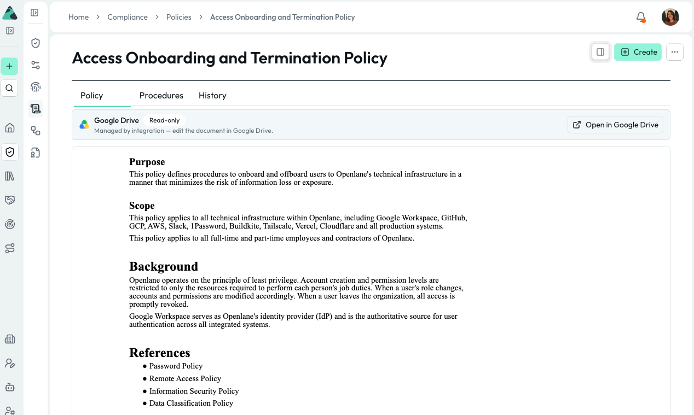

#  Google Drive Integration Guide

If your organization stores policies and compliance documents in Google Drive, this integration surfaces them directly in Openlane — no copy-paste, no version drift. Documents remain editable in Drive; Openlane displays them read-only and keeps them in sync automatically.

## Key Capabilities

- **OAuth Connectivity:** Connects to Google Drive using a workspace admin OAuth flow — no service account credentials or API keys to manage.
- **Policy Document Sync:** Syncs documents from a specified Drive folder into Openlane so policies are always current without manual uploads.
- **Read-Only Display in Openlane:** Documents sourced from Drive are marked as managed by the integration — edits are made in Google Drive and reflected automatically in Openlane.
- **Primary Document Manager:** Designate Google Drive as your primary document source so new policies default to Drive-managed documents.
- **Scoped Folder Sync:** Limit ingestion to a specific Drive folder so only your compliance documents are synced, not your entire Drive.

## Prerequisites

- Google Workspace super admin account to authorize Drive access during OAuth.
- The Google Drive folder ID or URL for the folder containing your policy documents.

## Step-by-Step Setup

### Step 1: Authorize Google Drive

1. Navigate to **Organization Settings** > **Integrations** and find **Google Drive**.
2. Click **Configure**.
3. Click **Continue to Authorization** — you will be redirected to Google. There are no credentials to enter manually.
4. Sign in with a Google Workspace account that has access to the target Drive folder.
5. Grant the requested Drive permissions.
6. After authorization, you are redirected back to Openlane and the connection is saved.

### Step 2: Configure Sync Behavior

After authorizing, configure which documents Openlane pulls in and how they are managed:

| Setting | Description |
|---|---|
| **Folder ID** | The Google Drive folder ID to sync — only documents within this folder are ingested. Leave blank to sync from the root of My Drive |
| **Primary Document Manager** | Designate Google Drive as the primary document source for your organization — new policies default to Drive-managed documents |

:::tip
To find a folder ID, open the folder in Google Drive. The ID is the string at the end of the URL: `https://drive.google.com/drive/folders/<FOLDER_ID>`.
:::

### Step 3: Link Documents to Policies

Once the integration is connected and a folder is synced, Drive documents automatically appear in openlane as policies. Policies linked to a Drive document show a **Google Drive** banner with a direct link to open and edit the source file.

Documents sourced from Google Drive are **read-only in Openlane** — all edits happen in Google Drive and are reflected in Openlane on the next sync.

## Validate Connection

After saving, Openlane runs a health check against the Drive API and displays the result on the **Installed** tab of the Integrations page. A **Healthy** badge confirms connectivity. If the badge shows **Needs Attention**, review the troubleshooting section below.

## What Openlane Syncs

| Resource | Source | Notes |
|---|---|---|
| **Policy Documents** | Google Drive folder | Synced from the configured folder; documents are read-only in Openlane |

Policy content is surfaced inline in Openlane alongside your compliance controls and evidence, eliminating the need to maintain separate document stores or manually attach PDFs during audits.

## Disconnect

To remove this integration:

1. Navigate to **Organization Settings** > **Integrations**
1. Select the **Installed** tab
1. Open the menu on the integration card and select **Disconnect**

This removes stored credentials and stops document sync. Existing policies that were linked to Drive documents retain their content but will no longer update automatically. You can reconnect later by configuring the integration again.

## Troubleshooting

- **Authorization errors:** verify the authorizing account has access to the target Drive folder and that all requested OAuth scopes were granted.
- **No documents syncing:** verify the folder ID is correct and that the authorizing account has access to the folder.
- **Documents not updating:** refresh the page, updates should come in immediately
- **Drive API errors:** verify that the Google Drive API is enabled in the Google Cloud project associated with your Workspace.

## References

- [Google Drive API overview](https://developers.google.com/drive/api/guides/about-sdk)
- [Google Workspace OAuth scopes](https://developers.google.com/identity/protocols/oauth2/scopes#drive)
- [Find a Google Drive folder ID](https://support.google.com/drive/answer/2494822)
