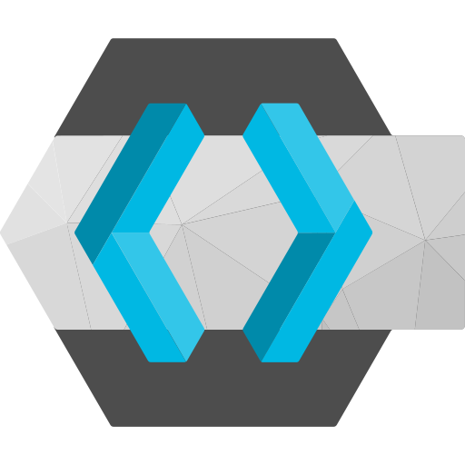

import Steps from '@site/src/components/Steps';
import Term from '@site/src/components/Term';

#  Keycloak Integration Guide

If your organization runs Keycloak as a self-hosted identity provider, this integration pulls your directory data into Openlane so you have the user and group context you need for User Access Reviews, onboarding/offboarding <Term t="evidence">evidence</Term>, and identity governance.

## Key Capabilities

- **Client Credentials Authentication:** Connects to your Keycloak instance using a confidential client with service accounts enabled — no user credentials stored.
- **Directory Metadata Sync:** Reads users, groups, and group memberships from your Keycloak realm, giving you the identity baseline for access reviews and audits.
- **Flexible Group Sync:** Group and membership sync can be disabled independently if you only need user data.

## Prerequisites

- A running Keycloak instance with a reachable base URL.
- Keycloak admin access to create a client and assign realm-management roles.

## Step-by-Step Setup

### Step 1: Create a Keycloak Client for Openlane

<Steps>

1. In the Keycloak admin console, select the realm you want to connect.
2. Navigate to **Clients** and click **Create client**.
3. Set a **Client ID** (e.g. `openlane`) and click **Next**.
4. Enable **Client authentication** and enable **Service accounts roles**, then click **Save**.
5. Open the client's **Service accounts roles** tab and click **Assign role**.
6. Filter by **realm-management** and assign at minimum `view-users` and `view-groups`.
7. Open the **Credentials** tab and copy the **Client secret** — it is only shown once after regeneration.

</Steps>

### Step 2: Connect in Openlane

<Steps>

1. Navigate to **Organization Settings** > **Integrations** and find **Keycloak**.
2. Click **Configure** and enter the required fields:

   | Field | Required | Purpose |
   |---|---|---|
   | `baseUrl` | Yes | Base URL of your Keycloak instance (e.g. `https://keycloak.mycompany.com`) |
   | `realm` | Yes | The Keycloak realm to sync (e.g. `master` or your organization realm) |
   | `clientId` | Yes | The client ID of the confidential client created in Step 1 |
   | `clientSecret` | Yes | The client secret from the client's Credentials tab |

3. Click **Save**.

</Steps>

### Step 3: Configure Sync Behavior

Optionally configure which data is collected and how records are filtered before ingestion:

#### Directory Sync

| Setting | Description |
|---|---|
| **Primary Directory** | Designate this connection as the primary directory source for your organization; the primary directory is the authoritative source that populates the majority of fields on identity holder records |
| **Disable Group Sync** | When enabled, only users are synced; groups and memberships are skipped |
| **Filter Expression** | Optional Common Expression Language (CEL) expression evaluated against each record; only records that match are ingested (allows inclusion) |

Filter expression example:

```
payload.enabled == true
```

CEL expressions have access to the full raw payload for each record via `payload.<field>`.

## Validate Connection

After saving, Openlane runs a health check against your Keycloak instance and displays the result on the **Installed** tab of the Integrations page. You should see a **Healthy** badge confirming connectivity. If the badge shows **Needs Attention**, review the troubleshooting section below.

## What Openlane Syncs

Openlane reads users, groups, and group memberships from your Keycloak realm. Groups and memberships are skipped when **Disable Group Sync** is enabled, which is useful if you only need user data.

This data feeds directly into User Access Reviews, onboarding/offboarding verification, and identity scope validation.

## Disconnect

To remove this integration:
<Steps>

1. Navigate to **Organization Settings** > **Integrations**
1. Select the **Installed** tab
1. Open the menu on the integration card and select **Disconnect**
1. In the Keycloak admin console, delete or disable the Openlane client from the **Clients** list

</Steps>

This removes stored credentials and stops all collection activity. You can reconnect later by configuring the integration again.

## Troubleshooting

- **Auth failures:** verify the client secret is correct and that the client has **Service accounts roles** enabled.
- **URL issues:** verify the base URL uses HTTPS and does not include a trailing slash (e.g. `https://keycloak.mycompany.com`).
- **Missing users:** verify the client's service account has `view-users` and `view-groups` roles assigned under **realm-management**.
- **No group data:** confirm that **Disable Group Sync** is not enabled if you expect group and membership records.

## References

- [Keycloak documentation](https://www.keycloak.org/documentation)
- [Keycloak Admin REST API](https://www.keycloak.org/docs-api/latest/rest-api/)
- [Keycloak service accounts](https://www.keycloak.org/docs/latest/server_admin/#_service_accounts)
