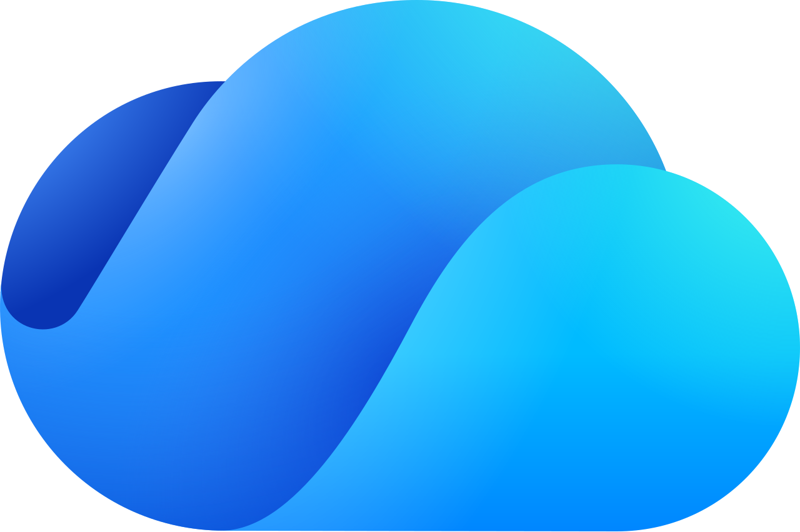

import Steps from '@site/src/components/Steps';

#  OneDrive Integration Guide

If your organization stores policies and compliance documents in Microsoft OneDrive or SharePoint, this integration surfaces them directly in Openlane, with no copying between systems and no version drift. Documents remain editable in OneDrive; Openlane displays them read-only and keeps them in sync automatically.

## Key Capabilities

- **OAuth Connectivity:** Connects to OneDrive using a Microsoft OAuth flow, with no service account credentials or API keys to manage.
- **Policy Document Sync:** Syncs documents from a specified OneDrive folder into Openlane so policies are always current without manual uploads.
- **Read-Only Display in Openlane:** Documents sourced from OneDrive are marked as managed by the integration; edits are made in OneDrive and reflected automatically in Openlane.
- **Primary Document Manager:** Designate OneDrive as your primary document source so new policies default to OneDrive-managed documents.
- **Scoped Folder Sync:** Limit ingestion to a specific OneDrive folder so only your compliance documents are synced rather than your entire drive.

## Prerequisites

- A Microsoft 365 account with access to the target OneDrive folder.
- The OneDrive folder name for the folder containing your policy documents.

## Step-by-Step Setup

### Step 1: Authorize OneDrive

<Steps>

1. Navigate to **Organization Settings** > **Integrations** and find **OneDrive**.
2. Click **Configure**.
3. Click **Continue to Authorization**. You will be redirected to Microsoft. There are no credentials to enter manually.
4. Sign in with a Microsoft 365 account that has access to the target OneDrive folder.
5. Grant the requested permissions.
6. After authorization, you are redirected back to Openlane and the connection is saved.

</Steps>

### Step 2: Configure Sync Behavior

After authorizing, configure which documents Openlane pulls in and how they are managed:

| Setting | Description |
|---|---|
| **Folder** | The OneDrive folder name to sync (e.g `Policies`); only documents within this folder are ingested. Leave blank to sync from the root of your OneDrive |
| **Primary Document Manager** | Designate OneDrive as the primary document source for your organization; new policies default to OneDrive-managed documents |

### Step 3: Link Documents to Policies

Once the integration is connected and a folder is synced, OneDrive documents automatically appear in Openlane as policies. Policies linked to a OneDrive document show a **OneDrive** banner with a direct link to open and edit the source file.

Documents sourced from OneDrive are **read-only in Openlane**; all edits happen in OneDrive and are reflected in Openlane on the next sync.

## Validate Connection

After saving, Openlane runs a health check against the OneDrive API and displays the result on the **Installed** tab of the Integrations page. You should see a **Healthy** badge confirming connectivity. If the badge shows **Needs Attention**, review the troubleshooting section below.

## What Openlane Syncs

| Resource | Source | Notes |
|---|---|---|
| **Policy Documents** | OneDrive folder | Synced from the configured folder; documents are read-only in Openlane |

Policy content is surfaced inline in Openlane alongside your compliance controls and evidence, eliminating the need to maintain separate document stores or manually attach PDFs during audits.

## Disconnect

To remove this integration:

<Steps>

1. Navigate to **Organization Settings** > **Integrations**
1. Select the **Installed** tab
1. Open the menu on the integration card and select **Disconnect**

</Steps>

This removes stored credentials and stops document sync. You can reconnect later by configuring the integration again.

## Troubleshooting

- **Authorization errors:** verify the authorizing account has access to the target OneDrive folder and that all requested OAuth permissions were granted.
- **No documents syncing:** verify the folder ID is correct and that the authorizing account has access to the folder.
- **Documents not updating:** refresh the page; updates should appear immediately.
- **OneDrive API errors:** verify that the Microsoft Graph API is accessible and that your Microsoft 365 tenant has not restricted third-party OAuth applications.

## References

- [Microsoft OneDrive developer documentation](https://learn.microsoft.com/en-us/onedrive/developer/)
- [Microsoft Graph OneDrive API](https://learn.microsoft.com/en-us/graph/api/resources/onedrive)
- [Get a OneDrive folder item ID](https://learn.microsoft.com/en-us/graph/api/driveitem-get)
