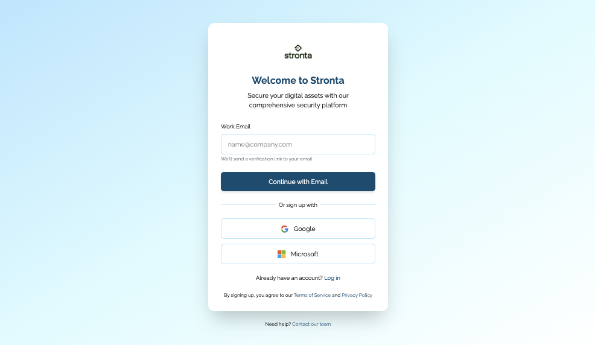
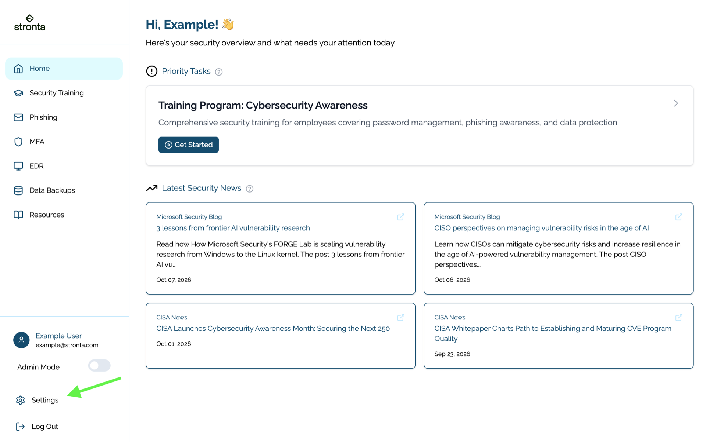
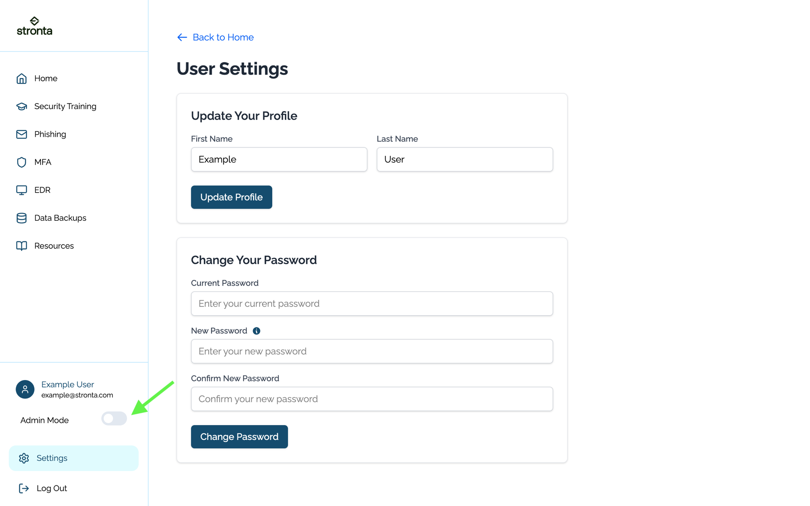
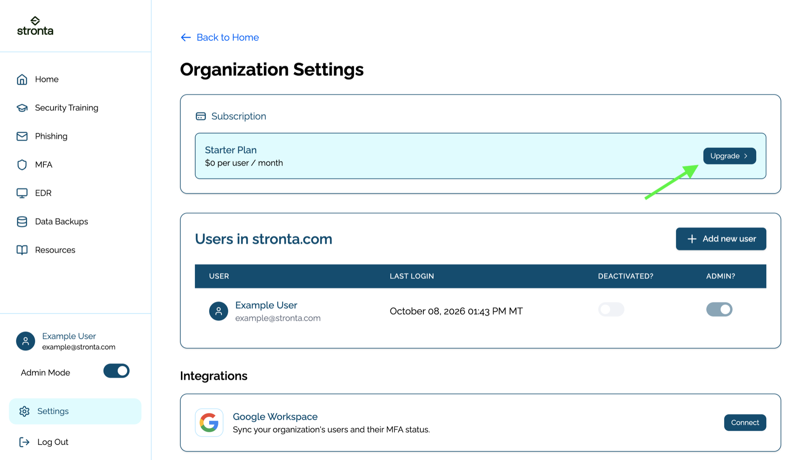
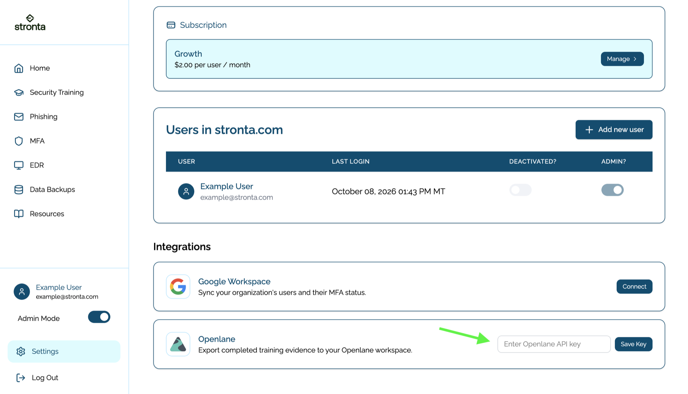
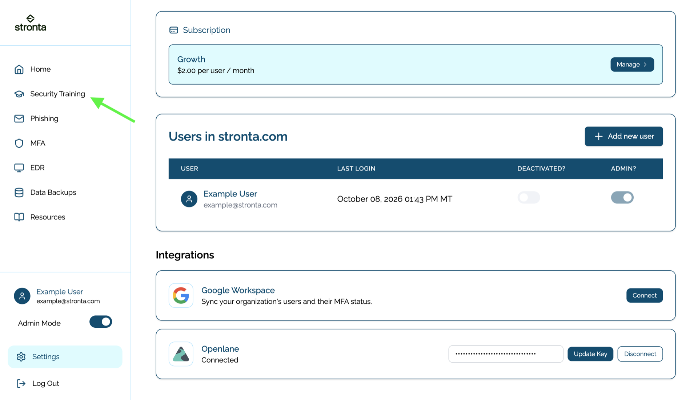
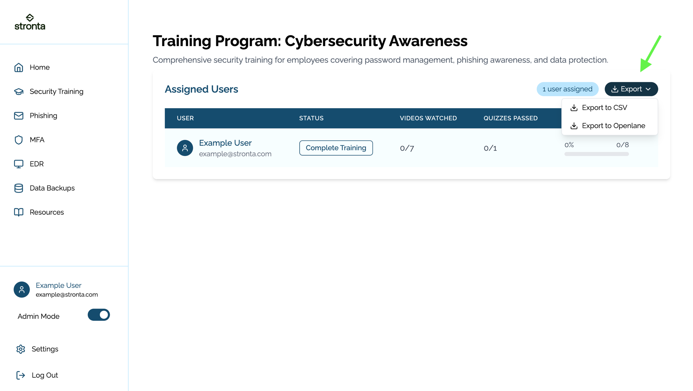
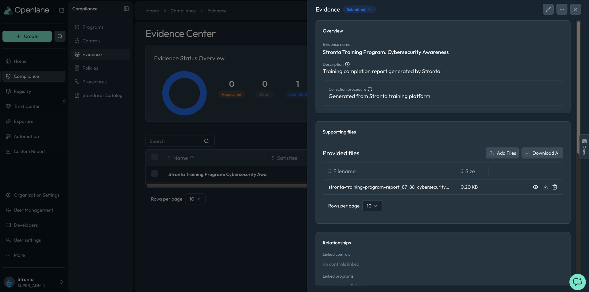

import Steps from '@site/src/components/Steps';
import Term from '@site/src/components/Term';

#  Stronta Integration Guide

If your organization runs security awareness training through Stronta, this integration exports
training completion to Openlane as <Term t="evidence">evidence</Term>. Each export creates an
evidence record with the completion report attached, so training proof is ready for the
<Term t="controls">controls</Term> it supports.

## Key Capabilities

* **Direct Evidence Export:** Send a training completion report to Openlane, which creates the
  evidence record and attaches the report in one action.
* **CSV Export:** Download the completion report as a CSV when you prefer to upload evidence
  yourself.
* **Program-Scoped Reports:** Export results for a single training program, such as Cybersecurity
  Awareness, so that each evidence record maps to the training it demonstrates.
* **Scoped Openlane Token:** Connect with an Openlane API token limited to evidence writes instead of
  a personal credential.

## Prerequisites

* A Stronta workspace on a paid plan with the Security Training module in use.
* Administrative access in Stronta to enable **Admin Mode** and save the Openlane API token.
* An Openlane API token that includes the `evidence:write` scope. Creating an API token requires a
  payment method on file for your Openlane organization. See
  [Programmatic Authentication](../settings/authentication/programmatic.mdx).

## Step-by-Step Setup

### Step 1: Create an Openlane API Token

<Steps>

1. Navigate to **Organization Settings** > **Developers** > **API Tokens**.
1. Click **Create** and name the token, for example `Stronta`.
1. Set an **Expiration** and grant the `evidence:write` scope.
1. Click **Create Token** and copy the value, which is shown only once.

</Steps>

:::warning
Create a dedicated token for this integration and grant only the scopes it needs. A token with
`evidence:write` can create evidence in your organization.
:::

### Step 2: Connect Stronta to Openlane

<Steps>

1. Open [app.stronta.com](https://app.stronta.com/) and sign in, or create an account if you do
   not have one.

   

1. Click **Settings** in the lower left navigation.

   

1. Enable **Admin Mode** with the slider in the lower left navigation. Admin Mode reveals the
   organization and integration settings.

   

1. Confirm the workspace is on a paid plan. If it shows the Starter Plan, click **Upgrade**, enter
   payment details, accept the terms, and click **Complete Order**.

   

1. Return to **Settings**, find the **Openlane** integration, enter your API token in
   **Enter Openlane API key**, and click **Save Key**.

   

1. Confirm the integration shows **Connected**.

</Steps>

### Step 3: Export Training Evidence

<Steps>

1. Click **Security Training** in the left navigation and open the training program you want to
   report on.

   
1. Click **Export** and choose an option.

   | Export option | Result |
   | --- | --- |
   | **Export to Openlane** | Creates an evidence record in Openlane with the completion report attached |
   | **Export to CSV** | Downloads the completion report so that you can upload it as evidence yourself |

   

1. If you exported to CSV, upload the file via the
   [Evidence Center](../compliance-management/evidence/create.mdx).

</Steps>

## Validate Connection

Saving the API token connects the integration immediately, and the Openlane integration card shows
**Connected** with controls to **Update Key** or **Disconnect**. To confirm the connection end to
end, run **Export to Openlane** from a training program and check for the new record in Openlane.

## What Openlane Receives

Each export creates one evidence record in Openlane. The record is named after the training program,
for example **Stronta Training Program: Cybersecurity Awareness**, and the completion report is
attached as a CSV file with one row per assigned user:

```text
Full Name,Email Address,Videos Watched,Video Percentage Complete,Quizzes Passed,Quizzes Percentage Complete
Example User,example@stronta.com,7,100%,1,100%
```



Link the record to the <Term t="controls">controls</Term> it supports. Exports do not link controls
automatically, and unlinked evidence does not count toward a control at audit time.

## Disconnect

To remove this integration:

<Steps>

1. In Stronta, open **Settings**, find the **Openlane** integration, and click **Disconnect**.
1. In Openlane, revoke the API token under **Organization Settings** > **Developers** > **API Tokens**.

</Steps>

Disconnecting stops new exports. Evidence records already created in Openlane remain, and you can
reconnect by saving a new token.

## Troubleshooting

* **Key not accepted:** confirm the token value was copied in full and includes the `evidence:write`
  scope.
* **Integration disconnects after saving:** confirm the Stronta workspace is on a paid plan, which
  the Openlane integration requires.
* **Export to Openlane fails:** confirm the Openlane organization has a payment method on file, and
  that the token has not expired or been revoked.
* **No record appears after a CSV export:** CSV export only downloads a file. Upload it via the
  [Evidence Center](../compliance-management/evidence/create.mdx).
* **Record is missing controls:** link the record to the controls it supports.

## References

* [Stronta](https://app.stronta.com/)
* [Programmatic Authentication](../settings/authentication/programmatic.mdx)
* [Create Evidence](../compliance-management/evidence/create.mdx)
