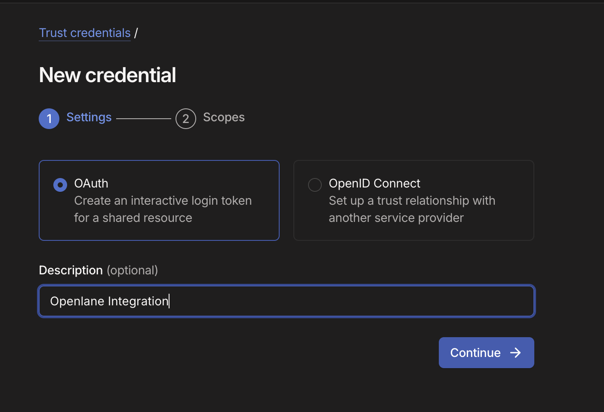
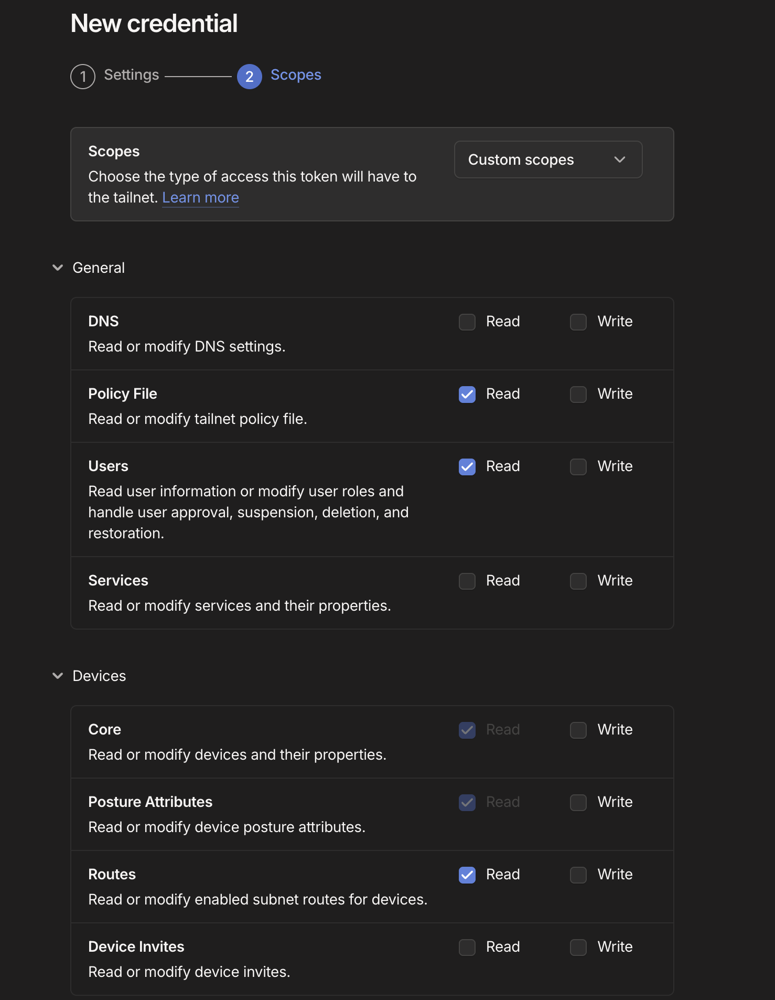

#  Tailscale Integration Guide

If your organization uses Tailscale to manage private network connectivity, this integration pulls device inventory and directory data into Openlane so you have visibility into who is on your tailnet and what devices are enrolled — supporting access control evidence for SOC 2 CC6 and ISO 27001 A.9, A.12.

## Key Capabilities

- **OAuth Authentication:** Connects using a scoped OAuth credential from the Tailscale admin panel — no long-lived API keys required, scoped to specific read-only access.
- **Directory Sync:** Reads users from your tailnet, giving you the identity baseline for access reviews and onboarding/offboarding evidence (SOC 2: CC6.2, CC6.3).
- **Asset Sync:** Ingests enrolled devices with route and posture attribute metadata, supporting device inventory and endpoint visibility (SOC 2: CC6.6, CC6.8; ISO 27001: A.12).
- **Vendor Creation:** If the Tailscale vendor record does not exist in Openlane, the integration creates it automatically on first sync.
- **Flexible Group Sync:** Group sync can be disabled independently if you only need user and device data.

## Prerequisites

- Tailscale admin access to create OAuth credentials under [Trust credentials](https://login.tailscale.com/admin/settings/trust-credentials).

## Supported Operations

| Operation | Description |
|---|---|
| `DirectorySync` | Collect Tailscale users and groups and emit directory ingest envelopes |
| `AssetSync` | Collect enrolled Tailscale devices and emit asset ingest envelopes |

## Step-by-Step Setup

### Step 1: Create a Tailscale OAuth Credential

1. In the Tailscale admin panel, navigate to **Settings** > [**Trust credentials**](https://login.tailscale.com/admin/settings/trust-credentials).
2. Click **Create trust credential**.
3. Select **OAuth** as the credential type.
4. Enter a description (e.g. `Openlane Integration`).



5. Click **Continue** to proceed to the Scopes step.
6. Select **Custom scopes** and enable the following scopes:

| Scope | Required For |
|---|---|
| `users:read` | Health check and directory sync — always required |
| `policy_file:read` | Policy file access for groups |
| `devices:core:read` | Device inventory sync |
| `devices:posture_attributes:read` | Device posture attribute sync |
| `devices:routes:read` | Device subnet route sync |



7. Click **Create credential** and copy the **Client ID** and **Client secret** — the secret is only shown once.

:::info
The `users:read` scope is required for the health check to succeed, even if you are not syncing users.
:::

### Step 2: Connect in Openlane

1. Navigate to **Organization Settings** > **Integrations** and find **Tailscale**.
2. Click **Configure** and enter the required fields:

| Field | Required | Purpose |
|---|---|---|
| `clientId` | Yes | OAuth client ID from the Tailscale trust credential |
| `clientSecret` | Yes | OAuth client secret from the Tailscale trust credential |

3. Click **Save**.

### Step 3: Configure Sync Behavior

Optionally configure which data is collected and how records are filtered before ingestion:

#### Directory Sync

| Setting | Description |
|---|---|
| **Disable Group Sync** | When enabled, only users are synced — groups and memberships are skipped |
| **Filter Expression** | Optional CEL expression evaluated against each record — only records that match are ingested (allows inclusion) |

Filter expression example:

```
payload.role == 'member'
```

#### Asset Sync

| Setting | Description |
|---|---|
| **Disable** | Turn off device ingestion without disconnecting the integration |
| **Filter Expression** | Optional CEL expression evaluated against each device record — only records that match are ingested |

Filter expression example:

```
payload.os == 'linux'
```

CEL expressions have access to the full raw payload for each record via `payload.<field>`.

## Validate Connection

After saving, Openlane runs a health check against the Tailscale API and displays the result on the **Installed** tab of the Integrations page. A **Healthy** badge confirms connectivity. If the badge shows **Needs Attention**, review the troubleshooting section below.

## What Openlane Syncs

Openlane reads the following resources from Tailscale and normalizes them into its internal schemas:

| Resource | Tailscale Source | Notes |
|---|---|---|
| **DirectoryAccount** | Tailscale users | All tailnet members are synced |
| **DirectoryGroup** | Tailscale groups | Skipped when Disable Group Sync is enabled |
| **DirectoryMembership** | Group membership relationships | Skipped when Disable Group Sync is enabled |
| **Asset** | Enrolled devices | Includes device metadata |

Directory data feeds into User Access Reviews, onboarding/offboarding verification, and identity scope validation. Device data populates your asset inventory with endpoint context for access control evidence.

## Disconnect

To remove this integration:

1. Navigate to **Organization Settings** > **Integrations**
1. Select the **Installed** tab
1. Open the menu on the integration card and select **Disconnect**
1. Go to **Settings** > **Trust credentials** in the Tailscale admin panel to revoke the OAuth credential

This removes stored credentials and stops all collection activity. You can reconnect later by configuring the integration again.

## Troubleshooting

- **Auth failures:** verify the client ID and client secret are correct and that the credential has not been revoked in the Tailscale admin panel.
- **Health check failing:** confirm the `users:read` scope is enabled — it is required for the health check even if directory sync is disabled.
- **Missing devices:** verify the `devices:core:read`, `devices:posture_attributes:read`, and `devices:routes:read` scopes are all enabled on the OAuth credential.
- **Missing users:** verify the `users:read` scope is enabled on the OAuth credential.
- **No group data:** confirm that **Disable Group Sync** is not enabled if you expect group and membership records.

## References

- [Tailscale OAuth clients documentation](https://tailscale.com/kb/1215/oauth-clients)
- [Tailscale API reference](https://tailscale.com/api)
- [Tailscale trust credentials](https://login.tailscale.com/admin/settings/trust-credentials)
